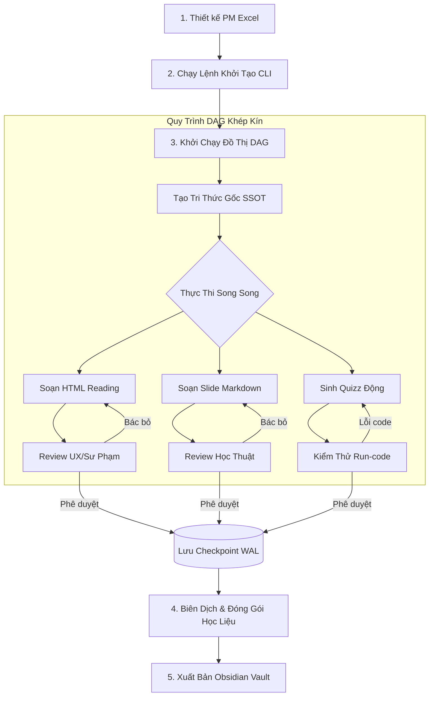

# 🎓 Hướng Dẫn Vận Hành Multi-Agent Learning Content Factory
> **Vai trò:** Senior System Architect / Technical Lead  
> **Dự án:** Hệ thống sản xuất học liệu tự động (Elearning Agent) sử dụng Event-Driven DAG Framework.

Hệ thống được thiết kế để tự động hóa hoàn toàn quy trình phân tích chương trình học (PM), định nghĩa mục tiêu chi tiết, soạn thảo nội dung (Bài đọc HTML, Slide bài giảng, Câu hỏi trắc nghiệm, Kịch bản video, Sơ đồ tư duy), chạy kiểm thử mã nguồn mẫu trong môi trường cô lập, phản biện chất lượng sư phạm và đóng gói xuất bản.

---

## 🏗️ 1. Quy Trình Vận Hành Tổng Quan (End-to-End Lifecycle)



---

## 🛠️ 2. Các Bước Chuẩn Bị Trước Khi Chạy

### Bước 2.1. Chuẩn Bị Spreadsheet PM Môn Học
Thiết kế file Excel chứa khung chương trình môn học. File Excel phải có cấu trúc cột theo chuẩn sau:
1.  **STT:** Số thứ tự dòng.
2.  **Hình thức (Form):** Lý thuyết / Thực hành / Thi.
3.  **Session:** Định danh phiên (ví dụ: `Session 01`, `Session 02`).
4.  **Nội dung Session:** Tên chủ đề chính của Session.
5.  **Lesson:** Định danh và tên bài học con (ví dụ: `Lesson 01.1: Giới thiệu về FastAPI`).
6.  **Chi tiết bài học:** Các gạch đầu dòng nội dung kiến thức chi tiết.
7.  **Sản phẩm đầu ra mong đợi:** Yêu cầu sản phẩm học viên cần hoàn thành.
8.  **Deadline:** Hạn hoàn thành (nếu có).

> [!IMPORTANT]  
> Hãy lưu file này vào thư mục `pms/` (Ví dụ: `pms/PM_FastAPI_Advanced.xlsx`). Tên file hoặc tên Sheet hoạt động (Active Sheet Title) sẽ được tự động phân tích để nhận diện **Technology Stack** (ví dụ: `python/fastapi`, `typescript/nestjs`, `typescript/react`, `java/springboot` hoặc `python/core`).

### Bước 2.2. Thiết Lập Biến Môi Trường (`.env`)
Tạo file `.env` tại thư mục gốc dự án:

```env
# --- LLM API Configuration ---
GEMINI_API_KEY=AIzaSy...               # (Ưu tiên) API Key của Google Gemini
# OPENAI_API_KEY=sk-...               # OpenAI API Key (nếu dùng gpt-4o-mini)
GEMINI_MODEL=gemini-1.5-flash         # Model phục vụ sinh tài nguyên lớn
GEMINI_CONTEXT_LIMIT=32768            # Ngưỡng kích hoạt Context Caching

# --- Database & Resilience Configuration ---
DATABASE_URL=sqlite:///./state_store_v2.db # Path DB checkpoint
DB_POOL_SIZE=5                        # Số lượng kết nối tối đa duy trì trong pool
DB_MAX_OVERFLOW=10                    # Số lượng kết nối vượt mức cho phép tạo thêm
DB_POOL_TIMEOUT=30.0                  # Thời gian chờ lấy kết nối tối đa (giây)

# --- Sandbox Security Configuration ---
SANDBOX_STRICT=True                   # Bắt buộc True trên Production (chỉ chạy Docker/E2B, khóa Subprocess Fallback)
# SANDBOX_STRICT=False                 # Thiết lập False khi Dev cục bộ không có Docker (chạy Subprocess)

# --- Observability Configuration (Tùy chọn) ---
LANGFUSE_PUBLIC_KEY=pk-lf-...         # Khóa công khai Langfuse
LANGFUSE_SECRET_KEY=sk-lf-...         # Khóa bảo mật Langfuse
LANGFUSE_HOST=https://cloud.langfuse.com
OTEL_EXPORTER_OTLP_ENDPOINT=http://localhost:6006/v1/traces # Endpoint xuất log cho Phoenix/OTel
```

---

## 💻 3. Các Câu Lệnh CLI Điều Khiển Hệ Thống

Hệ thống được kích hoạt và điều khiển thông qua file `main.py`.

### 3.1. Khởi Tạo Và Tạo Mới Toàn Bộ Môn Học
Để quét toàn bộ file PM và sinh học liệu cho tất cả các Session/Lesson:
```bash
python main.py --pm "pms/PM_FastAPI_Advanced.xlsx" --session all --parts all
```

### 3.2. Chỉ Sinh Học Liệu Cho Một Session Nhất Định (Khuyên dùng khi Dev/Test)
Để tránh tốn chi phí API và tập trung kiểm duyệt chất lượng từng phần:
```bash
python main.py --pm "pms/PM_FastAPI_Advanced.xlsx" --session "Session 01" --parts all
```

### 3.3. Chỉ Sinh Các Phần Sản Phẩm Cụ Thể
Nếu bạn chỉ muốn cập nhật bài đọc HTML (`html`) và slide bài giảng (`slide`) mà bỏ qua các phần khác:
```bash
python main.py --pm "pms/PM_FastAPI_Advanced.xlsx" --session "Session 01" --parts html,slide
```

### 3.4. Ép Buộc Sinh Lại Bằng Lệnh Force Rebuild (`--force`)
Mặc định, hệ thống kiểm tra trạng thái lưu trữ trong cơ sở dữ liệu. Nếu một bài học đã được Reviewer đánh giá là `Approved` (Phê duyệt), hệ thống sẽ bỏ qua ở lần chạy kế tiếp. Khi bạn thay đổi prompt hoặc cập nhật logic và muốn **ghi đè/sinh lại từ đầu**:
```bash
python main.py --pm "pms/PM_FastAPI_Advanced.xlsx" --session "Session 01" --parts all --force
```

### 3.5. Xuất Bản Cấu Trúc Obsidian Vault
Đóng gói toàn bộ học liệu đã sinh thành một cấu trúc thư mục dạng Obsidian Vault thông minh để chia sẻ hoặc lưu trữ:
```bash
python main.py --pm "pms/PM_FastAPI_Advanced.xlsx" --obsidian
```

---

## 🔄 4. Chu Trình Chỉnh Sửa & Duyệt Tin Cậy (Review & Edit Loop)

```
        +----------------------------------------+
        |  1. Đọc PM & Sinh tài nguyên nháp      |
        +-------------------+--------------------+
                            |
                            v
        +-------------------+--------------------+
        |  2. Duyệt tự động (Reviewer Agents)    |
        +-------------------+--------------------+
                            |
               [Có lỗi / Không đạt chuẩn?]
             /                             \
           Có                               Không
           /                                 \
          v                                   v
+--------+------------------+       +--------+------------------+
| 3. Tự vá lỗi (Self-Healing)|       | 4. Lưu Checkpoint DB      |
|    Chạy lại luồng sinh    |       |    Trạng thái: APPROVED    |
+--------+------------------+       +--------+------------------+
          |                                   |
          +<-- (Quay lại bước 2)              v
                                    +---------+-----------------+
                                    | 5. Đóng gói & Xuất bản    |
                                    |    HTML, Slide, Excel     |
                                    +---------------------------+
```

### 4.1. Cơ Chế Kiểm Duyệt Tự Động (Reviewer Loop)
*   **UX Reviewer:** Đánh giá tính sư phạm, cấu trúc HTML, CSS hiển thị, độ dài bài đọc.
*   **Academic Reviewer:** Kiểm định slide bài giảng, đảm bảo slide chứa các thẻ định dạng phù hợp, cấu trúc bài học mạch lạc.
*   **Sandbox Testing Agent:** Trích xuất các đoạn mã nằm trong thẻ code của bài học HTML, thực thi trong môi trường cô lập. Nếu mã lỗi hoặc không trả về kết quả mong đợi, yêu cầu `Quiz_Agent` sửa lại câu hỏi hoặc code mẫu.

### 4.2. Quản Lý Trạng Thái Checkpoint & Lock Dữ Liệu
Sau khi các Reviewer duyệt qua trạng thái `Approved`:
1.  Dữ liệu được nén bằng thuật toán `zlib` và đẩy vào bảng `checkpoints` của SQLite (`state_store_v2.db`) thông qua Pool kết nối an toàn.
2.  Mọi kết nối được tự động tái sử dụng. Nếu database bị corrupt do mất điện đột ngột hoặc xung đột luồng ghi, lớp **Self-Healing** của database pool sẽ tự động phát hiện lỗi, đóng toàn bộ handle, xóa file DB hỏng và tạo mới schema để tự động chạy lại mà không làm sập tiến trình.
3.  Khi cần chỉnh sửa nội dung bài viết theo yêu cầu thủ công: Bạn chỉ cần sửa trực tiếp nội dung file đầu ra tại thư mục `output/<môn_học>/session_xx/...`. Khi chạy lại lệnh không có cờ `--force`, hệ thống sẽ giữ nguyên sản phẩm của bạn.

---

## 📊 5. Giám Sát Và Chẩn Đoán Hệ Thống (Monitoring & Debugging)

### 5.1. Chạy Các Bộ Test Sức Bền Hệ Thống (Local Verification Tests)
Trước khi đưa hệ thống lên môi trường production chạy quy mô lớn, hãy đảm bảo tất cả các thành phần cốt lõi đều đạt trạng thái hoạt động tốt bằng cách chạy các lệnh test sau:

```bash
# 1. Kiểm tra tính an toàn và cơ chế Sandbox
python scratch/test_sandbox.py

# 2. Kiểm tra hiệu năng kết nối đa luồng đồng thời & cơ chế tự chữa lành của DB Pool
python scratch/test_db_pool.py

# 3. Kiểm tra tính năng Context Caching của Gemini để tối ưu chi phí
python scratch/test_prompt_caching.py

# 4. Kiểm tra bộ phân bổ luồng gộp trạng thái State Reducer
python scratch/test_state_reducer.py

# 5. Kiểm tra định dạng log chuẩn OpenTelemetry (OTel)
python scratch/test_observability.py
```

### 5.2. Theo Dõi Tracing Đồ Thị Với Langfuse Hoặc Arize Phoenix
*   **Langfuse:** Truy cập trực tiếp bảng điều khiển đám mây của Langfuse để kiểm tra chi tiết các bước xử lý LLM, so sánh chi phí token và lịch sử phản hồi sư phạm của các Reviewer.
*   **Arize Phoenix:** Nếu chạy phoenix cục bộ để giám sát OpenTelemetry, khởi chạy Phoenix collector bằng lệnh:
    ```bash
    phoenix start
    ```
    Sau đó mở trình duyệt truy cập `http://localhost:6006` để xem trực quan hóa đồ thị spans và vết gọi LLM theo thời gian thực.
