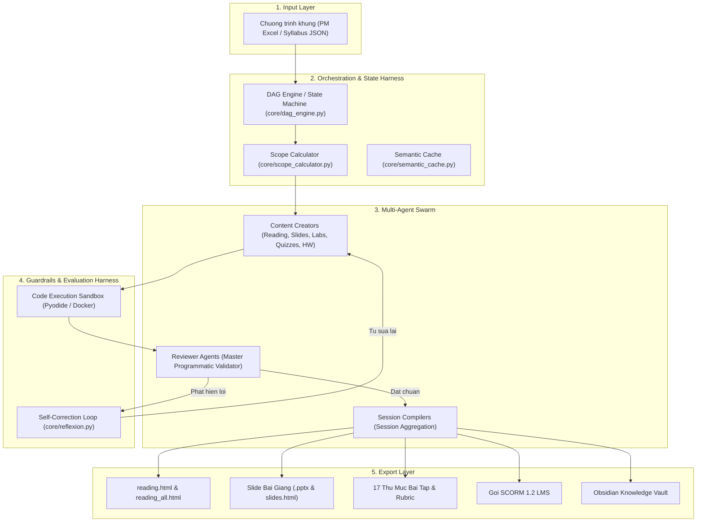

# Elearning Content Factory — Multi-Agent Harness & Learning Material Generator

> **Hệ thống sản xuất học liệu tự động đa tác nhân (Multi-Agent Harness Architecture) cấp Doanh nghiệp — 100% Dynamic, Generic, Stack-Agnostic, Type-Safe & Schema-Driven.**

[](https://python.org)
[](https://docs.pydantic.dev/)
[](https://github.com/ngoquy12/learning_material/actions/workflows/ci.yml)
[](Dockerfile)
[](core/scorm_exporter.py)
[](obsidian_vault/)

---

## Muc Luc

1. [Gioi thieu tong quan](#1-gioi-thieu-tong-quan)
2. [Kien truc he thong (Agent Harness Architecture)](#2-kien-truc-he-thong-agent-harness-architecture)
3. [Cac loai hoc lieu he thong sinh tu dong](#3-cac-loai-hoc-lieu-he-thong-sinh-tu-dong)
4. [Yeu cau he thong (Prerequisites)](#4-yeu-cau-he-thong-prerequisites)
5. [Huong dan cai dat chi tiet (Installation Guide)](#5-huong-dan-cai-dat-chi-tiet-installation-guide)
6. [Quan ly cau hinh & Bao mat bi mat (Centralized Settings & Secrets)](#6-quan-ly-cau-hinh--bao-mat-bi-mat-centralized-settings--secrets)
   - [6.1. Che do 1: Local Proxy (Antigravity Proxy @ 8045)](#61-che-do-1-local-proxy-antigravity-proxy--8045)
   - [6.2. Che do 2: API Key that Google Gemini (Google AI Studio)](#62-che-do-2-api-key-that-google-gemini-google-ai-studio)
7. [Huong dan su dung & Khoi chay he thong (Usage Guide)](#7-huong-dan-su-dung--khoi-chay-he-thong-usage-guide)
   - [7.1. Chay CLI Workflow sinh hoc lieu](#71-chay-cli-workflow-sinh-hoc-lieu)
   - [7.2. Chay kiem thu tu dong (Test Suite)](#72-chay-kiem-thu-tu-dong-test-suite)
8. [Tu dong hoa CI/CD (GitHub Actions)](#8-tu-dong-hoa-cicd-github-actions)
9. [Cau truc thu muc du an (Project Layout)](#9-cau-truc-thu-muc-du-an-project-layout)
10. [Quy chuan su pham & Tieu chuan thiet ke (AGENTS.md)](#10-quy-chuan-su-pham--tieu-chuan-thiet-ke-agentsmd)
11. [FAQ & Xu ly su co thuong gap](#11-faq--xu-ly-su-co-thuong-gap)

---

## 1. Gioi Thieu Tong Quan

**Elearning Content Factory** la he thong AI da tac nhan chuyen nghiep, tu dong hoa quy trinh chuyen doi chuong trinh dao tao (`syllabus.json` hoac PM Excel) thanh bo tai nguyen hoc lieu hoan chinh, chuan su pham va chuan ky thuat doanh nghiep cho **moi cong nghe** (Python, Java, TypeScript/React, Golang, SQL, Docker/DevOps...):

- **100% Tieng Viet co dau chuan xuat ban**: Toan bo noi dung bai doc, slide, cau hoi, kich ban video va code comments duoc chuan hoa tieng Viet su pham chuan xac.
- **Dynamic Scope Boundaries**: Tu dong chan va kiem soat tu khoa vuot cap, dam bao bai hoc khong su dung cu phap hay khai niem chua duoc day o cac bai truoc.
- **Vong lap Phan hoi & Tu sua loi (Reflexion Loop)**: Tu dong danh gia chat luong (PQM Engine, Bloom's Taxonomy) va yeu cau Agent tu sua loi khi phat hien vi pham quy chuan.
- **Thuc thi Code An toan trong Sandbox**: Tich hop Pyodide WASM Engine va Docker Sandbox de kiem chung 100% ma nguon vi du truoc khi chen vao bai hoc.
- **Tuong thich LMS Doanh nghiep & Knowledge Graph**: Xuat chuan SCORM 1.2 (ho tro Moodle, Canvas, Blackboard) va do thi tri thuc 2 chieu Obsidian Markmap.

---

## 2. Kien Truc He Thong (Agent Harness Architecture)

Du an duoc xay dung duoi mo hinh **Multi-Agent Production & Evaluation Harness**:


```mermaid
flowchart TD
    subgraph InputLayer ["1. Input Layer"]
        PM["Chuong trinh khung (PM Excel / Syllabus JSON)"]
    end

    subgraph HarnessOrchestrator ["2. Orchestration & State Harness"]
        DAG["DAG Engine / State Machine (core/dag_engine.py)"]
        Scope["Scope Calculator (core/scope_calculator.py)"]
        Cache["Semantic Cache (core/semantic_cache.py)"]
    end

    subgraph AgentSwarm ["3. Multi-Agent Swarm"]
        Creator["Content Creators (Reading, Slides, Labs, Quizzes, HW)"]
        Reviewer["Reviewer Agents (Master Programmatic Validator)"]
        Compiler["Session Compilers (Session Aggregation)"]
    end

    subgraph GuardrailsAndEvals ["4. Guardrails & Evaluation Harness"]
        Sandbox["Code Execution Sandbox (Pyodide / Docker)"]
        Reflexion["Self-Correction Loop (core/reflexion.py)"]
    end

    subgraph OutputLayer ["5. Export Layer"]
        ReadingOut["reading.html & reading_all.html"]
        SlideOut["Slide Bai Giang (.pptx & slides.html)"]
        HWOut["17 Thu Muc Bai Tap & Rubric"]
        SCORMOut["Goi SCORM 1.2 LMS"]
        ObsidianOut["Obsidian Knowledge Vault"]
    end

    PM --> DAG
    DAG --> Scope
    Scope --> Creator
    Creator --> Sandbox
    Sandbox --> Reviewer
    Reviewer -->|Phat hien loi| Reflexion
    Reflexion -->|Tu sua lai| Creator
    Reviewer -->|Dat chuan| Compiler
    Compiler --> ReadingOut
    Compiler --> SlideOut
    Compiler --> HWOut
    Compiler --> SCORMOut
    Compiler --> ObsidianOut
```

---

## 3. Cac Loai Hoc Lieu He Thong Sinh Tu Dong

| Loai Hoc Lieu | Dinh dang Dau ra | Dac ta & Tieu chuan Ky thuat |
| :--- | :--- | :--- |
| **Bai doc ly thuyet** | `reading.html` & `reading_all.html` | Cau truc list ngat y ngan gon, 100% tieng Viet co dau, anh boi canh 16:9, Dark Terminal Console, Self-Test tuong tac, Sandbox Pyodide chay truc tiep tren trinh duyet. |
| **Slide bai giang** | `Slide_Bai_Giang.pptx` & `slides.html` | Master Slide (15-20 slides/session), Bento Grid modern, nguyen tac 3-30-300 typography, phan mau the ky thuat, outline su pham cho giang vien. |
| **Bai tap thuc hanh** | 17 thu muc Markdown + Code files + Rubric | 17 bai tap phan cap theo thang nhan thuc Bloom (Van dung -> Phan tich -> Sang tao -> Tong hop). Kem file tieu chi cham diem chi tiet 100 diem (`tieu_chi_danh_gia.md`). |
| **Mini Project / Lab** | `practical_lab.md` + JSON + Checklist | Bo cuc 3 phan chuan hoa: Muc tieu -> Cac buoc thuc hien -> Bang checklist tu kiem tra dinh luong `[ ]`. |
| **Quizz Trac nghiem** | Excel (`.xlsx`) + JSON | 5 cau/lesson, Entrance Quiz 45 cau (30 cu + 15 moi), Exit Quiz 45 cau (100% moi). Tuan thu 9 nguyen tac su pham Quizz. |
| **SCORM 1.2 & Obsidian** | ZIP SCORM 1.2 & Obsidian Vault | Dong goi tuong thich chuan e-learning LMS va do thi mang luoi tri thuc 2 chieu (Obsidian Markmap). |

---

## 4. Yeu Cau He Thong (Prerequisites)

- **Python**: Phien ban `3.10`, `3.11`, hoac `3.12` ([Tai Python](https://www.python.org/downloads/)).
- **Node.js**: Phien ban `18.0.0+` ([Tai Node.js](https://nodejs.org/)).
- **Git**: Quan ly phien ban ma nguon.
- **Docker** *(Tuy chon)*: Neu su dung che do Sandbox co lap hoac dong goi container.

---

## 5. Huong Dan Cai Dat Chi Tiet (Installation Guide)

### Buoc 1: Clone repository
```bash
git clone https://github.com/ngoquy12/learning_material.git
cd Learning-Material
```

### Buoc 2: Khoi tao & Kich hoat Moi truong ao Python
- **Windows (PowerShell):**
  ```powershell
  python -m venv .venv
  .\.venv\Scripts\Activate.ps1
  ```
- **Linux / macOS:**
  ```bash
  python3 -m venv .venv
  source .venv/bin/activate
  ```

### Buoc 3: Cai dat thu vien phu thuoc
```bash
pip install --upgrade pip
pip install -r requirements.txt
```

---

## 6. Quan Ly Cau Hinh & Bao Mat Bi Mat (Centralized Settings & Secrets)

He thong su dung **Pydantic `BaseSettings`** tai [config/settings.py](file:///d:/Rikkei%20Education/Elearning_Agent/Learning-Material/config/settings.py) de kiem tra kieu du lieu tu dong, che giau khoa bi mat (`SecretStr`), va ngan chan ro ri API key khi ghi log.

Tao file `.env` tai thu muc goc tu file mau [`.env.example`](file:///d:/Rikkei%20Education/Elearning_Agent/Learning-Material/.env.example):
```bash
cp .env.example .env
```

### 6.1. Che do 1: Local Proxy (Antigravity Proxy @ 8045)
Su dung proxy cuc bo (mac dinh):
```env
USE_REAL_GEMINI_API_KEY=false
GEMINI_API_KEY=sk-your-proxy-key-here
GEMINI_BASE_URL=http://127.0.0.1:8045
GEMINI_MODEL=gemini-3.6-flash-high
```

### 6.2. Che do 2: API Key that Google Gemini (Google AI Studio)
Khi chuyen sang dung API Key that cua Google, ban chi can bat co `USE_REAL_GEMINI_API_KEY=true` (he thong se **tu dong bo qua proxy `127.0.0.1:8045`** va ket noi thang den may chu chinh thuc cua Google):
```env
USE_REAL_GEMINI_API_KEY=true
GEMINI_API_KEY=AIzaSyYourRealGoogleApiKeyHere...
GEMINI_MODEL=gemini-1.5-flash
```

---

## 7. Huong Dan Su Dung & Khoi Chay He Thong (Usage Guide)

### 7.1. Chay CLI Workflow sinh hoc lieu

Khoi chay he thong tu dong sinh toan bo tai nguyen cho mot khoa hoc tu file PM Excel hoac syllabus:

```bash
# Sinh toan bo hoc lieu cho Session 01:
python main.py --pm "documents/PM_Python.xlsx" --session "Session 01" --approve-pm

# Sinh toan bo khoa hoc (all sessions):
python main.py --pm "documents/PM_Python.xlsx" --session all --approve-pm

# Chi sinh mot so phan cu the (Selective Parts):
python main.py --pm "documents/PM_Python.xlsx" --session "Session 01" --parts html,slide --approve-pm

# Chay che do bat dong bo song song (Parallel Batch Mode):
python main.py --pm "documents/PM_Python.xlsx" --session "Session 01" --parallel --concurrency 4 --approve-pm

# Khoi tao nhanh cay cau truc thu muc rong (Scaffolding Mode):
python main.py --pm "documents/PM_Python.xlsx" --scaffold
```

### 7.2. Chay kiem thu tu dong (Test Suite)

Chay toan bo **159 bai kiem thu** tu dong da duoc xac thuc:

```bash
# Chay toan bo test suite:
pytest

# Chay test chi tiet kem bao cao ngan gon:
pytest -v --tb=short

# Kiem thu rieng module Quan ly Cau hinh & Secrets:
pytest tests/test_centralized_settings.py
```

---

## 8. Tu Dong Hoa CI/CD (GitHub Actions)

Du an tich hop san 2 pipeline tu dong hoa chuan doanh nghiep tai `.github/workflows/`:

1. **CI Pipeline ([.github/workflows/ci.yml](file:///.github/workflows/ci.yml))**:
   - **Linting**: Kiem tra chat luong va cu phap ma nguon qua `ruff` va `flake8`.
   - **Multi-version Matrix Testing**: Tu dong chay toan bo 159 tests tren 3 phien ban Python `3.10`, `3.11`, va `3.12` song song voi `Node.js 18`.
   - **Docker Build Verification**: Kiem tra qua trinh dong goi Docker image tu `Dockerfile`.
2. **CD Pipeline ([.github/workflows/cd.yml](file:///.github/workflows/cd.yml))**:
   - Tu dong dong goi Python Wheel Package (`.whl`) khi gan tag phien ban (`v*.*.*`).
   - Kiem tra CLI entrypoint va luu tru Release Artifacts.

---

## 9. Cau Truc Thu Muc Du An (Project Layout)

```
Learning-Material/
├── .agents/                      # Quy chuan Su pham & Tieu chuan Thiet ke (AGENTS.md)
├── .github/                      # CI/CD Workflows (GitHub Actions)
│   └── workflows/
│       ├── ci.yml                # Automated Lint, Matrix Tests & Docker Build
│       └── cd.yml                # Automated Package Build & Release
├── agents/                       # He thong Multi-Agent Chuyen biet
│   ├── creators/                 # Creators (Reading, Slides, Labs, Quizzes, Mindmap)
│   ├── reviewer_agents.py        # Reviewers & Programmatic Validators
│   └── homework_agents.py        # Homework Generators (17 thu muc theo thang Bloom)
├── config/                       # Quan ly Cau hinh Tap trung
│   ├── settings.py               # Pydantic BaseSettings & Secret Management Engine
│   └── prompts.yaml              # Persona & System Prompts
├── core/                         # Dong co Ha tang Loi (Core Infrastructure)
│   ├── dag_engine.py             # Asynchronous DAG Engine & State Machine
│   ├── graph.py                  # Multi-Agent Workflow Orchestrator
│   ├── llm.py                    # LLM Interface (Gemini Native & OpenAI Proxy)
│   ├── llm_router.py             # Antigravity Dynamic Model Router
│   ├── sandbox.py                # Pyodide / Docker Code Execution Sandbox
│   ├── scope_calculator.py       # Tinh toan & Chan ro ri pham vi kien thuc
│   ├── semantic_cache.py         # Semantic Embedding Cache Engine
│   ├── scorm_exporter.py         # Bo dong goi xuat ban SCORM 1.2
│   ├── schemas/                  # Pydantic Declarative Data Schemas
│   ├── renderers/                # Bo Render HTML, PPTX, CSS, SVG
│   └── validators/               # Master Programmatic Validators & PQM Engine
├── documents/                    # Tai lieu huong dan nghiep vu & van hanh
├── obsidian_vault/               # Vault do thi lien ket tri thuc 2 chieu
├── templates/                    # Jinja2 Templates (Prompts, HTML, CSS, PPTX)
├── tests/                        # Bo kiem thu Unit, Integration & Eval Tests (159 tests)
├── .env.example                  # File mau cau hinh bien moi truong an toan
├── .gitignore                    # Bo loc bao mat & chan rac/output
├── Dockerfile                    # Containerization Manifest
├── pyproject.toml                # Project metadata & build dependencies
├── requirements.txt              # Danh sach thu vien Python
└── main.py                       # Diem khoi chay CLI chinh cua he thong
```

---

## 10. Quy Chuan Su Pham & Tieu Chuan Thiet Ke (AGENTS.md)

Moi noi dung do Agent sinh ra deu phai tuan thu nghiem ngat **10 Nguyen Tac Cot Loi** quy dinh tai [.agents/AGENTS.md](file:///.agents/AGENTS.md):

1. **Cau truc 5 phan bat buoc**: Bai toan thuc te -> Cu phap & Co che -> Vi du thuc tien luy tien -> Loi thuong gap & Giai phap -> Tom tat & Form tu kiem tra.
2. **10-Minute Micro-Learning**: Ngan gon, suc tich, ngat y bang bullet list, khong dung van ban khoi dai.
3. **Problem-First Approach**: Luon xuat phat tu boi canh thuc te va van de doanh nghiep truoc khi gioi thieu cu phap ly thuyet.
4. **Chuan do hoa 2D Flat Vector**: Do thi Mermaid chuan hoa 5 hinh khoi, anh boi canh 16:9 sac net, khong dung emoji hat gao hoac anh 3D sci-fi.
5. **Nghiem cam tu ngu AI Cliche**: Loai bo hoan toan cac tu sao rong va thay the bang thuat ngu ky thuat chuan muc.
6. **Bao mat pham vi kien thuc**: Khong su dung cu phap hay cau lenh cua cac bai hoc tuong lai trong bai hoc hien tai.

---

## 11. FAQ & Xu Ly Su Co Thuong Gap

- **Q: Lam sao de chuyen giua Local Proxy va Google Gemini API Key that?**
  - *Tra loi:* Trong file `.env`, doi `USE_REAL_GEMINI_API_KEY=true` va dan API Key `AIzaSy...` cua ban vao `GEMINI_API_KEY`. He thong se tu dong bo qua proxy.
- **Q: Thu muc `output/` co bi day len GitHub khong?**
  - *Tra loi:* Khong. File `.gitignore` da chan toan bo thu muc `output/` de giu repository luon sach se va bao mat du lieu hoc lieu noi bo.
- **Q: Gap loi ky tu tieng Viet tren Windows PowerShell?**
  - *Tra loi:* He thong da tu dong cau hinh UTF-8. Neu terminal hien thi sai, hay chay lenh `$env:PYTHONIOENCODING="utf-8"` tren PowerShell truoc khi chay script.
