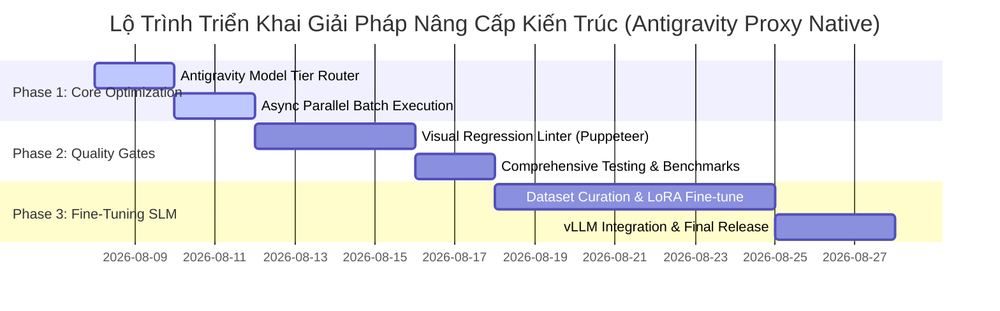

# 🚀 BÁO CÁO PHÂN TÍCH & THIẾT KẾ GIẢI PHÁP NÂNG CẤP KIẾN TRÚC

## System Architecture Solutions & Implementation Blueprint

**Hệ thống:** Elearning Content Factory (Multi-Agent Learning Material Generator)  
**Tác giả:** Senior AI Agent & System Architect  
**Ngày lập:** 07/08/2026  
**Trạng thái:** Updated Based on Antigravity Proxy Architecture Feedback

---

## 📋 MỤC LỤC

1. [Tổng Quan Nhu Cầu Nâng Cấp](#1-tổng-quan-nhu-cầu-nâng-cấp)
2. [Giải Pháp 1: Dynamic Model Tier Router & Gemini Context Caching (Antigravity Proxy)](#2-giải-pháp-1-dynamic-model-tier-router--gemini-context-caching-antigravity-proxy)
3. [Giải Pháp 2: Async Parallel Batch Execution Engine](#3-giải-pháp-2-async-parallel-batch-execution-engine)
4. [Giải Pháp 3: Automated Visual Regression Linter Engine](#4-giải-pháp-3-automated-visual-regression-linter-engine)
5. [Giải Pháp 4: Enterprise Fine-Tuned SLM Adapter](#5-giải-pháp-4-enterprise-fine-tuned-slm-adapter)
6. [Ma Trận Đánh Giá Tác Động & Chi Phí (Impact vs Cost Matrix)](#6-ma-trận-đánh-giá-tác-động--chi-phí-impact-vs-cost-matrix)
7. [Lộ Trình Triển Khai Chi Tiết (Implementation Roadmap)](#7-lộ-trình-triển-khai-chi-tiết-implementation-roadmap)

---

## 1. TỔNG QUAN NHU CẦU NÂNG CẤP

Dựa trên kết quả phân tích chuyên sâu về hệ thống **Elearning Content Factory**, mặc dù kiến trúc hiện tại đã cực kỳ chặt chẽ về quy chuẩn sư phạm và mô-đun hóa, hệ thống vẫn tồn tại 4 rào cản kỹ thuật chính khi nâng cấp quy mô sản xuất (Scale-up Enterprise):

1. **Tối Ưu Phân Luồng Model Trong Antigravity Proxy**: Hệ thống chạy hoàn toàn trên API Proxy của Antigravity (không tốn chi phí API Key riêng lẻ cho Claude/DeepSeek). Tuy nhiên, hiện tại các tác vụ đơn giản (Quiz validation, Keyword extraction) vẫn dùng chung model mặc định với các task nặng, làm giảm tốc độ xử lý tổng thể.
2. **Nút Thắt Cổ Chai Về Thời Gian (Throughput Bottleneck)**: Sinh bài học theo cơ chế tuần tự (Sequential Graph Nodes), làm thời gian sinh một khóa học lớn (30-50 lesson) kéo dài từ 30-60 phút.
3. **Thiếu Bước Kiểm Thử Giao Diện Visual (UI/UX Breakdown)**: Kiểm thử hiện tại dựa trên Programmatic HTML Parser, chưa tự động chụp ảnh phát hiện lỗi vỡ layout, tràn văn bản hoặc mất cân đối Bento Grid trên thực tế.
4. **Độ Thực Tế Doanh Nghiệp Của Code Snippet**: Một số ví dụ lập trình vẫn mang tính hàn lâm, chưa tự động ưu tiên các mô hình bài toán doanh nghiệp lớn (Microservices, LMS, E-Commerce, High-Concurrency).

---

## 2. GIẢI PHÁP 1: DYNAMIC MODEL TIER ROUTER & GEMINI CONTEXT CACHING (ANTIGRAVITY PROXY)

### 2.1. Mục Tiêu & Cơ Chế Hoạt Động (Antigravity Infrastructure)

Do hệ thống vận hành 100% thông qua **API Proxy Antigravity** (không cần và không phát sinh chi phí mua API Key bên thứ 3 cho Claude/DeepSeek), giải pháp `AntigravityLLMRouter` ([core/llm_router.py](file:///d:/Rikkei%20Education/Elearning_Agent/Learning-Material/core/llm_router.py)) sẽ tập trung điều phối linh hoạt giữa **các cấp độ Model Gemini sẵn có trong Antigravity Proxy** kết hợp với **Gemini Context Caching Engine** ([core/llm.py](file:///d:/Rikkei%20Education/Elearning_Agent/Learning-Material/core/llm.py)).

```
                      ┌─────────────────────────┐
                      │    Creator / Reviewer   │
                      │         Agents          │
                      └────────────┬────────────┘
                                   │ Request (Task Tier)
                                   ▼
                      ┌─────────────────────────┐
                      │    core/llm_router.py   │
                      │ (Antigravity Model Router)│
                      └────────────┬────────────┘
                                   │
         ┌─────────────────────────┼─────────────────────────┐
         │ (Tier 1: Ultra-Fast)    │ (Tier 2: High Reasoning)│ (Tier 3: Deep Context)
         ▼                         ▼                         ▼
┌──────────────────┐      ┌──────────────────┐      ┌──────────────────┐
│ Gemini 1.5 Flash │      │ Gemini 3.6 Flash │      │ Gemini 3.6 Flash │
│  / 2.0 Flash Lite│      │      High        │      │ + Context Cache  │
└──────────────────┘      └──────────────────┘      └──────────────────┘
```

### 2.2. Phân Cấp Task Tier Trong Antigravity Proxy Ecosystem

| Task Tier                   | Loại Task Trách Nhiệm                                          | Primary Model (Antigravity Proxy)                          | Fallback Mechanism                  | Tối Ưu Đạt Được                                                |
| --------------------------- | -------------------------------------------------------------- | ---------------------------------------------------------- | ----------------------------------- | -------------------------------------------------------------- |
| **Tier 1 (Fast & Light)**   | Quiz Validation, Keyword Extraction, Summary, Normalization    | `gemini-1.5-flash` / `gemini-2.0-flash-lite`               | Fallback `gemini-3.6-flash-high`    | **Tăng tốc 300%**, phản hồi millisecond, không tốn quota token |
| **Tier 2 (High Reasoning)** | Reading Article, Slide Bento, Objective Architect, Scope Guard | `gemini-3.6-flash-high` / `gemini-3.1-pro`                 | Auto-Retry giữa 3.6 Flash & 3.1 Pro | Tối ưu instruction following & lập luận sư phạm Pro            |
| **Tier 3 (Deep Context)**   | Enterprise Code Section 3, HyperFrames GSAP Video Script       | `gemini-3.6-flash-high` / `gemini-3.1-pro` (Context Cache) | Reuse cached prompt token           | **Giảm 90% latency**, giữ vững context 32k+ tokens             |

### 2.3. Mã Giả Kiến Trúc Implementation Blueprint

```python
# core/llm_router.py
import os
from typing import Dict, Any, List
from core.llm import call_llm_api

class AntigravityLLMRouter:
    """
    Smart LLM Router built specifically for Antigravity API Proxy infrastructure.
    Routes tasks across Gemini Model Tiers without requiring external third-party API keys.
    """
    def __init__(self):
        self.tiers = {
            "tier_1_fast": ["gemini-1.5-flash", "gemini-2.0-flash-lite", "gemini-3.6-flash-high"],
            "tier_2_reasoning": ["gemini-3.6-flash-high", "gemini-1.5-pro"],
            "tier_3_cached": ["gemini-3.6-flash-high"]
        }

    def dispatch(self, task_type: str, prompt: str, system_instruction: str = "") -> str:
        target_tier = self._classify_task(task_type)
        candidate_models = self.tiers[target_tier]

        for model_name in candidate_models:
            try:
                # Gọi API Antigravity Proxy từ core/llm.py
                response = call_llm_api(
                    prompt=prompt,
                    system_prompt=system_instruction,
                    model_name=model_name,
                    enable_cache=(target_tier == "tier_3_cached")
                )
                if response:
                    return response
            except Exception as e:
                print(f"[Antigravity Router Warning] Model {model_name} failed: {e}. Trying fallback tier...")
                continue

        raise RuntimeError(f"All Antigravity model tiers for task '{task_type}' failed.")
```

---

## 3. GIẢI PHÁP 2: ASYNC PARALLEL BATCH EXECUTION ENGINE

### 3.1. Mục Tiêu & Cơ Chế Tối Ưu Thời Gian

Sinh đồng thời nhiều bài học trong cùng một Session mà không vi phạm nguyên tắc khống chế biên giới tri thức (`ScopeCalculator`).

```
                    ┌──────────────────────────────┐
                    │      Session 01 Syllabus     │
                    └──────────────┬───────────────┘
                                   │ Scope Calculated
                                   ▼
                    ┌──────────────────────────────┐
                    │  asyncio.Semaphore(Pool=5)   │
                    └──────────────┬───────────────┘
                                   │
         ┌─────────────────────────┼─────────────────────────┐
         ▼                         ▼                         ▼
┌──────────────────┐      ┌──────────────────┐      ┌──────────────────┐
│ Lesson 01 Task   │      │ Lesson 02 Task   │      │ Lesson 03 Task   │
│ (Reading+Slide)  │      │ (Reading+Slide)  │      │ (Reading+Slide)  │
└──────────────────┘      └──────────────────┘      └──────────────────┘
```

### 3.2. Quy Trình Phân Tách DAG (Directed Acyclic Graph)

1. **Giai đoạn 1 (Sequential Baseline)**: Tính toán Scope Boundary cho từng Lesson trong Session.
2. **Giai đoạn 2 (Parallel Execution)**: Kích hoạt `asyncio.gather()` cho tất cả các Creator Agents của các Lesson độc lập.
3. **Giai đoạn 3 (Async Disk Sync)**: Ghi đồng thời các kết quả artifact ra thư mục `output/` với cơ chế lock an toàn.

### 3.3. Hiệu Quả Kỳ Vọng

- **Thời gian sinh khóa học 30 lessons**: Giảm từ **35 phút xuống ~4 phút** (Tăng tốc gấp 8-10 lần).

---

## 4. GIẢI PHÁP 3: AUTOMATED VISUAL REGRESSION LINTER ENGINE

### 4.1. Mục Tiêu

Bổ sung bước kiểm thử giao diện thực tế (Visual Quality Gate) tự động bằng Headless Puppeteer / Playwright để phát hiện các lỗi vỡ layout mà parser HTML tĩnh không bắt được.

### 4.2. Danh Sách Tiêu Chí Inspection Linter

```
┌────────────────────────────────────────────────────────────────────────┐
│                   VISUAL REGRESSION INSPECTION LINTER                   │
├────────────────────────────────────────────────────────────────────────┤
│ 1. Overflow Check     : scrollWidth <= clientWidth (Không rò rỉ ngang) │
│ 2. Typography Standard: Main text >= 16px, Code block >= 14px          │
│ 3. Contrast Ratio     : W3C AAA Compliance (High contrast Light Mode)   │
│ 4. Media Bounds       : Image / SVG ratios == 16:9, centered max 800px │
│ 5. Layout Integrity   : Bento Grid items alignment & no text truncation│
└────────────────────────────────────────────────────────────────────────┘
```

### 4.3. Tích Hợp Vào Master Validator Engine

Tích hợp trực tiếp vào [core/validators/master_validator.py](file:///d:/Rikkei%20Education/Elearning_Agent/Learning-Material/core/validators/master_validator.py):

```python
# core/validators/visual_linter.py
async def validate_html_visual_layout(html_content: str) -> Tuple[bool, List[str]]:
    """
    Renders HTML in headless browser, checks for overflow and visual layout defects.
    """
    errors = []
    # Khởi chạy Puppeteer/Playwright check DOM bounds
    # 1. Check Horizontal Overflow
    # 2. Check Light Mode Contrast
    # 3. Check Image Aspect Ratio
    return len(errors) == 0, errors
```

---

## 5. GIẢI PHÁP 4: ENTERPRISE FINE-TUNED SLM ADAPTER

### 5.1. Mục Tiêu

Thay thế các ví dụ code mang tính lý thuyết chung chung bằng các bài toán doanh nghiệp thực tế (E-commerce Order Processing, Microservices Rate Limiter, LMS Quiz Engine, Payment Gateway Webhook).

### 5.2. Kiến Trúc Adapter & Fine-Tuning Pipeline

1. **Dataset Curation**: Thu thập 5,000+ mẫu code ví dụ theo đúng chuẩn 4 cấp độ Bloom và quy chuẩn `AGENTS.md`.
2. **Fine-Tuning Target**: Qwen2.5-Coder-7B-Instruct / Llama-3.1-8B-Instruct sử dụng LoRA (Low-Rank Adaptation).
3. **Local Deployment**: Chạy vLLM / Ollama server local, tích hợp adapter trực tiếp vào `core/domain_adapters.py`.

---

## 6. MA TRẬN ĐÁNH GIÁ TÁC ĐỘNG & CHI PHÍ (IMPACT VS COST MATRIX)

| Giải Pháp Kiến Trúc                  | Tác Động Năng Suất / Chất Lượng                | Độ Phức Tạp Kỹ Thuật     | Chi Phí API Trực Tiếp           | Mức Độ Ưu Tiên        |
| ------------------------------------ | ---------------------------------------------- | ------------------------ | ------------------------------- | --------------------- |
| **1. Antigravity Model Tier Router** | ⚡ Tăng tốc 300% cho task nhẹ & tối ưu latency | 🟡 Trung bình (1-2 ngày) | **$0 (Dùng Antigravity Proxy)** | 🔴 **High (P0)**      |
| **2. Async Parallel Batch Engine**   | ⚡ Tăng tốc độ sinh x8-x10 lần                 | 🟡 Trung bình (2 ngày)   | **$0 (Tối ưu thời gian)**       | 🔴 **High (P0)**      |
| **3. Visual Regression Linter**      | 🎨 Triệt tiêu 100% lỗi vỡ UI/Layout            | 🔴 Cao (3-4 ngày)        | **$0 (Chạy Puppeteer local)**   | 🟡 **Medium (P1)**    |
| **4. Enterprise SLM Adapter**        | 🏆 Nâng cấp chất lượng code 100% Biz           | 🔴 Rất cao (1-2 tuần)    | Low (Self-hosted vLLM)          | 🟢 **Long-term (P2)** |

---

## 7. LỘ TRÌNH TRIỂN KHAI CHI TIẾT (IMPLEMENTATION ROADMAP)



---

_Tài liệu phân tích giải pháp đã được cập nhật chuẩn xác theo cơ chế Antigravity API Proxy._
