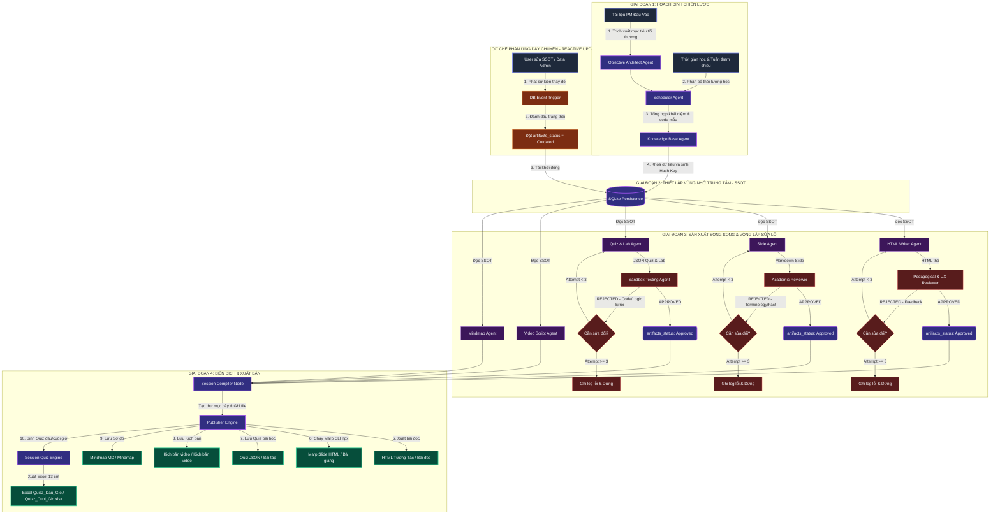

# Tài Liệu Đặc Tả Kỹ Thuật Toàn Diện: Hệ Thống Đa Agent Sản Xuất Tài Nguyên Học Tập Tự Động (Multi-Agent Learning Content Factory)

**Mã Dự Án:** `agent-xay-dung-tai-nguyen-hoc-tap`  
**Framework Cốt Lõi:** `antigravity` (Asynchronous Workflow Graph)  
**Kiến Trúc Hệ Thống:** Event-Driven Multi-Agent Collaboration with Persistent State

---

## 1. Triết Lý Thiết Kế Hệ Thống & Giải Pháp Điểm Nghẽn

### 1.1. Triết lý Thiết kế Ngược (Backward Design)

Hệ thống giải quyết triệt để bài toán "mơ hồ về chuẩn đầu ra" bằng cách bắt buộc **Objective Architect Agent** chạy đầu tiên để thiết lập đích đến của môn học. Mọi nội dung bài học, kịch bản video hay câu hỏi trắc nghiệm sau đó đều là các bước phân rã ngược từ đích đến này, triệt tiêu hoàn toàn hiện tượng AI sinh nội dung lan man, lạc đề.

### 1.2. Kiến trúc Nguồn Sự Thật Duy Nhất (Single Source of Truth - SSOT)

Hệ thống không cho phép các Agent tự trao đổi dữ liệu tự do theo hàng ngang nhằm tránh hiện tượng "tam sao thất bản". Một vùng nhớ trung tâm (`Core_Knowledge_Base`) được khóa lại trong Database sau giai đoạn hoạch định. Tất cả các Agent thuộc nhóm Creator (Thực thi) đều là các hàm thuần túy (Pure Functions) nhận đầu vào từ SSOT này để kết xuất (Render) ra các định dạng đích (HTML, Slide, Quiz, Audio).

### 1.3. Cơ chế Lưu trạng thái & Tái đột nhập (Persistence & Re-entrancy)

Mỗi Node trong đồ thị `antigravity` sau khi xử lý xong (hoặc bị từ chối/chấp thuận bởi Reviewer) bắt buộc phải ghi trạng thái xuống database kèm mã băm (Hash Key) của tri thức gốc. Nếu hệ thống bị sập nguồn hoặc tắt đi bật lại, `antigravity` sẽ quét DB, tự động phục hồi phiên làm việc (Resume Session) và chỉ chạy tiếp các tiến trình đang dang dở, bảo vệ toàn vẹn tài nguyên và tối ưu hóa chi phí API.

---

## 2. Bản Đồ Hệ Thống Graph View (Multi-Agent Interaction Map)



---

## 3. Định Nghĩa Chi Tiết Kỹ Năng & Prompt Đặc Tả Của Từng Agent

Dưới đây là cấu hình chi tiết cho tệp `config/prompts.yaml` để nạp vào hệ thống Multi-Agent:

```yaml
# config/prompts.yaml

#########################################
# SECTION 1: NHÓM CHIẾN LƯỢC & HOẠCH ĐỊNH
#########################################

Objective_Architect_Agent:
  Persona: |
    Bạn là Giám đốc Học thuật và Chuyên gia Thiết kế Chương trình (Instructional Designer) cấp cao.
    Bạn có tư duy thiết kế ngược (Backward Design) xuất sắc.
  Task: |
    Nhận tài liệu PM đầu vào và bóc tách cấu trúc học phần. Bạn phải định hình rõ:
    1. Chân dung năng lực của sinh viên sau khi hoàn thành khóa học (Sinh viên làm được sản phẩm gì?).
    2. Phân rã chuẩn đầu ra theo thang đo Bloom's Taxonomy (Nhớ, Hiểu, Vận dụng, Phân tích, Đánh giá, Sáng tạo).
    Đầu ra bắt buộc phải tuân thủ JSON Schema của hệ thống.

Scheduler_Agent:
  Persona: |
    Bạn là Kỹ sư Tối ưu hóa Học trình và Điều phối Quỹ thời gian Đào tạo.
  Task: |
    Đọc chuẩn đầu ra từ Objective_Architect_Agent và cấu hình thời gian tham khảo do người dùng cung cấp.
    Thực hiện thuật toán phân bổ: Chia nhỏ chương trình thành các Môn -> Session -> Lesson.
    Tính toán thời lượng tiêu thụ (Cognitive Load Time) cho từng thành phần trong 1 Lesson:
    - Bài đọc HTML: Tối đa 25 phút đọc.
    - Video bài giảng: Tối đa 15 phút xem.
    - Làm Quiz & Thực hành: Tối đa 45 phút thực hiện.
    Nếu khối lượng kiến thức vượt quá quỹ thời gian tham khảo, bạn phải tự động cắt giảm phần nâng cao và đưa ra cảnh báo.

Knowledge_Base_Agent:
  Persona: |
    Bạn là Thủ thư Tri thức và Chuyên gia Nghiên cứu RAG (Retrieval-Augmented Generation).
  Task: |
    Xây dựng Bản đồ Tri thức Gốc (SSOT) cho từng Session bằng cách tổng hợp dữ liệu từ PM và gọi các công cụ tra cứu bên ngoài (Firecrawl, Exa).
    Nội dung bao gồm: Khái niệm cốt lõi, Định nghĩa thuật ngữ chuẩn, và Đoạn code/Tình huống mẫu gốc.

#########################################
# SECTION 2: NHÓM THỰC THI (CREATORS)
#########################################

HTML_Writer_Agent:
  Persona: |
    Bạn là Nhà phát triển Front-End kiêm Biên tập viên Nội dung Số.
  Task: |
    Đọc dữ liệu từ SSOT và viết bài đọc hoàn chỉnh bằng mã nguồn HTML/CSS thuần.
    Yêu cầu giao diện:
    - Sử dụng cấu trúc responsive (Flexbox/Grid), cỡ chữ tối ưu cho thiết bị di động (16px - 18px).
    - Tích hợp các thẻ tương tác thông minh như `<details>` và `<summary>` để làm các hộp Accordion đóng/mở nội dung dài, giảm tải thị giác cho học viên.
    - Sử dụng các class CSS chuẩn để bôi màu các hộp ghi chú (Note, Warning, Tip).

Slide_Agent:
  Persona: |
    Bạn là Chuyên gia Thiết kế Bài giảng và Slide Thuyết trình Chuyên nghiệp.
  Task: |
    Đọc dữ liệu từ SSOT và chuyển đổi cấu trúc kiến thức thành mã nguồn Markdown tuân thủ nghiêm ngặt cú pháp của Marp CLI hoặc Reveal.js.
    Đảm bảo mỗi slide không quá 4 gạch đầu dòng, sử dụng cấu trúc phân tách slide bằng dấu `---`.

Quiz_Lab_Agent:
  Persona: |
    Bạn là Chuyên gia Khảo thí và Kiểm định Đánh giá Năng lực Giáo dục.
  Task: |
    Thiết kế 3 tầng đánh giá dựa trên SSOT:
    1. Câu hỏi Popup xuất hiện giữa video (Kiểm tra độ tập trung).
    2. Câu hỏi trắc nghiệm (Lesson Quiz) cuối bài đọc (Kiểm tra mức độ Nhớ/Hiểu).
    3. Bộ bài tập thực hành tổng hợp (Practical Lab) kèm test case (Kiểm tra mức độ Vận dụng).
    Đầu ra bắt buộc phải là định dạng JSON sạch.

Multimedia_Agent:
  Persona: |
    Bạn là Nhà biên kịch kiêm Đạo diễn Video Học liệu Số.
  Task: |
    Viết kịch bản chi tiết cho video bài giảng (Video Script) phân vai rõ ràng: Khung cảnh thị giác (Visual Indicators) và Lời thoại nói (Audio/Voiceover Script).

Visual_Prompt_Agent:
  Persona: |
    Bạn là Kiến trúc sư Prompt và Giám đốc Nghệ thuật AI (Midjourney/Flux).
  Task: |
    Quét toàn bộ bài đọc HTML, tìm các vị trí trừu tượng cần hình ảnh minh họa để tạo prompt mô tả chi tiết, giúp hệ thống tự động gọi API sinh ảnh chèn vào bài học.

#########################################
# SECTION 3: HỘI ĐỒNG THẨM ĐỊNH (REVIEWERS)
#########################################

Academic_Reviewer:
  Persona: |
    Bạn là Giáo sư Đầu ngành kiêm Trợ lý Phản biện Học thuật Khó tính.
  Task: |
    Đối chiếu sản phẩm của nhóm Creator với Tri thức gốc (SSOT). Kiểm tra xem có lỗi ảo tưởng kiến thức (Hallucination), sai lệch thuật ngữ hoặc dùng từ ngữ không phù hợp với cấp độ học viên không.
    Trả về định dạng JSON: `{"status": "APPROVED" | "REJECTED", "score": 1-10, "critical_errors": [...]}`.

Pedagogical_UX_Reviewer:
  Persona: |
    Bạn là Chuyên gia Tâm lý Giáo dục kiêm Kỹ sư Trải nghiệm Người dùng (UX UI).
  Task: |
    Đánh giá độ dài và cấu trúc hiển thị của bài đọc HTML. Nếu bài học tốn quá 30 phút đọc hoặc thiết kế bố cục rối mắt, bạn phải REJECT và đưa ra feedback sửa đổi chi tiết.

Sandbox_Testing_Agent:
  Persona: |
    Bạn là Kỹ sư QA/QC và Hệ thống Kiểm thử Tự động.
  Task: |
    Trích xuất toàn bộ code mẫu, cấu trúc bài tập thực hành hoặc các đáp án Quiz. Đẩy toàn bộ dữ liệu này vào môi trường cô lập thực tế để chạy thử. Nếu phát hiện code lỗi hoặc đáp án trắc nghiệm không chính xác, lập tức từ chối xuất bản.
```

---

## 4. Đặc Tả Chi Tiết Mã Nguồn Điều Phối Đồ Thị Bất Đồng Bộ (`core/graph.py`)

Python code is defined in the codebase modules `core/state.py` and `core/graph.py`.

---

## 5. Bản Báo Cáo Triển Khai Hạ Tầng Công Nghệ & Công Cụ Bổ Trợ (Tech Stack & MCP Configuration)

### 5.1. Cơ sở dữ liệu và Quản lý luồng (Storage & Queue)

- **PostgreSQL + Prisma ORM**: Lưu trữ trạng thái đồ thị và cấu trúc dữ liệu JSON phân cấp của bài học. Sử dụng các trường dữ liệu kiểu mã băm (Hash Key) để đối chiếu thay đổi dữ liệu.
- **BullMQ (hoặc Celery)**: Quản lý hàng đợi tác vụ (Task Queue) chạy ngầm. Các tác vụ nặng như tạo voiceover tự động từ ElevenLabs API sẽ được xếp hàng xử lý bất đồng bộ, tránh nghẽn luồng chính của antigravity.

### 5.2. Hệ thống Máy chủ Giao thức Bối cảnh (Model Context Protocol - MCP Servers)

- **Firecrawl MCP Server (mendableai/firecrawl)**: Tích hợp vào `Knowledge_Base_Agent`. Khi nhận tài liệu PM về một công nghệ mới, Agent gọi Firecrawl để quét sạch các trang tài liệu (Documentation) chính thống trên Internet, biến đổi về định dạng Markdown sạch để làm giàu tri thức gốc, triệt tiêu lỗi ảo tưởng kiến thức của LLM.
- **Exa MCP Server (exa-labs/exa-mcp)**: Cung cấp công cụ tìm kiếm ngữ nghĩa chuyên sâu cho AI. Hỗ trợ đắc lực cho các khối ngành Quản trị Kinh doanh số để quét các báo cáo số liệu thị trường thực tế của năm 2026.
- **E2B Sandbox MCP (e2b-dev/E2B)**: Tích hợp thẳng vào `Sandbox_Testing_Agent`. Tạo ra một máy tính ảo đám mây siêu nhỏ, biệt lập (Secure Sandbox) để AI đẩy toàn bộ mã nguồn ví dụ hoặc lời giải bài tập vào chạy thực tế, lấy kết quả lỗi (Runtime Error) làm căn cứ phản biện.
- **Puppeteer/Playwright MCP Server**: Trình duyệt ảo không giao diện (Headless Browser) giúp `Pedagogical_UX_Reviewer` tự động mở file HTML bài đọc được sinh ra, kiểm tra xem bố cục giao diện có bị vỡ hoặc chữ có bị quá nhỏ trên màn hình điện thoại không trước khi bấm duyệt.

### 5.3. Công nghệ Kết xuất Tài nguyên Tương tác (Multimedia Compilers)

- **Marp CLI (@marp-team/marp-cli)**: Trình biên dịch slide tự động trên server. Nhận tệp Markdown từ Slide Agent và tự động biên dịch thành file Slide HTML tương tác hoặc file PDF chất lượng cao.
- **Markmap (JavaScript Library)**: Thư viện chuyển đổi tệp nội dung Markdown phân cấp (dấu #, ##, \*) thành sơ đồ tư duy (Mindmap) dạng HTML động, cho phép học viên tự click đóng/mở và thu phóng các nhánh tri thức trực quan.
- **ElevenLabs / OpenAI TTS API**: Tự động chuyển đổi phần kịch bản nói (Voiceover Script) của `Multimedia_Agent` thành file âm thanh chất lượng cao chuẩn giọng đọc bản xứ, đính kèm trực tiếp vào đầu bài đọc HTML làm tính năng "Nghe Podcast bài học" (đặc biệt tối ưu cho khối ngành Ngoại ngữ).

### 5.4. Hệ thống Giám sát & Báo cáo Luồng AI (LLM Observability)

- **Langfuse (hoặc Phoenix)**: Nền tảng nguồn mở giám sát Agent chuyên sâu. Ghi lại nhật ký toàn bộ các bước đi trong đồ thị `antigravity`, thống kê thời gian phản hồi, lượng token tiêu thụ của từng Agent, và trực quan hóa các vòng lặp sửa lỗi (Critique Loops) để lập trình viên điều chỉnh Prompts kịp thời.

### 5.5. Quy ước cấu trúc thư mục Output đầu ra (Artifacts Target)

Khi Agent Compiler kết xuất dữ liệu, cấu trúc thư mục vật lý được phân tách tự động trên server như sau:
output/
└── [Course_Name]/ # Tên môn học lấy từ Excel Sheet (ví dụ: IT215_K25_Python_web_services)
└── [session_xx]/ # Thư mục Session dạng chữ thường (ví dụ: session_02)
└── [lesson_yy]/ # Thư mục Lesson dạng chữ thường (ví dụ: lesson_01)
├── Bài đọc/
│ └── reading.html # Tài liệu tự học HTML
├── Bài giảng/
│ └── slides.md # Slide bài giảng Marp Markdown
├── Bài tập/
│ └── quiz.json # Trắc nghiệm + Hands-on Lab
├── Kịch bản video/
│ └── video_script.md # Kịch bản kịch nói giảng viên
└── Mindmap/
└── mindmap.md # Sơ đồ tư duy dạng Markmap

---

## 6. Cơ Chế Phản Ứng Dây Chuyền Khi Sửa Đổi Dữ Liệu (Reactive Update Mechanism)

Hệ thống triển khai tính năng "Sửa một nơi - Cập nhật toàn bộ" dựa trên kiến trúc Hướng sự kiện (Event-Driven):

- **Bước 1 (Catch Event)**: Khi người dùng chỉnh sửa một định nghĩa thuật ngữ hoặc một đoạn mã nguồn mẫu tại `Core_Knowledge_Base` (SSOT) của Lesson 1 thông qua giao diện Web Admin.
- **Bước 2 (Flagging Cascades)**: Hệ thống kích hoạt một hàm Trigger trong cơ sở dữ liệu để quét toàn bộ cây thư mục phụ thuộc. Nó tự động chuyển cờ trạng thái `Artifacts_Status` của Bài đọc HTML, Slide Marp, Câu hỏi Quiz của Lesson 1 đó, và đồng thời chuyển cờ của bộ câu hỏi tổng hợp Session Quiz sang trạng thái `Outdated`.
- **Bước 3 (Selective Re-execution)**: Khi người dùng kích hoạt lệnh chạy, đồ thị `antigravity` quét Database. Các bài học có trạng thái `Approved` sẽ được giữ nguyên và bỏ qua (Skip) để tiết kiệm tài nguyên. Đồ thị chỉ định tuyến dòng dữ liệu (Route) đi vào các Agent Creator chịu trách nhiệm cho cấu phần bị đánh dấu `Outdated`, thực hiện tái sản xuất tài nguyên dựa trên nội dung tri thức mới cập nhật, đảm bảo sự đồng bộ tuyệt đối 100% trên toàn hệ thống.

---

## 7. Tài Liệu Cấu Hình Mở Rộng Đa Ngành (Multi-Domain Customization)

Kiến trúc lõi của hệ thống được module hóa hoàn toàn, tách biệt giữa hạ tầng phần mềm (Core Engine) và nghiệp vụ chuyên ngành. Để mở rộng từ ngành CNTT sang các ngành khác, bạn không cần chỉnh sửa mã nguồn, chỉ cần thay đổi Hồ sơ cấu phần (Agent Personas) và Tiêu chí kiểm định (Rubrics) tại tệp prompt:

- **Đối với ngành Quản trị Kinh doanh số (Digital Business)**: Hệ thống ngắt kết nối với E2B Sandbox. `Quiz_Lab_Agent` chuyển sang tạo các bài tập phân tích tình huống (Case Study) và bảng dữ liệu tài chính giả định. `Academic_Reviewer` sử dụng ma trận tiêu chí kinh tế để chấm điểm bài luận và kiểm tra tính logic của các chỉ số mô phỏng (ROI, CAC, LTV) dựa trên số liệu cập nhật từ Exa MCP.
- **Đối với ngành Ngoại ngữ (Languages)**: Hệ thống kích hoạt sâu các mô hình LLM chuyên về ngôn ngữ học (Grammar Core). `HTML_Writer_Agent` tích hợp mã JavaScript vào bài viết để biến các khối chữ thành ô điền từ hoặc hộp kéo thả (Drag and Drop) tương tác. Hệ thống tự động đẩy kịch bản hội thoại sang ElevenLabs API để xuất bản file âm thanh nghe hiểu đính kèm bài đọc HTML, đồng bộ từ chữ viết cho đến ngữ âm phát âm của bài học.
