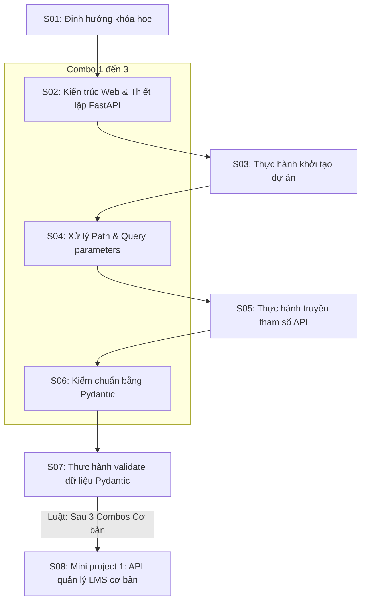

# Phân Tích & Đề Xuất Giải Pháp Tối Ưu Nhịp Độ Học Tập (Pacing & Cognitive Design)

Dựa trên các góp ý chuyên sâu từ góc độ sư phạm và giảng dạy thực tế, chúng tôi đề xuất bộ giải pháp chi tiết sau để cải tiến thuật toán thiết kế Syllabus (PM) tự động của AI Agent.

---

## 1. Giải Pháp Cho 7 Vấn Đề Góp Ý

### 🛠️ Vấn đề 1: Buổi 1 (Orientation) thuần định hướng
- **Giải pháp**: Cấu hình mặc định cho `Session 01` là **Lý thuyết** nhưng **không chứa bài học lập trình hoặc cài đặt**. Nội dung của buổi này sẽ tập trung 100% vào: Giới thiệu lộ trình học, Cam kết chuẩn đầu ra CLO/PLO, Showcase kết quả dự án mẫu của cựu sinh viên, và Hướng dẫn phương pháp học tập chủ động.

### 🛠️ Vấn đề 2: Tối ưu hóa tiêu đề và sự liên kết Lý thuyết - Thực hành
- **Giải pháp**: 
  - Khắc phục sự lãng phí bằng cách gộp bài lý thuyết nhẹ về "Kiến trúc Web" và "Khởi động dự án FastAPI" vào chung **Session 02**.
  - Đặt tiêu đề đồng bộ, hướng về kết quả đầu ra:
    - **Session 02**: `Kiến trúc ứng dụng Web và thiết lập dự án FastAPI` (Lý thuyết).
    - **Session 03**: `Thực hành khởi tạo dự án và chạy ứng dụng API đầu tiên` (Thực hành - thực hành trực tiếp nội dung của Session 02).

### 🛠️ Vấn đề 3: Ràng buộc phạm vi thực hành (Strict Scope Containment)
- **Giải pháp**: Áp dụng luật **"Cấm rò rỉ kiến thức tương lai"**. Bộ đề xuất bài thực hành ở Session $N$ chỉ được phép sử dụng các kiến thức nằm trong tập hợp các buổi lý thuyết từ $1$ đến $N-1$. AI Agent sẽ kiểm duyệt tập hợp các khái niệm đã học để đưa vào phần mô tả nhiệm vụ thực hành, loại bỏ mọi khái niệm nâng cao chưa học.

### 🛠️ Vấn đề 4: Phân bổ Mini Project theo mô hình Combo
- **Giải pháp**: Định nghĩa rõ 1 **Combo = [Lý thuyết + Thực hành]** trên cùng 1 nhóm kiến thức.
  - **Nhóm kiến thức cơ bản (Routing, Validation)**: Tần suất **3 - 4 combos** ➔ 1 Mini Project.
  - **Nhóm kiến thức phức tạp (SQLAlchemy ORM, Auth/JWT)**: Tần suất **2 combos** ➔ 1 Mini Project.
  - Vị trí của Mini Project sẽ là buổi tổng hợp toàn bộ các combo trước đó để xây dựng module sản phẩm hoàn chỉnh.

### 🛠️ Vấn đề 5 & 6: Mốc thi Hackathon (Giữa môn) & Buổi Tổng ôn tập (Review)
- **Giải pháp**:
  - Xác định điều kiện thi Hackathon: Sinh viên phải hoàn thành tối thiểu phần **API CRUD** và **Database connection** (vì đây là kỹ năng backend cốt lõi nhất).
  - Đối với môn 36 buổi, mốc thi Hackathon tối ưu sẽ được đặt tại **Session 24**.
  - **Session 23** (ngay trước đó) sẽ là buổi **Thực hành (Tổng ôn tập kiến thức nâng cao và chuẩn bị thi giữa môn)**. Giảng viên sẽ chữa bài tập mẫu và sinh viên luyện đề thi thử.

### 🛠️ Vấn đề 7: Loại bỏ hậu tố phân loại độ khó trong tiêu đề Session
- **Giải pháp**: Loại bỏ hoàn toàn các hậu tố hiển thị như `(HEAVY)`, `(LIGHT)`, `(Lý thuyết Nhẹ)` khỏi tiêu đề chuỗi của Session.
  - Tên tiêu đề buổi học trên bảng và trên file Excel sẽ sạch 100% (Ví dụ: `Kiểm chuẩn dữ liệu đầu vào bằng Pydantic models`).
  - Thông số phân loại độ nặng nhẹ (Heavy/Light) chỉ được lưu ở dạng metadata ẩn trong mã JSON để Agent tự xử lý logic, không hiển thị ra ngoài giao diện cho sinh viên thấy.

---

## 2. Mô Phỏng Lộ Trình Môn FastAPI (IT-204) 36 Buổi Chuẩn Hóa

Dưới đây là sơ đồ phân bổ buổi học đạt chuẩn sau khi áp dụng toàn bộ 7 quy tắc hiệu chỉnh trên:

### 📋 Lộ trình 36 buổi chi tiết:

| Buổi (Session) | Hình thức học | Tên tiêu đề buổi học | Nội dung chi tiết các bài học / Nhiệm vụ thực hành | Ghi chú / Mục tiêu đạt được | Mức độ tải (Metadata) |
| :--- | :--- | :--- | :--- | :--- | :--- |
| **Session 01** | Lý thuyết | Định hướng khóa học và giới thiệu lộ trình Backend | Giới thiệu lộ trình FastAPI, cam kết chuẩn đầu ra CLO/PLO, demo dự án cuối khóa. | Học viên hiểu rõ mục tiêu và phương pháp học. | LIGHT |
| **Session 02** | Lý thuyết | Kiến trúc ứng dụng Web và thiết lập dự án FastAPI | Tổng quan Client-Server, HTTP methods/status, khởi tạo venv và cài đặt FastAPI. | Nắm được kiến trúc web và lệnh chạy Uvicorn. | LIGHT |
| **Session 03** | Thực hành | Thực hành thiết lập dự án và chạy ứng dụng API đầu tiên | Khởi tạo cấu trúc dự án, tạo file main.py và chạy thử endpoint Hello World trên cổng localhost. | Thành thạo cài đặt môi trường và chạy thử API. | PRACTICE |
| **Session 04** | Lý thuyết | Xử lý định tuyến động và tham số Path, Query | Định nghĩa Path parameters dynamic, cách lấy dữ liệu Query parameters lọc danh sách. | Làm chủ tham số trên đường dẫn API. | LIGHT |
| **Session 05** | Thực hành | Thực hành xây dựng các tuyến API lấy tham số động | Viết API lọc danh sách sản phẩm theo khoảng giá và danh mục, ràng buộc kiểu dữ liệu số nguyên/chuỗi. | Truy xuất dữ liệu API qua URL tham số. | PRACTICE |
| **Session 06** | Lý thuyết | Kiểm chuẩn dữ liệu đầu vào bằng Pydantic models | Giới thiệu Pydantic, viết các class schemas để tự động validate kiểu dữ liệu JSON request body. | Bảo vệ Backend khỏi dữ liệu rác. | LIGHT |
| **Session 07** | Thực hành | Thực hành validate dữ liệu đăng ký người dùng bằng Pydantic | Xây dựng schema validate email, số điện thoại và các ràng buộc dữ liệu mật khẩu phức tạp. | Thành thạo kiểm chuẩn dữ liệu JSON. | PRACTICE |
| **Session 08** | **Mini project** | **Dự án nhỏ 1: Xây dựng bộ API quản lý học viên cơ bản** | Thiết kế ứng dụng quản lý học viên lưu trữ tạm thời trong RAM, hỗ trợ CRUD và lọc danh sách. | Tổng hợp toàn bộ kiến thức từ Session 2 đến Session 7. | MINI_PROJECT |
| **Session 09** | Lý thuyết | Tương tác cơ sở dữ liệu quan hệ bằng SQLAlchemy ORM | Cấu hình kết nối DB Engine, định nghĩa Models thực thể kế thừa Base. | Kết nối database từ mã nguồn Python. | HEAVY |
| **Session 10** | Thực hành | Thực hành kết nối cơ sở dữ liệu và quản lý Alembic Migrations | Cấu hình file env của Alembic, tạo phiên bản migration và đồng bộ cấu trúc bảng lên PostgreSQL. | Làm chủ luồng cập nhật cơ sở dữ liệu. | PRACTICE |
| **Session 11** | Lý thuyết | Triển khai các thao tác CRUD cơ bản và Transaction | Thực hiện select, filter, insert, update dữ liệu bằng db session, cơ chế commit/rollback. | Lập trình các tương tác dữ liệu chính xác. | HEAVY |
| **Session 12** | Thực hành | Thực hành API CRUD tương tác trực tiếp PostgreSQL | Viết các route xử lý CRUD người dùng, tích hợp cơ chế Soft Delete. | Hoàn thiện cổng CRUD database thực tế. | PRACTICE |
| **Session 13** | Lý thuyết | Thiết lập mối quan hệ các bảng trong SQLAlchemy | Định nghĩa quan hệ One-to-Many, Many-to-Many và tối ưu hóa hiệu năng eager loading. | Giải quyết triệt để lỗi N+1 queries. | HEAVY |
| **Session 14** | Thực hành | Thực hành thiết kế API đơn hàng liên kết nhiều bảng | Xây dựng các route quản lý Order and OrderItems, thiết kế schemas dữ liệu lồng nhau. | Làm chủ quan hệ database trong FastAPI. | PRACTICE |
| **Session 15** | **Mini project** | **Dự án nhỏ 2: Hoàn thiện Backend API cho giỏ hàng đa bảng** | Thiết lập ứng dụng quản lý giỏ hàng kết nối PostgreSQL, có ràng buộc chặt chẽ khóa ngoại. | Áp dụng 2 combos Database & ORM nâng cao. | MINI_PROJECT |
| **Session 16** | Lý thuyết | Hệ thống xác thực người dùng và mã hóa mật khẩu | Cơ chế đăng ký, đăng nhập hệ thống, băm mật khẩu bảo mật sử dụng Bcrypt. | Bảo mật thông tin lưu trữ mật khẩu. | HEAVY |
| **Session 17** | Thực hành | Thực hành viết API Đăng ký tài khoản và mã hóa mật khẩu | Viết route đăng ký, bẫy lỗi email trùng lặp và lưu trữ mật khẩu đã băm vào DB. | Làm chủ quy trình đăng ký người dùng an toàn. | PRACTICE |
| **Session 18** | Lý thuyết | Phát hành và kiểm chuẩn mã xác thực JWT Tokens | Cấu trúc JWT, cách sinh Access Token có thời hạn và viết dependency bảo mật route. | Đăng nhập cấp quyền dựa trên mã token. | HEAVY |
| **Session 19** | Thực hành | Thực hành bảo mật API sử dụng mã xác thực JWT | Viết route đăng nhập cấp token và dependency lấy thông tin tài khoản hiện tại từ request header. | Hoàn thiện cơ chế đăng nhập hệ thống. | PRACTICE |
| **Session 20** | **Mini project** | **Dự án nhỏ 3: Tích hợp hệ thống phân quyền thành viên (LMS)** | Xây dựng phân quyền người dùng (Role-Based Access Control) cho giảng viên/học sinh trên nền tảng. | Áp dụng 2 combos bảo mật xác thực nâng cao. | MINI_PROJECT |
| **Session 21** | Lý thuyết | Quản lý kiểm soát CORS và cấu hình môi trường Production | Hiểu cơ chế CORS, cách cấu hình middleware CORS trong FastAPI để gọi từ Frontend. | Sẵn sàng kết nối API với giao diện người dùng. | LIGHT |
| **Session 22** | Thực hành | Thực hành cấu hình CORS và triển khai Docker Container | Viết Dockerfile đóng gói ứng dụng FastAPI kết nối với container cơ sở dữ liệu PostgreSQL. | Đóng gói thành công ứng dụng độc lập. | PRACTICE |
| **Session 23** | **Thực hành** | **Tổng ôn tập thực hành và luyện đề chuẩn bị thi giữa môn** | Tổng ôn tập toàn bộ kiến thức từ buổi 1 đến buổi 22, hướng dẫn giải quyết các bài toán bẫy. | Chuẩn bị sẵn sàng kỹ năng thi Hackathon. | PRACTICE |
| **Session 24** | **Thi giữa môn** | **Thi Hackathon: Lập trình hệ thống Backend API Server hoàn chỉnh** | Thực hiện bài thi lập trình trực tiếp xây dựng RESTful API Server có xác thực và kết nối DB PostgreSQL. | Đánh giá năng lực độc lập của sinh viên. | HACKATHON |
| **Session 25** | Lý thuyết | Lập trình bất đồng bộ chuyên sâu và Background Tasks | Giải thích Event Loop, chạy các tác vụ chạy ngầm gửi email, xuất báo cáo ngầm. | Tối ưu thời gian phản hồi cho client. | HEAVY |
| **Session 26** | Thực hành | Thực hành viết API gửi email xác nhận thông qua Background Tasks | Viết logic gửi email kích hoạt tài khoản ngầm mà không làm nghẽn luồng xử lý API. | Thành thạo xử lý tác vụ chạy ngầm. | PRACTICE |
| **Session 27** | Lý thuyết | Xử lý File Upload và quản lý tệp tin tĩnh trong FastAPI | Cách upload tệp tin hình ảnh, lưu trữ vào thư mục static và trả ra URL liên kết ảnh. | Xây dựng chức năng tải ảnh đại diện. | LIGHT |
| **Session 28** | Thực hành | Thực hành API tải hình ảnh và liên kết ảnh đại diện người dùng | Viết route upload file, kiểm tra dung lượng, đuôi tệp tin và cập nhật link ảnh vào database. | Làm chủ tương tác tệp tin tĩnh. | PRACTICE |
| **Session 29** | Lý thuyết | Tích hợp WebSocket truyền tải dữ liệu thời gian thực | Nguyên lý hoạt động của kết nối hai chiều WebSocket so với HTTP client. | Xây dựng hạ tầng real-time. | HEAVY |
| **Session 30** | Thực hành | Thực hành API trò chuyện trực tuyến thời gian thực | Xây dựng cổng chat đơn giản giữa nhiều client kết nối đồng thời qua giao thức WebSocket. | Làm chủ luồng giao tiếp real-time. | PRACTICE |
| **Session 31** | Lý thuyết | Tích hợp kiểm thử tự động API bằng thư viện Pytest | Viết test cases tự động mô phỏng client gọi route, kiểm tra database cô lập. | Đảm bảo tính ổn định khi nâng cấp code. | HEAVY |
| **Session 32** | Thực hành | Thực hành viết kiểm thử tự động cho hệ thống API CRUD | Sử dụng TestClient để tự động kiểm thử toàn bộ hệ thống API CRUD và đăng nhập. | Thành thạo viết unit test/integration test. | PRACTICE |
| **Session 33** | **Capstone Project** | **Dự án cuối khóa - Buổi 1: Đặc tả SRS và thiết kế cơ sở dữ liệu** | Phân tích bài toán dự án thực tế, vẽ sơ đồ ERD và thống nhất API Specs. | Hoàn thiện thiết kế hệ thống. | PROJECT |
| **Session 34** | **Capstone Project** | **Dự án cuối khóa - Buổi 2: Lập trình logic API và ORM** | Triển khai viết mã nguồn phần Backend, cấu hình database và tạo các routers. | Hoàn thiện 60% tiến độ dự án. | PROJECT |
| **Session 35** | **Capstone Project** | **Dự án cuối khóa - Buổi 3: Tích hợp bảo mật và deploy Cloud** | Hoàn thiện bảo mật JWT, kiểm thử lỗi và triển khai dự án lên hạ tầng VPS/Cloud. | Sản phẩm sẵn sàng bàn giao. | PROJECT |
| **Session 36** | **Dự án cuối khóa** | **Bảo vệ dự án phát triển sản phẩm Web Backend hoàn chỉnh** | Học viên báo cáo demo sản phẩm và giải trình câu hỏi chất vấn trước Hội đồng đánh giá. | Đạt chuẩn đầu ra môn học và chuẩn PLO/CLO. | PROJECT |
