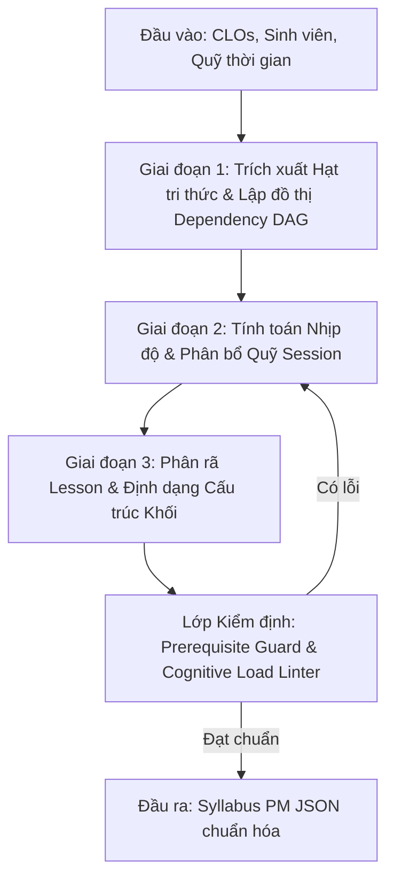

# Đề Xuất Ý Tưởng & Thiết Kế Kiến Trúc: Syllabus PM Generator Agent
*(Góc nhìn Quản lý Giáo dục & Kiến trúc sư AI Agent)*

Hệ thống sẽ nâng cấp thêm một cấu phần chỉ huy cấp cao: **Syllabus PM Generator Agent (SPGA)**. Nhiệm vụ của Agent này là đóng vai trò như một chuyên gia phát triển chương trình, nhận vào các dữ liệu đầu vào thực trạng và xuất ra file phân bổ chương trình chi tiết (file PM) đạt tiêu chuẩn vàng như tệp Excel PTIT 2026 mà không cần con người chia buổi thủ công.

Dưới đây là ý tưởng thiết kế kiến trúc toàn diện của Agent này.

---

## 1. Luồng Quy Trình Xử Lý 3 Giai Đoạn Của AI (3-Stage Reasoning Loop)

Để tạo ra một chương trình học cân bằng giữa lý thuyết và thực hành, SPGA sẽ thực thi theo đồ thị tư duy 3 bước sau:



### 1.1. Giai đoạn 1: Trích xuất Hạt tri thức (Knowledge Unit Extraction)
- **Hành động của AI**: Phân tích các chuẩn đầu ra môn học (`CLOs`) và mục tiêu chương trình (`PLOs`). AI tự động phân rã chúng thành một danh sách các **Hạt tri thức** (Knowledge Units - KUs) cần thiết để đạt được năng lực đó.
- **Xây dựng Đồ thị Phụ thuộc (Dependency DAG)**: Sắp xếp các KUs theo thứ tự logic tiên quyết:
  - *Ví dụ*: Cú pháp biến ➔ Luồng điều kiện ➔ Vòng lặp ➔ Hàm ➔ Xử lý mảng.
  - Đồ thị này đảm bảo toán học sư phạm: Node cha luôn được dạy trước Node con.

### 1.2. Giai đoạn 2: Tính toán Nhịp độ & Phân bổ Quỹ Session (Pacing & Session Budgeting)
- **Hành động của AI**: Tính toán **Hệ số Nhịp độ Học tập (Pacing Index - PI)** dựa trên Hồ sơ sinh viên:
  - Công thức giả lập:
    $$PI = \text{Entry Level Factor} \times \text{Background Factor} \times \text{Cognitive Speed}$$
  - Nếu sinh viên chuyển ngành (Non-IT, Beginner), hệ số $PI$ thấp (ví dụ: $0.7$) ➔ Tần suất phân bổ KUs vào mỗi Session sẽ thưa hơn, đồng thời hệ thống tự động chèn xen kẽ các **Session thực hành tổng hợp** ngay sau mỗi 1-2 Session lý thuyết để củng cố.
  - Phân bổ KUs vào tổng số buổi học quy định (`total_sessions`). Nếu quỹ buổi học bị giới hạn, AI sẽ ưu tiên giữ lại các KUs cốt lõi đáp ứng CLO và đẩy các KUs nâng cao thành "Tài liệu đọc thêm/Tự học".

### 1.3. Giai đoạn 3: Phân rã Lesson & Định dạng Khối (Lesson Granularization)
- **Hành động của AI**:
  - Đối với các **Session Lý thuyết**: Phân rã nội dung Session thành **3 - 5 Lessons** nhỏ (Micro-lessons) để giảm tải nhận thức, bám sát cấu trúc của tệp mẫu PTIT 2026.
  - Đối với các **Session Thực hành/Project**: Giữ nguyên dưới dạng Session khối đơn lẻ (không chia nhỏ Lesson con), tập trung vào làm bài tập nghiệp vụ thực tế.
  - Thiết lập thuộc tính `allowed_scope` (được dùng kiến thức gì) và `forbidden_scope` (cấm đụng vào kiến thức tương lai nào) cho từng buổi.

---

## 2. Thiết Kế Chi Tiết Dữ Liệu Đầu Vào & Đầu Ra (Input/Output Spec)

### 2.1. Cấu trúc Input (Dữ liệu đầu vào từ Phòng Đào tạo)
Dữ liệu đầu vào sẽ được khai báo dưới dạng cấu trúc JSON rõ ràng:

```json
{
  "course_metadata": {
    "course_code": "IT-106",
    "course_name": "Phát triển ứng dụng web",
    "semester": "SEM I"
  },
  "student_profile": {
    "entry_level": "beginner",
    "background": "non-it",
    "cognitive_speed": 0.95
  },
  "learning_outcomes": {
    "plos_mapped": ["PLO 1", "PLO 4"],
    "clos": [
      {
        "id": "CLO 1",
        "description": "Lập trình được các tương tác Web cơ bản và kết nối API bằng Javascript thuần"
      },
      {
        "id": "CLO 2",
        "description": "Phân tích và xử lý dữ liệu JSON từ hệ thống bên ngoài"
      }
    ]
  },
  "time_budget": {
    "total_sessions": 25,
    "session_distribution": {
      "theory_sessions": 12,
      "practice_sessions": 10,
      "mini_projects": 2,
      "final_exam": 1
    }
  }
}
```

### 2.2. Cấu trúc Output mong đợi (Tương thích 100% với tệp chuẩn PTIT 2026)
Đầu ra của Agent sẽ là một sơ đồ chương trình học chi tiết (Syllabus PM Schema):

```json
{
  "course_code": "IT-106",
  "course_name": "Phát triển ứng dụng web",
  "sessions": [
    {
      "session_num": 1,
      "hinh_thuc": "Lý thuyết",
      "title": "Tổng quan về Javascript & Biến",
      "lessons": [
        {
          "lesson_num": 1,
          "title": "Lịch sử Javascript và vai trò trong xã hội số",
          "details": "Kiến trúc runtime của JS trên trình duyệt..."
        },
        {
          "lesson_num": 2,
          "title": "Khai báo biến với var, let, const",
          "details": "Sự khác biệt về scope, hoisting và quy chuẩn đặt tên biến tiếng Anh..."
        }
      ]
    },
    {
      "session_num": 2,
      "hinh_thuc": "Thực hành",
      "title": "Luyện tập tổng hợp - Làm việc với biến trong JS",
      "lessons": []
    }
  ]
}
```

---

## 3. Lớp Kiểm Định An Toàn & Phản Biện (Guardrails & Validation Layer)

Để đảm bảo chương trình được AI thiết kế đạt chuẩn giáo dục quốc tế, kết quả đầu ra phải đi qua **Cổng kiểm duyệt tự động**:

1. **Prerequisite Loopback Check**:
   - Gọi tác nhân `Prerequisite Guard` kiểm tra chéo file JSON đầu ra. 
   - Nếu phát hiện Lesson ở Session $N$ chứa khái niệm kỹ thuật chưa được dạy ở các Session từ $1$ đến $N-1$, Agent sẽ bị ép buộc tái cấu trúc lại vị trí các buổi học.
2. **Cognitive Load Linter**:
   - Kiểm tra số lượng Lessons trong mỗi Session Lý thuyết. 
   - Nếu `student_profile.entry_level` = `beginner` mà số lượng Lessons trong một Session vượt quá **4**, hệ thống sẽ cảnh báo lỗi quá tải nhận thức và yêu cầu AI gộp hoặc tách buổi học.

---

## 4. Kế Hoạch Tích Hợp Vào Engine Hiện Tại (Antigravity Graph Integration)

Chúng tôi đề xuất tích hợp SPGA vào đồ thị Antigravity hiện tại bằng cách thêm một node khởi đầu:

1. **Node 0: `generate_syllabus_pm`**:
   - Node này sẽ chạy đầu tiên (trước `pm_review`).
   - Đọc cấu hình đầu vào `student_profile` và `learning_outcomes` từ file cấu hình của người dùng.
   - Gọi **Syllabus PM Generator Agent** để sinh ra file `syllabus_pm_generated.json`.
2. **Node 1: `pm_review`**:
   - Đọc file `syllabus_pm_generated.json` làm đầu vào, tiến hành thẩm định và xuất báo cáo.
3. **Các Creator Nodes kế tiếp**:
   - Đọc trực tiếp từ file JSON đã sinh để khởi tạo cấu trúc thư mục học liệu vật lý và sinh HTML/Slide/Quiz chuẩn xác theo đúng nhịp độ học tập của sinh viên.

---
Bản đề xuất ý tưởng này thiết lập một phương án tiếp cận sư phạm định lượng chặt chẽ. Chúng tôi sẵn sàng hỗ trợ triển khai thực tế thiết kế chi tiết các Prompt và Schema lớp cấu phần này ngay khi nhận được phê duyệt của Ban Giám đốc.
