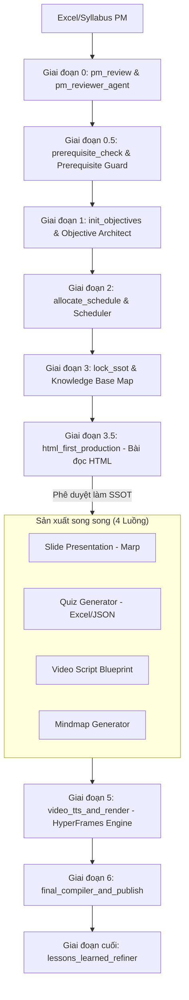

# Báo Cáo Phân Tích Hệ Thống Elearning Content Factory
*(Góc nhìn Senior Software Architect & AI Agent Expert)*

Hệ thống **Elearning Content Factory** là một nền tảng sản xuất học liệu đa phương tiện tự động hóa quy mô lớn, được phát triển trên kiến trúc đa tác nhân (Multi-Agent Architecture) và điều phối bởi Engine đồ thị tuần tự tùy biến **Antigravity**. Hệ thống có mức độ trưởng thành kỹ thuật cao, áp dụng các best practices trong lập trình hệ thống agentic và tối ưu hóa xử lý ngôn ngữ tự nhiên.

Dưới đây là phân tích chi tiết toàn diện về kiến trúc, mã nguồn, các điểm sáng sư phạm/kỹ thuật và định hướng tối ưu hóa hệ thống.

---

## 1. Bản Đồ Tổng Quan Kiến Trúc Hệ Thống

Hệ thống hoạt động theo mô hình **Pipeline Hướng Luồng Tri Thức (Knowledge-Driven Pipeline)**. Toàn bộ tài nguyên được dẫn xuất từ một file đặc tả duy nhất (`syllabus.json` hoặc Excel PM) thông qua các bước xử lý nghiêm ngặt:

---

## 2. Phân Tích Động Cơ Điều Phối Asynchronous DAG Engine (Antigravity)

Trong file [antigravity.py](file:///d:/Rikkei%20Education/Elearning_Agent/Learning-Material/antigravity.py), hệ thống không sử dụng các framework nặng như LangChain hay LangGraph, mà tự xây dựng một **Engine DAG Asynchronous gọn nhẹ với Declarative State Reducers**.

### 2.1. Thiết kế Hướng Trạng thái (State Reducer Pattern)
- **Cơ chế**: Engine hoạt động trên một trạng thái dùng chung `AgentState` ([core/state.py](file:///d:/Rikkei%20Education/Elearning_Agent/Learning-Material/core/state.py)). Thay vì code cứng cách trộn dữ liệu của các nhánh chạy song song, hệ thống khai báo đăng ký reducer map (`STATE_REDUCERS`) cho từng trường:
  - `override`: Dành cho các trường nội dung đơn lẻ (VD: `html_content`, `slide_markdown`). Tránh ghi đè giá trị rỗng từ các nhánh không liên quan.
  - `append_unique`: Dành cho các log tích lũy (VD: `review_logs`, `error_logs`).
  - `merge_dict`: Trộn nông (shallow merge) cấu hình trạng thái (VD: `artifacts_status`).
- **Ưu điểm Senior**: Tách biệt hoàn toàn logic lõi của Engine điều phối với logic xử lý nghiệp vụ (Domain-Agnostic). Khi thêm cấu phần mới (ví dụ: `homework_pdf`), lập trình viên chỉ cần đăng ký reducer tương ứng mà không phải sửa mã nguồn lõi của Engine.

### 2.2. Nhánh Thực Thi Song Song (Parallel Execution)
- Trong [core/graph.py](file:///d:/Rikkei%20Education/Elearning_Agent/Learning-Material/core/graph.py#L779-L837), node `parallel_derived_production` khởi chạy đồng thời 4 pipeline dẫn xuất (Slide, Quiz, VideoScript, Mindmap) bằng `ThreadPoolExecutor` trên các bản sao sâu (`copy.deepcopy(state)`).
- **Cơ chế Merge**: Sau khi các thread hoàn tất, Engine quét toàn bộ các khóa trạng thái trả về của từng nhánh, tra cứu reducer từ registry và gộp ngược lại vào master state.

---

## 3. Quy Trình Kiểm Duyệt Sư Phạm & Kỹ Thuật (Critique & Guardrails)

Hệ thống thiết lập một rào chắn chất lượng cực kỳ tinh vi thông qua 2 lớp kiểm định: **Lập trình định lượng (Programmatic Linter)** và **Phản biện AI (Agent Critique Loop)**.

### 3.1. Prerequisite Guard (Tính Tuần Tự Tri Thức)
Nằm trong [agents/prerequisite_guard_agent.py](file:///d:/Rikkei%20Education/Elearning_Agent/Learning-Material/agents/prerequisite_guard_agent.py):
- **Cơ chế**: Sử dụng LLM phân tích toàn bộ syllabus theo cụm (batching 10 sessions để tránh tràn context), trích xuất registry khái niệm kỹ thuật cốt lõi và định vị bài học dạy đầu tiên.
- **Topological Validation**: Khi biên dịch bài học hiện tại, hệ thống kiểm tra xem các khái niệm kỹ thuật được sử dụng có nằm ngoài tập khái niệm đã học (`known_concepts`) hay không. 
- **Quy chuẩn xử lý**: Nếu phát hiện vi phạm tiên quyết (khái niệm nâng cao xuất hiện trước khi giới thiệu), hệ thống phân loại mức độ nghiêm trọng (`BLOCKER` cho bài nâng cao, `WARNING` cho bài cơ bản) và chặn hoàn toàn pipeline biên dịch (nếu có Blocker), xuất báo cáo `prerequisite_report.md`.

### 3.2. Chương Trình Linter Tự Động (Programmatic Linting)
Trong [agents/reviewer_agents.py](file:///d:/Rikkei%20Education/Elearning_Agent/Learning-Material/agents/reviewer_agents.py):
- **Bắt emoji**: Sử dụng Regex Unicode quét và cấm triệt để emoji trong nội dung học liệu để giữ tính học thuật nghiêm túc.
- **Phát hiện Tiếng Việt không dấu**: Sử dụng tập hợp các mẫu từ khóa không dấu phổ biến trong lập trình để phát hiện lỗi dịch thuật hoặc rò rỉ prompt từ AI, bắt buộc đầu ra 100% Tiếng Việt chuẩn sản xuất.
- **Master Validator**: Phân phối kiểm tra cú pháp HTML/JS bằng `lint_html_syntax`, đảm bảo không lỗi thẻ chưa đóng trước khi đưa vào trình duyệt.

### 3.3. Critique Loop (Vòng Lặp Phản Biện Tự Động)
- Toàn bộ các bước sinh nội dung quan trọng (Bài đọc HTML, Slide, Quiz, Video Script) đều chạy trong một vòng lặp thử-sai (tối đa 3 lần).
- Đứng sau là các Reviewer chuyên biệt (`html_ux_reviewer`, `academic_reviewer`, `sandbox_testing_agent`). 
- Nếu Reviewer từ chối (`REJECTED`), log phản hồi phản biện (`feedback`) sẽ được đưa ngược lại vào lịch sử (`review_logs`) để làm ngữ cảnh đầu vào cho Creator Agent sửa đổi ở lượt kế tiếp.

---

## 4. Pipeline Video Voice-Driven (HyperFrames Render Engine)

Mô hình sản xuất Video HyperFrames trong [hyperframes/video_pipeline_engine.py](file:///d:/Rikkei%20Education/Elearning_Agent/Learning-Material/hyperframes/video_pipeline_engine.py) đại diện cho phương pháp thiết kế video tự động tiên tiến:

1. **Voice-UI Separation**: Tách bạch kịch bản lời thoại thoại TTS tự nhiên với cấu trúc từ khóa/mã nguồn hiển thị trên UI.
2. **Audio Probing & durations.json**: Thay vì hardcode thời gian hiển thị slide, hệ thống gọi Kokoro-Vietnamese hoặc Edge-TTS sinh file âm thanh `.wav` trước, sau đó dùng `soundfile` hoặc `ffprobe` đo đạc chính xác thời lượng thực tế tới từng miligiây.
3. **Voice-Driven GSAP HTML**: Sinh các sub-compositions HTML tích hợp animation GSAP. Tổng thời lượng hiển thị (duration) của mỗi phân cảnh được gắn khớp 100% với thời lượng của file âm thanh TTS tương ứng.
4. **Controlled Puppeteer Render**: Dùng Chrome không đầu (headless Puppeteer thông qua lệnh `hyperframes render`) chuyển đổi Master index.html (tập hợp các sub-compositions HTML lồng ghép âm thanh/nhạc nền) thành tệp MP4 hoàn chỉnh.

---

## 5. Tối Ưu Hóa Trải Nghiệm Học Tập & Tri Thức

### 5.1. Học tập Liên Kết Nhờ Obsidian Knowledge Vault
File [core/obsidian_knowledge_linker.py](file:///d:/Rikkei%20Education/Elearning_Agent/Learning-Material/core/obsidian_knowledge_linker.py) giúp người học có cái nhìn trực quan:
- Biến đổi cấu trúc khóa học thành một Obsidian Vault số hóa.
- Tự động chèn metadata frontmatter và liên kết Wiki dạng DAG (`[[Session Name]]`).
- Người học sử dụng tính năng **Graph View** của Obsidian để thấy sơ đồ mạng lưới luồng tri thức của môn học, giúp tự học tuần tự cực kỳ hiệu quả.

### 5.2. Hợp nhất Master Hub Sư phạm
File [core/session_compilers.py](file:///d:/Rikkei%20Education/Elearning_Agent/Learning-Material/core/session_compilers.py) cung cấp trình gộp trang thông minh:
- Gộp toàn bộ bài đọc lẻ trong Session thành một Master Hub `reading_all.html`.
- **Senior Design**: Thay vì sử dụng `display: none` làm ẩn các tab bài học khác, compiler sử dụng **cơ chế Iframe hiển thị với thuộc tính z-index và opacity** để chuyển đổi bài học. Đây là giải pháp xử lý cao tay, vì các thư viện vẽ sơ đồ như Mermaid hay thư viện hoạt họa sẽ bị tính sai kích thước khung (dimension) nếu nằm trong phần tử ẩn `display: none`, còn kỹ thuật opacity giữ nguyên kích thước tính toán của Iframe.

---

## 6. Cơ Chế Quan Sát & Tối Ưu LLM (Observability & Caching)

### 6.1. Gemini Context Caching
- Trong [core/llm.py](file:///d:/Rikkei%20Education/Elearning_Agent/Learning-Material/core/llm.py), hệ thống triển khai bộ nhớ đệm ngữ cảnh prompt (`CachedContent.create`).
- Khi system prompt vượt quá giới hạn cấu hình (mặc định 32,768 tokens, bao gồm các file skill chỉ dẫn và guidelines đồ sộ), Engine sẽ tạo cache trên Google AI API với thời lượng sống (TTL) 30 phút. 
- Các cuộc gọi LLM tiếp theo của các Agent trong Session sẽ đánh trúng Cache (Cache Hit), giúp **giảm chi phí tài chính đáng kể và tăng tốc độ phản hồi gấp 2 - 3 lần**.

### 6.2. Observability & Semantic Convention
- Toàn bộ cuộc gọi của các Agent được kiểm soát bởi bộ ghi dấu trace log (`core/observability.py`).
- Cung cấp tính năng gửi dữ liệu vết chạy sang các collector bên ngoài qua **OpenTelemetry SDK** và **Langfuse SDK**, đồng thời xuất log JSONL cục bộ bám sát chuẩn **OpenTelemetry GenAI Semantic Conventions** (ghi nhận model, input tokens, output tokens, duration).

---

## 7. Đánh Giá Điểm Mạnh & Đề Xuất Cải Tiến Của Chuyên Gia

### 7.1. Các Điểm Sáng Kỹ Thuật (Strengths)
1. **Lỏng lẻo về liên kết đồ thị (Low Coupling Graph)**: Động cơ Antigravity có tính tái sử dụng cao, không bị dính chặt với nội dung elearning.
2. **Kiểm định đa lớp (Multi-layered Linting)**: Kết hợp cả linter tĩnh (Regex/HTML parser) và dynamic review (LLM) để lọc sạch lỗi trước khi ghi đĩa.
3. **Mô phỏng Code Sandbox an toàn**: Chạy code kiểm định quiz bằng Docker độc lập không mạng hoặc qua E2B sandbox mây giúp bảo mật tuyệt đối host chạy.
4. **Cơ chế nạp thông minh (Disk-Sync)**: Trong [core/graph.py](file:///d:/Rikkei%20Education/Elearning_Agent/Learning-Material/core/graph.py#L738-L753), hệ thống tự động phát hiện nếu bài đọc HTML trên đĩa đã có nội dung và đồng bộ ngược lại vào State để không sinh đè bản chỉnh sửa thủ công của con người.

### 7.2. Các Đề Xuất Tối Ưu Hóa & Cải Tiến Hệ Thống (Opportunities)
1. **Nâng cấp Quản lý Trạng thái & Cơ chế Retry khi Lỗi Thread**:
   - Khi chạy parallel 4 nhánh trong `parallel_derived_production`, nếu một nhánh con gặp lỗi nghiêm trọng (như lỗi parse JSON của LLM), toàn bộ pipeline chính sẽ bị lỗi theo hoặc mất mát trường dữ liệu gộp.
   - *Khuyên dùng*: Triển khai khối try-catch an toàn trong thread pool, tự động cô lập lỗi nhánh hỏng, hồi phục trạng thái từ checkpoint gần nhất hoặc tạo bản mock tự động thay vì dừng đột ngột hệ thống.
2. **Cơ chế Quét Scope Tri thức Tránh False-Positive**:
   - Hiện tại, hàm `_concept_appears_in_content` trong `Prerequisite Guard` kiểm tra sự tồn tại của khái niệm bằng Regex tìm kiếm từ đơn giản (`c_name in content_lower`). Kỹ thuật này dễ gây hiện tượng báo động giả (False-Positive) đối với các từ phổ thông (ví dụ: khái niệm "Class" trong OOP dễ bị dính với cụm từ "CSS class" hoặc "class container").
   - *Khuyên dùng*: Nâng cấp bộ so khớp tri thức bằng việc trích xuất thực thể ngữ nghĩa (Named Entity Recognition - NER) thông qua LLM hoặc xây dựng danh sách từ đồng nghĩa / cấu trúc ngữ cảnh để lọc bỏ từ trùng lặp.
3. **Tối ưu Hóa Tài Nguyên render Puppeteer**:
   - Quá trình render Puppeteer MP4 là một tiến trình nặng (heavy CPU/RAM). Chạy render video ngay trong pipeline chính dễ gây quá tải hệ thống nếu chạy nhiều session đồng thời.
   - *Khuyên dùng*: Tách tiến trình render video thành hàng đợi phi tập trung (Async Task Queue) như Celery hoặc chạy nền độc lập hoàn toàn thông qua cờ cấu hình tắt render (`ENABLE_HEAVY_VIDEO_RENDER=false`), chỉ dựng khung HTML/TTS để render thủ công khi cần.

---
Bản báo cáo này cung cấp cái nhìn toàn diện về mặt kỹ thuật cho hệ thống **Elearning Content Factory**. Thiết kế hệ thống cực kỳ bài bản và tối ưu, xứng đáng là hình mẫu cho các dự án multi-agent quy mô lớn hiện nay.
