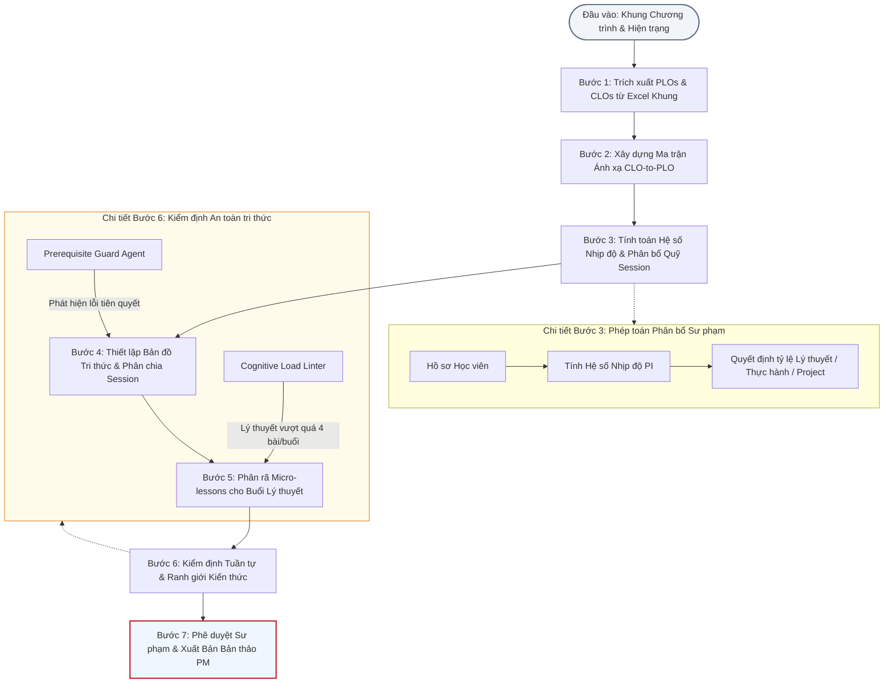
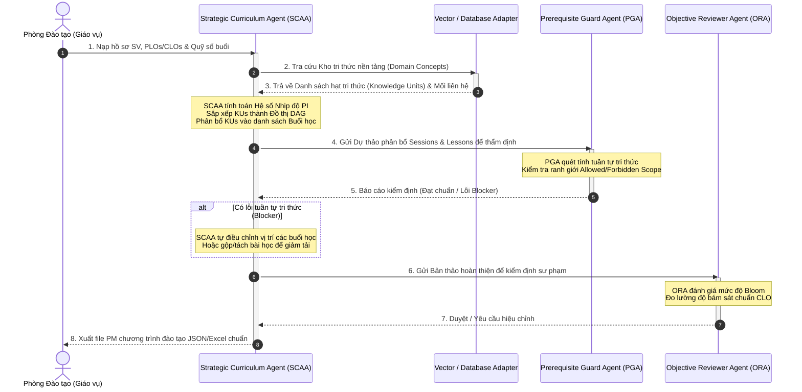

# Quy Trình Chuẩn Hóa Đại Học: Thiết Kế Chương Trình Học Dựa Trên PLO & CLO
*(University-Standard Outcomes-Based Education Workflow)*

Tài liệu này đặc tả quy trình chuẩn hóa thiết kế chương trình học tự động bằng AI Agent dựa trên chuẩn đầu ra **PLO (Program Learning Outcomes)** và **CLO (Course Learning Outcomes)**, bám sát cấu trúc của tệp mẫu [PM_PTIT_2026_Chương trình đào tạo.xlsx](file:///d:/Rikkei%20Education/Elearning_Agent/Learning-Material/CLO-PLO/PM_PTIT_2026_Chương-trình-đào-tạo.xlsx).

---

## 1. Sơ Đồ Quy Trình Thiết Kế Ngược (Backward Design Flowchart)

Quy trình chuẩn hóa 7 bước đi từ Mục tiêu tổng thể của Chương trình (Vĩ mô) đến từng bài học nhỏ của mỗi buổi học (Vi mô):

---

## 2. Sơ Đồ Tuần Tự Tương Tác Giữa Các Tác Nhân (Agent Interaction Sequence Diagram)

Sơ đồ thể hiện sự phối hợp nhịp nhàng giữa Đội ngũ AI Agents chuyên biệt trong việc biên soạn chương trình học:

---

## 3. Đặc Tả Chi Tiết 7 Bước Xây Dựng Quy Trình Chuẩn

### Bước 1: Trích xuất PLOs & CLOs
- **Hành động**: Đọc sheet Khung chương trình (Kỳ I ➔ V) của môn học được yêu cầu.
- **Trích xuất**:
  - Danh sách chuẩn đầu ra cấp học kỳ (`PLO 1` đến `PLO 5`).
  - Danh sách chuẩn đầu ra môn học (`CLO 1` đến `CLO 4`) của môn học cụ thể (ví dụ: `IT-106`).

### Bước 2: Xây dựng Ma trận Ánh xạ CLO-to-PLO
- **Hành động**: AI lập bảng ma trận liên kết. Mỗi `CLO` của môn học bắt buộc phải đánh dấu đóng góp vào ít nhất một `PLO` của học kỳ.
- **Mục tiêu**: Đảm bảo không có bài học nào "vô nghĩa" (không đóng góp vào chuẩn đầu ra chung của chương trình).

### Bước 3: Tính toán Hệ số Nhịp độ & Phân bổ Quỹ Session
- **Hành động**: Đọc hồ sơ sinh viên đầu vào.
  - Lớp chuyển ngành (Non-IT, Beginner): Tăng tỷ lệ thực hành (Session loại `Thực hành`) và phân bổ xen kẽ lý thuyết.
  - Lớp chất lượng cao (IT-student, Fast learner): Tăng tốc độ dạy lý thuyết nền tảng, tăng tỷ lệ tự học.

### Bước 4: Thiết lập Bản đồ Tri thức & Phân chia Session
- **Hành động**: Phân tách các CLO thành các **Hạt tri thức** (Knowledge Units - KUs). Sắp xếp các KUs theo mô hình Đồ thị có hướng không chu trình (DAG).
- **Phân bổ**: Gán các KUs vào từng buổi học (`Session`). Buổi Lý thuyết sẽ nhận các KUs mới; Buổi Thực hành/Project sẽ nhận các KUs cũ để ôn luyện.

### Bước 5: Phân rã Micro-lessons cho Buổi Lý thuyết
- **Hành động**: Với các buổi học được gán nhãn `Lý thuyết`, AI tiến hành chia nhỏ KUs thành **3 - 4 bài học nhỏ (Lessons)** có cấu trúc scannable (dạng Bullet list).
- **Quy tắc**: Tuyệt đối cấm chia quá 4 bài học nhỏ trong một buổi lý thuyết đối với lớp Beginner để tránh quá tải nhận thức.

### Bước 6: Kiểm định Tuần tự & Ranh giới Kiến thức (Prerequisite Guard)
- **Hành động**: PGA kiểm duyệt chéo. 
  - Đảm bảo các hàm/cú pháp nâng cao không được xuất hiện ở buổi đầu (Forbidden Scope).
  - Đảm bảo các bài học có tính kế thừa tri thức (ví dụ: Bài học về Hàm bắt buộc phải nằm sau bài học về Vòng lặp và Biến).

### Bước 7: Phê duyệt Sư phạm & Xuất Bản
- **Hành động**: Xuất bản chương trình học chi tiết dưới dạng JSON/Excel. Lưu trữ cấu hình ranh giới tri thức (`Allowed Scope` và `Forbidden Scope`) cho môn học để sẵn sàng cấp phát cho các Creator Agents sinh nội dung học liệu chi tiết.
