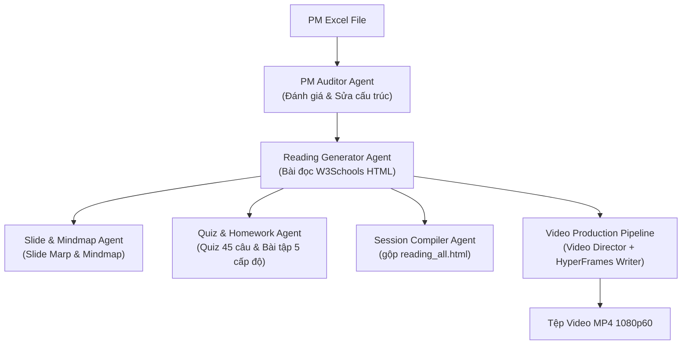

# 📚 BỘ TÀI LIỆU HƯỚNG DẪN 01: TỔNG QUAN HỆ THỐNG MULTI-AGENT CONTENT FACTORY

## 1. 🚀 Giới Thiệu Hệ Thống
Hệ thống **Multi-Agent Elearning Content Factory** là nền tảng tự động hóa sản xuất học liệu E-learning toàn diện chuẩn doanh nghiệp do Rikkei Education phát triển. Hệ thống tích hợp các AI Agents chuyên biệt phối hợp theo đồ thị trạng thái (**LangGraph / Graph Workflow**) để sinh học liệu chuẩn SEO, chuẩn sư phạm và sản xuất video bài giảng Full HD 1080p60.

---

## 2. 🏛️ Kiến Trúc Các Agents Trong Hệ Thống



### Các Agent Chính Và Vai Trò:
1. **PM Auditor & Reviewer Agent**: Quét file Excel khung chương trình PM, kiểm tra lỗ hổng nhảy cóc kiến thức, tải lượng nhận thức và tự động cập nhật cấu trúc bài học.
2. **Reading Generator Agent**: Biên soạn Bài đọc HTML (`reading.html`) theo chuẩn W3Schools, tích hợp Pyodide Wasm Sandbox, Mermaid Flowchart và Accordions tự kiểm tra.
3. **Slide Generator Agent**: Tự động tạo Slide bài giảng HTML tương tác (`slides.html`) qua bộ biên dịch Marp CLI.
4. **Quiz & Homework Agent**: Sinh Quiz đầu giờ/cuối giờ (45 câu Excel `.xlsx`) và Bài tập về nhà 5 cấp độ.
5. **Session Compiler Agent**: Gộp tất cả bài đọc thành Master Hub `reading_all.html` với sticky sidebar và logo Rikkei Education.
6. **Video Director Agent**: Phân tích bài đọc SSOT thành kịch bản Blueprint JSON 6-12 phân cảnh.
7. **HyperFrames Writer Agent**: Tổng hợp giọng đọc Kokoro-TTS, probe `durations.json` và dựng cấu trúc UI GSAP HTML 1080p60.

---

## 3. 📂 Cấu Trúc Thư Mục Học Liệu Đầu Ra (`output/`)
```
output/
└── PM_Python/
    ├── Session 06 - Cấu trúc dữ liệu List va Tuple/
    │   ├── Lesson 01 - Khái niệm List và cách khởi tạo/
    │   │   ├── Bài đọc/ (reading.html)
    │   │   ├── Bài giảng/ (slides.html)
    │   │   ├── Câu hỏi Quizz/ (Quizz_Session06_Lesson01.xlsx)
    │   │   ├── Mindmap/ (mindmap.md)
    │   │   └── Video/ (session_06_lesson_01/ -> renders/MP4)
    │   └── reading_all.html (Master Session Hub)
    └── Session06._Quizz_Dau_Gio_*.xlsx
```