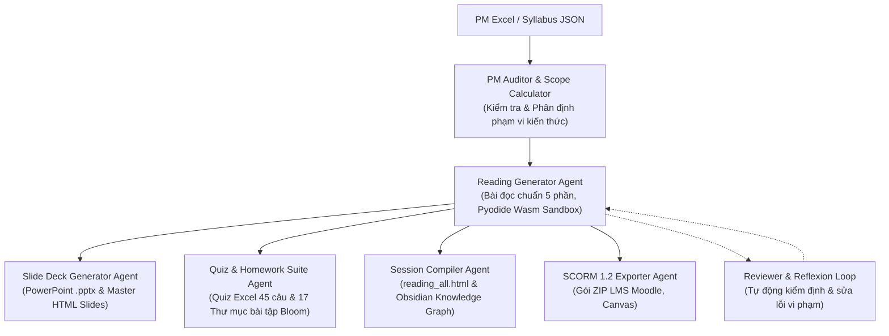

# TÀI LIỆU HƯỚNG DẪN 01: TỔNG QUAN HỆ THỐNG MULTI-AGENT HARNESS

## 1. Giới Thiệu Hệ Thống
Hệ thống **Multi-Agent Elearning Content Factory** là nền tảng tự động hóa sản xuất học liệu E-learning toàn diện chuẩn doanh nghiệp do Rikkei Education phát triển. Hệ thống tích hợp các AI Agents chuyên biệt phối hợp theo đồ thị trạng thái (**Asynchronous DAG & State Machine**) để sinh học liệu chuẩn SEO, chuẩn sư phạm và chuẩn doanh nghiệp cho mọi ngôn ngữ lập trình và công nghệ.

---

## 2. Kiến Trúc Các Agents Trong Hệ Thống



### Các Agent Chính Và Vai Trò:
1. **PM Auditor & Scope Calculator Agent**: Quét file chương trình khung, phân định phạm vi kiến thức động (Dynamic Scope Boundaries), ngăn chặn hiện tượng nhảy cóc kiến thức.
2. **Reading Generator Agent**: Biên soạn Bài đọc HTML (`reading.html`) theo cấu trúc 5 phần chuẩn hóa, tích hợp Pyodide Wasm Sandbox, Mermaid Flowchart 5 hình khối chuẩn và Interactive Self-Test.
3. **Slide Deck Generator Agent**: Tự động tạo Slide bài giảng PowerPoint chuyên nghiệp (`Slide_Bai_Giang.pptx`) và Slide HTML tương tác (`slides.html`) kèm dàn ý sư phạm cho giảng viên.
4. **Quiz & Homework Agent**: Sinh Quiz đầu giờ/cuối giờ (45 câu Excel `.xlsx`) và bộ 17 bài tập phân tầng theo thang nhận thức Bloom, có tiêu chí chấm điểm chi tiết 100 điểm (`tieu_chi_danh_gia.md`).
5. **Session Compiler Agent**: Gộp tất cả bài đọc thành Master Hub `reading_all.html` với thanh điều hướng cố định và liên kết đồ thị tri thức Obsidian 2 chiều.
6. **Master Reviewer & Reflexion Engine**: Tự động kiểm tra chất lượng (thang đo Bloom, PQM Engine, loại bỏ AI cliché) và kích hoạt vòng lặp tự sửa lỗi khi phát hiện sai phạm.
7. **SCORM 1.2 Exporter**: Đóng gói chuẩn e-learning quốc tế tương thích 100% với các nền tảng LMS doanh nghiệp.

---

## 3. Cấu Trúc Thư Mục Học Liệu Đầu Ra Chuẩn (`output/pms/`)

```
output/pms/<Tên_Khóa_Học>/
├── Session 01 - <Tên_Session>/
│   ├── Lesson 01 - <Tên_Lesson>/
│   │   ├── Bài đọc/ (reading.html)
│   │   ├── Bài thực hành/ (practical_lab.md, practical_lab.json)
│   │   ├── Câu hỏi Quizz/ (Quizz_Session01_Lesson01.xlsx, quiz.json)
│   │   └── Câu hỏi bài đọc/ (reading_questions.md, reading_questions.json)
│   ├── Slide bài giảng/
│   │   ├── Slide_Bai_Giang_Session_01.pptx
│   │   ├── outline_bai_giang.md
│   │   └── slide_deck_review_report.md
│   ├── Bài tập/
│   │   ├── tieu_chi_danh_gia.md (Bảng rubric tổng hợp 100 điểm)
│   │   ├── 1_van_dung_co_ban_1_.../ (de_bai_bai_tap.md, tieu_chi_cham_diem_ai.md)
│   │   ├── 2_van_dung_co_ban_2_.../
│   │   ├── ...
│   │   └── 17_tong_hop_he_thong_kien_thuc_mindmap/
│   ├── Mindmap/ (session_mindmap.md)
│   ├── Session 01._Quizz_Dau_Gio_*.xlsx
│   └── Session 01._Quizz_Cuoi_Gio_*.xlsx
└── structure_review_report.md
```