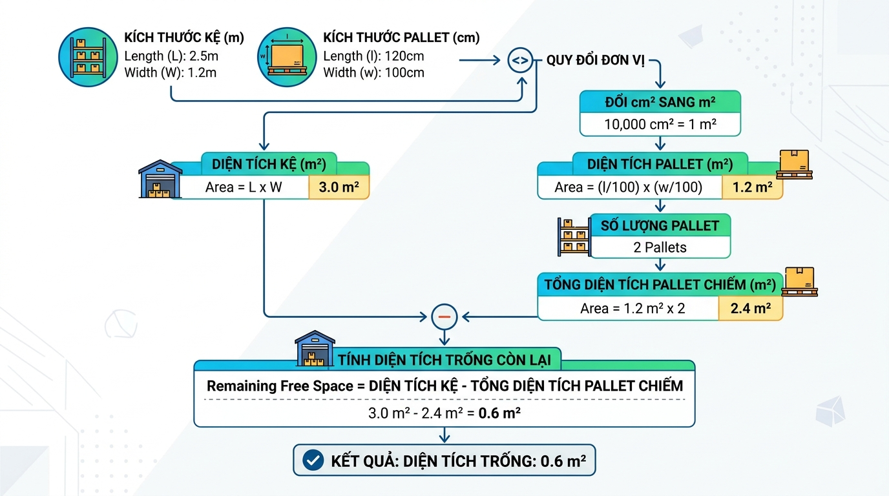

## <center>[Vận dụng cơ bản 2] Sửa lỗi tính toán sức chứa kệ hàng trong kho</center>

### **1. Mục tiêu**
Học viên có khả năng vận dụng các kiến thức cơ bản về biến, kiểu dữ liệu, các hàm nhập xuất dữ liệu (`input()`, `print()`), kỹ thuật ép kiểu dữ liệu (`casting`) và định dạng chuỗi bằng `f-string` để phát hiện và sửa các lỗi logic, lỗi chuyển đổi đơn vị đo lường trong một chương trình quản lý kho hàng tuần tự.

### **2. Bối cảnh & Vấn đề**
Trong phân hệ quản lý kho hàng WAREHOUSE, việc tính toán diện tích còn trống trên các kệ hàng (Shelf) để sắp xếp các pallet hàng hóa là vô cùng quan trọng. Bộ phận vận hành cần một công cụ dòng lệnh (CLI) đơn giản để tính toán nhanh diện tích còn trống của kệ hàng dựa trên các thông số đầu vào:
*   Kích thước kệ hàng: Chiều dài và chiều rộng (đơn vị tính bằng mét - m).
*   Kích thước của một pallet tiêu chuẩn: Chiều dài và chiều rộng (đơn vị tính bằng centimet - cm).
*   Số lượng pallet hiện có trên kệ (đơn vị: cái).

Lập trình viên tập sự đã viết một đoạn mã nguồn Python để thực hiện công việc này. Tuy nhiên, khi đưa vào thử nghiệm, chương trình liên tục tính toán ra các con số sai lệch nghiêm trọng so với thực tế và đôi khi bị dừng đột ngột (crash).


<p align="center">
  
</p>


### **3. Mã nguồn hiện tại**
Dưới đây là mã nguồn hiện tại đang chạy lỗi. Lập trình viên đang thực hiện các bước nhập liệu, tính toán diện tích nhưng gặp sai sót về đơn vị quy đổi và logic tính toán diện tích còn lại.

```python
# Chương trình tính toán diện tích còn trống của kệ hàng (Warehouse Shelf Capacity Calculator)
print("--- CHƯƠNG TRÌNH TÍNH DIỆN TÍCH KỆ KHO CÒN TRỐNG ---")

# Nhập thông tin kích thước kệ kho (đơn vị: mét)
chieu_dai_ke = input("Nhập chiều dài kệ kho (mét): ")
chieu_rong_ke = input("Nhập chiều rộng kệ kho (mét): ")

# Nhập thông tin kích thước của một Pallet tiêu chuẩn (đơn vị: centimet)
chieu_dai_pallet = input("Nhập chiều dài pallet (centimet): ")
chieu_rong_pallet = input("Nhập chiều rộng pallet (centimet): ")

# Nhập số lượng pallet hiện đang đặt trên kệ
so_luong_pallet = input("Nhập số lượng pallet hiện có trên kệ: ")

# Thực hiện ép kiểu để tính toán
chieu_dai_ke_float = float(chieu_dai_ke)
chieu_rong_ke_float = float(chieu_rong_ke)
chieu_dai_pallet_float = float(chieu_dai_pallet)
chieu_rong_pallet_float = float(chieu_rong_pallet)
so_luong_pallet_int = int(so_luong_pallet)

# Tính diện tích kệ kho (mét vuông)
dien_tich_ke = chieu_dai_ke_float * chieu_rong_ke_float

# Tính diện tích một pallet (mét vuông)
# [LỖI NGHIỆP VỤ 1] Đổi từ centimet sang mét bị sai công thức chuyển đổi diện tích
dien_tich_pallet = (chieu_dai_pallet_float * chieu_rong_pallet_float) / 100

# Tính tổng diện tích đã bị chiếm dụng bởi số lượng pallet hiện tại
tong_dien_tich_chiem_dung = dien_tich_pallet * so_luong_pallet_int

# Tính diện tích còn trống trên kệ
# [LỖI NGHIỆP VỤ 2] Công thức tính diện tích còn lại bị ngược logic
dien_tich_con_trong = tong_dien_tich_chiem_dung - dien_tich_ke

# Xuất kết quả sử dụng f-string
# [LỖI HIỂN THỊ] Kết quả in ra chưa được làm tròn số thập phân, gây tràn màn hình khi hiển thị số thực dài
print(f"Diện tích kệ kho ban đầu: {dien_tich_ke} m2")
print(f"Tổng diện tích pallet chiếm dụng: {tong_dien_tich_chiem_dung} m2")
print(f"Diện tích còn lại trên kệ: {dien_tich_con_trong} m2")
```

### **4. Yêu cầu đầu ra**

Học viên cần phân tích mã nguồn trên và hoàn thành hai phần yêu cầu sau:

#### **Phần 1: Bảng kịch bản kiểm thử (Test Cases)**
Tạo một bảng gồm 3 kịch bản kiểm thử (Test Cases) để chỉ rõ các lỗi logic của chương trình hiện tại và kết quả mong muốn sau khi sửa đổi. 
[YÊU CẦU] Phải sử dụng định dạng bảng HTML bên dưới để trình bày:

<table style="width: 100%; min-width: 100%; display: table; border-collapse: collapse; border: 1px solid #ddd;" width="100%">
  <thead>
    <tr style="background-color: #f2f2f2; text-align: left;">
      <th style="padding: 8px; border: 1px solid #ddd;">Mã Test Case</th>
      <th style="padding: 8px; border: 1px solid #ddd;">Mô tả kịch bản</th>
      <th style="padding: 8px; border: 1px solid #ddd;">Dữ liệu đầu vào (Input)</th>
      <th style="padding: 8px; border: 1px solid #ddd;">Kết quả thực tế bị lỗi (Output lỗi)</th>
      <th style="padding: 8px; border: 1px solid #ddd;">Kết quả mong muốn (Output đúng)</th>
    </tr>
  </thead>
  <tbody>
    <tr>
      <td style="padding: 8px; border: 1px solid #ddd;">TC-01</td>
      <td style="padding: 8px; border: 1px solid #ddd;">Kiểm tra tính toán diện tích với kích thước kệ và pallet tiêu chuẩn.</td>
      <td style="padding: 8px; border: 1px solid #ddd;">
        Dài kệ: 5.0 (m)<br>
        Rộng kệ: 2.0 (m)<br>
        Dài pallet: 120.0 (cm)<br>
        Rộng pallet: 80.0 (cm)<br>
        Số lượng: 5 (cái)
      </td>
      <td style="padding: 8px; border: 1px solid #ddd;">(Học viên tự điền kết quả tính toán sai của code cũ)</td>
      <td style="padding: 8px; border: 1px solid #ddd;">(Học viên tự điền kết quả mong đợi đúng)</td>
    </tr>
    <tr>
      <td style="padding: 8px; border: 1px solid #ddd;">TC-02</td>
      <td style="padding: 8px; border: 1px solid #ddd;">Kiểm tra định dạng hiển thị số thập phân bằng f-string khi kết quả có nhiều chữ số sau dấu phẩy.</td>
      <td style="padding: 8px; border: 1px solid #ddd;">
        Dài kệ: 4.55 (m)<br>
        Rộng kệ: 2.33 (m)<br>
        Dài pallet: 121.5 (cm)<br>
        Rộng pallet: 82.3 (cm)<br>
        Số lượng: 3 (cái)
      </td>
      <td style="padding: 8px; border: 1px solid #ddd;">(Học viên tự điền kết quả chưa làm tròn)</td>
      <td style="padding: 8px; border: 1px solid #ddd;">(Học viên tự điền kết quả đã được làm tròn 2 chữ số thập phân)</td>
    </tr>
    <tr>
      <td style="padding: 8px; border: 1px solid #ddd;">TC-03</td>
      <td style="padding: 8px; border: 1px solid #ddd;">Kiểm tra phản ứng của hệ thống khi người dùng nhập dữ liệu không hợp lệ (ví dụ: nhập chữ thay vì nhập số).</td>
      <td style="padding: 8px; border: 1px solid #ddd;">
        Dài kệ: "năm mét"<br>
        ...
      </td>
      <td style="padding: 8px; border: 1px solid #ddd;">(Học viên ghi nhận lỗi crash hệ thống)</td>
      <td style="padding: 8px; border: 1px solid #ddd;">(Học viên phân tích nguyên nhân lỗi ép kiểu và cách phòng tránh trong Session 01)</td>
    </tr>
  </tbody>
</table>

#### **Phần 2: Sửa mã nguồn chương trình**
*   Chỉnh sửa tệp mã nguồn Python để khắc phục triệt để các lỗi logic nghiệp vụ về chuyển đổi đơn vị diện tích (từ cm2 sang m2) và phép trừ tính diện tích còn trống.
*   Sử dụng định dạng f-string để hiển thị toàn bộ kết quả diện tích làm tròn đúng **2 chữ số thập phân** (ví dụ: `5.20 m2` thay vì `5.2 m2` hoặc `5.20000000000003 m2`).
*   [YÊU CẦU] Chỉ sử dụng các cấu trúc tuần tự, các hàm ép kiểu cơ bản (`int()`, `float()`), định dạng `f-string` đã học trong Session 01. Tuyệt đối không sử dụng cấu trúc rẽ nhánh `if/else` hoặc vòng lặp.

### **5. Yêu cầu nộp bài**
Học viên cần nộp:
*   Phần phân tích lỗi (Bảng Test Cases) và file mã nguồn Python sau khi sửa.
*   Đẩy mã nguồn lên GitHub theo định dạng thư mục: `[Tên Lớp]_[Môn Học]_Session01_Ex02`.
    Ví dụ: `HNKS25CNTT1_PythonCore_Session01_Ex02`