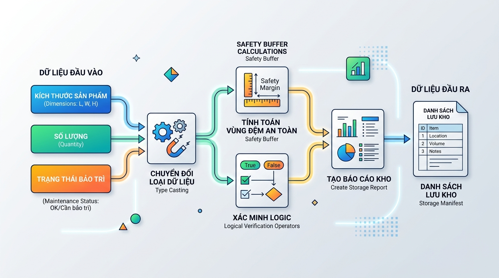

## <center>**1. Mục tiêu**</center>
*   Vận dụng linh hoạt kiến thức về biến, các kiểu dữ liệu cơ bản (string, integer, float, boolean).
*   Sử dụng thành thạo các hàm nhập xuất dữ liệu căn bản (`input()`, `print()`) và kỹ thuật ép kiểu dữ liệu (type casting) trong Python.
*   Ứng dụng các toán tử số học, toán tử so sánh và toán tử logic để xử lý nghiệp vụ thực tế mà không sử dụng câu lệnh rẽ nhánh (`if-else`).
*   Xây dựng tư duy thiết kế luồng dữ liệu (Data Flow) tuyến tính và định dạng dữ liệu đầu ra chuyên nghiệp bằng f-string.

### **2. Bối cảnh & Vấn đề**
Trong phân hệ quản lý kho hàng (Warehouse Management System - WMS) của doanh nghiệp logistics, việc tối ưu hóa không gian lưu trữ và kiểm soát trạng thái các vị trí kho (vị trí kệ hàng) là vô cùng quan trọng. Trước khi cho phép một lô hàng mới nhập kho, hệ thống cần tính toán dung tích thực tế lô hàng chiếm dụng, bao gồm cả không gian an toàn dự phòng (Safety Buffer Space). 

Đồng thời, hệ thống cần thực hiện cơ chế "Soft Lock" (Khóa mềm vị trí). Nếu một vị trí kho đang trong trạng thái bảo trì hoặc tổng thể tích lô hàng vượt quá giới hạn thiết kế của vị trí đó, vị trí này sẽ tự động chuyển sang trạng thái "Không khả dụng" (False) để ngăn chặn việc xếp hàng vào vị trí lỗi.

Để chuẩn bị cho việc nâng cấp hệ thống WMS lớn sau này, doanh nghiệp yêu cầu xây dựng một module dòng lệnh (Console Interface) thử nghiệm nhằm tự động hóa quy trình tính toán và kiểm tra trạng thái Soft Lock này. Bạn cần thiết kế giải pháp xử lý dòng dữ liệu tuyến tính đáp ứng nhu cầu trên dựa trên các tham số động từ người dùng.


<p align="center">
  
</p>


### **3. Quy tắc nghiệp vụ**
Hệ thống xử lý tính toán dựa trên các tham số đầu vào được nhập từ bàn phím. Do chưa áp dụng cấu trúc rẽ nhánh, mọi quy trình kiểm tra logic đều phải thực hiện thông qua toán tử so sánh và toán tử logic để trả về kết quả kiểu boolean.

Các công thức nghiệp vụ bắt buộc phải triển khai bao gồm:
1.  **Thể tích thực tế của một kiện hàng (Single Volume):**
    $$\text{Thể tích} = \text{Chiều dài} \times \text{Chiều rộng} \times \text{Chiều cao}$$
2.  **Tổng thể tích lô hàng thuần (Net Volume):**
    $$\text{Thể tích thuần} = \text{Thể tích đơn chiếc} \times \text{Số lượng kiện hàng}$$
3.  **Tổng thể tích yêu cầu lưu trữ (Required Volume):** Bao gồm cả không gian an toàn dự phòng.
    $$\text{Thể tích yêu cầu} = \text{Thể tích thuần} \times (1 + \text{Tỷ lệ dự phòng})$$
    *(Ví dụ: Tỷ lệ dự phòng nhập vào là 0.15 tương đương 15%)*
4.  **Kiểm tra tính khả dụng (Soft Lock Verification):** Một vị trí kho được coi là sẵn sàng tiếp nhận lô hàng (trạng thái `True`) khi và chỉ khi thỏa mãn đồng thời hai điều kiện:
    *   Vị trí kho KHÔNG ở trong trạng thái bảo trì.
    *   Tổng thể tích yêu cầu lưu trữ KHÔNG vượt quá giới hạn thể tích tối đa của vị trí kệ (mặc định giới hạn thiết kế của kệ là 850.5 m³).

Dữ liệu đầu vào cần được mô phỏng theo cấu trúc bảng sau:

<table style="width: 100%; min-width: 100%; display: table; border-collapse: collapse;" width="100%" border="1">
  <thead>
    <tr style="background-color: #f2f2f2;">
      <th>Tên tham số nhập</th>
      <th>Kiểu dữ liệu đích</th>
      <th>Mô tả nghiệp vụ</th>
    </tr>
  </thead>
  <tbody>
    <tr>
      <td><code>ma_vi_tri</code></td>
      <td>string (str)</td>
      <td>Mã định danh vị trí kệ kho (Ví dụ: ZONE-A-102)</td>
    </tr>
    <tr>
      <td><code>chieu_dai</code>, <code>chieu_rong</code>, <code>chieu_cao</code></td>
      <td>float</td>
      <td>Kích thước vật lý của một kiện hàng (đơn vị: mét)</td>
    </tr>
    <tr>
      <td><code>so_luong</code></td>
      <td>integer (int)</td>
      <td>Số lượng kiện hàng cần lưu kho trong đợt này</td>
    </tr>
    <tr>
      <td><code>ty_le_du_phong</code></td>
      <td>float</td>
      <td>Hệ số diện tích cản gió/hành lang an toàn (ví dụ: 0.12)</td>
    </tr>
    <tr>
      <td><code>dang_bao_tri</code></td>
      <td>boolean (bool)</td>
      <td>Nhận đầu vào từ chuỗi nhập. Nếu nhập "1" tức là đang bảo trì, các chuỗi khác là hoạt động bình thường</td>
    </tr>
  </tbody>
</table>

### **4. Yêu cầu đầu ra**

#### **Phần 1: Thiết kế kiến trúc và Sơ đồ luồng dữ liệu**
Học viên cần mô tả chi tiết luồng di chuyển của dữ liệu từ thiết bị đầu cuối (Console Client) qua quá trình chuyển đổi kiểu dữ liệu đến khi xuất kết quả ra màn hình bằng sơ đồ Mermaid hoặc mô tả chi tiết các bước xử lý (Sequential Step-by-Step). Sơ đồ phải làm rõ:
*   Điểm tiếp nhận dữ liệu (Standard Input).
*   Các điểm ép kiểu dữ liệu (casting) sang dữ liệu nguyên bản.
*   Xử lý logic toán tử để đưa ra cờ Soft Lock (Boolean).
*   Đầu ra chuẩn hóa (Standard Output).

#### **Phần 2: Triển khai chương trình Python**
Xây dựng file mã nguồn `main.py` thực hiện tuần tự các bước sau:
1.  **Nhập liệu:** Xuất thông báo yêu cầu người dùng nhập lần lượt từng tham số trong bảng mô tả nghiệp vụ.
2.  **Xử lý và Ép kiểu:** Chuyển đổi dữ liệu nhập (vốn là string) về đúng kiểu dữ liệu yêu cầu. Riêng phần trạng thái bảo trì, chuyển đổi chuỗi nhập thành kiểu logic (Ví dụ: `is_maintenance = (input_maintenance == "1")`).
3.  **Tính toán logic:** Thực hiện tính toán các chỉ số thể tích và trạng thái Soft Lock bằng toán tử logic, tuyệt đối không dùng cấu trúc nâng cao như `if-else`, vòng lặp, hoặc hàm tự định nghĩa.
4.  **Xuất báo cáo:** Sử dụng `f-string` căn lề và định dạng số thực lấy đúng 2 chữ số thập phân để hiển thị phiếu Manifest của vị trí kho.

**Ví dụ dữ liệu đầu vào:**
```text
Nhập mã vị trí kệ kho: ZONE-B-405
Nhập chiều dài kiện hàng (m): 1.5
Nhập chiều rộng kiện hàng (m): 1.2
Nhập chiều cao kiện hàng (m): 1.8
Nhập số lượng kiện hàng: 120
Nhập tỷ lệ dự phòng an toàn (ví dụ 0.15 cho 15%): 0.15
Thiết lập bảo trì (Nhập 1 để Kích hoạt bảo trì, nhập ký tự khác để hoạt động): 0
```

**Ví dụ kết quả hiển thị trên Terminal:**
```text
==================================================
        BÁO CÁO KIỂM XÁC THỰC VỊ TRÍ KHO
==================================================
Mã vị trí kệ: ZONE-B-405
Thể tích đơn chiếc: 3.24 m3
Tổng số lượng hàng: 120 kiện
Thể tích thuần lô hàng: 388.80 m3
Tổng thể tích yêu cầu (bao gồm 15.00% dự phòng): 447.12 m3
--------------------------------------------------
TRẠNG THÁI HỆ THỐNG KHO:
- Đang trong trạng thái bảo trì: False
- Vượt giới hạn dung tích (Max 850.5m3): False
- Đủ điều kiện phê duyệt nhập kho: True
==================================================
```

### **5. Yêu cầu nộp bài**
Học viên cần nộp:
*   Sơ đồ luồng dữ liệu nghiệp vụ và thiết kế vòng đời tính năng (Lưu trong file `architecture.md` hoặc vẽ trực tiếp bằng cú pháp Mermaid).
*   Mã nguồn triển khai đầy đủ các bước xử lý trên dòng lệnh (Console).
*   Đẩy mã nguồn lên GitHub theo định dạng thư mục: `[Tên Lớp]_[Môn Học]_Session01_Ex05`.
    Ví dụ: `HNKS25CNTT1_FastAPI_Session01_Ex05`