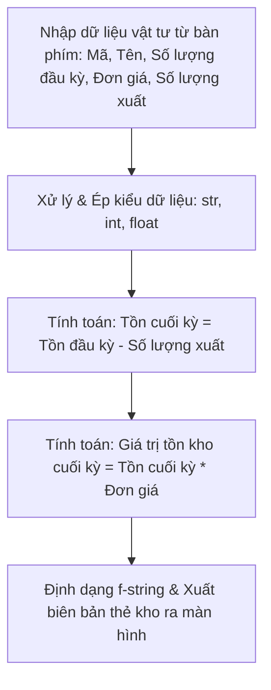

## <center>[Bài tập tổng hợp] Quản lý thẻ kho vật tư đơn giản</center>

### **1. Mục tiêu**
Sau khi hoàn thành bài tập này, học viên có khả năng:
*   Khởi tạo và kích hoạt môi trường ảo `.venv` đúng quy chuẩn của dự án Python.
*   Khai báo và quản lý các biến với các kiểu dữ liệu cơ bản (chuỗi, số nguyên, số thực).
*   Sử dụng thành thạo hàm `input()` để nhận dữ liệu từ người dùng và thực hiện ép kiểu (type casting) an toàn.
*   Ứng dụng `f-string` để định dạng và hiển thị báo cáo dạng văn bản (Terminal-based) chuyên nghiệp, căn chỉnh lề rõ ràng.

### **2. Bối cảnh & Vấn đề**
Một quản lý kho tại trung tâm phân phối logistics (Warehouse) cần một ứng dụng dòng lệnh (CLI) chạy nhanh, độc lập để tạo nhanh "Thẻ kho vật tư" cho từng sản phẩm riêng biệt khi có yêu cầu kiểm tra đột xuất. 

Vì hệ thống ERP tổng của doanh nghiệp đang trong quá trình bảo trì định kỳ, ứng dụng Python nhỏ này sẽ chạy trực tiếp trên môi trường máy của nhân viên kiểm kho để tính toán lượng tồn kho cuối kỳ, giá trị tồn kho của vật tư và hiển thị một biên bản in thẻ kho tạm thời.


<p align="center">
  
</p>


Dưới đây là sơ đồ luồng dữ liệu của chương trình:



### **3. Quy tắc nghiệp vụ**
Học viên cần xây dựng chương trình đáp ứng các quy tắc nghiệp vụ sau:
1.  **Chuẩn hóa dữ liệu đầu vào:**
    *   Mã vật tư khi nhập vào có thể viết thường, nhưng khi xuất báo cáo phải được tự động chuyển thành chữ in hoa toàn bộ.
    *   Đơn giá vật tư phải được định dạng hiển thị với 2 chữ số phần thập phân.
2.  **Logic tính toán:**
    *   Số lượng tồn cuối kỳ = Số lượng tồn đầu kỳ - Số lượng xuất kho.
    *   Giá trị tồn kho cuối kỳ = Số lượng tồn cuối kỳ * Đơn giá.
3.  **Bố cục xuất dữ liệu:**
    *   Biên bản Thẻ Kho xuất ra màn hình Terminal cần được căn lề thẳng hàng, phân chia các khu vực tiêu đề, chi tiết vật tư, và phần tính toán bằng các dòng kẻ phân cách (ví dụ: các ký tự `-` hoặc `=`).

Bảng đặc tả dữ liệu đầu vào:
<table style="width: 100%; min-width: 100%; display: table; border-collapse: collapse;" width="100%" border="1">
  <thead>
    <tr style="background-color: #f2f2f2;">
      <th style="padding: 8px; text-align: left;">Tham số đầu vào</th>
      <th style="padding: 8px; text-align: left;">Mô tả</th>
      <th style="padding: 8px; text-align: left;">Kiểu dữ liệu lập trình</th>
      <th style="padding: 8px; text-align: left;">Quy tắc chuyển đổi</th>
    </tr>
  </thead>
  <tbody>
    <tr>
      <td style="padding: 8px;">Mã vật tư</td>
      <td>Mã định danh duy nhất của vật tư kho</td>
      <td>Chuỗi ký tự (String)</td>
      <td>Chuyển thành chữ in hoa (.upper())</td>
    </tr>
    <tr>
      <td style="padding: 8px;">Tên vật tư</td>
      <td>Tên gọi chi tiết của vật tư</td>
      <td>Chuỗi ký tự (String)</td>
      <td>Loại bỏ khoảng trắng thừa ở hai đầu (.strip())</td>
    </tr>
    <tr>
      <td style="padding: 8px;">Số lượng đầu kỳ</td>
      <td>Số lượng tồn kho tại thời điểm đầu ngày</td>
      <td>Số nguyên (Integer)</td>
      <td>Chuyển đổi từ chuỗi nhập vào sang int</td>
    </tr>
    <tr>
      <td style="padding: 8px;">Đơn giá</td>
      <td>Đơn giá nhập kho của một đơn vị vật tư</td>
      <td>Số thực (Float)</td>
      <td>Chuyển đổi từ chuỗi nhập vào sang float</td>
    </tr>
    <tr>
      <td style="padding: 8px;">Số lượng xuất</td>
      <td>Số lượng đã xuất kho trong ngày</td>
      <td>Số nguyên (Integer)</td>
      <td>Chuyển đổi từ chuỗi nhập vào sang int</td>
    </tr>
  </tbody>
</table>

### **4. Yêu cầu đầu ra**
[YÊU CẦU 1] Thiết lập và kích hoạt thành công môi trường ảo `.venv` tại thư mục làm việc của dự án. Tạo file mã nguồn `warehouse_card.py`.

[YÊU CẦU 2] Triển khai nhận dữ liệu đầu vào từ bàn phím bằng hàm `input()`. Chương trình cần hiển thị các câu lệnh gợi ý nhập rõ ràng cho từng thuộc tính như mô tả ở mục 3.

[YÊU CẦU 3] Thực hiện ép kiểu dữ liệu từ chuỗi nhập vào sang dạng số (`int` và `float`) phục vụ tính toán. Thực hiện phép toán để tìm ra Số lượng tồn cuối kỳ và Giá trị tồn kho cuối kỳ.

[YÊU CẦU 4] In ra màn hình kết quả "THẺ KHO VẬT TƯ" định dạng chuẩn công nghiệp bằng `f-string`. 

Ví dụ kết quả hiển thị trên Terminal mong đợi (phần chữ sau dấu hai chấm là dữ liệu do người dùng nhập vào):
```text
--- NHẬP THÔNG TIN THẺ KHO ---
Nhập mã vật tư: vt-102
Nhập tên vật tư:  Thép Tấm Chống Trượt 
Nhập số lượng tồn đầu kỳ: 500
Nhập đơn giá: 15.5
Nhập số lượng xuất trong ngày: 120

==================================================
                 THẺ KHO VẬT TƯ
==================================================
Mã vật tư      : VT-102
Tên vật tư     : Thép Tấm Chống Trượt
Đơn giá        : 15.50
--------------------------------------------------
Số lượng đầu   : 500
Số lượng xuất  : 120
Tồn cuối kỳ    : 380
--------------------------------------------------
Giá trị tồn cuối: 5,890.00
==================================================
```

[NOTE] Học viên lưu ý căn chỉnh khoảng trắng của các nhãn (ví dụ: "Mã vật tư   :") để các dấu hai chấm thẳng hàng dọc, tạo giao diện CLI chuyên nghiệp. Phần định dạng số thực cần sử dụng cú pháp định dạng của f-string để hiển thị đúng dấu phẩy ngăn cách hàng nghìn và 2 chữ số thập phân (ví dụ: `5,890.00`).

### **5. Yêu cầu nộp bài**
Để hoàn thành bài tập tổng hợp, học viên cần:
*   Hiện thực hóa toàn bộ các chức năng yêu cầu và chạy thử nghiệm thành công trên terminal cá nhân.
*   Đẩy mã nguồn lên GitHub theo định dạng thư mục: `[Tên Lớp]_[Môn Học]_Session01_Tong_hop`.
    Ví dụ: `HNKS25CNTT1_PythonCore_Session01_Tong_hop`
*   Dán link của repository lên phần nộp bài trên hệ thống.

### **6. Tiêu chí đánh giá & Rubric chấm điểm (Dành cho Giảng viên/Mentor)**
<table style="width: 100%; min-width: 100%; display: table; border-collapse: collapse;" width="100%" border="1">
  <thead>
    <tr style="background-color: #f2f2f2;">
      <th style="padding: 8px; text-align: left; width: 30%;">Tiêu chí</th>
      <th style="padding: 8px; text-align: left; width: 50%;">Chi tiết yêu cầu đạt</th>
      <th style="padding: 8px; text-align: center; width: 20%;">Trọng số điểm</th>
    </tr>
  </thead>
  <tbody>
    <tr>
      <td style="padding: 8px;"><b>Cài đặt & Thiết lập môi trường</b></td>
      <td style="padding: 8px;">Khởi tạo thành công môi trường ảo `.venv`, tạo cấu trúc thư mục sạch sẽ, không đẩy thư mục `.venv` lên GitHub (sử dụng file `.gitignore` nếu có hoặc cấu hình bỏ qua đúng cách).</td>
      <td style="padding: 8px; text-align: center;">20 điểm</td>
    </tr>
    <tr>
      <td style="padding: 8px;"><b>Nhập dữ liệu & Xử lý Chuỗi</b></td>
      <td style="padding: 8px;">Sử dụng đúng hàm <code>input()</code> để lấy thông tin. Áp dụng thành công các hàm xử lý chuỗi: <code>.upper()</code> cho mã vật tư và <code>.strip()</code> để làm sạch tên vật tư.</td>
      <td style="padding: 8px; text-align: center;">20 điểm</td>
    </tr>
    <tr>
      <td style="padding: 8px;"><b>Ép kiểu & Logic Toán học</b></td>
      <td style="padding: 8px;">Ép kiểu thành công từ chuỗi sang <code>int</code> (cho số lượng) và <code>float</code> (cho đơn giá). Áp dụng đúng công thức tính toán lượng tồn cuối kỳ và giá trị tồn kho cuối kỳ.</td>
      <td style="padding: 8px; text-align: center;">30 điểm</td>
    </tr>
    <tr>
      <td style="padding: 8px;"><b>Trình bày & Định dạng f-string</b></td>
      <td style="padding: 8px;">Sử dụng f-string xuất dữ liệu đúng cấu trúc bảng như yêu cầu. Giá trị số và tiền tệ được định dạng hiển thị đẹp (có dấu thập phân cố định và phân tách hàng nghìn). Căn lề các dấu hai chấm thẳng hàng.</td>
      <td style="padding: 8px; text-align: center;">20 điểm</td>
    </tr>
    <tr>
      <td style="padding: 8px;"><b>Quy chuẩn nộp bài</b></td>
      <td style="padding: 8px;">Mã nguồn chạy không lỗi cú pháp. Đặt tên thư mục và đẩy lên GitHub đúng quy định cấu trúc đặt tên.</td>
      <td style="padding: 8px; text-align: center;">10 điểm</td>
    </tr>
  </tbody>
</table>