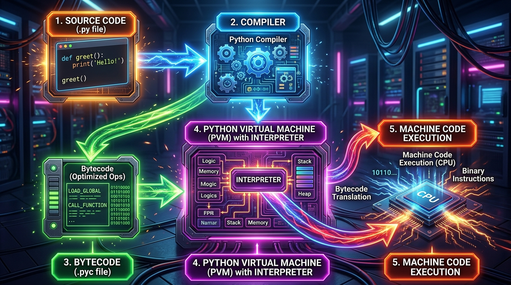

```markmap
# Session 01: Giới thiệu ngôn ngữ Python

## Python_Core_Characteristics
- Lịch sử phát triển
  - Guido van Rossum sáng lập năm 1991
  - Tập trung tối đa vào tốc độ viết mã nguồn và sự trong sáng của cú pháp
- Đặc tính chuyên môn
  - Ngôn ngữ thông dịch (Interpreted Language) chuyển mã nguồn thành Bytecode và thực thi bằng Python Virtual Machine (PVM)
  - Quy tắc đặt tên biến: Tiếng Anh dạng snake_case
  - Thư viện mặc định đa dạng, hạn chế phụ thuộc bên thứ ba
  - 

## Virtual_Environment
- Bản chất
  - Môi trường ảo cô lập tài nguyên cho từng dự án độc lập, tránh xung đột phiên bản thư viện
- Công cụ sử dụng
  - Thư viện tích hợp sẵn `venv` để khởi tạo không gian làm việc sạch
- Lệnh thực thi cơ bản
  - Khởi tạo môi trường ảo: `python -m venv .venv`
  - Kích hoạt (Windows): `.venv\Scripts\activate`
  - Kích hoạt (macOS/Linux): `source .venv/bin/activate`

## Terminal_and_CLI_Execution
- Cơ chế vận hành
  - Sử dụng Terminal/Command Line Interface (CLI) để gọi trình thông dịch Python chạy file mã nguồn
- Mã nguồn mẫu: `first_python_program`
  ```python
  course_name = "Python Core Essentials"
  total_lessons = 12
  print(course_name)
  print(total_lessons)
  ```
- Lệnh thực thi
  - Thực thi chương trình từ Terminal: `python program_greeting.py`

## Syntax_Error
- Phân loại lỗi thường gặp
  - IndentationError: Lỗi thụt dòng sai nguyên tắc (Python dùng thụt dòng thay cho cặp ngoặc nhọn để phân cấp khối lệnh)
  - SyntaxError: Lỗi cấu trúc cú pháp cơ bản (thiếu dấu ngoặc, thiếu nháy bao chuỗi, sai từ khóa)
  - NameError: Gọi biến hoặc hàm chưa được định nghĩa trước đó
- Ví dụ và cách khắc phục: `fix_syntax_errors`
  ```python
  # Loi SyntaxError do thieu dau nhay dong
  # message = "Chao ban
  message = "Chao ban" # Sua dung

  # Loi IndentationError do thut le sai cap
  #  print(message)
  print(message) # Sua dung
  ```
```
```
```