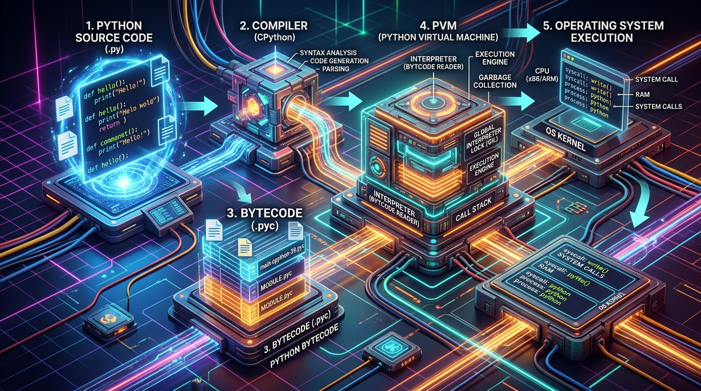
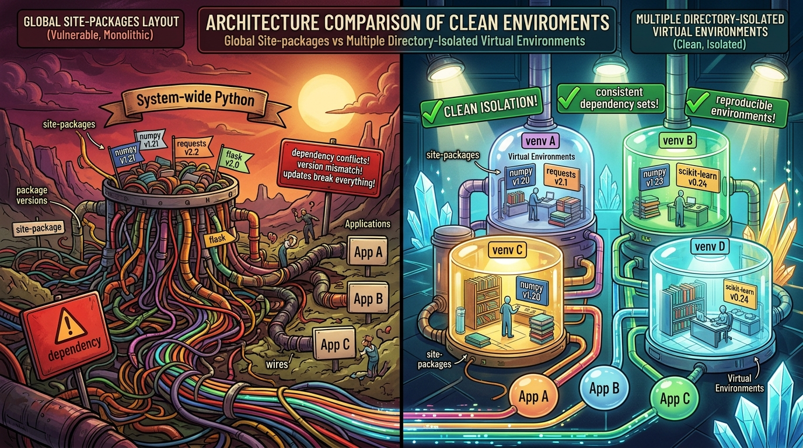

```markmap
# Session 01 - Lesson 02: Cài đặt môi trường

## Python Interpreter
* Bản chất: Trình thông dịch dịch mã nguồn Python từng dòng thành Bytecode và thực thi trên Python Virtual Machine (PVM)
* 
* Sự cố thường gặp: Lỗi CommandNotFoundException (hoặc python is not recognized)
    * Nguyên nhân: Chưa cấu hình biến môi trường PATH khi cài đặt Python gốc
    * Giải pháp: Tích chọn "Add Python to PATH" trong quá trình cài đặt (Setup Wizard)

## VS Code (Visual Studio Code)
* Bản chất: Trình soạn thảo mã nguồn gọn nhẹ (Source Code Editor) hỗ trợ lập trình đa ngôn ngữ qua hệ thống Extensions
* Thiết lập cốt lõi: Cài đặt Extension Python phát triển bởi Microsoft để kích hoạt IntelliSense, Linting và kiểm thử
* Cơ chế vận hành: Yêu cầu định cấu hình chỉ định chính xác đường dẫn trình thông dịch (Select Interpreter Path)
* Sự cố thường gặp: Lỗi InterpreterMismatchError
    * Biểu hiện: VS Code tự động chọn sai bộ dịch mặc định làm phát sinh lỗi môi trường hoặc thư viện
    * Giải pháp: Sử dụng tổ hợp phím Ctrl + Shift + P (hoặc Cmd + Shift + P) gõ "Python: Select Interpreter" để chọn đúng môi trường ảo

## Global Environment
* Khái niệm: Môi trường hệ thống dùng chung mặc định được thiết lập ngay sau khi cài đặt Python vào hệ điều hành
* Hạn chế: Xảy ra xung đột phụ thuộc (Dependency Conflict) khi các dự án độc lập đòi hỏi các phiên bản thư viện khác nhau chạy song song
* Cơ chế phân bổ: Thư viện cài đặt ngoài thông qua câu lệnh pip sẽ lưu trữ trực tiếp vào thư mục dùng chung site-packages của hệ thống

## Virtual Environment
* Phân loại giải pháp chính cô lập môi trường
    * venv: Công cụ tích hợp sẵn trong thư viện tiêu chuẩn của Python, nhẹ và tối ưu cho từng dự án riêng lẻ
    * Anaconda: Nền tảng quản lý gói phân phối lớn phù hợp cho Khoa học dữ liệu, quản lý đa phiên bản Python độc lập qua Conda
* 
* Cú pháp thiết lập nhanh (venv)
    * Khởi tạo: `python -m venv venv_name`
    * Kích hoạt trên Windows: `.\venv_name\Scripts\activate`
    * Kích hoạt trên macOS/Linux: `source venv_name/bin/activate`
* Sự cố thường gặp: Lỗi ModuleNotFoundError
    * Nguyên nhân: Thư viện được cài đặt ở môi trường Global nhưng file code được thực thi bằng Python Interpreter của Virtual Environment hoặc ngược lại

## Terminal/Command Line Interface (CLI)
* Khái niệm: Giao diện dòng lệnh giúp tương tác trực tiếp với hệ điều hành, quản lý gói phụ thuộc và thực thi mã nguồn
* Mã nguồn kiểm thử môi trường (PEP 8 Standard)
    ```python
    import sys

    def print_greeting():
        """Return a simple greeting string."""
        return "Xin chao Python!"

    def calculate_sum(first_number, second_number):
        """Return the sum of two integer arguments."""
        return first_number + second_number

    if __name__ == "__main__":
        print(print_greeting())
        print("Result:", calculate_sum(5, 10))
        print("Interpreter Path:", sys.executable)
    ```
* Thử nghiệm thực thi qua CLI
    * Điều hướng thư mục hiện hành: `cd path/to/project_folder`
    * Chạy kiểm thử: `python main.py`
```
```
```