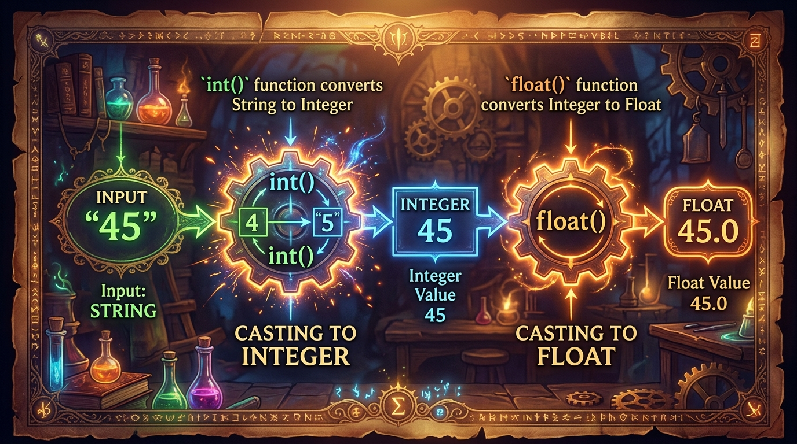

```markmap
# Session 01 - Lesson 04: Kiểu dữ liệu cơ bản

## Biến (Variable)
- Bản chất & Quy định đặt tên
  - Là nhãn đại diện cho phân vùng bộ nhớ lưu trữ giá trị
  - Đặt tên theo chuẩn CamelCase hoặc Snake Case (Khuyên dùng `snake_case` trong Python)
  - CẤM: Bắt đầu bằng số, chứa ký tự đặc biệt (trừ `_`), trùng từ khóa hệ thống (`int`, `str`, `import`...)
- Khai báo & Gán giá trị
  ```python
  product_name = "Mechanical Keyboard"
  quantity = 3
  ```
- Cấu trúc bộ nhớ của biến
  - 

## Kiểu dữ liệu Số (int, float)
- Số nguyên (int)
  - Lưu các số nguyên dương, âm hoặc bằng không (Ví dụ: -5, 0, 100)
  - Không giới hạn độ lớn lưu trữ trong Python 3
- Số thực (float)
  - Lưu số có phần thập phân hoặc biểu diễn dưới dạng số mũ khoa học (Ví dụ: 3.14, -0.05, 1e-3)
- Kiểm tra kiểu dữ liệu
  - Sử dụng hàm `type()` để xác định kiểu của đối tượng dữ liệu tại runtime
  ```python
  quantity = 3
  unit_price = 45.5
  print(type(quantity))  # <class 'int'>
  print(type(unit_price)) # <class 'float'>
  ```

## Phép toán số học cơ bản
- Toán tử toán học
  - Cộng `+`, Trừ `-`, Nhân `*`
  - Chia lấy giá trị thực `/` (Kết quả luôn là float)
  - Chia lấy nguyên `//`, Chia lấy dư `%`, Lũy thừa `**`
- Độ ưu tiên thực thi
  - Thứ tự: Ngoặc đơn `()` -> Lũy thừa `**` -> Nhân/Chia `*`, `/`, `//`, `%` -> Cộng/Trừ `+`, `-`
  ```python
  result = (10 + 5) * 2 / 2**2
  print(result) # 7.5 (float)
  ```

## Kiểu dữ liệu Chuỗi (str)
- Bản chất
  - Biểu diễn một chuỗi ký tự Unicode
  - Đặt trong cặp dấu nháy đơn `'...'` hoặc nháy kép `"..."`
- Hàm đo độ dài chuỗi
  - Sử dụng hàm `len()` để đếm số lượng ký tự trong chuỗi (gồm cả khoảng trắng)
  ```python
  brand = "Rikkei Education"
  print(len(brand)) # 16
  ```

## Ghép chuỗi và xử lý cơ bản
- Phép ghép chuỗi
  - Sử dụng toán tử `+` để nối hai hoặc nhiều chuỗi lại với nhau
- Lỗi phân giải kiểu (TypeError)
  - Cố gắng thực hiện phép toán cộng giữa `str` và `int`/`float` trực tiếp sẽ gây lỗi hệ thống
- Khắc phục lỗi TypeError
  ```python
  price = 45.5
  # Lỗi: message = "Price: " + price
  message = "Price: " + str(price) # Giải pháp ép kiểu trước khi cộng
  print(message)
  ```

## Kiểu dữ liệu Luận lý (bool)
- Giá trị định nghĩa
  - Có đúng hai giá trị luận lý: `True` và `False`
- Gotchas (Lỗi thường gặp)
  - Viết thường chữ cái đầu `true` hoặc `false` sẽ kích hoạt lỗi `NameError` (do hệ thống hiểu lầm là biến chưa khai báo)
  ```python
  is_available = True
  # is_completed = false -> Lỗi NameError
  ```

## Phép toán so sánh
- Các toán tử so sánh
  - So sánh bằng `==`, So sánh khác `!=`
  - So sánh lớn hơn `>`, nhỏ hơn `<`, lớn hơn hoặc bằng `>=`, nhỏ hơn hoặc bằng `<=`
- Cơ chế trả về
  - Kết quả của mọi phép so sánh luôn là một giá trị kiểu `bool` (`True` hoặc `False`)
  ```python
  stock = 10
  order = 12
  is_valid = stock >= order
  print(is_valid) # False
  ```

## Biểu thức logic
- Các toán tử logic
  - Phép và `and`: Chỉ trả về `True` nếu cả hai vế đều `True`
  - Phép hoặc `or`: Trả về `True` nếu ít nhất một vế mang giá trị `True`
  - Phép phủ định `not`: Nghịch đảo giá trị logic hiện tại
  - 
- Ví dụ biểu thức
  ```python
  is_valid = True
  is_empty = False
  check_status = is_valid and (not is_empty)
  print(check_status) # True
  ```

## Chuyển đổi kiểu dữ liệu (Type Casting)
- Mục đích
  - Chuyển đổi dữ liệu từ kiểu này sang kiểu khác để thực hiện tính toán hoặc xử lý logic
- Các hàm ép kiểu chính
  - `int()`: Chuyển sang số nguyên (Cắt bỏ phần thập phân nếu từ float)
  - `float()`: Chuyển dữ liệu sang số thực
  - `str()`: Biến đổi giá trị bất kỳ sang chuỗi ký tự tương ứng
  - 
- Minh họa
  ```python
  str_value = "100"
  int_value = int(str_value)
  print(int_value + 5) # 105
  ```

## Chương trình tuần tự và xuất dữ liệu
- Cơ chế tuần tự
  - Trình thông dịch Python thực thi từng dòng lệnh từ trên xuống dưới một cách tuần tự cấu trúc
- Xuất dữ liệu ra terminal
  - Sử dụng hàm `print()` để đưa giá trị ra màn hình hiển thị standard output
  ```python
  item_name = "Mechanical Keyboard"
  quantity = 3
  unit_price = 45.5
  total_price = quantity * unit_price
  print("Product:", item_name)
  print("Total Price:", total_price)
  ```
```
```
```