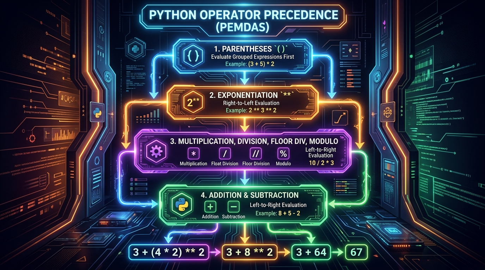

```markmap
# Session 02: Các loại toán tử số học

## Mục tiêu bài học
- Hiểu rõ bản chất và sự khác biệt giữa các toán tử cộng, trừ, nhân, chia, chia lấy nguyên và chia lấy dư.
- Nhận biết và xử lý các lỗi runtime phổ biến như chia cho không và sai kiểu dữ liệu khi làm việc với biểu thức số học.
- Áp dụng đúng quy chuẩn PEP 8 về khoảng trắng và thứ tự ưu tiên của biểu thức toán học.

## Toán tử số học cơ bản
### Khái niệm cốt lõi
- Các phép toán cơ bản bao gồm phép cộng (+), trừ (-), nhân (*) và chia (/). Phép chia (/) luôn luôn trả về kết quả thuộc kiểu số thực (float) bất kể toán hạng có chia hết hay không.
### Cú pháp & Cách khai báo
- Khai báo và sử dụng:
  ```python
  a = 15
  b = 4
  result_add = a + b
  result_sub = a - b
  result_mul = a * b
  result_div = a / b
  ```
### Lưu ý thực chiến
- Tránh thực hiện tính toán giữa số và chuỗi chưa được ép kiểu để ngăn chặn lỗi TypeError trong quá trình vận hành chương trình.

## Phép chia lấy nguyên
### Khái niệm cốt lõi
- Toán tử chia lấy nguyên (//) thực hiện phép chia và chỉ giữ lại phần nguyên của kết quả, làm tròn xuống số nguyên gần nhất (floor division).
- Nếu một hoặc cả hai toán hạng là số thực (float), giá trị trả về sẽ mang kiểu số thực (float).
### Cú pháp & Cách khai báo
- Khai báo và sử dụng:
  ```python
  total_products = 527
  box_capacity = 25
  full_boxes = total_products // box_capacity
  result_float = 527.0 // 25
  ```
### Lưu ý thực chiến
- Phù hợp nhất cho giải thuật phân trang dữ liệu, phân nhóm phần tử hoặc phân bổ tài nguyên logistics.

## Phép chia lấy dư
### Khái niệm cốt lõi
- Toán tử chia lấy dư (%) trả về phần dư còn lại của phép chia hai toán hạng (modulo). Kết quả tự động chuyển sang float nếu có toán hạng dạng float.
- 
### Cú pháp & Cách khai báo
- Khai báo và sử dụng:
  ```python
  total_items = 527
  divisor = 25
  remainder = total_items % divisor
  remainder_float = 527 % 25.0
  ```
### Lưu ý thực chiến
- Được áp dụng rộng rãi để kiểm tra số chẵn lẻ, kiểm tra một số là bội số của số khác hoặc chạy các vòng lặp tuần hoàn.

## Lỗi chia cho không
### Khái niệm cốt lõi
- Lỗi thời gian chạy (runtime error) xảy ra khi chương trình thực hiện các phép toán chia (/), chia lấy nguyên (//) hoặc chia lấy dư (%) với mẫu số bằng không.
### Cú pháp & Cách khai báo
- Lỗi phát sinh:
  ```python
  numerator = 100
  denominator = 0
  err = numerator / denominator
  ```
### Lưu ý thực chiến
- Luôn kiểm tra điều kiện của mẫu số trước khi tính toán để chủ động tránh lỗi ZeroDivisionError đột ngột dừng hệ thống.

## Thứ tự ưu tiên toán tử
### Khái niệm cốt lõi
- Trật tự tính toán của biểu thức số học tuân theo các quy tắc toán học chuẩn hóa (PEMDAS) từ trong ngoặc ra ngoài, nhân chia trước cộng trừ sau.
- 
### Cú pháp & Cách khai báo
- Khai báo biểu thức phức tạp:
  ```python
  final_cost = 100 + 50 * 2 ** 3 / (10 - 5)
  ```
### Lưu ý thực chiến
- Khuyến khích sử dụng cặp dấu ngoặc đơn () để phân tách các nhóm biểu thức rõ ràng, hạn chế sai sót logic và cải thiện độ tường minh cho mã nguồn.

## Quy chuẩn PEP 8
### Khái niệm cốt lõi
- Hướng dẫn định dạng code Python chuẩn hóa nhằm duy trì tính nhất quán, cải thiện khả năng đọc và bảo trì mã nguồn giữa các nhà phát triển.
### Cú pháp & Cách khai báo
- Viết biểu thức chuẩn PEP 8:
  ```python
  x = a * b + c
  y = (a + b) * (c - d)
  ```
### Lưu ý thực chiến
- Không đặt khoảng trắng xung quanh toán tử có độ ưu tiên cao nhất trong biểu thức số học phức tạp để tạo độ gắn kết rõ nét trực quan.
```
```
```