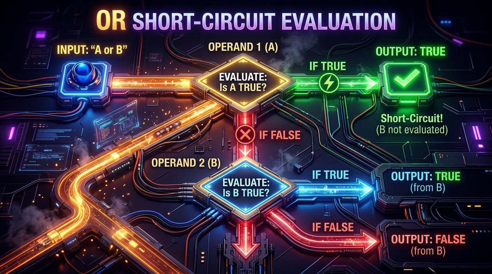

```markmap
# Session 02: Lesson 03: Toán tử logic
## Mục tiêu bài học
- Hiểu rõ bản chất hoạt động của các toán tử logic and, or, not
- Vận dụng phân tích độ ưu tiên toán tử logic trong các bài toán thực tế
- Viết biểu thức logic sạch, tối ưu và chuẩn PEP 8
## Toán tử logic (Logical Operators)
### Khái niệm cốt lõi
- Công cụ kết hợp hoặc biến đổi các biểu thức điều kiện thành một trạng thái Boolean đại diện.
- Python sử dụng cơ chế Truth Value Testing để chuyển đổi không tường minh mọi đối tượng thành True hoặc False.
### Cú pháp & Cách khai báo
- Kết hợp các toán tử cơ bản:
  ```python
  x = True
  y = False
  z = not x or y and x
  ```
### Lưu ý thực chiến
- Cảnh báo lỗi TypeError khi áp dụng toán tử logic trên các kiểu dữ liệu không hỗ trợ ép kiểu logic ngầm định.
## Toán tử logic 'and' (Conjunction)
### Khái niệm cốt lõi
- Chỉ trả về True khi toàn bộ các toán hạng tham gia có giá trị True.
- Cơ chế đánh giá ngắn mạch (Short-circuit): Dừng đánh giá ngay lập tức nếu gặp toán hạng False đầu tiên.
- 
### Cú pháp & Cách khai báo
- Sử dụng trong mã nguồn:
  ```python
  is_valid = True and False  # Kết quả: False
  val = (10 > 5) and (3 < 4)  # Kết quả: True
  ```
### Lưu ý thực chiến
- Ưu tiên xếp các biểu thức đơn giản, ít tốn tài nguyên CPU lên trước phía bên trái để tận dụng tối đa ngắn mạch.
## Toán tử logic 'or' (Disjunction)
### Khái niệm cốt lõi
- Trả về True nếu tồn tại ít nhất một toán hạng mang giá trị True.
- Cơ chế đánh giá ngắn mạch (Short-circuit): Dừng đánh giá và trả về kết quả ngay khi gặp toán hạng True đầu tiên.
- 
### Cú pháp & Cách khai báo
- Sử dụng trong mã nguồn:
  ```python
  has_access = True or False  # Kết quả: True
  default_val = None or "Default Value"  # Kết quả: "Default Value"
  ```
### Lưu ý thực chiến
- Thường phối hợp để thiết lập giá trị dự phòng trong ứng dụng nhờ cơ thế giá trị mặc định của phép toán or.
## Toán tử logic 'not' (Negation)
### Khái niệm cốt lõi
- Toán tử một ngôi thực hiện đảo ngược trạng thái Boolean của toán hạng (True thành False, False thành True).
### Cú pháp & Cách khai báo
- Sử dụng trong mã nguồn:
  ```python
  is_admin = False
  is_guest = not is_admin  # Kết quả: True
  ```
### Lưu ý thực chiến
- Tránh sử dụng cấu trúc phủ định kép (Double Negation) như not not để kiểm tra điều kiện, nhằm giữ code sạch.
## Thứ tự ưu tiên toán tử logic (Precedence)
### Khái niệm cốt lõi
- Quy tắc thực thi toán tử mặc định trong Python theo phân cấp từ cao xuống thấp: not -> and -> or.
- 
### Cú pháp & Cách khai báo
- Đánh giá không dùng dấu ngoặc:
  ```python
  # Tương đương với: False or (True and False) -> False
  result = False or True and False
  ```
### Lưu ý thực chiến
- Tránh lỗi Operator Precedence Bug khiến ứng dụng chạy sai logic nghiệp vụ nhưng trình dịch không báo lỗi.
## Ngoặc đơn trong biểu thức logic (Parentheses)
### Khái niệm cốt lõi
- Dấu ngoặc đơn () giữ độ ưu tiên thực thi tuyệt đối cao nhất, dùng để cưỡng chế thứ tự tính toán mong muốn.
### Cú pháp & Cách khai báo
- Ép nhóm điều kiện:
  ```python
  # Ép tính toán phép or trước khi thực hiện and
  result = (False or True) and False  # Kết quả: False
  ```
### Lưu ý thực chiến
- Luôn chỉ định ngoặc đơn tường minh trong biểu thức phức tạp, tăng khả năng đọc hiểu cho người khác.
## Chuẩn PEP 8 cho biểu thức logic (PEP 8 Conventions)
### Khái niệm cốt lõi
- Các hướng dẫn chuẩn hóa về cách định dạng và viết biểu thức so sánh logic tối giản trong Python.
### Cú pháp & Cách khai báo
- Viết code chuẩn Pythonic:
  ```python
  # Chuẩn PEP 8:
  if is_active: pass
  # Mẫu xấu nên tránh:
  if is_active == True: pass
  ```
### Lưu ý thực chiến
- Thiết kế tên biến Boolean bắt đầu bằng các tiền tố tiêu chuẩn quốc tế như is_ hoặc has_ để đảm bảo tính tường minh.
## Lỗi logic (Logical Errors)
### Khái niệm cốt lõi
- Lỗi xuất hiện khi ứng dụng chạy trơn tru nhưng trả ra đúng kết quả sai mong đợi do biểu thức logic bị sai.
### Cú pháp & Cách khai báo
- Lỗi logic về quyền hạn bảo mật:
  ```python
  # Mẫu sai: Thiếu ngoặc đơn dẫn đến an toàn bảo mật bị phá vỡ
  is_access_granted = is_credential_ok and is_admin or is_ip_trusted
  ```
### Lưu ý thực chiến
- Cảnh báo lỗi Logical Shortcut Fail: Cẩn trọng khi chèn các biểu thức có tác dụng phụ (side-effects) ở phía sau biểu thức ngắn mạch.
```
```
```