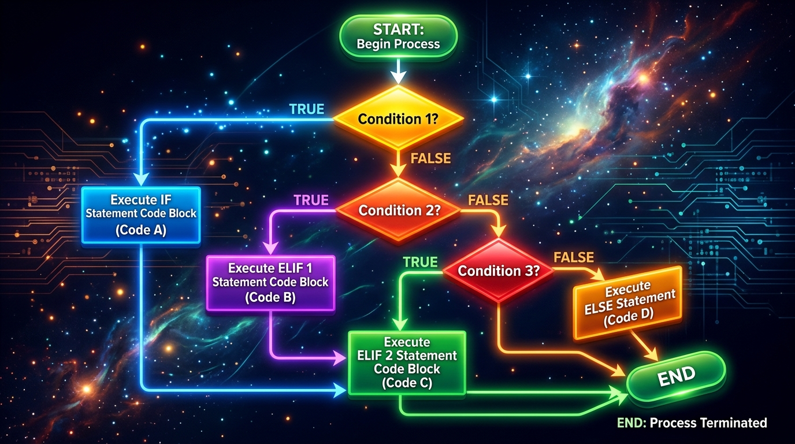

```markmap
# Session 02 - Lesson 04: Cấu trúc điều kiện đa nhánh if-else-match-case

## Mục tiêu bài học
- Hiểu và vận dụng cấu trúc điều kiện if-elif-else
- Làm chủ cấu trúc match-case và wildcard pattern trong Python 3.10+
- Tránh các lỗi cú pháp, logic và định dạng PEP 8

## if_elif_else
### Khái niệm cốt lõi
- Kiểm tra tuần tự các biểu thức điều kiện Boolean từ trên xuống dưới
- Thích hợp cho các so sánh khoảng giá trị hoặc biểu thức logic phức tạp kết hợp các toán tử and, or, not
- 
### Cú pháp & Cách khai báo
- ```python
  if score >= 90:
      grade = "A"
  elif score >= 80:
      grade = "B"
  else:
      grade = "C"
  ```
### Lưu ý thực chiến
- Python dừng kiểm tra ngay khi gặp nhánh điều kiện thỏa mãn True đầu tiên
- Tránh lồng ghép nested if quá 3 cấp để giảm độ phức tạp cyclo-complexity của mã

## match_case
### Khái niệm cốt lõi
- Cơ chế Pattern Matching giới thiệu từ Python 3.10 giúp tối ưu hóa việc so khớp mẫu
- Rẽ nhánh trực quan hơn chuỗi if-elif dài khi cần so sánh giá trị tĩnh
- 
### Cú pháp & Cách khai báo
- ```python
  match membership:
      case "gold":
          discount = 0.15
      case "silver":
          discount = 0.10
  ```
### Lưu ý thực chiến
- Không hỗ trợ so sánh khoảng lớn hơn hay nhỏ hơn trực tiếp trên các mẫu so khớp tĩnh
- Các biểu thức case được thiết kế để kiểm tra độc lập và tối ưu tốc độ thực thi bởi Python VM

## wildcard_pattern
### Khái niệm cốt lõi
- Ký tự đại diện gạch dưới _ đóng vai trò khớp với mọi giá trị dữ liệu đầu vào còn lại
- Đảm bảo luồng xử lý không bị bỏ sót, hoạt động tương đương lệnh else hoặc default
### Cú pháp & Cách khai báo
- ```python
  match user_role:
      case "admin":
          access = True
      case _:
          access = False
  ```
### Lưu ý thực chiến
- Ký tự wildcard pattern case _ bắt buộc phải xếp ở vị trí cuối cùng của khối match-case
- Nếu khai báo case _ trước các case khác, chương trình sẽ báo lỗi SyntaxError

## logic_error
### Khái niệm cốt lõi
- Lỗi phát sinh do xử lý không đồng nhất kiểu dữ liệu hoặc sai cú pháp điều hướng
- Dẫn đến việc chương trình bị dừng đột ngột hoặc chạy sai nghiệp vụ mong muốn
### Cú pháp & Cách khai báo
- ```python
  # TypeError: so sanh khong dong nhat kieu du lieu
  age = "20"
  if age > 18:
      pass
  ```
### Lưu ý thực chiến
- Luôn kiểm tra đầy đủ dấu hai chấm ở cuối các dòng khai báo điều kiện case hoặc elif
- Ép kiểu dữ liệu tương thích trước khi thực hiện các phép so sánh số học lớn bé

## pep_8_alignment
### Khái niệm cốt lõi
- Tiêu chuẩn căn lề Indentation sử dụng khoảng trắng để định hình khối mã lệnh trong Python
- Đảm bảo tính đồng bộ, sạch sẽ và dễ đọc của cấu trúc đa nhánh điều kiện
### Cú pháp & Cách khai báo
- ```python
  # Su dung dung 4 khoang trang cho cac khoi lenh con
  if is_active:
      status = "Online"
  else:
      status = "Offline"
  ```
### Lưu ý thực chiến
- Tuyệt đối không pha trộn Tab và Space để tránh gặp lỗi IndentationError ở thời điểm chạy
- Khai báo tên biến và hàm bổ trợ theo chuẩn định dạng snake_case
```
```