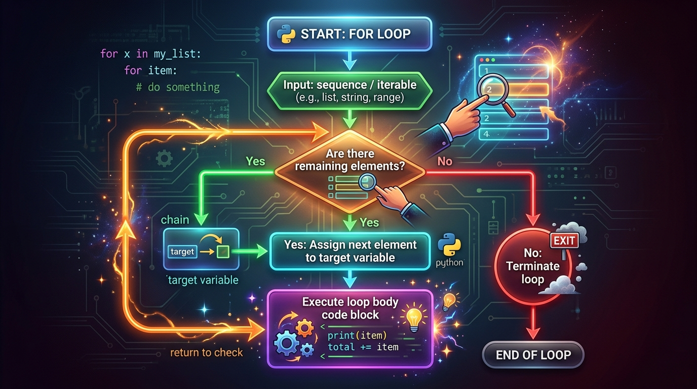

```markmap
# Session 03: Vòng lặp for và hàm range()

## Vòng lặp for trong Python
- Cơ chế hoạt động
  - Duyệt qua các phần tử của một Sequence hoặc Iterable (Iterable traversal).
  - Tự động gán từng giá trị cho biến lặp qua mỗi chu kỳ.
- Cú pháp
  ```python
  for variable in sequence:
      # Khoi lenh thuc thi
  ```

## Hàm range(start, stop, step)
- Cơ chế Lazy Evaluation
  - Không sinh toàn bộ danh sách số ra RAM cùng lúc.
  - Tính toán giá trị tiếp theo ngay khi vòng lặp yêu cầu, tối ưu hóa bộ nhớ.
- Ý nghĩa tham số
  - `start`: Điểm bắt đầu (Mặc định: 0, Bao gồm trong dãy).
  - `stop`: Điểm giới hạn (Bắt buộc phải khai báo).
  - `step`: Bước nhảy chuyển vị (Mặc định: 1, Phải khác 0).
- 
- Lỗi vận hành thường gặp
  - `ValueError`: Phát sinh khi khởi tạo `step` bằng 0 (`range(1, 10, 0)`).
  - `TypeError`: Phát sinh khi truyền kiểu số thực float hoặc chuỗi ký tự (`range(1.5, 10)`).
  - Lặp rỗng (Không báo lỗi): Sinh ra từ xung đột hướng chạy (`range(1, 10, -1)`).

## Quy tắc cận trên (Exclusive Limit)
- Định nghĩa biên toán học
  - Cận trên `stop` bị loại trừ khỏi chu kỳ lặp: $[start, stop)$.
  - Vòng lặp dừng ngay trước khi biến đếm đạt giá trị `stop`.
- 

## Tổng lũy tiến (Cumulative Sum)
- Kỹ thuật tích lũy
  - Khởi tạo accumulator (biến tích lũy) bằng 0 trước vòng lặp.
  - Cộng dồn liên tiếp giá trị biến đếm vào accumulator.
- Mã nguồn mẫu
  ```python
  total_sum = 0
  for current_number in range(1, 10, 2):
      total_sum += current_number
  ```

## Cấu trúc match-case kết hợp vòng lặp
- Nguyên lý hoạt động
  - Khớp mẫu giá trị của biến lặp tại mỗi chu kỳ để phân nhánh logic.
- Mã nguồn mẫu
  ```python
  for i in range(1, 4):
      match i:
          case 1:
              print("First item")
          case _:
              print("Other items")
  ```

## Lỗi logic Off-by-one
- Hiện tượng
  - Vòng lặp chạy thiếu hoặc thừa đúng 1 lần lặp do xác định sai giá trị `stop`.
- Cách khắc phục
  - Để lặp $N$ lần từ 1 đến $N$, cận trên phải được cấu hình là `N + 1` (`range(1, N + 1)`).

## Quy chuẩn tài liệu PEP 8
- Đặt tên biến lặp
  - Sử dụng tên biến có ý nghĩa khi truyền tải logic xử lý (`current_number`).
- Khoảng trắng (Spacing)
  - Phân cách bằng 1 khoảng trắng sau mỗi dấu phẩy phân tách đối số (`start, stop, step`).
- Thụt lề (Indentation)
  - Thụt lề nhất quán 4 dấu cách (spaces) đối với thân vòng lặp và mệnh đề điều khiển.
```
```
```