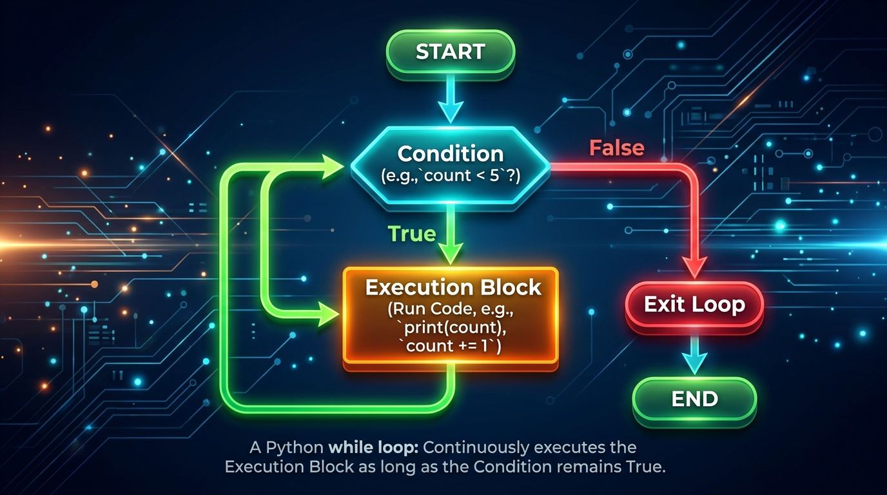

```markmap
# Session 03 - Lesson 02: Vòng lặp while

## Cú pháp vòng lặp while
- Cấu trúc cơ bản
  - ```python
    while condition:
        # Khối lệnh được thực thi liên tục
        # khi condition còn đánh giá là True
    ```
- Quy tắc Indentation
  - Thân vòng lặp bắt buộc thụt lề 4 khoảng trắng (spaces)
  - Khối lệnh cùng cấp phải thụt lề thẳng hàng để tránh lỗi IndentationError

## Cơ chế đánh giá điều kiện
- Luồng điều khiển (Control Flow)
  - Bước 1: Đánh giá biểu thức điều kiện (Condition)
  - Bước 2: Nếu True -> Thực thi thân vòng lặp -> Quay lại Bước 1
  - Bước 3: Nếu False -> Bỏ qua thân vòng lặp, chạy tiếp code phía dưới
  - 
- Nhóm giá trị Falsy trong Python
  - Đối tượng trống/rỗng tự động đánh giá là False: `0`, `0.0`, `""` (chuỗi rỗng), `[]` (danh sách rỗng)

## Quy tắc PEP 8 cho vòng lặp while
- So sánh tường minh cho kiểu Boolean
  - Sai khuyến nghị: `while status == True:` hoặc `while is_active == False:`
  - Đúng chuẩn (Idiomatic): `while status:` hoặc `while not is_active:`
- Khoảng trắng xung quanh toán tử điều kiện
  - Đúng: `while count < limit:`
  - Sai: `while count<limit:`

## Vòng lặp vô hạn
- Nguyên lý
  - Xảy ra khi biểu thức điều kiện của vòng lặp luôn đánh giá là True
- Nguyên nhân phổ biến
  - Quên cập nhật biến điều khiển hoặc viết sai logic làm điều kiện không bao giờ thay đổi
  - ```python
    # Lỗi vô hạn do quên tăng giá trị biến i
    i = 1
    while i <= 5:
        print(i)
    ```
- Cố ý thiết lập vô hạn có kiểm soát
  - Sử dụng `while True:` để nhận kết nối máy chủ hoặc chạy tiến trình liên tục
- Kỹ thuật thoát khẩn cấp: Nhấn tổ hợp phím Ctrl + C trên Terminal

## Biến điều khiển
- Vai trò
  - Biến dùng để thay đổi trạng thái sau mỗi vòng lặp nhằm đưa điều kiện tiệm cận về False
- Cập nhật toán tử rút gọn
  - Tăng dần: `counter += 1`
  - Giảm dần: `counter -= 1`

## Phân tích Dry run
- Định nghĩa
  - Kỹ thuật mô phỏng thủ công từng bước chạy của chương trình để kiểm tra biến thiên của giá trị
- Ví dụ phân tích bảng trace (với logic: counter = 1; while counter < 3)
  - Khởi tạo: counter = 1
  - Vòng 1: Điều kiện 1 < 3 (True) -> In counter -> counter tăng lên 2
  - Vòng 2: Điều kiện 2 < 3 (True) -> In counter -> counter tăng lên 3
  - Vòng 3: Điều kiện 3 < 3 (False) -> Thoát vòng lặp

## Kiểm tra tính hợp lệ đầu vào
- Chống treo/crash chương trình (tránh ValueError)
  - Sử dụng phương thức `.isdigit()` để kiểm định chuỗi số trước khi ép kiểu
- Đoạn mã thực tế hợp lệ
  - ```python
    user_input = ""
    while not user_input.isdigit():
        user_input = input("Nhập vào một số nguyên dương: ")
    number = int(user_input)
    ```

## Tích lũy toán học
- Khái niệm
  - Tích lũy giá trị liên tục qua mỗi lần lặp (tính tổng, tính tích)
- Ví dụ tích lũy tổng từ 1 đến N
  - ```python
    n = 5
    total = 0
    i = 1
    while i <= n:
        total += i
        i += 1
    ```

## Kiểm soát thoát vòng lặp an toàn
- Cơ chế Giới hạn (Guard Condition)
  - Khống chế số lần thử tối đa (max retries) để đảm bảo chương trình không lặp vô tận khi đầu vào lỗi liên tiếp
- Giải pháp mã nguồn an toàn chống crash
  - ```python
    retry_count = 0
    max_retries = 3
    is_valid = False
    
    while not is_valid and retry_count < max_retries:
        val = input("Nhập số: ")
        if val.isdigit() and int(val) > 0:
            is_valid = True
        else:
            retry_count += 1
    ```
```
```