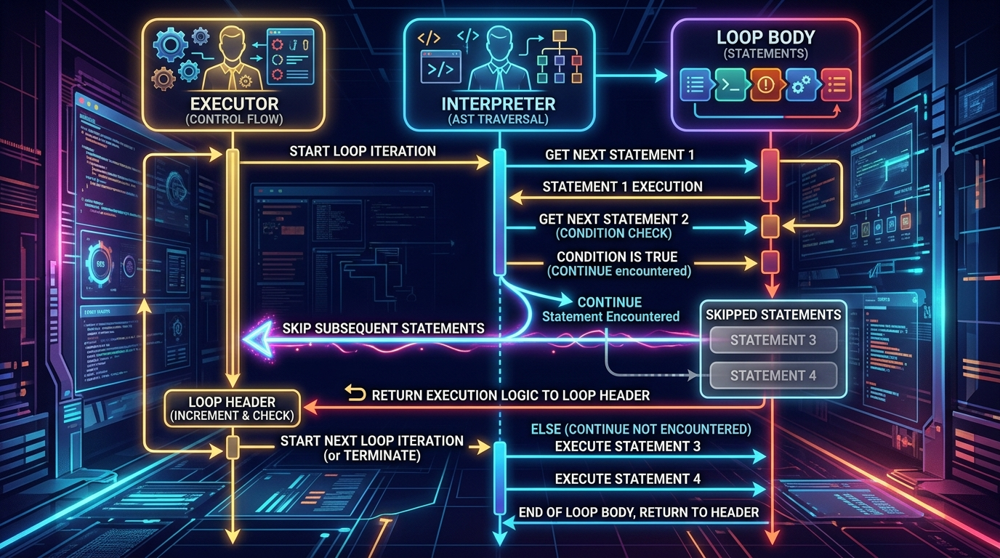

```markmap
# Session 03: Kiểm soát vòng lặp - break, continue, pass

## Câu lệnh break (Thoát vòng lặp)
- Bản chất
  - Ngắt thực thi và thoát khỏi vòng lặp hiện tại ngay lập tức
  - Chuyển hướng luồng chương trình tới khối lệnh tiếp theo bên ngoài vòng lặp
- Luồng hoạt động trực quan
  - 
- Code mẫu thực chiến
  - ```python
    revenue_limit = 1000
    total = 0
    orders = [250, 450, 500, 100]
    for order in orders:
        total += order
        if total >= revenue_limit:
            print("Dat muc tieu doanh thu")
            break
    ```
- Điểm cần chú ý (Gotchas)
  - Chỉ thoát ra khỏi vòng lặp trực tiếp chứa nó (trong cấu trúc vòng lặp lồng nhau)

## Câu lệnh continue (Bỏ qua lượt lặp)
- Bản chất
  - Bỏ qua các lệnh còn lại trong thân vòng lặp của lượt lặp hiện tại
  - Di chuyển ngay lập tức sang lượt lặp tiếp theo của vòng lặp
- Luồng hoạt động trực quan
  - 
- Code mẫu thực chiến
  - ```python
    values = [100, -20, 300, -50]
    for val in values:
        if val <= 0:
            continue
        print("Xuly gia tri du: " + str(val))
    ```
- Điểm cần chú ý (Gotchas)
  - Trong vòng lặp while, nếu đặt continue trước khi cập nhật biến đếm sẽ gây ra lỗi lặp vô hạn

## Câu lệnh pass (Giữ cấu trúc/Bỏ qua lệnh)
- Bản chất
  - Là câu lệnh rỗng (Null statement) không thực hiện bất kỳ hành động nào
  - Sử dụng làm khối giữ chỗ (Placeholder) để tránh lỗi IndentationError khi chưa triển khai logic code
- Code mẫu thực chiến
  - ```python
    orders = [10, 20, 30]
    for order in orders:
        if order < 0:
            pass  # Logic xu ly don hang am se bo sung sau
        else:
            print("Giao hang")
    ```
- Điểm cần chú ý (Gotchas)
  - Không thay đổi hành vi hoặc luồng thực thi vòng lặp như break hay continue

## Vòng lặp vô hạn (Infinite Loop)
- Nguyên nhân phổ biến
  - Điều kiện dừng của vòng lặp while luôn đúng (True)
  - Quên cập nhật biến điều khiển hoặc biến đếm trước khi gặp lệnh continue
- Case-study thực tế: Xác thực mã PIN tài khoản ngân hàng
  - ```python
    correct_pin = "7979"
    attempts = 0
    max_attempts = 3
    while True:
        if attempts >= max_attempts:
            print("Khoa tai khoan.")
            break
        user_input = input("Nhap PIN: ")
        attempts += 1
        if user_input == correct_pin:
            print("Xac thuc thanh cong.")
            break
        else:
            continue
    ```
- Cách khắc phục và kiểm soát
  - Luôn đảm bảo biểu thức điều kiện vòng lặp tiệm cận tới giá trị False
  - Sử dụng cơ chế thoát khẩn cấp với điều kiện kiểm tra và lệnh break

## Quy chuẩn PEP 8 trong vòng lặp
- Đặt tên biến đếm rõ nghĩa
  - Sử dụng các ký tự đơn giản truyền thống (i, j, k) cho vòng lặp ngắn đơn giản
  - Đặt tên biến tường minh (như: index, member_id, revenue_value) cho logic nghiệp vụ phức tạp
- Trình bày mã nguồn chuẩn xác
  - Bắt buộc có 1 khoảng trắng quanh các toán tử gán (=) và toán tử so sánh (==, <=, >=, !=)
  - Căn lề thụt dòng (Indentation) đồng nhất bằng 4 khoảng trắng (Spaces) thay vì phím Tab
- Code mẫu đúng chuẩn PEP 8
  - ```python
    limit = 10
    i = 0
    while i < limit:
        print(i)
        i += 1
    ```
```
```