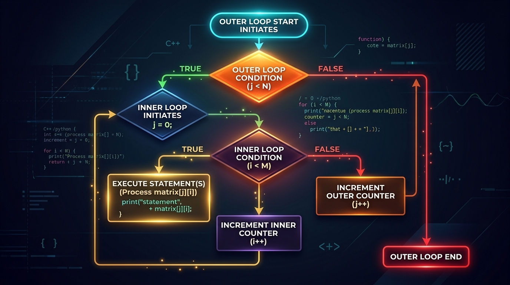

```markmap
# Session 03 - Lesson 04: Vòng lặp lồng nhau (Nested loops)
## vong_lap_long_nhau_nested_loops
- Định nghĩa: Cấu trúc điều khiển chứa một hoặc nhiều vòng lặp nằm trong thân của một vòng lặp khác.
- Cơ chế vận hành: Với mỗi vòng lặp đơn lẻ của vòng lặp cấp ngoài, vòng lặp cấp trong sẽ chạy toàn bộ các chu kỳ của nó từ đầu đến cuối.
- 
## vong_lap_ngoai_outer_loop
- Định nghĩa: Vòng lặp bao bọc ở cấp độ cao nhất.
- Tần suất hoạt động: Chạy chậm hơn vòng lặp trong (mỗi bước lặp tương đương với toàn bộ chu kỳ của vòng lặp trong).
- Vai trò thiết kế: Thường dùng để quản lý các điều khiển bao quát như hàng trong ma trận 2D hoặc các chỉ số vĩ mô.
## vong_lap_trong_inner_loop
- Định nghĩa: Vòng lặp phụ thuộc, khai báo bên trong khối mã thực thi của vòng ngoài.
- Tần suất hoạt động: Chạy nhanh hơn vòng ngoài (lặp lại đầy đủ trạng thái ban đầu của nó tại mỗi chu kỳ của vòng ngoài).
- Vai trò thiết kế: Thường xử lý chi tiết chi tiết nội bộ như cột trong ma trận 2D hoặc phần tử vi mô.
## bien_chay_loop_control_variable
- Độc lập tên biến: Phải đặt tên biến chạy khác biệt hoàn toàn giữa vòng ngoài và vòng trong nhằm tránh hiện tượng ghi đè phạm vi biến (Shadowing).
- Gợi ý đặt tên: Sử dụng `row_number` và `column_number` hoặc các biến chỉ số rõ nghĩa để kiểm soát luồng dữ liệu trực quan.
## tong_so_lan_lap_total_iterations
- Công thức tính: `Total = N * M` (N là số chu kỳ của vòng ngoài, M là số chu kỳ của vòng trong).
- Hiệu năng hệ thống: Tăng dần theo cấp lũy thừa khi số cấp lồng nhau tăng lên.
- Gotchas: Hạn chế lồng nhau vượt quá 3 cấp trong thực hành để tránh lỗi treo hoặc nghẽn tài nguyên CPU.
## ve_hinh_bang_ky_tu_character_drawing
- Ứng dụng: Biểu diễn tọa độ dòng và cột bằng ma trận ký tự thông qua cơ chế vòng lặp đồng bộ.
- Mã nguồn mẫu:
  ```python
  row_limit = 3
  column_limit = 4
  for row_number in range(1, row_limit + 1):
      for column_number in range(1, column_limit + 1):
          print(f"[{row_number}-{column_number}]", end=" ")
      print()
  ```
## long_ghep_vong_lap_khac_loai_mixed_loops
- Khái niệm: Lồng ghép cấu trúc `for` bên trong `while` hoặc ngược lại tùy thuộc vào bài toán.
- Ví dụ mẫu:
  ```python
  row = 1
  while row <= 3:
      for col in range(1, 3):
          print(f"R{row} - C{col}")
      row += 1
  ```
## vong_lap_vo_tan_infinite_loop
- Nguyên nhân: Quên cập nhật biến điều khiển hoặc sai lệch điều kiện dừng của vòng lặp `while` bên trong hoặc bên ngoài.
- Phòng tránh: Luôn kiểm tra các lệnh tăng/giảm giá trị bước nhảy điều kiện trước khi khởi chạy chương trình.
## toi_uu_cau_lenh_in_print_optimization
- Tùy chỉnh tham số end: Sử dụng `print(..., end=" ")` thay đổi ký tự xuống dòng mặc định thành khoảng trắng để duy trì định dạng in trên hàng ngang.
- Tự động ngắt dòng: Gọi `print()` không có tham số để thực hiện ngắt dòng ngay khi hoàn thành các phần tử của một hàng.
## phong_cach_lap_trinh_pep8
- Quy tắc thụt lề: Sử dụng nhất quán 4 khoảng trắng (spaces) trên mỗi cấp lồng nhau.
- Cảnh báo Syntax: Tránh lỗi `IndentationError` bằng cách không trộn lẫn Whitespaces và TAB trong định dạng mã Python.
```
```
```