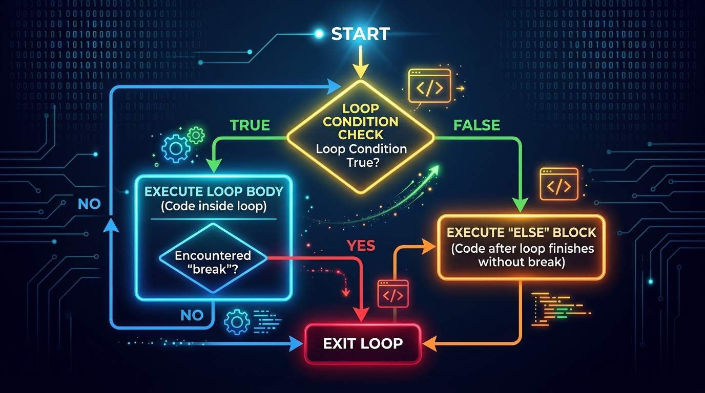

```markmap
# Session 03 - Lesson 05: Khối else trong vòng lặp Python

## Cấu trúc và cơ chế loop-else (loop_else_syntax_and_behavior)
* Nguyên lý hoạt động
  * Khối `else` chỉ thực thi khi vòng lặp kết thúc bình thường (hoàn thành đầy đủ các vòng lặp).
  * Khối `else` sẽ BỊ BỎ QUA nếu vòng lặp bị ngắt quãng giữa chừng bởi câu lệnh `break`.
  * 
* Minh họa cú pháp `for-else` thực tế
  ```python
  def search_suspicious_account(accounts):
      for current_account in accounts:
          if current_account["is_blacklisted"]:
              print(f"Warning: Suspicious account: {current_account['id']}")
              break
      else:
          print("Inspection green: No suspicious accounts detected.")
  ```
* Minh họa cú pháp `while-else` thực tế
  ```python
  def monitor_connection(max_attempts):
      attempts = 0
      while attempts < max_attempts:
          if is_connected():
              print("Connection established successfully.")
              break
          attempts += 1
      else:
          print("Failed: Connection timeout after max attempts.")
  ```
* Lưu ý thực chiến (Gotchas)
  * Vòng lặp rỗng (danh sách trống hoặc điều kiện while là False ngay từ đầu) vẫn kích hoạt khối `else`.
  * Sử dụng nhầm `continue` thay vì `break` sẽ khiến khối `else` vẫn chạy bình thường.
  * Lỗi thụt lề IndentationError: Đặt khối `else` ngang hàng với `if` thay vì `for` hoặc `while`.

## Khác biệt giữa loop-else và if-else (difference_between_loop_else_and_if_else)
* Logic loại trừ của `if-else`
  * Rẽ nhánh độc lập: Chỉ một trong hai khối `if` hoặc `else` được chạy.
* Logic đồng hành của `loop-else`
  * Khối `else` đóng vai trò là hậu tố xác nhận vòng lặp đã chạy trọn vẹn và không gặp sự cố ngắt quãng (no break).

## Tìm kiếm tuần tự trên chuỗi không qua mảng (sequential_search_on_strings_without_lists)
* Ý tưởng
  * Duyệt trực tiếp qua từng ký tự của một chuỗi văn bản (String) để tiết kiệm tài nguyên bộ nhớ.
* Mã nguồn minh họa
  ```python
  def verify_secure_input(user_input):
      for character in user_input:
          if character in "@#$":
              print("Input contains restricted characters!")
              break
      else:
          print("Input verified: Safe to proceed.")
  ```

## Loại bỏ biến cờ hiệu bằng loop-else (flag_variable_refactoring)
* Cách tiếp cận dùng cờ hiệu (Flag) truyền thống
  * Khởi tạo biến cờ `is_found = False`. Thay đổi giá trị khi gặp điều kiện, kiểm tra lại cờ sau vòng lặp.
* Cải tiến loại bỏ cờ hiệu với `for-else`
  * Chuyển logic kiểm tra trực tiếp vào khối `else` của vòng lặp, giúp giảm số lượng biến trạng thái dư thừa.
* Mã nguồn đối chiếu
  ```python
  # Cach cu (Dung flag):
  found = False
  for x in data:
      if x == target:
          found = True
          break
  if not found:
      register_new(target)

  # Refactored (Khong dung flag):
  for x in data:
      if x == target:
          break
  else:
      register_new(target)
  ```

## Chuẩn hóa PEP 8 trong chương trình kiểm tra số nguyên tố (pep8_compliance_in_prime_check)
* Quy tắc chuẩn hóa
  * Tên hàm sử dụng snake_case, đặt tên biến rõ nghĩa, có khoảng trắng chuẩn theo PEP 8.
* Mã nguồn kiểm tra số nguyên tố tối ưu
  ```python
  def check_prime_number(target_number):
      if target_number < 2:
          return False
      for factor in range(2, int(target_number ** 0.5) + 1):
          if target_number % factor == 0:
              break
      else:
          return True
      return False
  ```
```
```
```