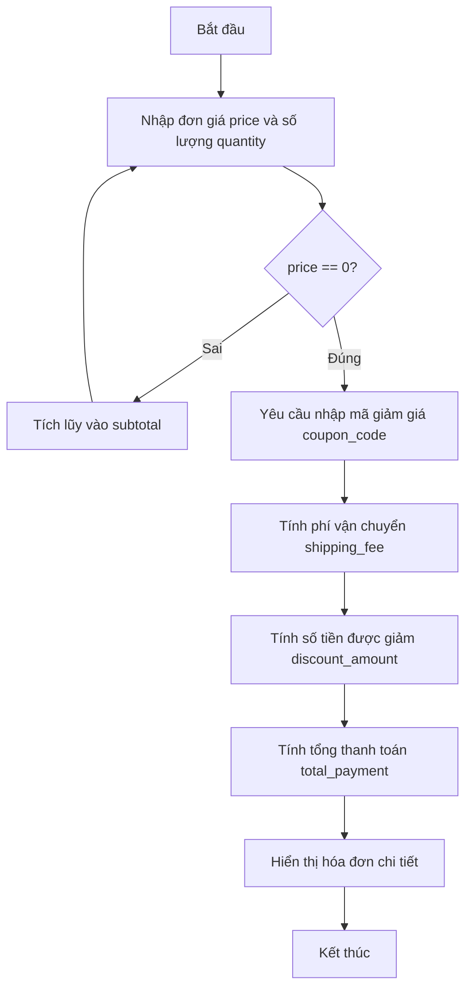

## <center>Tính Toán Hóa Đơn và Áp Dụng Mã Giảm Giá Cho Đơn Hàng Ecommerce</center>

### **1. Mục tiêu**
Sau khi hoàn thành bài thực hành này, sinh viên có khả năng:
* Sử dụng thành thạo các biểu thức toán học và toán tử logic trong Python để tính toán giá trị tài chính cơ bản.
* Áp dụng cấu trúc điều kiện `if-elif-else` để phân loại và xử lý các kịch bản áp dụng mã giảm giá và tính phí vận chuyển khác nhau.
* Sử dụng vòng lặp `while` để nhận và tích lũy dữ liệu đầu vào từ người dùng một cách liên tục cho đến khi thỏa mãn điều kiện dừng.
* Định dạng và hiển thị kết quả kiểm thử hóa đơn rõ ràng, chính xác.

### **2. Vấn đề**
Trong phân hệ quản lý đơn hàng của một hệ thống thương mại điện tử (Ecommerce), việc tính toán chính xác tổng số tiền khách hàng phải thanh toán là vô cùng quan trọng. Nhân viên tại quầy thu ngân cần một công cụ dòng lệnh (Console App) đơn giản để nhập giá trị và số lượng của từng mặt hàng khách lựa chọn. Sau khi hoàn tất việc nhập sản phẩm, hệ thống cần tính toán số tiền tạm tính, áp dụng phí vận chuyển theo chính sách của công ty, kiểm tra và áp dụng mã giảm giá tương ứng, cuối cùng xuất ra hóa đơn chi tiết cho khách hàng. Nếu hệ thống tính toán sai lệch hoặc không xử lý đúng các trường hợp miễn phí vận chuyển, doanh nghiệp sẽ chịu tổn thất tài chính hoặc làm giảm trải nghiệm của khách hàng.


<p align="center">
  
</p>




### **3. Yêu cầu bài toán**
Sinh viên cần xây dựng các hàm độc lập để xử lý từng nhiệm vụ trong luồng tính hóa đơn và kết hợp chúng trong một chương trình hoàn chỉnh.

<table style="width: 100%; min-width: 100%; display: table; border-collapse: collapse;" width="100%" border="1">
  <thead>
    <tr>
      <th>Tên hàm</th>
      <th>Tham số đầu vào</th>
      <th>Đầu ra (Kiểu dữ liệu)</th>
      <th>Mô tả xử lý</th>
    </tr>
  </thead>
  <tbody>
    <tr>
      <td><code>calculate_item_total</code></td>
      <td><code>price</code> (float), <code>quantity</code> (int)</td>
      <td>float</td>
      <td>Tính tổng tiền của một sản phẩm bằng công thức: <code>price * quantity</code>.</td>
    </tr>
    <tr>
      <td><code>calculate_shipping</code></td>
      <td><code>subtotal</code> (float), <code>coupon_code</code> (str)</td>
      <td>float</td>
      <td>Xác định phí vận chuyển dựa trên tổng tiền tạm tính và mã giảm giá.</td>
    </tr>
    <tr>
      <td><code>apply_discount</code></td>
      <td><code>subtotal</code> (float), <code>coupon_code</code> (str)</td>
      <td>float</td>
      <td>Xác định số tiền được giảm trực tiếp trên tổng tiền sản phẩm dựa trên mã giảm giá.</td>
    </tr>
  </tbody>
</table>

- Yêu cầu 1: Viết hàm `calculate_item_total(price, quantity)` nhận vào đơn giá và số lượng để trả về tổng tiền của sản phẩm đó.
  - Đầu vào (Input): `price = 150000.0`, `quantity = 2`
  - Đầu ra (Output): `300000.0`

- Yêu cầu 2: Viết hàm `calculate_shipping(subtotal, coupon_code)` để tính phí vận chuyển theo quy tắc:
  - Phí vận chuyển mặc định là `30000.0`.
  - Nếu `subtotal >= 500000.0` hoặc khách hàng sử dụng mã giảm giá là `"FREESHIP"`, phí vận chuyển sẽ là `0.0`.
  - Đầu vào (Input): `subtotal = 350000.0`, `coupon_code = "FREESHIP"`
  - Đầu ra (Output): `0.0`

- Yêu cầu 3: Viết hàm `apply_discount(subtotal, coupon_code)` để tính số tiền được giảm trực tiếp:
  - Nếu mã giảm giá là `"GIAOTRINH10"`, số tiền giảm bằng `10%` của `subtotal`.
  - Nếu mã giảm giá là các chuỗi khác hoặc rỗng, số tiền giảm là `0.0`.
  - Đầu vào (Input): `subtotal = 400000.0`, `coupon_code = "GIAOTRINH10"`
  - Đầu ra (Output): `40000.0`

- Yêu cầu 4: Xây dựng luồng chương trình chính (chạy trực tiếp khi thực thi file code):
  - Sử dụng vòng lặp `while` để yêu cầu người dùng nhập liên tục đơn giá (`price`) và số lượng (`quantity`) của từng sản phẩm.
  - Quy ước dừng: Khi người dùng nhập `price` bằng `0`, vòng lặp nhập sản phẩm sẽ kết thúc.
  - Sau khi kết thúc nhập sản phẩm, chương trình yêu cầu nhập mã giảm giá (`coupon_code`).
  - Gọi các hàm đã xây dựng ở trên để tính toán và in ra màn hình thông tin chi tiết:
    - Tổng tiền tạm tính của các sản phẩm (`subtotal`).
    - Phí vận chuyển (`shipping_fee`).
    - Số tiền được giảm (`discount_amount`).
    - Tổng số tiền thực tế khách phải trả (`total_payment = subtotal - discount_amount + shipping_fee`).

[NOTE] Tất cả các giá trị tiền tệ in ra màn hình phải được làm tròn hoặc hiển thị dưới dạng số thực (float) rõ ràng.

### **4. Quy tắc xử lý**
* Ràng buộc dữ liệu nhập vào:
  * Đơn giá (`price`) phải là số thực lớn hơn hoặc bằng 0. Nếu nhập số âm, chương trình phải báo lỗi và yêu cầu nhập lại đơn giá của sản phẩm đó.
  * Số lượng (`quantity`) phải là số nguyên lớn hơn 0. Nếu nhập số nhỏ hơn hoặc bằng 0, chương trình phải báo lỗi và yêu cầu nhập lại số lượng của sản phẩm đó.
* Quy tắc áp dụng tối đa một mã coupon cho mỗi đơn hàng (chương trình chỉ nhận vào 1 chuỗi coupon duy nhất).
* Cấu trúc thư mục nộp bài:
  ```text
  tinh_toan_hoa_don_ecommerce/
  └── order_calculator.py
  ```

### **5. Yêu cầu nộp bài**
Để hoàn thành bài tập, sinh viên cần:
* Đưa mã nguồn lên GitHub.
* Dán link của repository lên phần nộp bài trên hệ thống.

---

### **Rubric chấm điểm (Dành cho Giảng viên/Mentor)**

| Tiêu chuẩn đánh giá | Thang điểm | Mô tả chi tiết |
| :--- | :--- | :--- |
| **Logic & Chạy qua Testcases** | **40 điểm** | - Hàm `calculate_item_total` hoạt động chính xác (10đ).<br>- Hàm `calculate_shipping` xử lý đúng logic miễn phí hoặc phí mặc định (10đ).<br>- Hàm `apply_discount` tính toán đúng tỷ lệ giảm giá (10đ).<br>- Tính toán chính xác tổng thanh toán cuối cùng (10đ). |
| **Clean Code & Naming** | **20 điểm** | - Đặt tên biến và tên hàm rõ ràng theo chuẩn snake_case (`subtotal`, `coupon_code`, `calculate_shipping`) (10đ).<br>- Code có chú thích (comments) giải thích các bước xử lý logic chính (10đ). |
| **Xử lý Bẫy ngoại lệ và ràng buộc** | **20 điểm** | - Ràng buộc thành công việc nhập đơn giá âm (10đ).<br>- Ràng buộc thành công việc nhập số lượng nhỏ hơn hoặc bằng 0 (10đ). |
| **Format nộp bài & Tối ưu** | **20 điểm** | - Không sử dụng các thư viện ngoài phạm vi buổi học (10đ).<br>- Cấu trúc thư mục và tên tệp tin đặt đúng yêu cầu (10đ). |
| **Điểm cộng khuyến khích (Bonus)** | **10 điểm** | - In hóa đơn định dạng căn lề đẹp mắt bằng các ký tự bảng console (5đ).<br>- Cho phép người dùng lựa chọn tiếp tục tạo đơn hàng mới hoặc thoát chương trình thông qua một vòng lặp ngoài cùng (5đ). |
| **TỔNG ĐIỂM KỲ VỌNG** | **100 điểm** | **Yêu cầu sinh viên thực hiện đúng tất cả các quy tắc đã đề ra.** |