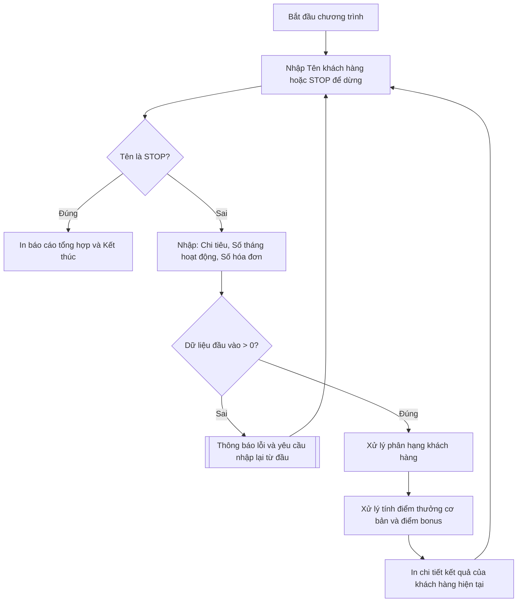

## <center>Phân Loại Khách Hàng và Tính Điểm Thưởng CRM</center>

### **1. Mục tiêu**
Sau khi hoàn thành bài tập thực hành này, sinh viên có khả năng:
* Vận dụng thành thạo các biểu thức toán học, biểu thức quan hệ và biểu thức logic để giải quyết các điều kiện nghiệp vụ trong thực tế.
* Áp dụng cấu trúc điều kiện `if-elif-else` lồng nhau để phân cấp/phân hạng dữ liệu dựa trên nhiều tiêu chí đồng thời.
* Sử dụng vòng lặp `while` kết hợp với các câu lệnh điều khiển `break`, `continue` nhằm thiết lập luồng chương trình nhập liệu liên tục và kiểm soát lỗi đầu vào (Data Validation) một cách hiệu quả mà không làm gián đoạn chương trình.

### **2. Vấn đề**
Bộ phận chăm sóc khách hàng (CRM) của một doanh nghiệp bán lẻ đang gặp khó khăn trong việc quản lý chương trình khách hàng thân thiết. Hiện tại, dữ liệu khách hàng được tổng hợp thủ công, dẫn đến việc phân hạng và cộng điểm thưởng cho khách hàng thường xuyên bị sai lệch. 

Doanh nghiệp cần một kịch bản chương trình Python chạy trên Terminal cho phép nhân viên vận hành nhập thông tin khách hàng, tự động kiểm tra tính hợp lệ của dữ liệu, phân loại khách hàng vào các nhóm thành viên tương ứng, sau đó tính toán điểm thưởng tích lũy dựa trên số lượng hóa đơn phát sinh trong tháng.


<p align="center">
  
</p>


Dưới đây là sơ đồ luồng dữ liệu của chương trình:



### **3. Yêu cầu bài toán**
Chương trình viết bằng ngôn ngữ Python (chương trình script chạy trực tiếp, chưa áp dụng khai báo hàm `def` hoặc lớp `class`) để xử lý tác vụ nhập và tính toán theo bảng đặc tả luồng xử lý dưới đây:

<table style="width: 100%; min-width: 100%; display: table; border-collapse: collapse;" width="100%" border="1">
  <thead>
    <tr>
      <th style="padding: 10px; text-align: left;">Các khối xử lý chính</th>
      <th style="padding: 10px; text-align: left;">Dữ liệu đầu vào (Input)</th>
      <th style="padding: 10px; text-align: left;">Dữ liệu đầu ra (Output)</th>
      <th style="padding: 10px; text-align: left;">Mô tả xử lý chính</th>
    </tr>
  </thead>
  <tbody>
    <tr>
      <td style="padding: 10px; vertical-align: top;"><b>Khối 1: Vòng lặp &amp; Nhập liệu</b></td>
      <td style="padding: 10px; vertical-align: top;">
        - Tên khách hàng (chuỗi)<br>
        - Tổng chi tiêu tích lũy (số thực)<br>
        - Số tháng hoạt động (số nguyên)<br>
        - Số hóa đơn tháng này (số nguyên)
      </td>
      <td style="padding: 10px; vertical-align: top;">Dữ liệu kiểu số đã được chuyển đổi thành công từ chuỗi nhập vào.</td>
      <td style="padding: 10px; vertical-align: top;">Sử dụng vòng lặp <code>while</code>. Nếu người dùng nhập tên là "STOP" (không phân biệt hoa thường), chương trình sẽ kết thúc và in ra tổng số khách hàng đã xử lý thành công trong phiên làm việc.</td>
    </tr>
    <tr>
      <td style="padding: 10px; vertical-align: top;"><b>Khối 2: Kiểm chuẩn dữ liệu (Validation)</b></td>
      <td style="padding: 10px; vertical-align: top;">Các thông số thô vừa nhập ở Khối 1.</td>
      <td style="padding: 10px; vertical-align: top;">Thông báo lỗi ứng với từng trường dữ liệu không hợp lệ.</td>
      <td style="padding: 10px; vertical-align: top;">Kiểm tra giá trị số. Nếu chi tiêu &lt; 0, hoặc số tháng hoạt động &lt; 0, hoặc số hóa đơn &lt; 0, thông báo lỗi cụ thể và quay lại lượt nhập mới (sử dụng <code>continue</code>).</td>
    </tr>
    <tr>
      <td style="padding: 10px; vertical-align: top;"><b>Khối 3: Phân loại hạng thành viên</b></td>
      <td style="padding: 10px; vertical-align: top;">
        - Chi tiêu tích lũy<br>
        - Số tháng hoạt động
      </td>
      <td style="padding: 10px; vertical-align: top;">Hạng khách hàng (Kim Cương, Vàng, Bạc, Đồng) dưới dạng chuỗi văn bản.</td>
      <td style="padding: 10px; vertical-align: top;">Sử dụng cấu trúc <code>if-elif-else</code> theo các quy tắc nghiêm ngặt quy định tại Mục 4.</td>
    </tr>
    <tr>
      <td style="padding: 10px; vertical-align: top;"><b>Khối 4: Tính điểm tích lũy</b></td>
      <td style="padding: 10px; vertical-align: top;">
        - Hạng khách hàng<br>
        - Số hóa đơn tháng này
      </td>
      <td style="padding: 10px; vertical-align: top;">Điểm thưởng cơ bản, điểm thưởng thêm (bonus) và tổng điểm thưởng.</td>
      <td style="padding: 10px; vertical-align: top;">
        - Tính điểm thưởng cơ bản dựa trên hạng thành viên và số hóa đơn.<br>
        - Cộng thêm điểm bonus nếu đạt chỉ tiêu về tần suất mua hàng.
      </td>
    </tr>
  </tbody>
</table>

Chi tiết các yêu cầu thực thi:

- **Yêu cầu 1**: Triển khai luồng nhập liệu liên tục và xác thực dữ liệu đầu vào.
  * Đầu vào (Input): Nhập từ bàn phím thông tin của một khách hàng có số liệu không hợp lệ.
    ```text
    Nhập tên khách hàng (hoặc 'STOP' để dừng): Tran Van B
    Nhập tổng chi tiêu tích lũy (VND): -500000
    Nhập số tháng hoạt động tích cực: 5
    Nhập số hóa đơn trong tháng này: 2
    ```
  * Đầu ra (Output): Chương trình thông báo lỗi cụ thể và bỏ qua lượt xử lý này để yêu cầu nhập lại khách hàng mới.
    ```text
    [WARNING] Dữ liệu không hợp lệ: Tổng chi tiêu phải lớn hơn hoặc bằng 0. Vui lòng nhập lại!
    Nhập tên khách hàng (hoặc 'STOP' để dừng): 
    ```

- **Yêu cầu 2**: Tính toán phân hạng và xuất hóa đơn điểm thưởng cho khách hàng có dữ liệu hợp lệ.
  * Đầu vào (Input): Nhập thông tin của khách hàng đáp ứng điều kiện xếp hạng Vàng.
    ```text
    Nhập tên khách hàng (hoặc 'STOP' để dừng): Le Thi C
    Nhập tổng chi tiêu tích lũy (VND): 35000000
    Nhập số tháng hoạt động tích cực: 8
    Nhập số hóa đơn trong tháng này: 6
    ```
  * Đầu ra (Output): In kết quả tính toán chi tiết định dạng rõ ràng trên màn hình điều khiển.
    ```text
    --- KẾT QUẢ XỬ LÝ CRM ---
    Khách hàng: Le Thi C
    Hạng thành viên: Vàng
    Điểm thưởng cơ bản: 300 điểm
    Điểm thưởng thêm (Bonus): 30 điểm
    Tổng điểm tích lũy tháng này: 330 điểm
    ---------------------------
    ```

- **Yêu cầu 3**: Dừng chương trình và in báo cáo tổng hợp.
  * Đầu vào (Input): Nhập từ khóa để kết thúc công việc.
    ```text
    Nhập tên khách hàng (hoặc 'STOP' để dừng): stop
    ```
  * Đầu ra (Output): In thông tin tổng hợp số lượng tài khoản khách hàng đã xử lý thành công trong suốt phiên làm việc.
    ```text
    [NOTE] Đã dừng nhận dữ liệu.
    Tổng số khách hàng đã thực hiện phân hạng thành công: 1
    Chương trình kết thúc.
    ```

### **4. Quy tắc xử lý**
Sinh viên cần lập trình tuân thủ chính xác các quy tắc nghiệp vụ sau:

* **Quy tắc phân hạng thành viên**:
  * **Kim Cương**: Tổng chi tiêu lớn hơn 50.000.000 VND **và** số tháng hoạt động tích cực từ 12 tháng trở lên.
  * **Vàng**: Tổng chi tiêu từ 20.000.000 VND đến 50.000.000 VND (bao gồm cả mốc 20 triệu và 50 triệu) **và** số tháng hoạt động tích cực từ 6 tháng trở lên.
  * **Bạc**: Tổng chi tiêu từ 5.000.000 VND đến dưới 20.000.000 VND **và** số tháng hoạt động tích cực từ 3 tháng trở lên.
  * **Đồng**: Các trường hợp còn lại không thỏa mãn các điều kiện trên.

* **Quy tắc tính toán điểm thưởng**:
  * Điểm thưởng cơ bản được tính bằng: `Số hóa đơn trong tháng này * Hệ số điểm hạng`.
    * Hệ số điểm hạng tương ứng:
      * Kim Cương: 100 điểm / hóa đơn.
      * Vàng: 50 điểm / hóa đơn.
      * Bạc: 20 điểm / hóa đơn.
      * Đồng: 10 điểm / hóa đơn.
  * Quy tắc điểm thưởng thêm (Bonus): Nếu số hóa đơn trong tháng này **lớn hơn 5**, khách hàng được tặng thêm 10% trên số điểm thưởng cơ bản của tháng đó.

* **Ràng buộc mã nguồn**:
  * [WARNING] Chỉ sử dụng các cấu trúc dữ liệu cơ bản, toán tử, biểu thức điều kiện (`if-elif-else`), và vòng lặp (`while`, `for`) được học trong Session 04. Không sử dụng hàm định nghĩa sẵn (`def`), lập trình hướng đối tượng (`class`), hay cấu trúc dữ liệu nâng cao như danh sách lồng nhau (nested list), từ điển (dictionary).
  * Sử dụng ép kiểu dữ liệu từ chuỗi nhập vào trực tiếp sang kiểu phù hợp (`float` cho chi tiêu, `int` cho số tháng và số hóa đơn).

### **5. Yêu cầu nộp bài**
Để hoàn thành bài tập, sinh viên cần:
- Đưa mã nguồn lên GitHub.
- Dán link của repository lên phần nộp bài trên hệ thống.