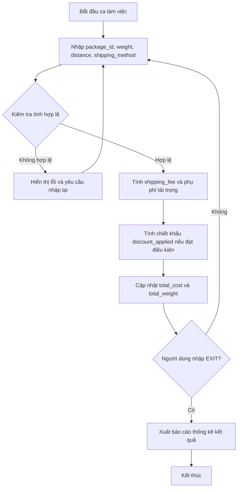

## <center>Tính Cước và Phân Loại Đơn Hàng Logistics</center>

### **1. Mục tiêu**
Sau khi hoàn thành bài thực hành này, sinh viên có khả năng vận dụng linh hoạt biểu thức số học, các cấu trúc điều kiện phân nhánh lồng nhau (`if-elif-else`) và cấu trúc vòng lặp điều khiển (`while`, `for`) trong Python để giải quyết một bài toán nghiệp vụ logistics thực tế. Bài tập giúp sinh viên hình thành kỹ năng kiểm chuẩn dữ liệu đầu vào (data validation), xử lý vòng lặp tích lũy dữ liệu và xuất báo cáo tổng hợp có định dạng chính xác.

### **2. Vấn đề**
Trong phân hệ quản lý logistics của một doanh nghiệp thương mại điện tử, việc tính toán chính xác chi phí vận chuyển chặng cuối đóng vai trò sống còn trong việc kiểm soát dòng tiền và tối ưu lợi nhuận. Quy trình hiện tại đang được thực hiện thủ công, dẫn đến việc tính sai phụ phí tải trọng cho các kiện hàng cồng kềnh hoặc bỏ sót các mức chiết khấu khi gom đơn hàng số lượng lớn (Bulk shipment).

Hệ thống cần một chương trình tự động chạy trên giao diện dòng lệnh (CLI), cho phép nhân viên điều phối nhập danh sách các đơn hàng phát sinh trong ca làm việc, sau đó tự động phân tích dịch vụ, áp dụng biểu phí động cùng phụ phí phạt quá tải và cuối cùng xuất ra một báo cáo tổng hợp chiết khấu lô hàng cuối ca.


<p align="center">
  
</p>




### **3. Yêu cầu bài toán**

Các thành phần xử lý của hệ thống được quy định chi tiết trong bảng dưới đây:

<table style="width: 100%; min-width: 100%; display: table; border-collapse: collapse;" width="100%">
  <thead>
    <tr style="background-color: #f2f2f2;">
      <th style="border: 1px solid #dddddd; padding: 8px; text-align: left;">Chức năng / Thành phần</th>
      <th style="border: 1px solid #dddddd; padding: 8px; text-align: left;">Tham số đầu vào</th>
      <th style="border: 1px solid #dddddd; padding: 8px; text-align: left;">Đầu ra (Kiểu dữ liệu)</th>
      <th style="border: 1px solid #dddddd; padding: 8px; text-align: left;">Mô tả xử lý</th>
    </tr>
  </thead>
  <tbody>
    <tr>
      <td style="border: 1px solid #dddddd; padding: 8px;">Nhập và kiểm chuẩn dữ liệu đơn hàng (Validation Loop)</td>
      <td style="border: 1px solid #dddddd; padding: 8px;">Mã đơn (id), khối lượng (weight), khoảng cách (distance), dịch vụ (method)</td>
      <td style="border: 1px solid #dddddd; padding: 8px;">Thông báo trạng thái (String)</td>
      <td style="border: 1px solid #dddddd; padding: 8px;">Nhận thông tin nhập từ bàn phím. Kiểm tra ràng buộc hợp lệ của các giá trị. Nếu sai, yêu cầu nhập lại ngay lập tức cho đơn hàng đó. Vòng lặp dừng khi mã đơn là "EXIT".</td>
    </tr>
    <tr>
      <td style="border: 1px solid #dddddd; padding: 8px;">Tính cước vận chuyển và phụ phí tải trọng</td>
      <td style="border: 1px solid #dddddd; padding: 8px;">weight (float), distance (float), method (str)</td>
      <td style="border: 1px solid #dddddd; padding: 8px;">base_fee (float), surcharge (float)</td>
      <td style="border: 1px solid #dddddd; padding: 8px;">Sử dụng biểu thức điều kiện để tính cước phí cơ bản theo khoảng cách và phụ phí nếu khối lượng vượt mức cho phép.</td>
    </tr>
    <tr>
      <td style="border: 1px solid #dddddd; padding: 8px;">Tổng hợp thống kê và chiết khấu lô hàng</td>
      <td style="border: 1px solid #dddddd; padding: 8px;">Danh sách dữ liệu các đơn hàng hợp lệ đã ghi nhận</td>
      <td style="border: 1px solid #dddddd; padding: 8px;">Báo cáo tổng hợp (String)</td>
      <td style="border: 1px solid #dddddd; padding: 8px;">Tổng hợp thông tin sau khi kết thúc ca làm việc, tính toán mức chiết khấu gom đơn, và in báo cáo định dạng chuẩn xác.</td>
    </tr>
  </tbody>
</table>

- Yêu cầu 1: Thiết lập vòng lặp nhập thông tin đơn hàng liên tục và kiểm chuẩn tính hợp lệ của từng tham số đầu vào.
  - Đầu vào (Input): Các giá trị nhập từ bàn phím cho từng thuộc tính của đơn hàng.
    ```text
    Nhập mã đơn hàng (hoặc 'EXIT' để dừng): ORD001
    Nhập khối lượng đơn hàng (kg): -5.0
    ```
  - Đầu ra (Output): Thông báo lỗi nếu dữ liệu không hợp lệ và yêu cầu nhập lại thuộc tính sai.
    ```text
    [CẢNH BÁO] Khối lượng không hợp lệ. Phải lớn hơn 0 và nhỏ hơn hoặc bằng 100 kg. Vui lòng nhập lại đơn này!
    ```

- Yêu cầu 2: Thực hiện tính toán chi tiết cước phí cơ bản và phụ phí tải trọng cho từng đơn hàng hợp lệ dựa theo công thức quy định.
  - Đầu vào (Input): Dữ liệu đơn hàng hợp lệ:
    ```text
    Mã đơn hàng: ORD002
    Khối lượng: 15.0 (kg)
    Khoảng cách giao hàng: 30.0 (km)
    Loại dịch vụ: Overnight
    ```
  - Đầu ra (Output): Tính toán và hiển thị thông số chi tiết của đơn hàng.
    ```text
    Đơn hàng: ORD002
    - Loại dịch vụ: Overnight
    - Cước phí cơ bản: 360000.00 đ
    - Phụ phí tải trọng: 125000.00 đ
    - Tổng cước tính riêng: 485000.00 đ
    ```

- Yêu cầu 3: Tổng hợp báo cáo logistics toàn bộ lô hàng khi người dùng nhập từ khóa "EXIT".
  - Đầu vào (Input): Danh sách các đơn hàng đã nhập hợp lệ trong ca làm việc, ví dụ gồm 3 đơn hàng:
    - Đơn 1: `ORD001` | Khối lượng: 12.5 kg | Khoảng cách: 45 km | Dịch vụ: Standard
    - Đơn 2: `ORD002` | Khối lượng: 15.0 kg | Khoảng cách: 30 km | Dịch vụ: Overnight
    - Đơn 3: `ORD003` | Khối lượng: 5.0 kg | Khoảng cách: 20 km | Dịch vụ: Express
  - Đầu ra (Output): Báo cáo tổng kết chi tiết lô hàng trên màn hình console.
    ```text
    === BÁO CÁO TỔNG HỢP LOGISTICS ===
    Tổng số đơn hàng thực hiện: 3
    - Đơn hàng Standard: 1
    - Đơn hàng Express: 1
    - Đơn hàng Overnight: 1
    Tổng khối lượng vận chuyển: 32.50 kg
    Tổng cước gốc tích lũy: 872500.00 đ
    Chiết khấu áp dụng (10%): 87250.00 đ
    Tổng thanh toán thực tế: 785250.00 đ
    =================================
    ```

### **4. Quy tắc xử lý**

[YÊU CẦU] Sinh viên áp dụng chính xác các quy tắc nghiệp vụ logistics sau đây vào cấu trúc rẽ nhánh và tính toán biểu thức:

*   **Tính cước cơ bản (Base Fee):**
    *   **Standard (Tiêu chuẩn):** 10 km đầu tiên tính giá 5,000 đ/km. Từ km thứ 11 trở đi, tính giá 4,000 đ/km cho quãng đường dư ra.
    *   **Express (Hỏa tốc):** Luôn tính đồng giá 8,000 đ/km cho toàn bộ khoảng cách.
    *   **Overnight (Qua đêm):** Luôn tính đồng giá 12,000 đ/km cho toàn bộ khoảng cách.
*   **Tính phụ phí tải trọng (Overweight Surcharge):**
    *   Ngưỡng chịu phụ phí bắt đầu khi khối lượng đơn hàng vượt quá 10 kg.
    *   Đối với dịch vụ **Standard** và **Express**: Mỗi kg vượt quá ngưỡng 10 kg chịu phụ phí 15,000 đ/kg.
    *   Đối với dịch vụ **Overnight**: Mỗi kg vượt quá ngưỡng 10 kg chịu phụ phí 25,000 đ/kg.
*   **Tính chiết khấu tổng lô hàng (Bulk Discount):**
    *   **Mức 1 (10%):** Áp dụng nếu tổng số lượng đơn hàng hợp lệ trong ca >= 3 đơn **và** tổng khối lượng của toàn bộ đơn hàng đó cộng lại lớn hơn 30 kg.
    *   **Mức 2 (15%):** Áp dụng nếu tổng khối lượng của toàn bộ đơn hàng trong ca lớn hơn 50 kg (không giới hạn số lượng đơn).
    *   [NOTE] Hai mức chiết khấu này không được áp dụng cộng dồn. Hệ thống ưu tiên chọn mức chiết khấu cao nhất có thể đạt được cho toàn lô hàng.
*   **Quy tắc kiểm chuẩn đầu vào (Validation):**
    *   Khối lượng (weight) phải là một số thực lớn hơn 0 và không vượt quá 100 kg.
    *   Khoảng cách vận chuyển (distance) phải là một số thực lớn hơn 0 và không vượt quá 500 km.
    *   Dịch vụ (method) chỉ chấp nhận một trong ba chuỗi phân biệt chính xác chữ hoa - chữ thường: `"Standard"`, `"Express"`, `"Overnight"`.
    *   Nếu bất kỳ dữ liệu nào của một đơn hàng bị sai quy định, hệ thống thông báo lỗi chi tiết và yêu cầu người dùng nhập lại toàn bộ thông tin của đơn hàng đó.

[WARNING] Bài tập yêu cầu chỉ sử dụng kiến thức đến hết Session 04 (Vòng lặp, rẽ nhánh, biểu thức và kiểu dữ liệu cơ bản như List/Tuple để lưu trữ danh sách đơn giản). Cấm sử dụng các thư viện như `pandas`, `numpy` hoặc lập trình cấu trúc Class nâng cao.

### **5. Yêu cầu nộp bài**
Để hoàn thành bài tập, sinh viên cần:
- Đưa mã nguồn lên GitHub.
- Dán link của repository lên phần nộp bài trên hệ thống.