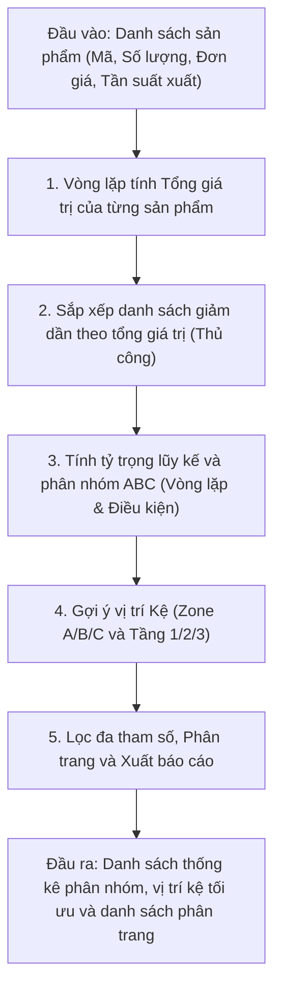

## <center>Phân Tích Phân Nhóm ABC và Tối Ưu Hóa Sắp Xếp Kho Hàng Warehouse</center>

### **1. Mục tiêu**
Sau khi hoàn thành bài thực hành này, sinh viên có khả năng:
- Vận dụng linh hoạt cấu trúc điều kiện `if-elif-else` và các vòng lặp `for`, `while` để giải quyết các bài toán duyệt và biến đổi dữ liệu phức tạp.
- Sử dụng các toán tử logic, so sánh, và toán tử số học nâng cao để giải quyết các công thức tài chính và logistics trong kho hàng.
- Thực hiện các thuật toán tìm kiếm, lọc đa tham số, sắp xếp thủ công (không dùng thư viện ngoài) kết hợp phân trang dữ liệu trên các cấu trúc dữ liệu nguyên bản như List và Dictionary.
- Nâng cao tư duy xây dựng thuật toán tối ưu hóa tài nguyên và logic tổ chức kho bãi thực tế (Warehouse Management System).

### **2. Vấn đề**
Trong quản lý kho hàng (Warehouse Management), một trong những thách thức lớn nhất là tối ưu hóa không gian lưu trữ và giảm thiểu thời gian xuất/nhập hàng. Nếu hàng hóa có giá trị cao hoặc tần suất luân chuyển lớn bị xếp ở vị trí sâu trong kho, doanh nghiệp sẽ tốn rất nhiều chi phí vận hành. Ngược lại, hàng hóa ít khi sử dụng nếu đặt ở lối ra vào sẽ gây tắc nghẽn.

Để giải quyết vấn đề này, các doanh nghiệp thường áp dụng phương pháp Phân tích ABC (ABC Analysis) dựa trên nguyên lý Pareto. Hàng hóa được chia làm 3 nhóm:
- **Nhóm A**: Chiếm khoảng 70-80% tổng giá trị sử dụng hàng tồn kho nhưng chỉ chiếm khoảng 10-20% số lượng mặt hàng. Cần đặt ở nơi dễ tiếp cận nhất và kiểm soát nghiêm ngặt.
- **Nhóm B**: Chiếm khoảng 15-20% giá trị và 30% số lượng.
- **Nhóm C**: Chiếm khoảng 5-10% giá trị nhưng chiếm tới 50% số lượng. Có thể đặt ở xa hoặc trên cao.

Bạn được giao nhiệm vụ viết một mô-đun Python cốt lõi để phân tích toàn bộ danh sách sản phẩm trong kho, tự động phân nhóm ABC, gợi ý vị trí kệ phù hợp và cung cấp công cụ lọc tìm kiếm nâng cao phục vụ cho nhân viên thủ kho.


<p align="center">
  
</p>




### **3. Yêu cầu bài toán**

Sinh viên cần triển khai hệ thống thông qua các hàm xử lý dữ liệu cơ bản sau đây:

<table style="width: 100%; min-width: 100%; display: table; border-collapse: collapse;" width="100%">
  <thead>
    <tr style="background-color: #f2f2f2;">
      <th style="border: 1px solid #dddddd; text-align: left; padding: 8px;">Tên hàm</th>
      <th style="border: 1px solid #dddddd; text-align: left; padding: 8px;">Tham số đầu vào</th>
      <th style="border: 1px solid #dddddd; text-align: left; padding: 8px;">Đầu ra (Output)</th>
      <th style="border: 1px solid #dddddd; text-align: left; padding: 8px;">Mô tả xử lý</th>
    </tr>
  </thead>
  <tbody>
    <tr>
      <td style="border: 1px solid #dddddd; padding: 8px;"><code>classify_inventory_abc</code></td>
      <td style="border: 1px solid #dddddd; padding: 8px;"><code>products: list</code> (danh sách dictionary sản phẩm)</td>
      <td style="border: 1px solid #dddddd; padding: 8px;"><code>list</code> (mỗi sản phẩm được gán thêm key <code>total_value</code>, <code>percentage</code>, <code>cumulative_percentage</code>, <code>abc_group</code>)</td>
      <td style="border: 1px solid #dddddd; padding: 8px;">Tính tổng giá trị từng sản phẩm, sắp xếp giảm dần, tính tỷ trọng lũy kế để gắn nhãn phân hạng A, B, C theo quy tắc Pareto.</td>
    </tr>
    <tr>
      <td style="border: 1px solid #dddddd; padding: 8px;"><code>optimize_storage_allocation</code></td>
      <td style="border: 1px solid #dddddd; padding: 8px;"><code>classified_products: list</code></td>
      <td style="border: 1px solid #dddddd; padding: 8px;"><code>list</code> (mỗi sản phẩm được gán thêm key <code>zone</code> và <code>shelf_level</code>)</td>
      <td style="border: 1px solid #dddddd; padding: 8px;">Đề xuất vị trí kệ tối ưu (Zone A/B/C và Level 1/2/3) dựa trên phân nhóm ABC và tần suất xuất nhập hàng trong tháng.</td>
    </tr>
    <tr>
      <td style="border: 1px solid #dddddd; padding: 8px;"><code>search_and_filter_inventory</code></td>
      <td style="border: 1px solid #dddddd; padding: 8px;">
        <code>products: list</code>, 
        <code>abc_group: str</code> (tùy chọn), 
        <code>min_stock: int</code> (tùy chọn), 
        <code>zone: str</code> (tùy chọn), 
        <code>sort_by: str</code> (tùy chọn), 
        <code>page: int</code>, 
        <code>page_size: int</code>
      </td>
      <td style="border: 1px solid #dddddd; padding: 8px;"><code>dict</code> (chứa danh sách sản phẩm trang hiện tại, tổng số trang, tổng số bản ghi thỏa điều kiện lọc)</td>
      <td style="border: 1px solid #dddddd; padding: 8px;">Lọc sản phẩm theo nhiều tiêu chí đồng thời, sắp xếp kết quả và thực hiện cơ chế phân trang thủ công bằng vòng lặp.</td>
    </tr>
  </tbody>
</table>

#### **Yêu cầu 1: Phân hạng tồn kho ABC**
Thực hiện tính toán tổng giá trị tồn kho của mỗi sản phẩm (`quantity * unit_price`). Sắp xếp danh sách sản phẩm giảm dần theo tổng giá trị đó bằng một thuật toán sắp xếp thủ công (không dùng hàm `sorted()` hoặc phương thức `list.sort()`). Sau đó, tính phần trăm tỷ trọng giá trị của từng sản phẩm so với tổng giá trị của toàn kho và tính phần trăm lũy kế để phân nhóm.
- Đầu vào (Input):
  ```python
  products = [
      {"id": "P001", "name": "Laptop Dell", "quantity": 10, "unit_price": 1200, "frequency": 45},
      {"id": "P002", "name": "Chuot Logitech", "quantity": 150, "unit_price": 20, "frequency": 120},
      {"id": "P003", "name": "Man hinh Asus", "quantity": 25, "unit_price": 300, "frequency": 30},
      {"id": "P004", "name": "Cap HDMI", "quantity": 300, "unit_price": 5, "frequency": 80},
      {"id": "P005", "name": "Ban phim Co", "quantity": 40, "unit_price": 80, "frequency": 60}
  ]
  ```
- Đầu ra (Output):
  ```python
  [
      {
          "id": "P001", "name": "Laptop Dell", "quantity": 10, "unit_price": 1200, "frequency": 45,
          "total_value": 12000, "percentage": 49.38, "cumulative_percentage": 49.38, "abc_group": "A"
      },
      {
          "id": "P003", "name": "Man hinh Asus", "quantity": 25, "unit_price": 300, "frequency": 30,
          "total_value": 7500, "percentage": 30.86, "cumulative_percentage": 80.24, "abc_group": "B"
      },
      {
          "id": "P005", "name": "Ban phim Co", "quantity": 40, "unit_price": 80, "frequency": 60,
          "total_value": 3200, "percentage": 13.17, "cumulative_percentage": 93.41, "abc_group": "B"
      },
      {
          "id": "P002", "name": "Chuot Logitech", "quantity": 150, "unit_price": 20, "frequency": 120,
          "total_value": 3000, "percentage": 12.35, "cumulative_percentage": 105.76, # Lưu ý: Tùy tỷ trọng tổng đạt 100%
          "abc_group": "C"
      },
      # ... tương tự cho các phần tử tiếp theo dựa trên quy tắc phân nhóm lũy kế.
  ]
  ```

#### **Yêu cầu 2: Đề xuất vị trí kệ hàng tối ưu**
Dựa vào phân nhóm ABC và tần suất xuất nhập hàng (`frequency`: số lần xuất kho/tháng), xác định vùng lưu trữ (`zone`) và tầng kệ (`shelf_level`).
- Đầu vào (Input): Danh sách sản phẩm đã được phân nhóm ABC ở Yêu cầu 1.
- Đầu ra (Output): Danh sách sản phẩm được cập nhật thêm thông tin vị trí lưu trữ mới.

#### **Yêu cầu 3: Tìm kiếm, lọc và phân trang dữ liệu**
Thực hiện chức năng tìm kiếm kết hợp lọc đa tham số. Sinh viên cần lọc các sản phẩm thỏa mãn điều kiện lọc đầu vào, thực hiện sắp xếp danh sách kết quả theo yêu cầu và trả về phân trang dữ liệu chính xác.
- Đầu vào (Input):
  ```python
  # Giả định lọc các sản phẩm thuộc nhóm "B", có số lượng tồn kho tối thiểu là 30, phân trang trang số 1, mỗi trang 1 sản phẩm, sắp xếp giảm dần theo total_value.
  search_and_filter_inventory(
      products=classified_products_input,
      abc_group="B",
      min_stock=30,
      zone="Zone B",
      sort_by="total_value",
      page=1,
      page_size=1
  )
  ```
- Đầu ra (Output):
  ```json
  {
      "page": 1,
      "page_size": 1,
      "total_items": 2,
      "total_pages": 2,
      "data": [
          {
              "id": "P003",
              "name": "Man hinh Asus",
              "quantity": 25, # Lưu ý: Số lượng này phải thỏa mãn bộ lọc min_stock được tùy chỉnh trong bài
              "unit_price": 300,
              "frequency": 30,
              "total_value": 7500,
              "percentage": 30.86,
              "cumulative_percentage": 80.24,
              "abc_group": "B",
              "zone": "Zone B",
              "shelf_level": "Level 2"
          }
      ]
  }
  ```

---

### **4. Quy tắc xử lý**

[YÊU CẦU 1] **Quy tắc phân nhóm ABC theo Tỷ Trọng Lũy Kế**:
- Tổng giá trị của kho hàng là tổng số tiền của tất cả các mặt hàng (`total_value = quantity * unit_price` của từng mặt hàng).
- Tỷ trọng giá trị của một sản phẩm: `percentage = (total_value / tong_gia_tri_kho) * 100` (làm tròn 2 chữ số thập phân).
- Sắp xếp danh sách sản phẩm giảm dần theo `total_value`.
- Tính tỷ trọng lũy kế (`cumulative_percentage`) của từng sản phẩm bằng cách cộng dồn `percentage` của sản phẩm đó và tất cả các sản phẩm đứng trước nó trong danh sách đã xếp hạng.
- Phân nhóm ABC dựa trên giá trị lũy kế:
  - Nếu `cumulative_percentage` <= 80%: Gán nhóm **A**.
  - Nếu 80% < `cumulative_percentage` <= 95%: Gán nhóm **B**.
  - Nếu `cumulative_percentage` > 95%: Gán nhóm **C**.

[YÊU CẦU 2] **Quy tắc gợi ý vị trí lưu trữ tối ưu**:
- Vị trí khu vực lưu kho (`zone`):
  - Nhóm **A** lưu tại `Zone A` (Khu vực gần cửa xuất hàng nhất).
  - Nhóm **B** lưu tại `Zone B` (Khu vực trung tâm).
  - Nhóm **C** lưu tại `Zone C` (Khu vực phía trong/sâu hơn).
- Vị trí tầng kệ (`shelf_level`):
  - Kệ tầng thấp (`Level 1` - Dễ lấy nhất): Tần suất xuất kho `frequency` >= 80 lần/tháng.
  - Kệ tầng trung (`Level 2` - Độ cao vừa phải): Tần suất xuất kho 30 <= `frequency` < 80 lần/tháng.
  - Kệ tầng cao (`Level 3` - Cần dùng xe nâng nâng hạ): Tần suất xuất kho `frequency` < 30 lần/tháng.

[YÊU CẦU 3] **Thuật toán sắp xếp và Phân trang thủ công**:
- CẤM sử dụng các hàm sắp xếp viết sẵn của Python như `sorted()`, `list.sort()`. Sinh viên phải tự viết giải thuật sắp xếp (như Bubble Sort, Selection Sort hoặc Insertion Sort) bằng cách sử dụng các vòng lặp lòng nhau (`nested loops`) để sắp xếp dữ liệu theo trường `sort_by` (giá trị hỗ trợ: `"total_value"` hoặc `"quantity"`).
- Việc lọc và phân trang phải thực hiện thủ công bằng các cấu trúc lặp và lát cắt (slice) của danh sách. Công thức tính tổng số trang: `total_pages = (total_filtered_items + page_size - 1) // page_size` (không sử dụng thư viện `math`).
- Dữ liệu đầu vào của các bộ lọc có thể rỗng. Nếu một điều kiện lọc không được truyền vào (nhận giá trị mặc định là `None`), coi như không lọc theo điều kiện đó.

---

### **5. Yêu cầu nộp bài**
Để hoàn thành bài tập, sinh viên cần:
- Đưa mã nguồn lên GitHub.
- Dán link của repository lên phần nộp bài trên hệ thống.