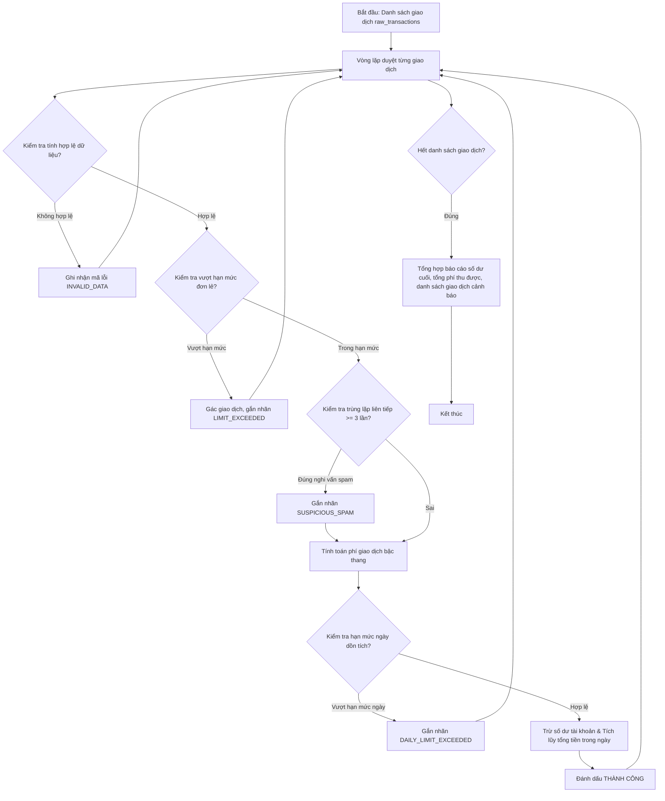

## <center>Thiết Kế Hệ Thống Tính Phí Giao Dịch và Quét Giao Dịch Bất Thường Fintech</center>

### **1. Mục tiêu**
Sau khi hoàn thành bài thực hành này, sinh viên sẽ:
*   Vận dụng thành thạo các cấu trúc điều khiển rẽ nhánh phức tạp (`if-elif-else` lồng nhau) để giải quyết các bài toán biểu phí tài chính đa cấp.
*   Làm chủ cấu trúc vòng lặp (`for`, `while`) kết hợp các biến cờ hiệu (flag), biến tích lũy để kiểm tra toàn vẹn và duyệt chuỗi dữ liệu giao dịch theo thời gian.
*   Biết cách tổ chức và module hóa chương trình thành các hàm chuyên biệt, kiểm soát logic đầu vào và xây dựng thuật toán xử lý dữ liệu tối ưu trong phân hệ Fintech.
*   Rèn luyện tư duy lập trình phòng ngừa lỗi (defensive programming) để lọc bỏ dữ liệu nhiễu và xử lý các ràng buộc nghiệp vụ thực tế của hệ thống ngân hàng số.

### **2. Vấn đề**
Trong các hệ thống lõi ngân hàng (Core Banking) và ví điện tử, việc xử lý hàng triệu giao dịch mỗi giây đòi hỏi một công cụ kiểm soát cực kỳ chính xác và nhanh chóng. Một trong những bài toán phức tạp nhất là tính phí giao dịch biến động theo bậc thang dựa trên phân hạng tài khoản, đồng thời phải nhận diện tích thời các giao dịch nghi vấn gian lận (ví dụ: giao dịch vượt hạn mức ngày, giao dịch spam trùng lặp liên tiếp, hoặc giao dịch có số tiền bất thường).

Nếu hệ thống tính toán sai lệch dù chỉ 1 đồng, hoặc không ngăn chặn kịp thời một giao dịch bất thường vượt hạn mức, doanh nghiệp Fintech có thể đối mặt với rủi ro pháp lý nghiêm trọng và tổn thất tài chính lớn. Do đó, việc xây dựng một luồng xử lý tuần tự kết hợp tính phí thông minh và phát hiện dấu hiệu bất thường (anomaly detection) ngay tại tầng xử lý giao dịch là vô cùng cấp thiết.


<p align="center">
  
</p>




### **3. Yêu cầu bài toán**

Để giải quyết bài toán trên, sinh viên cần viết một chương trình Python hoàn chỉnh, sử dụng cấu trúc dữ liệu cơ bản (List, Dictionary) kết hợp với các cấu trúc rẽ nhánh và vòng lặp để xử lý một lô giao dịch (batch transactions).

Sinh viên cần thiết kế mã nguồn tuân thủ cấu trúc các hàm xử lý sau đây:

<table style="width: 100%; min-width: 100%; display: table; border-collapse: collapse;" width="100%" border="1">
  <thead>
    <tr style="background-color: #f2f2f2;">
      <th style="padding: 8px; text-align: left;">Tên hàm</th>
      <th style="padding: 8px; text-align: left;">Tham số đầu vào</th>
      <th style="padding: 8px; text-align: left;">Đầu ra (Return)</th>
      <th style="padding: 8px; text-align: left;">Mô tả xử lý</th>
    </tr>
  </thead>
  <tbody>
    <tr>
      <td style="padding: 8px; font-weight: bold;">validate_transaction_format</td>
      <td style="padding: 8px;">transaction (dict)</td>
      <td style="padding: 8px;">bool</td>
      <td style="padding: 8px;">Kiểm tra cấu trúc dict giao dịch xem có đủ trường: 'transaction_id', 'amount', 'type' (chuyển/rút), và giá trị 'amount' phải là số thực lớn hơn 0.</td>
    </tr>
    <tr>
      <td style="padding: 8px; font-weight: bold;">calculate_transaction_fee</td>
      <td style="padding: 8px;">amount (float), account_type (str)</td>
      <td style="padding: 8px;">float</td>
      <td style="padding: 8px;">Tính phí giao dịch dựa trên số tiền và loại tài khoản theo quy tắc biểu phí bậc thang (Xem chi tiết tại mục 4).</td>
    </tr>
    <tr>
      <td style="padding: 8px; font-weight: bold;">detect_spam_pattern</td>
      <td style="padding: 8px;">current_tx (dict), previous_txs (list)</td>
      <td style="padding: 8px;">bool</td>
      <td style="padding: 8px;">Kiểm tra xem giao dịch hiện tại có trùng số tiền 'amount' và loại 'type' liên tiếp với ít nhất 2 giao dịch ngay trước đó trong danh sách hay không.</td>
    </tr>
    <tr>
      <td style="padding: 8px; font-weight: bold;">process_financial_batch</td>
      <td style="padding: 8px;">transactions (list), account_info (dict)</td>
      <td style="padding: 8px;">dict</td>
      <td style="padding: 8px;">Hàm điều phối chính: Duyệt qua tất cả giao dịch, áp dụng các hàm kiểm tra, tính phí, cập nhật số dư tài khoản, tích lũy hạn mức ngày và phân loại trạng thái giao dịch.</td>
    </tr>
    <tr>
      <td style="padding: 8px; font-weight: bold;">filter_transactions_by_status</td>
      <td style="padding: 8px;">processed_txs (list), target_status (str)</td>
      <td style="padding: 8px;">list</td>
      <td style="padding: 8px;">Lọc danh sách các giao dịch sau xử lý theo một trạng thái cụ thể để phục vụ công tác thanh tra.</td>
    </tr>
  </tbody>
</table>

#### **Chi tiết đầu vào và đầu ra cho các yêu cầu cụ thể:**

- **Yêu cầu 1: Thực thi tính phí giao dịch bậc thang**
  Hàm `calculate_transaction_fee` thực hiện tính toán phí dựa trên số tiền và loại tài khoản của khách hàng.
  *   Đầu vào (Input):
      ```python
      amount = 25000000.0  # float
      account_type = "Personal"  # str
      ```
  *   Đầu ra (Output):
      ```python
      200000.0  # float (Áp dụng mức phí 0.8% cho tài khoản Personal từ 10M đến dưới 50M)
      ```

- **Yêu cầu 2: Xử lý lô giao dịch tài chính và phát hiện bất thường**
  Hàm `process_financial_batch` nhận một danh sách giao dịch và thông tin tài khoản hiện tại, trả về kết quả số dư mới của tài khoản và báo cáo chi tiết trạng thái từng giao dịch.
  *   Đầu vào (Input):
      ```python
      account_info = {
          "account_id": "ACC-9988",
          "account_type": "Personal",
          "balance": 100000000.0,
          "daily_limit": 50000000.0
      }
      transactions = [
          {"transaction_id": "TX001", "amount": 15000000.0, "type": "transfer"},
          {"transaction_id": "TX002", "amount": 15000000.0, "type": "transfer"},
          {"transaction_id": "TX003", "amount": 15000000.0, "type": "transfer"},
          {"transaction_id": "TX004", "amount": 30000000.0, "type": "withdraw"},
          {"transaction_id": "TX005", "amount": -500000.0, "type": "transfer"}
      ]
      ```
  *   Đầu ra (Output):
      ```json
      {
          "account_id": "ACC-9988",
          "final_balance": 54680000.0,
          "total_fees_collected": 320000.0,
          "processed_transactions": [
              {
                  "transaction_id": "TX001",
                  "amount": 15000000.0,
                  "fee": 120000.0,
                  "status": "SUCCESS",
                  "reason": "Giao dich thanh cong"
              },
              {
                  "transaction_id": "TX002",
                  "amount": 15000000.0,
                  "fee": 120000.0,
                  "status": "SUCCESS",
                  "reason": "Giao dich thanh cong"
              },
              {
                  "transaction_id": "TX003",
                  "amount": 15000000.0,
                  "fee": 80000.0, 
                  "status": "SUSPICIOUS_SPAM",
                  "reason": "Giao dich trung lap lien tiep 3 lan tro len"
              },
              {
                  "transaction_id": "TX004",
                  "amount": 30000000.0,
                  "fee": 0.0,
                  "status": "DAILY_LIMIT_EXCEEDED",
                  "reason": "Vuot han muc giao dich trong ngay cua tai khoan"
              },
              {
                  "transaction_id": "TX005",
                  "amount": -500000.0,
                  "fee": 0.0,
                  "status": "INVALID_DATA",
                  "reason": "So tien giao dich khong hop le"
              }
          ]
      }
      ```

- **Yêu cầu 3: Lọc giao dịch theo trạng thái phục vụ kiểm toán**
  Hàm `filter_transactions_by_status` thực hiện lọc các giao dịch sau khi đã chạy qua lô xử lý để trích xuất danh sách phục vụ việc điều tra nghi vấn hoặc phân tích lỗi.
  *   Đầu vào (Input):
      Giả sử `processed_txs` chính là kết quả của mảng `processed_transactions` ở Output của Yêu cầu 2. Tham số lọc:
      ```python
      target_status = "SUSPICIOUS_SPAM"
      ```
  *   Đầu ra (Output):
      ```json
      [
          {
              "transaction_id": "TX003",
              "amount": 15000000.0,
              "fee": 80000.0,
              "status": "SUSPICIOUS_SPAM",
              "reason": "Giao dich trung lap lien tiep 3 lan tro len"
          }
      ]
      ```

### **4. Quy tắc xử lý**

Sinh viên bắt buộc phải cấu hình và kiểm soát các logic nghiệp vụ sau trong mã nguồn:

#### **4.1. Quy tắc Tính Phí Giao Dịch Bậc Thang (Tiered Fee Policy)**
Phí giao dịch được áp dụng dựa trên loại tài khoản (`account_type`) và số tiền giao dịch (`amount`):

*   **Tài khoản Cá nhân (Personal):**
    *   Khoản giao dịch dưới 10,000,000 VND: Phí **1.0%** giá trị giao dịch (mức phí tối thiểu phải thu là 10,000 VND).
    *   Khoản giao dịch từ 10,000,000 VND đến dưới 50,000,000 VND: Phí **0.8%** giá trị giao dịch.
    *   Khoản giao dịch từ 50,000,000 VND trở lên: Phí **0.5%** giá trị giao dịch (mức phí tối đa bị giới hạn ở mức 500,000 VND).

*   **Tài khoản Doanh nghiệp (Business):**
    *   Khoản giao dịch dưới 100,000,000 VND: Phí **0.3%** giá trị giao dịch (mức phí tối thiểu phải thu là 50,000 VND).
    *   Khoản giao dịch từ 100,000,000 VND trở lên: Phí **0.2%** giá trị giao dịch (mức phí tối đa bị giới hạn ở mức 1,000,000 VND).

*   **Tài khoản Cao cấp (Premium):**
    *   Áp dụng một mức phí duy nhất là **0.1%** giá trị giao dịch cho mọi mức tiền (không áp dụng mức phí tối thiểu hay tối đa).

[NOTE] Mức phí tối thiểu có nghĩa là nếu số tiền phí tính theo tỷ lệ phần trăm nhỏ hơn phí tối thiểu, hệ thống sẽ tự động thu bằng mức phí tối thiểu. Tương tự, nếu số phí tính theo phần trăm lớn hơn phí tối đa thì hệ thống chỉ thu ở mức phí tối đa.

#### **4.2. Quy tắc Giới Hạn Giao Dịch Đơn Lẻ (Single Transaction Limit)**
Mỗi loại tài khoản có một giới hạn số tiền tối đa cho một giao dịch riêng lẻ:
*   Tài khoản **Personal**: Không được vượt quá **100,000,000 VND** / giao dịch.
*   Tài khoản **Business**: Không được vượt quá **2,000,000,000 VND** / giao dịch.
*   Tài khoản **Premium**: Không giới hạn số tiền giao dịch đơn lẻ.
*   [YÊU CẦU] Nếu vượt quá giới hạn đơn lẻ này, giao dịch lập tức bị đánh dấu trạng thái `"LIMIT_EXCEEDED"` và không được thực thi trừ tiền vào tài khoản.

#### **4.3. Quy tắc Cộng Dồn Hạn Mức Toàn Ngày (Accumulated Daily Limit)**
*   Mỗi tài khoản được cấu hình một hạn mức chi tiêu tối đa trong ngày (`daily_limit` nằm trong `account_info`).
*   Hệ thống cần khai báo một biến tích lũy tổng số tiền của những giao dịch đã thực hiện **thành công** hoặc **nghi vấn spam** (các giao dịch lỗi hoặc vượt hạn mức từ đầu sẽ không được tính cộng dồn vào hạn mức ngày).
*   Trước khi thực hiện một giao dịch mới, hệ thống phải cộng thử số tiền của giao dịch đó vào biến tích lũy ngày. Nếu tổng này vượt quá `daily_limit` của tài khoản, giao dịch hiện tại sẽ bị từ chối với trạng thái `"DAILY_LIMIT_EXCEEDED"`.

#### **4.4. Quy tắc Phát Hiện Spam Trùng Lặp (Spam Detection)**
*   Hệ thống cần kiểm tra thời gian thực để ngăn chặn các giao dịch lỗi gửi liên tiếp từ phía client.
*   Nếu giao dịch hiện tại có cùng số tiền (`amount`) và cùng loại giao dịch (`type`) với ít nhất **2 giao dịch trước đó** xảy ra liên tục (tức là tạo thành chuỗi 3 giao dịch giống hệt nhau liên tiếp), giao dịch thứ 3 này vẫn sẽ được xử lý nhưng phải bị gắn trạng thái cảnh báo nghi vấn là `"SUSPICIOUS_SPAM"`. Giao dịch này vẫn bị trừ tiền và tính phí bình thường nhưng sẽ bị ghi vào danh sách giám sát.

#### **4.5. Định dạng dữ liệu đầu vào không hợp lệ**
*   Nếu giao dịch thiếu bất kỳ trường thông tin bắt buộc nào hoặc có giá trị `amount` nhỏ hơn hoặc bằng 0, hoặc kiểu dữ liệu của `amount` không phải là `int` hay `float`, giao dịch đó phải được đánh dấu trạng thái `"INVALID_DATA"`.

### **5. Yêu cầu nộp bài**

Để hoàn thành bài tập, sinh viên cần:
*   Đưa mã nguồn lên GitHub.
*   Dán link của repository lên phần nộp bài trên hệ thống.