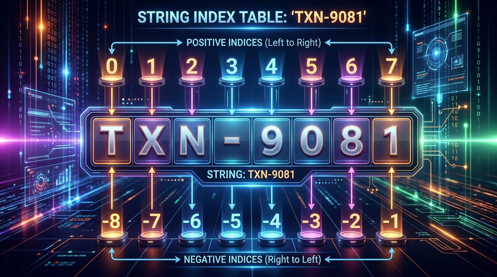

```markmap
# Session 05 - Lesson 01: Giới thiệu String, Indexing và Immutability

## Chuỗi ký tự (String)
- Bản chất
  - Là tập hợp chuỗi các ký tự (sequence of characters) đại diện cho dữ liệu văn bản.
- Khai báo theo chuẩn PEP 8
  - Sử dụng cặp dấu nháy kép hoặc nháy đơn bao quanh dữ liệu chuỗi.
  - Phổ biến: Dùng nháy kép cho các chuỗi thông thường.
  - Mã nguồn minh họa:
    ```python
    transaction_code = "TXN-9081"
    ```

## Chỉ mục hai chiều (Two-way Indexing)
- Cơ chế hoạt động
  - Chỉ mục dương (Positive indexing): Chạy từ trái sang phải, bắt đầu từ 0 đến len(str) - 1.
  - Chỉ mục âm (Negative indexing): Chạy từ phải sang trái, bắt đầu từ -1 đến -len(str).
- Sơ đồ logic chỉ mục
  - 
- Truy xuất phần tử
  - Cú pháp: string_variable[index]
  - Mã nguồn ví dụ:
    ```python
    first_char = transaction_code[0]  # Kết quả: "T"
    last_char = transaction_code[-1]  # Kết quả: "1"
    ```

## Tính bất biến (Immutability)
- Định nghĩa
  - Đối tượng chuỗi sau khi được tạo ra trong bộ nhớ RAM không thể bị sửa đổi giá trị hiển thị tại chỗ (in-place).
- Cơ chế quản lý bộ nhớ
  - Gán lại biến hoặc biến đổi chuỗi là tạo ra một đối tượng mới hoàn toàn ở một địa chỉ ID bộ nhớ RAM khác.
  - 

## Lỗi TypeError do sửa chuỗi
- Nguyên nhân
  - Lập trình viên cố tình thực hiện hành động ghi đè hoặc thay đổi trực tiếp phần tử của chuỗi qua chỉ mục.
  - Mã lỗi trực tiếp gây sập luồng:
    ```python
    # Gây lỗi: TypeError: 'str' object does not support item assignment
    transaction_code[0] = "A"
    ```
- Cơ chế kiểm soát an toàn bằng try-except
  - Mã nguồn phòng ngừa:
    ```python
    try:
        transaction_code[0] = "A"
    except TypeError as e:
        print(f"Error caught: {e}")
    ```

## Lỗi IndexError (Index out of range)
- Nguyên nhân
  - Truy cập đến chỉ mục không nằm trong biên giới hạn từ -len(string) đến len(string) - 1.
- Cơ chế kiểm soát bằng độ dài (len)
  - Mã nguồn kiểm tra biên trước khi truy cập:
    ```python
    target_index = 10
    length = len(transaction_code)
    if -length <= target_index < length:
        safe_char = transaction_code[target_index]
        print(f"Safe character: {safe_char}")
    else:
        print("Warning: Target index out of bounds")
    ```

## Tạo chuỗi mới tuân thủ PEP 8
- Phương pháp biến đổi
  - Duyệt qua từng ký tự chuỗi cũ bằng vòng lặp kết hợp điều kiện sàng lọc để tích lũy tạo lập chuỗi đích mới hoàn toàn.
- Mã nguồn chuẩn mực
  - Tái xây dựng chuỗi thay thế ký tự gạch ngang thành gạch dưới:
    ```python
    modified_code = ""
    for char in transaction_code:
        if char == "-":
            modified_code += "_"
        else:
            modified_code += char
    print(f"Original ID: {id(transaction_code)}")
    print(f"New ID: {id(modified_code)}")
    ```
```
```
```