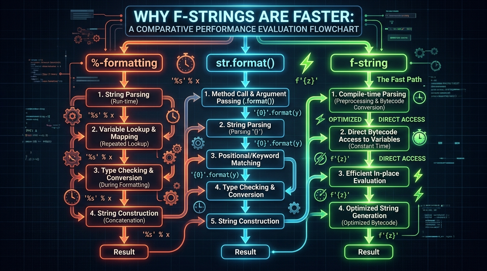

```markmap
# Session 05: Lesson 04 - String formatting
## %-formatting
- Cơ chế hoạt động
  - Thay thế dữ liệu dựa trên toán tử % và các đặc tả định dạng (Format specifiers) thích hợp với từng kiểu dữ liệu
- Cú pháp và Mã nguồn mẫu
  - ```python
    product_name = "Mini Laptop"
    unit_price = 899.957
    quantity = 5
    # Sử dụng bộ tuple chứa giá trị truyền vào tương ứng
    formatted_old = "Product: %s | Price: %.2f | Qty: %d" % (product_name, unit_price, quantity)
    ```
- Đặc tả định dạng phổ biến
  - `%s`: Định dạng dữ liệu kiểu chuỗi (String)
  - `%d`: Định dạng dữ liệu kiểu số nguyên (Integer)
  - `%f`: Định dạng dữ liệu kiểu số thực (Float)
- Lỗi thường gặp (Gotchas)
  - TypeError: Xảy ra khi truyền sai kiểu dữ liệu (ví dụ truyền chuỗi vào `%d`) hoặc quên bọc các biến vào cặp ngoặc tuple khi có từ 2 biến trở lên

## str.format()
- Cơ chế hoạt động
  - Sử dụng phương thức hệ thống của lớp chuỗi cùng cặp dấu ngoặc nhọn `{}` làm nơi giữ chỗ (Placeholders)
  - Hỗ trợ truyền tham số theo vị trí (Positional) hoặc chỉ định từ khóa (Keyword)
- Cú pháp và Mã nguồn mẫu
  - ```python
    # Sử dụng placeholder tự động hoặc chỉ định vị trí/khóa
    formatted_mid = "Product: {} | Total: {:.2f}".format(product_name, unit_price * quantity)
    formatted_named = "Product: {name} | Total: {total:.2f}".format(name=product_name, total=999.9)
    ```
- Lỗi thường gặp (Gotchas)
  - IndexError: Xảy ra khi chỉ định index trong cặp ngoặc nhọn lớn hơn số lượng đối số truyền vào hàm `.format()`
  - KeyError: Xảy ra khi sử dụng định dạng khóa `{key}` nhưng không khai báo giá trị cho khóa đó trong đối số truyền vào

## f-string
- Cơ chế hoạt động
  - Cơ chế nội suy chuỗi trực tiếp (Literal String Interpolation) xuất hiện từ phiên bản Python 3.6 trở lên
  - Đặt tiền tố `f` hoặc `F` trước chuỗi và viết biến hoặc biểu thức trực tiếp trong cặp ngoặc nhọn `{}`
- Hiệu năng và Luồng xử lý
  - Được biên dịch trực tiếp và đánh giá tại thời điểm chạy (Runtime evaluation) giúp tốc độ thực thi nhanh hơn `% format` và `.format()`
  - 
- Cú pháp và Mã nguồn mẫu
  - ```python
    net_total = unit_price * quantity * (1 - discount_rate)
    # Tích hợp biểu thức tính toán trực tiếp bên trong biểu thức f-string
    formatted_new = f"Product: {product_name} | Net Total: ${net_total}"
    ```

## Căn lề và độ rộng hiển thị
- Cú pháp định dạng căn lề
  - Sử dụng ký tự phân tách `:` tiếp sau là hướng căn lề và độ rộng mong muốn: `{variable:align_char width}`
- Các hướng căn lề mặc định
  - `<`: Căn lề trái (Left aligned)
  - `>`: Căn lề phải (Right aligned)
  - `^`: Căn lề giữa (Centered)
- Cú pháp và Mã nguồn mẫu
  - ```python
    # Căn lề trái biến product_name với độ rộng 15 ký tự
    formatted_align = f"Product: {product_name:<15} | Qty: {quantity:>5}"
    ```

## Làm tròn số thập phân
- Cú pháp định dạng số thực
  - Sử dụng định lượng kiểu `:.Nf` để chỉ định lấy đúng N chữ số sau dấu chấm thập phân
  - Sử dụng dấu phẩy `,` trước dấu chấm thập phân để thêm định dạng phân tách hàng nghìn khi giá trị số lớn
- Cú pháp và Mã nguồn mẫu
  - ```python
    value = 1234567.89123
    # Làm tròn lấy 2 chữ số thập phân và phân tách hàng nghìn bằng dấu phẩy
    formatted_num = f"Total: {value:,.2f}"
    ```
- Lỗi thường gặp (Gotchas)
  - ValueError: Xảy ra khi cố tình áp dụng định dạng kiểu số thực `:f` cho biến có kiểu dữ liệu chuỗi (String)

## Báo cáo dữ liệu chuẩn PEP 8
- Khuyến nghị lựa chọn
  - Luôn sử dụng f-string thay thế các phương thức định dạng cũ để tăng tính trực quan cho mã nguồn và cải thiện hiệu năng hệ thống
- Quy tắc xuống dòng khi chuỗi quá dài
  - Tuân thủ giới hạn tối đa 79 ký tự trên một dòng của chuẩn PEP 8 bằng cách nhóm các chuỗi liền kề trong cặp ngoặc đơn `()`
- Cú pháp và Mã nguồn mẫu
  - ```python
    # Xuống dòng hợp lệ và chuẩn PEP 8 cho chuỗi định dạng dài
    report_line = (
        f"Product Name: {product_name:<15} | "
        f"Quantity: {quantity:>5} | "
        f"Net Total: ${net_total:,.2f}"
    )
    ```
```
```
```