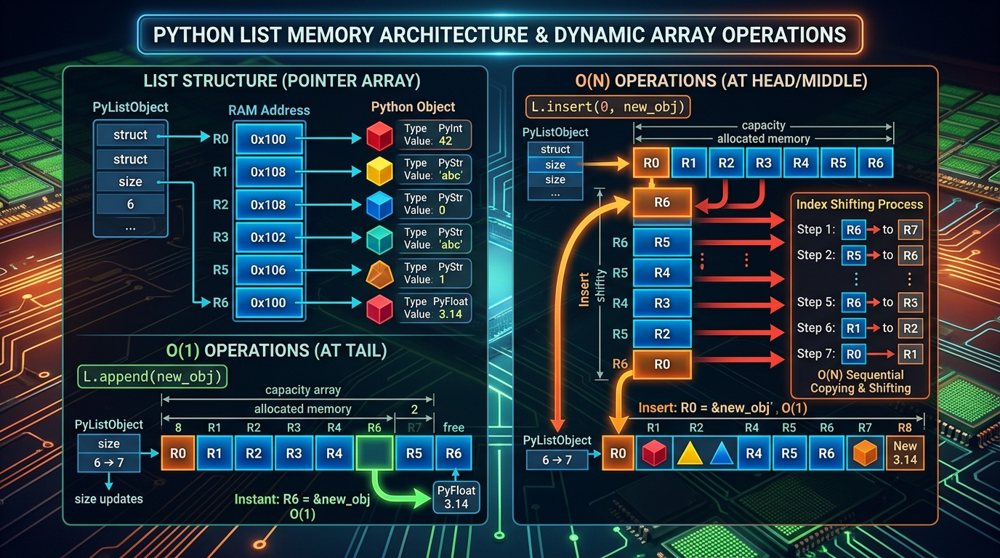

```markmap
# Session 06 - Lesson 02: Thao tác với List

## Phương thức append()
- Khái niệm và Hiệu năng
  - Thêm một phần tử vào cuối List.
  - Độ phức tạp thời gian tốt nhất: O(1) do không cần dịch chuyển phần tử.
- Mã nguồn minh họa
  ```python
  shopping_cart = ["phone", "tablet"]
  shopping_cart.append("headset")
  ```
- Đặc điểm vận hành
  - Thêm trực tiếp đối tượng được truyền vào (có thể là một List khác dưới dạng 1 phần tử đơn lẻ).

## Phương thức insert()
- Cơ chế và Định vị
  - Chèn một phần tử vào chỉ số index xác định.
  - Đòi hỏi dịch chuyển các phần tử phía sau sang phải: O(n).
- Mã nguồn minh họa an toàn
  ```python
  target_index = 1
  if 0 <= target_index <= len(shopping_cart):
      shopping_cart.insert(target_index, "smartwatch")
  ```
- Lưu ý biên (Border cases)
  - Vượt quá len(list): Tự động chèn xuống cuối danh sách mà không báo lỗi.

## Phương thức extend()
- Cơ chế gom nhóm
  - Giải nén (unpack) một iterable (List, Tuple) và thêm từng phần tử vào cuối danh sách hiện tại.
  - Độ phức tạp thời gian: O(k) với k là số lượng phần tử bổ sung.
- Mã nguồn minh họa
  ```python
  extra_items = ["holder", "case"]
  shopping_cart.extend(extra_items)
  ```
- Phân biệt với append()
  - append() giữ nguyên cấu trúc mảng lồng nhau, trong khi extend() làm phẳng mảng bổ sung.

## Cập nhật qua Index (Modifying via Index)
- Bản chất ô nhớ
  - Thay đổi giá trị tham chiếu tại vị trí chỉ định mà không dịch chuyển con trỏ hay làm thay đổi kích thước danh sách. Tốc độ O(1).
- Mã nguồn minh họa
  ```python
  shopping_cart[2] = "gaming_mouse"
  ```
- Rủi ro IndexError
  - Phát sinh ngoại lệ nếu chỉ số index chỉ định nằm ngoài vùng giới hạn cho phép.

## Phương thức pop()
- Cơ chế thu hồi
  - Xóa và giải phóng một phần tử tại vị trí chỉ định rồi trả về giá trị đó. Mặc định xóa phần tử cuối cùng.
- Mã nguồn minh họa an toàn
  ```python
  index_to_pop = 2
  if 0 <= index_to_pop < len(shopping_cart):
      popped = shopping_cart.pop(index_to_pop)
  ```
- Cảnh báo Runtime
  - Gây lỗi IndexError khi thao tác trên List rỗng hoặc index vượt ngoài phạm vi cho phép.

## Phương thức remove()
- Cơ chế đối sánh giá trị
  - Tìm kiếm và xóa phần tử đầu tiên khớp với giá trị truyền vào từ trái qua phải.
- Mã nguồn minh họa an toàn
  ```python
  val_to_remove = "tablet"
  if val_to_remove in shopping_cart:
      shopping_cart.remove(val_to_remove)
  ```
- Cực kỳ nguy hiểm
  - Ném ngoại lệ ValueError trực tiếp nếu không tìm thấy giá trị trong List. Luôn phải kiểm tra điều kiện thành viên "in" trước khi dùng.

## Phương thức clear()
- Cơ chế giải phóng
  - Xóa sạch toàn bộ phần tử trong List, làm rỗng danh sách nhưng giữ nguyên id() tham chiếu của đối tượng gốc ban đầu.
- Mã nguồn minh họa
  ```python
  shopping_cart.clear()
  ```
- Tối ưu hóa hệ thống
  - Giúp tái sử dụng lại đối tượng List thay vì cấp phát mới (list = []), tiết kiệm chi phí dọn rác (Garbage Collector).

## Dịch chuyển chỉ số (Index Shifting)
- Luồng hoạt động trong RAM
  - Việc thêm/bớt phần tử ở đầu/giữa List buộc Python phải sao chép cấu trúc và sắp xếp lại toàn bộ chỉ số index của các phần tử liền kề sau đó.
- Sơ đồ trực quan
  - 
- Bẫy logic (Mutating during Iteration)
  - Cấm sửa đổi cấu trúc List (thêm, bớt phần tử) trực tiếp bằng vòng lặp for do con trỏ duyệt sẽ bị nhảy cóc hoặc lặp vô tận.
  - Khắc phục: Duyệt qua bản sao List hoặc thiết lập bộ lọc (List Comprehension).

## Chuẩn PEP 8 và Định dạng chuỗi (PEP 8 & String Formatting)
- Chuẩn viết mã PEP 8
  - Luôn thụt lề 4 khoảng trắng cho các khối lệnh logic kiểm tra.
  - Phân tách tham số bằng dấu phẩy followed by khoảng trắng: [val1, val2].
- Định dạng chuỗi (Formatting)
  - Ưu tiên sử dụng F-string để in trạng thái hiển thị của List một cách trực quan, tối giản bộ nhớ đệm tạo chuỗi.
- Mã nguồn minh họa
  ```python
  print(f"Updated shopping cart content: {shopping_cart}")
  ```
```
```
```