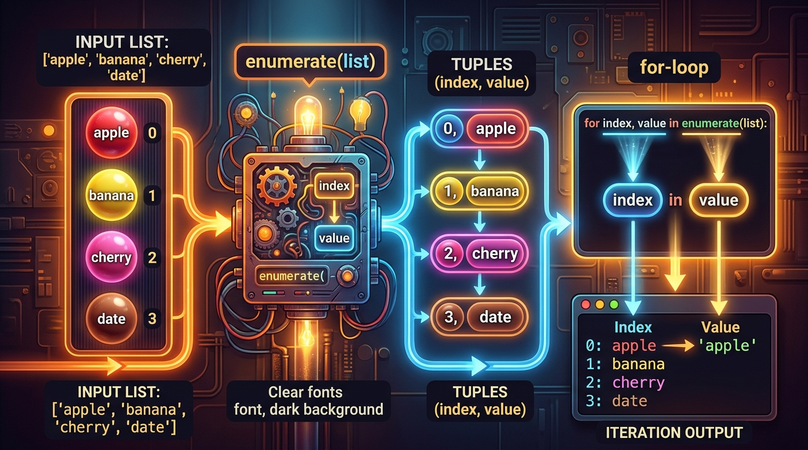

```markmap
# Session 06: Lesson 03 - Duyệt List với vòng lặp (for, enumerate)

## Vòng lặp for duyệt List
- Bản chất & Nguyên lý
  - Duyệt qua từng phần tử (item-based iteration) của iterable object (List) từ đầu đến cuối.
  - Sử dụng Iterator Protocol để tự động trỏ đến phần tử kế tiếp mà không cần quản lý chỉ số bằng cách thủ công.
- Cú pháp trực tiếp
  ```python
  items = ["Laptop", "Smartphone", "Tablet"]
  for item in items:
      print(item)
  ```
- Hạn chế
  - Không thể truy cập trực tiếp chỉ mục (index) của phần tử hiện tại nếu không dùng thêm biến đếm bên ngoài hoặc hàm hỗ trợ.

## Hàm enumerate()
- Bản chất
  - Built-in function nhận vào một iterable (List, Tuple, String...) và trả về enumerate object (dạng iterator).
  - Trả ra chuỗi các Tuple có dạng cặp giá trị: `(index, item)`.
  - 
- Cú pháp & Khởi tạo
  ```python
  # Cú pháp cơ bản
  enumerate(iterable, start=0)

  # Thay đổi chỉ số bắt đầu bằng tham số start
  enumerate(shipment_queue, start=1)
  ```
- Lỗi runtime (TypeError)
  - Xảy ra khi truyền đối tượng không có đặc tính tuần tự/không lặp được (như kiểu dữ liệu số nguyên đơn thuần `int`) vào hàm `enumerate()`.

## Cơ chế Unpacking (Phân rã)
- Định nghĩa & Nguyên lý
  - Kỹ thuật phân rã các phần tử của một Tuple hoặc List và gán đồng thời cho các biến đơn lẻ tương ứng.
- Áp dụng với enumerate()
  ```python
  # Unpacking tuple (index, item) trực tiếp tại tiêu đề vòng lặp
  shipment_queue = ["Laptop", "Smartphone", "Tablet", "Monitor"]
  for index, item in enumerate(shipment_queue):
      print(f"Index: {index}, Shipment: {item}")
  ```
- Lỗi runtime (ValueError)
  - Xảy ra khi khai báo sai số lượng biến nhận dữ liệu từ Tuple Unpacking (ví dụ chỉ viết 1 biến đại diện khi unpack cặp tuple hoặc viết thừa từ 3 biến trở lên).

## Định dạng chuỗi f-string
- Định nghĩa
  - Formatted string literals (Python 3.6+) cho phép nhúng trực tiếp biểu thức hoặc giá trị biến vào trong chuỗi bằng cặp ngoặc nhọn `{}`.
- Ứng dụng xuất kết quả
  ```python
  print(f"Index: {index}, Shipment: {item}")
  ```
- Ưu điểm thực chiến
  - Tối ưu hiệu năng thực thi (nhanh hơn `.format()` và `%`).
  - Cải thiện tính trực quan và dễ đọc của mã nguồn khi hiển thị chỉ mục và giá trị phần tử.

## Lỗi thay đổi List khi duyệt
- Hành vi nguy hiểm
  - Thực hiện thêm (`append()`, `insert()`) hoặc xóa (`remove()`, `pop()`) phần tử của List ngay bên trong thân vòng lặp `for` đang duyệt List đó.
- Hệ quả logic
  - Phá vỡ cấu trúc chỉ mục của List, gây xáo trộn luồng trỏ chỉ mục, dẫn đến bỏ sót phần tử hoặc làm phát sinh vòng lặp vô tận.
- Giải pháp khắc phục
  - Duyệt qua một bản sao (shallow copy) của List bằng cú pháp slicing `list[:]`.
  - Sử dụng List Comprehension để lọc và tạo ra một List mới thay vì can thiệp trực tiếp vào List cũ.

## Tiêu chuẩn PEP 8 về đặt tên và cấu trúc vòng lặp
- Đặt tên biến lặp
  - Đặt tên mang ý nghĩa rõ ràng, tương ứng với ngữ cảnh dữ liệu (ví dụ: `item` đại diện cho phần tử trong `items`, `shipment` cho `shipment_queue`).
- Biến chỉ mục
  - Đặt tên biến đại diện cho chỉ mục là `index` hoặc viết tắt là `i` khi thực hiện `enumerate()`.
- Quy tắc bỏ qua biến (Dummy Variable)
  - Sử dụng ký tự dấu gạch dưới `_` cho biến đã unpack nhưng không được sử dụng tiếp trong logic nội bộ của vòng lặp nhằm tối ưu tài nguyên và làm sạch mã nguồn.
```
```
```