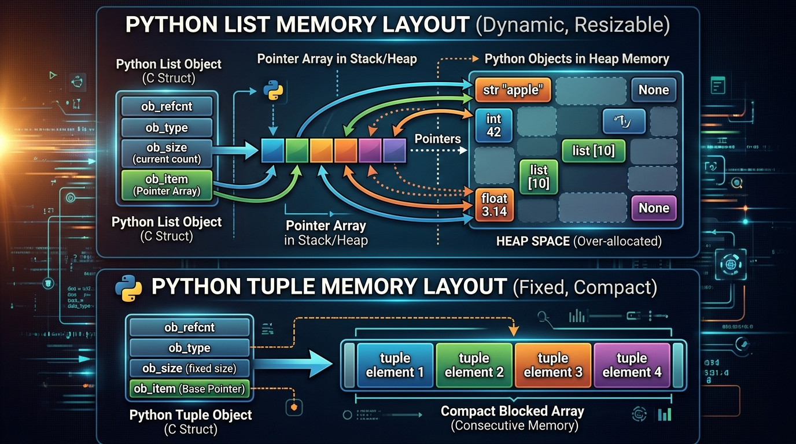

```markmap
# Session 06 - Lesson 05: So sánh List vs Tuple và khi nào nên dùng

## List (Danh sách)
- Bản chất: Mảng động (dynamic array), cho phép co giãn kích thước linh hoạt khi chạy chương trình.
- Bộ nhớ: Chiếm dụng nhiều RAM hơn do có cơ chế dự phòng (over-allocation) để tối ưu việc thêm phần tử.
- Chuyển đổi sang Tuple: Sử dụng hàm khởi tạo `tuple()`.
- Code minh họa và đo hiệu năng:
  ```python
  import sys
  sample_list = [1, 2, 3, 4, 5]
  print(f"List size: {sys.getsizeof(sample_list)} bytes")
  ```

## Tuple (Bộ dữ liệu)
- Bản chất: Mảng tĩnh (static array), kích thước cố định sau khi khởi tạo.
- Bộ nhớ: Tối ưu, chỉ chiếm dụng lượng RAM vừa đủ với số lượng phần tử thực tế.
- Chuyển đổi sang List: Sử dụng hàm khởi tạo `list()` để chỉnh sửa dữ liệu khi cần.
- Code minh họa và đo hiệu năng:
  ```python
  import sys
  sample_tuple = (1, 2, 3, 4, 5)
  print(f"Tuple size: {sys.getsizeof(sample_tuple)} bytes")
  ```
- 

## Mutable (Khả biến)
- Nguyên lý: Cho phép chỉnh sửa, thêm, hoặc xóa phần tử trực tiếp trên đối tượng mà không thay đổi địa chỉ vùng nhớ (ID).
- Ứng dụng: Dùng khi tập dữ liệu liên tục thay đổi trong suốt vòng đời ứng dụng.
- Tác vụ phổ biến: `append()`, `extend()`, `pop()`, `remove()`.

## Immutable (Bất biến)
- Nguyên lý: Không thể chỉnh sửa phần tử sau khi đã tạo. Mọi hành vi cố gắng chỉnh sửa trực tiếp sẽ gây lỗi hệ thống.
- Lỗi gán trực tiếp:
  ```python
  tup = (1, 2, 3)
  # tup[0] = 99 -> Gây lỗi TypeError: 'tuple' object does not support item assignment
  ```
- Tính an toàn: Bảo vệ dữ liệu cấu hình quan trọng khỏi tác động vô tình của hệ thống.
- Hashability: Tuple có tính hashable nên được dùng làm tham số, phần tử của Set hoặc Key cho Dictionary (List thì không thể).

## Indexing (Truy xuất qua chỉ số)
- Định nghĩa: Định vị vị trí phần tử để truy xuất trực tiếp với độ phức tạp thời gian O(1).
- Chỉ số dương: Bắt đầu từ 0 (phần tử đầu tiên) đến N-1.
- Chỉ số âm: Bắt đầu từ -1 (phần tử cuối cùng) đếm ngược về phía trước.
- Ví dụ:
  ```python
  data = [10, 20, 30]
  print(data[0])  # 10
  print(data[-1]) # 30
  ```

## Slicing (Cắt lát dữ liệu)
- Cú pháp chuẩn: `sequence[start:stop:step]`
- Cơ chế: Trích xuất một chuỗi con từ chỉ số `start` đến sát chỉ số `stop - 1` theo khoảng nhảy `step`.
- Thao tác thực chiến:
  ```python
  nums = [0, 1, 2, 3, 4, 5]
  sub = nums[1:4]   # [1, 2, 3]
  rev = nums[::-1]  # Đảo ngược danh sách
  ```

## PEP 8 (Quy chuẩn định dạng code)
- Khai báo Tuple 1 phần tử: Phải có dấu phẩy đi kèm để Python nhận diện là Tuple chứ không phải biểu thức ngoặc đơn thông thường.
  ```python
  correct_tuple = (42,)
  wrong_type = (42)  # Kiểu dữ liệu sẽ là int
  ```
- Khoảng trắng trong khai báo: Không chèn khoảng trắng sát bên trong dấu ngoặc vuông hoặc ngoặc đơn.
  ```python
  # Đúng chuẩn PEP 8
  my_list = [1, 2, 3]
  my_tuple = (1, 2, 3)
  ```
```
```
```