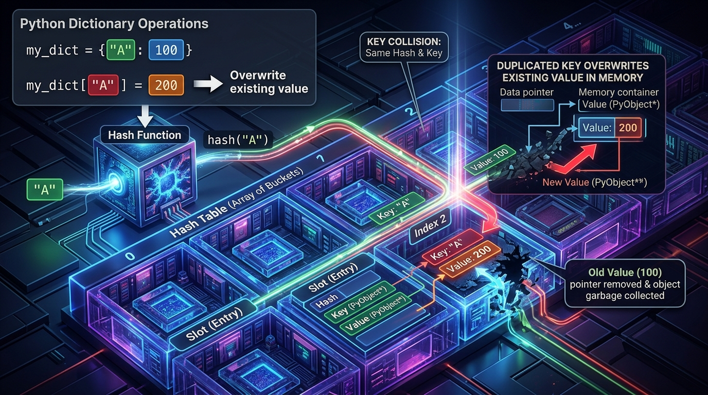
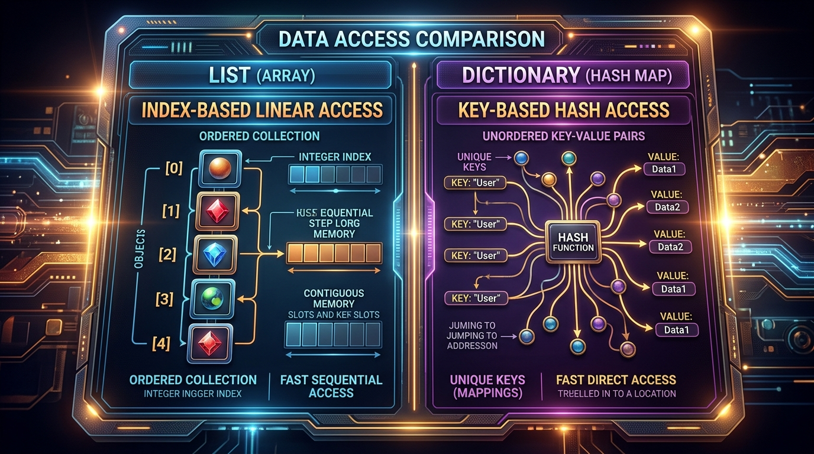

```markmap
# Python Core - S07L01: Khái niệm và khởi tạo Dictionary

## Định nghĩa & Đặc trưng Dictionary
- Bản chất: Cấu trúc dữ liệu dạng ánh xạ (Mapping Type) cho phép liên kết các cặp dữ liệu.
- Cấu trúc: Gồm các cặp khóa - giá trị (Key - Value). Key đóng vai trò định danh để tra cứu Value.
- Đặc trưng: Key phải là duy nhất trong một Dictionary, trong khi các Value có thể trùng lặp.
- 

## Cơ chế hoạt động Key-Value
- Liên kết dữ liệu: Mỗi Key được ánh xạ trực tiếp tới một Value tương ứng thông qua cú pháp chỉ mục `dict[key]`.
- Hành vi ghi đè ngầm: Khai báo trùng Key không gây lỗi biên dịch mà tự động ghi đè giá trị mới nhất lên giá trị cũ.
  ```python
  # Gia tri 200.0 se ghi de hoan toan gia tri 100.0
  product_prices = {
      "product_key": 100.0,
      "product_key": 200.0
  }
  ```
- Gotcha: Truy xuất bằng Key không tồn tại sẽ phát sinh lỗi `KeyError`.

## Tính bất biến và Khả năng băm của Key (Immutability & Hashability)
- Yêu cầu bắt buộc: Key phải thuộc kiểu dữ liệu bất biến (Immutable) và có thể băm (Hashable).
- Cơ chế băm (Hashing): Python sử dụng hàm `hash(key)` để tính toán vị trí lưu trữ trong bộ nhớ giúp tìm kiếm nhanh O(1).
- Kiểu dữ liệu hợp lệ làm Key: str, int, float, bool, tuple (nếu tuple chỉ chứa các phần tử bất biến).

## Các phương pháp khởi tạo Dictionary
- Sử dụng dấu ngoặc nhọn `{}`: Cách khai báo trực quan và phổ biến nhất.
  ```python
  user_credentials = {
      "user_manager": "admin123",
      "user_guest": "guest_pass"
  }
  ```
- Sử dung hàm dựng `dict()`:
  - Khởi tạo từ danh sách Tuple liên kết:
    ```python
    product_prices = dict([
        ("product_a", 120.5),
        ("product_b", 250.0)
    ])
    ```
  - Khởi tạo từ tham số đặt tên (keyword arguments):
    ```python
    application_settings = dict(
        theme_color="dark",
        auto_save=True
    )
    ```

## So sánh Dictionary với List & Tuple
- Khác biệt cơ bản: List và Tuple sử dụng chỉ số nguyên (Index 0, 1, 2...) để định vị phần tử. Dictionary sử dụng Key (chuỗi, số, tuple...) tự định nghĩa.
- Tốc độ truy vấn: Dictionary có tốc độ tìm kiếm theo Key nhanh vượt trội và không phụ thuộc vào độ lớn của dữ liệu nhờ bảng băm.
- 

## Lỗi Unhashable Key & Cách xử lý
- Nguyên nhân: Sử dụng các kiểu dữ liệu có thể thay đổi (Mutable) như List, Set hoặc một Dictionary khác làm Key.
- Mã lỗi Runtime: `TypeError: unhashable type` xuất hiện ngay khi thông dịch đoạn mã.
  ```python
  # Sai lam gay loi he thong:
  # invalid_key_dict = { ["category"]: "Store Item" }
  ```
- Cách khắc phục: Chuyển đổi kiểu dữ liệu mutable thành immutable tương ứng (ví dụ: chuyển List thành Tuple).
  ```python
  # Khai bao hop le voi Tuple:
  valid_key_dict = { ("category",): "Store Item" }
  ```

## Chuẩn định dạng PEP 8
- Quy chuẩn khoảng trắng: Luôn có một dấu cách sau dấu hai chấm `: `, không đặt dấu cách trước dấu hai chấm.
- Xuống dòng và thụt lề: Đối với Dictionary chứa nhiều thuộc tính phức tạp, viết mỗi cặp Key-Value trên một dòng thụt lề 4 dấu cách.
  ```python
  # Chuan PEP 8 cho Dictionary nhieu thuoc tinh
  employee_directory = {
      "employee_001": {
          "name": "Jonathan",
          "role": "Lead Engineer"
      },
      "employee_002": {
          "name": "Sarah",
          "role": "Security Architect"
      }
  }
  ```
```
```
```