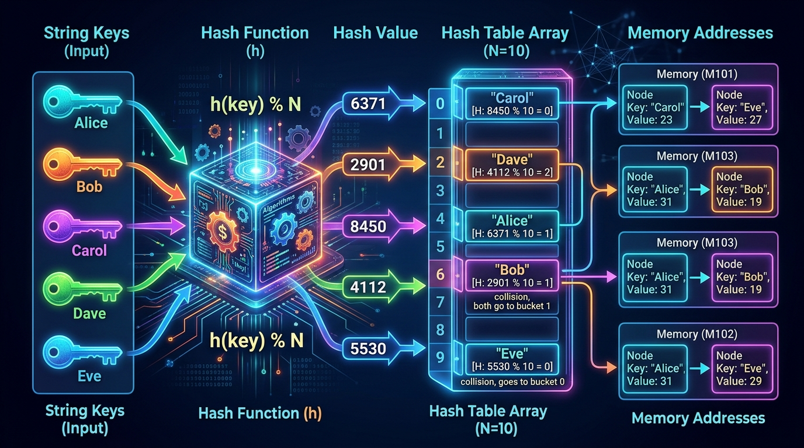

```markmap
# Session 07 - Lesson 02: Thao tác với Keys, Values và Items

## Cấu trúc dữ liệu Tự điển (dictionary)
- Đặc điểm: Tập hợp các cặp key-value không trùng lặp khóa, có thứ tự insertion-ordered (từ Python 3.7+), có thể thay đổi (mutable).
- Độ phức tạp tìm kiếm: Đạt tối ưu O(1) nhờ cơ chế Hash Table (bảng băm).
- 

## Quy tắc khóa bất biến (immutable_key_rule)
- Nguyên lý: Khóa (key) phải là đối tượng bất biến (immutatable) và có thể băm (hashable).
- Các kiểu dữ liệu hợp lệ làm khóa: str, int, float, bool, tuple (chỉ chứa các phần tử bất biến).
- Các kiểu dữ liệu không hợp lệ: list, dict, set (gây lỗi TypeError: unhashable type).

## Cú pháp ngoặc vuông truy cập và chỉnh sửa (bracket_notation)
- Truy cập giá trị: `value = dictionary[key]` (báo lỗi KeyError nếu khóa không tồn tại).
- Thêm mới / Cập nhật: `dictionary[key] = value` (tạo khóa mới nếu chưa có, ghi đè nếu đã tồn tại).
- Ví dụ:
  ```python
  smartphone = {"product_name": "Pro Phone 15"}
  smartphone["price"] = 1200.0  # Thêm khóa 'price' mới
  smartphone["product_name"] = "Pro Phone 16"  # Cập nhật khóa hiện có
  ```

## Phương thức lấy danh sách khóa (keys_method)
- Cơ chế: Phương thức `.keys()` trả về một đối tượng View (`dict_keys`) của tất cả các khóa.
- Đặc tính: View động (dynamic view), tự động cập nhật khi Dictionary gốc thay đổi.
- Cách xử lý để sắp xếp hoặc truy cập theo chỉ số: Ép kiểu qua `list()`.
- Chú ý: Tránh gọi trực tiếp các phương thức danh sách như `.sort()` hay `.append()` trên đối tượng View (gây lỗi AttributeError).

## Phương thức lấy danh sách giá trị (values_method)
- Cơ chế: Phương thức `.values()` trả về một đối tượng View (`dict_values`) của tất cả các giá trị.
- Ví dụ chuyển đổi:
  ```python
  all_prices = list(smartphone.values())
  ```
- Chú ý: Không hỗ trợ truy cập theo chỉ số index trực tiếp (ví dụ: `values[0]` sẽ gây lỗi TypeError).

## Phương thức lấy cặp khóa-giá trị (items_method)
- Cơ chế: Phương thức `.items()` trả về đối tượng View (`dict_items`) chứa danh sách các tuple có dạng `(key, value)`.
- Ứng dụng: Chuyển đổi cấu trúc Dictionary hoặc phục vụ cho quá trình duyệt phần tử hiệu quả.

## Giải nén dữ liệu trong vòng lặp (unpacking_in_loop)
- Khái niệm: Tách trực tiếp tuple `(key, value)` thành hai biến riêng biệt ngay trong biểu thức vòng lặp `for`.
- Ví dụ:
  ```python
  for key, val in smartphone.items():
      print(f"Thuộc tính: {key} có giá trị: {val}")
  ```

## Toán tử in kiểm tra khóa (in_operator_key_check)
- Bản chất: Kiểm tra sự tồn tại của một khóa trong Dictionary với độ phức tạp thời gian trung bình O(1).
- Phạm vi: Chỉ tìm kiếm trên không gian khóa (keys), không tìm kiếm và quét trên các giá trị (values).
- Ví dụ:
  ```python
  if "price" in smartphone:
      print(f"Giá sản phẩm: {smartphone['price']}")
  ```

## Giải pháp phòng ngừa lỗi KeyError (key_error_prevention)
- Phương thức an toàn `.get()`: Cấu trúc `.get(key, default)` trả về giá trị mặc định được thiết lập trước thay vì crash chương trình khi không tìm thấy khóa.
- Phương thức hàng loạt `.update()`: `dictionary.update(other_dict)` cập nhật đồng thời nhiều cặp key-value hoặc hợp nhất từ một Dictionary khác mà không gây lỗi khóa.
- 
- Ví dụ:
  ```python
  discount = smartphone.get("discount_rate", 0.0) # Trả về 0.0 thay vì báo lỗi KeyError
  smartphone.update({"price": 1150.0, "warranty_months": 12})
  ```

## Khai báo Dictionary phẳng theo chuẩn PEP 8 (pep8_flat_dict)
- Quy tắc thiết kế: Thụt lề thụt dòng 4 khoảng trắng cho mỗi khóa, đặt dấu hai chấm ngay sau khóa, dấu phẩy cuối cùng sau phần tử cuối cùng để dễ nâng cấp rộng mở (trailing comma).
- Ví dụ:
  ```python
  smartphone_product = {
      "product_name": "Pro Phone 15",
      "price": 1200.0,
      "stock_quantity": 45,
  }
  ```
```
```
```