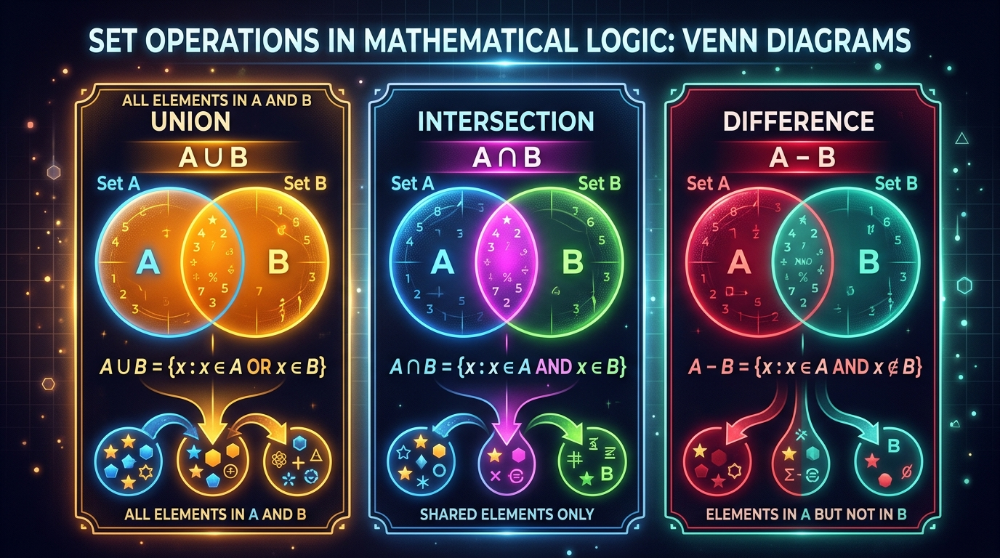

```markmap
# Session 07 - Lesson 04: Các phép toán trên Set

## set_definition
- Bản chất
  - Tập hợp không thứ tự (Unordered), các phần tử là duy nhất (Unique)
  - Phần tử lưu trữ phải thuộc kiểu bất biến (Immutable) và băm được (Hashable)
  - Không hỗ trợ truy cập qua chỉ mục (Indexing) hoặc cắt lát (Slicing)
- 

## set_initialization
- Cú pháp khởi tạo
  - Dùng cặp ngoặc nhọn `{}` chứa các phần tử cách nhau bằng dấu phẩy
  - Dùng hàm dựng `set()`
- Khởi tạo tập hợp rỗng
  - Bắt buộc dùng `set()`
  - Tránh nhầm lẫn: `{}` khởi tạo một Dictionary rỗng thay vì Set
  ```python
  empty_set = set() # Đúng
  empty_dict = {} # Sai, đây là dict
  ```

## set_operations
- Phép hợp (Union)
  - Ý nghĩa: Lấy toàn bộ phần tử độc nhất từ cả hai tập hợp
  - Toán tử: `|` (Yêu cầu cả hai toán hạng đều phải là Set)
  - Phương thức: `union()` (Chấp nhận mọi iterable như List, Tuple, String làm đối số)
- Phép giao (Intersection)
  - Ý nghĩa: Chỉ lấy những phần tử xuất hiện ở cả hai tập hợp
  - Toán tử: `&` (Yêu cầu cả hai toán hạng đều là Set)
  - Phương thức: `intersection()` (Chấp nhận mọi iterable)
- Phép hiệu (Difference)
  - Ý nghĩa: Lấy các phần tử chỉ có trong tập hợp bên trái mà không có trong tập hợp bên phải
  - Toán tử: `-` (Yêu cầu cả hai toán hạng đều là Set)
  - Phương thức: `difference()` (Chấp nhận mọi iterable)
- 

## type_casting_deduplication
- Cơ chế
  - Ép kiểu dữ liệu tuần tự có phần tử trùng lặp sang Set để tự động loại bỏ trùng lặp
- Loại bỏ trùng lặp từ chuỗi (String)
  ```python
  word = "abracadabra"
  unique_chars = set(word) # {'a', 'b', 'r', 'c', 'd'}
  ```
- Loại bỏ trùng lặp từ List
  ```python
  numbers = [1, 2, 2, 3, 4, 4]
  unique_numbers = list(set(numbers)) # [1, 2, 3, 4]
  ```

## product_comparison_pep8
- Ứng dụng quản lý kho hàng doanh nghiệp
  - So sánh đối chiếu hai nguồn dữ liệu trực tiếp trong O(N) thay vì O(N*M) của vòng lặp lồng nhau
  ```python
  current_inventory = {"laptop", "keyboard", "mouse", "monitor"}
  new_shipment = {"mouse", "monitor", "headphone", "webcam"}
  
  # Tìm tất cả sản phẩm độc nhất trong kho
  all_unique_products = current_inventory.union(new_shipment)
  
  # Tìm sản phẩm bị trùng lặp cần rà soát
  overlapping_products = current_inventory.intersection(new_shipment)
  
  # Tìm sản phẩm chỉ có ở kho hiện tại
  exclusive_current = current_inventory.difference(new_shipment)
  ```
- Cảnh báo lỗi Runtime & Chuẩn PEP 8
  - Lỗi `TypeError: unsupported operand type(s) for -`
    - Nguyên nhân: Sử dụng toán tử tập hợp (`|`, `&`, `-`) giữa Set và List/Tuple
    - Giải pháp: Dùng phương thức tương ứng (`difference()`, `union()`, `intersection()`) hoặc ép kiểu List/Tuple sang Set trước khi dùng toán tử
  - Lỗi `TypeError: unhashable type`
    - Nguyên nhân: Cố gắng chèn phần tử có thể thay đổi (Mutable như List, Dictionary) vào trong Set
    - Giải pháp: Chuyển đổi List đó thành Tuple trước khi đưa vào Set
```
```
```