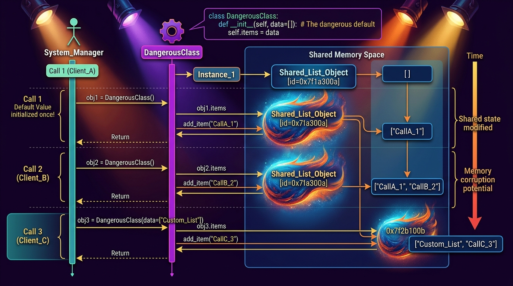

```markmap
# Session 08: Lesson 02 - Tham số và giá trị trả về

## Positional Argument (Tham số vị trí)
- Nguyên lý
  - Đối số truyền vào được gán cho tham số dựa theo đúng thứ tự từ trái qua phải
- Cú pháp & Code mẫu
  ```python
  def register(name, email):
      return f"User: {name}, Email: {email}"

  # "Alice" gán cho name, "alice@email.com" gán cho email
  register("Alice", "alice@email.com")
  ```
- Cảnh báo lỗi
  - Truyền thiếu hoặc thừa số lượng đối số so với khai báo sẽ gây lỗi TypeError

## Keyword Argument (Tham số định danh)
- Nguyên lý
  - Đối số được truyền kèm tên tham số rõ ràng giúp bỏ qua sự ràng buộc về thứ tự vị trí
- Cú pháp & Code mẫu
  ```python
  def greet(name, age):
      return f"{name} is {age} years old"

  # Thứ tự truyền không ảnh hưởng đến kết quả gán
  greet(age=25, name="Bob")
  ```
- Cảnh báo lỗi
  - Lỗi TypeError xảy ra nếu truyền trùng lặp giá trị cho cùng một tham số bằng cả hai cách

## Default Argument (Tham số mặc định)
- Nguyên lý
  - Gán giá trị mặc định cho tham số ngay khi định nghĩa hàm nhằm tối ưu việc gọi hàm
- Cú pháp & Code mẫu
  ```python
  def connect(host, port=5432):
      return f"Connecting to {host} on port {port}"

  connect("localhost")  # port tự động nhận giá trị 5432
  ```
- Cảnh báo bẫy ngầm (Mutable Default Argument)
  - Tránh sử dụng đối tượng có thể thay đổi (list, dict) làm giá trị mặc định vì chúng chia sẻ vùng nhớ giữa các lần gọi
  - 
  - Giải pháp chuẩn hóa:
    ```python
    def add_item(item, target_list=None):
        if target_list is None:
            target_list = []
        target_list.append(item)
        return target_list
    ```

## Return Statement & Tuple Return (Trả về nhiều giá trị)
- Bản chất
  - Lệnh return dừng thực thi hàm ngay lập tức và gửi giá trị kết quả về nơi gọi hàm
- Cơ chế Tuple Return
  - Python chuyển đổi các giá trị ngăn cách bởi dấu phẩy thành một Tuple duy nhất khi trả về
- Cú pháp & Code mẫu
  ```python
  def get_coordinates():
      return 10.5, 20.3  # Trả về Tuple (10.5, 20.3)

  # Unpacking trực tiếp giá trị nhận được
  lat, lon = get_coordinates()
  ```

## *args (Tham số biến thiên theo vị trí)
- Bản chất
  - Gom toàn bộ các đối số vị trí dư thừa truyền vào hàm thành một Tuple duy nhất
- Quy ước đặt tên
  - Dấu * là bắt buộc để giải nén toán tử, args là tên biến tiêu chuẩn
- Cú pháp & Code mẫu
  ```python
  def sum_numbers(*args):
      # args là một Tuple lưu trữ toàn bộ tham số vị trí
      return sum(args)

  sum_numbers(1, 2, 3, 4)  # Trả về 10
  ```

## **kwargs (Tham số biến thiên định danh)
- Bản chất
  - Gom toàn bộ các đối số định danh không được định nghĩa trước thành một Dictionary
- Quy ước đặt tên
  - Dấu ** là bắt buộc để giải nén từ khóa, kwargs là tên biến tiêu chuẩn
- Cú pháp & Code mẫu
  ```python
  def print_profile(**kwargs):
      # kwargs là một Dictionary chứa cặp key-value truyền vào
      for key, value in kwargs.items():
          print(f"{key}: {value}")

  print_profile(role="Admin", level=5)
  ```

## Quy tắc thứ tự tham số & Chuẩn hóa Python 3.12
- Thứ tự khai báo bắt buộc
  - Positional args -> Default args -> *args -> Keyword-Only args -> **kwargs
- Cảnh báo SyntaxError
  - Tham số mặc định bắt buộc phải khai báo SAU tham số không mặc định
- Code mẫu tích hợp chuẩn hóa
  ```python
  def configure_shipping_service(service_name, base_rate=15.0, *hubs, **extra_charges):
      return {
          "service": service_name,
          "base_cost": base_rate,
          "transit_hubs": list(hubs),
          "additional_fees": extra_charges
      }
  ```
- 
```
```
```