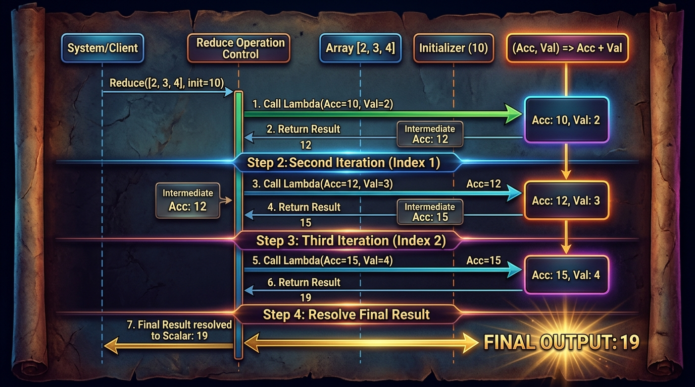
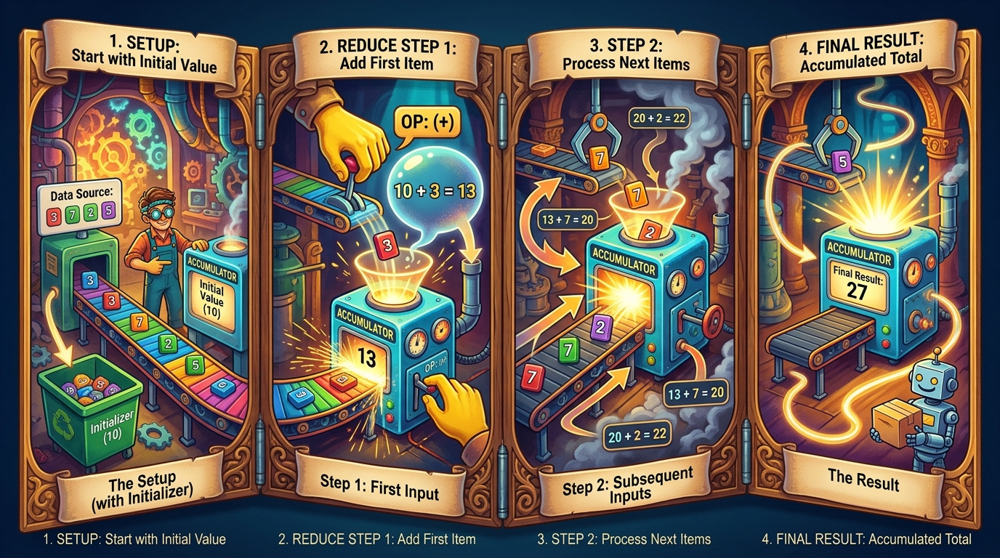

```markmap
# Session 08: Hàm nâng cao và Tiện ích trong Python

## lambda_function
- Định nghĩa: Hàm ẩn danh (Anonymous function) không cần định danh bằng tên, viết gọn trên một dòng.
- Cú pháp cơ bản: `lambda arguments: expression`
- Đặc điểm: Tự động trả về giá trị của biểu thức duy nhất mà không cần sử dụng từ khóa return.
- Ví dụ minh họa:
  ```python
  square = lambda x: x ** 2
  print(square(5))
  ```

## def_vs_lambda
- Hàm thông thường (def):
  - Định danh bằng tên cụ thể trong không gian tên (namespace).
  - Có thể chứa nhiều câu lệnh, vòng lặp, xử lý ngoại lệ và khối docstring mô tả.
  - Phù hợp cho các logic nghiệp vụ phức tạp, tái sử dụng lâu dài.
- Hàm ẩn danh (lambda):
  - Không có tên trực tiếp gắn vào bộ nhớ.
  - Chỉ chứa một biểu thức logic duy nhất và không cho phép gán biến hay vòng lặp phức tạp.
  - Thường dùng làm đối số tức thời cho các hàm cấp cao khác.
- So sánh kiến trúc và phân bổ vùng nhớ:
  - 

## pep8_lambda
- Tiêu chuẩn PEP 8: Tránh gán trực tiếp biểu thức lambda vào một danh định biến để giả lập hàm định danh.
- Hậu quả vi phạm: Gây khó khăn cho việc gỡ lỗi (Debugging) vì Traceback lỗi chỉ ghi nhận là "lambda".
- Đối chiếu thiết kế mã nguồn:
  ```python
  # BAD (Vi phạm quy tắc PEP 8)
  increase = lambda x: x + 1

  # GOOD (Tuân thủ chuẩn PEP 8)
  def increase(x):
      return x + 1
  ```

## map_function
- Khái niệm: Áp dụng một hàm biến đổi lên tất cả các phần tử của một iterable.
- Cú pháp: `map(function, iterable)`
- Cơ chế trả về: Trả về một đối tượng Generator-like Iterator (tiết kiệm bộ nhớ). Dữ liệu chỉ được tính toán khi duyệt qua hoặc ép kiểu.
- Ví dụ thực tế:
  ```python
  numbers = [1, 2, 3, 4]
  doubled = map(lambda x: x * 2, numbers)
  print(list(doubled))
  ```
- Minh họa luồng biến đổi:
  - 

## filter_function
- Khái niệm: Lọc các phần tử của iterable dựa trên điều kiện kiểm tra logic của một hàm trả về Boolean.
- Cú pháp: `filter(function, iterable)`
- Cơ chế trả về: Trả về một Filter Iterator chứa các phần tử thỏa mãn điều kiện trả về giá trị True.
- Ví dụ thực tế:
  ```python
  numbers = [1, 2, 3, 4]
  evens = filter(lambda x: x % 2 == 0, numbers)
  print(list(evens))
  ```
- Minh họa luồng chọn lọc:
  - 

## reduce_function
- Khái niệm: Thực hiện tích lũy, áp dụng liên tiếp hàm 2 tham số lên các phần tử từ trái qua phải để trả về một giá trị đơn nhất.
- Nguồn thư viện: Phải import từ module tiêu chuẩn `functools`.
- Cú pháp: `reduce(function, iterable[, initializer])`
- Ví dụ thực tế:
  ```python
  from functools import reduce
  numbers = [1, 2, 3, 4]
  sum_all = reduce(lambda x, y: x + y, numbers, 0)
  print(sum_all)
  ```
- Lưu ý lỗi nghiêm trọng (Gotchas):
  - Lỗi NameError: Chưa import reduce từ thư viện functools.
  - Lỗi TypeError: Gọi reduce trên danh sách rỗng mà không khai báo tham số khởi tạo (initializer).
- Minh họa luồng tích lũy:
  - 

## complex_data_processing
- Kịch bản: Tích hợp đồng thời cả filter, map và reduce để giải quyết bài toán xử lý dữ liệu theo chuỗi.
- Code mẫu tích hợp:
  ```python
  from functools import reduce
  
  raw_invoice_prices = [12.5, 45.0, 99.9, 150.0, 8.0, 250.25]
  
  # Bước 1: Lọc hóa đơn giá trị lớn hơn 40.0
  filtered_invoices = filter(lambda price: price > 40.0, raw_invoice_prices)
  
  # Bước 2: Áp dụng mã giảm giá 10% cho hóa đơn đã qua bộ lọc
  discounted_invoices = map(lambda price: price * 0.9, filtered_invoices)
  
  # Bước 3: Tính tổng doanh thu thu được từ các hóa đơn trên
  total_net_revenue = reduce(lambda total, price: total + price, discounted_invoices, 0.0)
  
  print(round(total_net_revenue, 2))
  ```

## performance_and_readability
- Ưu điểm:
  - `map` và `filter` viết bằng mã C tối ưu hóa, thực thi nhanh hơn vòng lặp thông thường khi gọi hàm có sẵn.
  - Hạn chế tạo biến trung gian, tiết kiệm bộ nhớ RAM nhờ cơ chế Lazy Evaluation.
- Nhược điểm:
  - Việc lồng ghép quá nhiều lớp hàm tạo ra mã nguồn phức tạp, khó đọc và khó phát hiện lỗi logic.
  - Viết lambda lồng nhau sâu vi phạm nghiêm trọng tính dễ hiểu của triết lý Pythonic.

## refactoring_pipeline
- Chuyển đổi mã nguồn: Thay thế map và filter bằng List Comprehension để nâng cao tính tường minh cho lập trình viên.
- So sánh trực quan cú pháp:
  ```python
  data = [1, 2, 3, 4, 5]
  
  # Khó đọc do lồng hàm và lambda phức tạp
  res_fp = map(lambda x: x * 3, filter(lambda x: x % 2 != 0, data))
  
  # Tái cấu trúc (Refactored) thành List Comprehension thuần Pythonic
  res_pythonic = [x * 3 for x in data if x % 2 != 0]
  ```
```
```
```