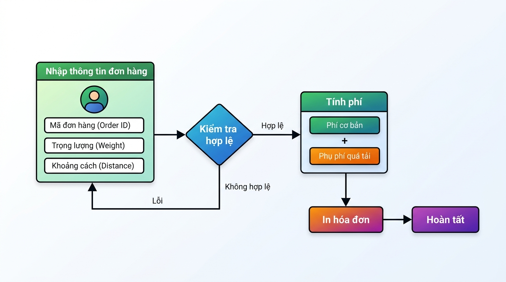

## <center>**1. Mục tiêu**</center>
*   Áp dụng các kiến thức về biến, kiểu dữ liệu cơ bản (int, float, str) và các hàm ép kiểu dữ liệu trong Python.
*   Hiểu rõ cơ chế nhập xuất dữ liệu thông qua hàm `input()` và `print()`, kết hợp định dạng chuỗi hiển thị trực quan thông qua `f-string`.
*   Phát hiện và sửa đổi các lỗi logic nghiệp vụ trong việc xử lý điều kiện, thứ tự kiểm tra dữ liệu và validate đầu vào trong bài toán logistics thực tế.
*   Học cách đóng gói kết quả đầu ra mô phỏng cấu trúc mã phản hồi HTTP để chuẩn bị cho việc xây dựng API sau này.

### **2. Vấn đề**
Bộ phận vận hành của doanh nghiệp Logistics **GreenExpress** đang sử dụng một công cụ dòng lệnh (CLI tool) viết bằng Python để tính nhanh chi phí vận chuyển chặng cuối (Last-mile delivery) cho nhân viên giao nhận. Công cụ này nhận đầu vào là Mã đơn hàng, Quãng đường vận chuyển (km) và Trọng lượng hàng hóa (kg) để đưa ra hóa đơn chi tiết. 

Tuy nhiên, mã nguồn hiện tại liên tục gặp lỗi Runtime (chương trình bị tắt đột ngột) khi người dùng nhập dữ liệu từ bàn phím. Hơn nữa, với các đơn hàng có trọng lượng lớn (> 30kg), hệ thống đang tính sai hoàn toàn phần phụ phí cồng kềnh, khiến doanh nghiệp thất thoát doanh thu đáng kể.


<p align="center">
  
</p>


### **3. Mã nguồn hiện tại**
Dưới đây là đoạn mã nguồn đang vận hành gặp lỗi. Lập trình viên trước đó chưa thực hiện ép kiểu và phân chia logic phân tầng phí bị sai thứ tự.

```python
# file: main.py

print("=== HỆ THỐNG TÍNH PHÍ VẬN CHUYỂN GREENEXPRESS ===")

# Nhận thông tin đầu vào từ console
ma_don_hang = input("Nhập mã đơn hàng (Ví dụ: LGT-99281): ")
quang_duong_str = input("Nhập quãng đường vận chuyển (km): ")
trong_luong_str = input("Nhập trọng lượng hàng hóa (kg): ")

# LỖI LOGIC & ÉP KIỂU XUẤT HIỆN TỪ ĐÂY
# Phí cơ bản = Quãng đường * đơn giá 12,000 VND/km
phi_co_ban = quang_duong_str * 12000

# Tính phụ thu theo trọng lượng
# Quy tắc: 
# - Từ 0kg đến 10kg: Không phụ thu
# - Từ trên 10kg đến 30kg: Phụ thu 5,000 VND cho mỗi kg vượt mốc 10kg
# - Trên 30kg: Phụ thu cố định 150,000 VND và cộng thêm 10% phí cơ bản
phu_thu = 0
if trong_luong_str > 10:
    phu_thu = (trong_luong_str - 10) * 5000
elif trong_luong_str > 30:
    phu_thu = 150000 + (phi_co_ban * 0.1)

tong_phi = phi_co_ban + phu_thu

# Hiển thị hóa đơn chi tiết bằng f-string
print(f"\n--- HÓA ĐƠN CHI TIẾT ---")
print(f"Mã đơn hàng: {ma_don_hang}")
print(f"Phí cơ bản: {phi_co_ban} VND")
print(f"Phụ phí cồng kềnh: {phu_thu} VND")
print(f"Tổng phí vận chuyển: {tong_phi} VND")
```

### **4. Yêu cầu bài toán**

Học viên không được sử dụng các thư viện nâng cao (như FastAPI, Pydantic, SQLAlchemy). Chỉ sử dụng kiến thức căn bản của **Session 01** (biến, cấu trúc phân nhánh `if-else` cơ bản, ép kiểu chắt lọc và các phương thức xử lý chuỗi để validate dữ liệu đầu vào).

#### **Phần 1: Báo cáo kịch bản kiểm thử (Test Case Report)**
Tạo một bảng kiểm thử gồm ít nhất 3 kịch bản kiểm thử (Test cases) để chứng minh các lỗi hiện tại của mã nguồn. Bảng cần tuân thủ cấu trúc sau:

| STT | Trạng thái đầu vào (Input) | Lỗi thực tế gặp phải (Actual Output) | Output mong đợi sau khi sửa (Expected Output) |
|---|---|---|---|
| 1 | `ma_don_hang`: "LGT-001"<br>`quang_duong_str`: "abc"<br>`trong_luong_str`: "15" | Chương trình bị crash do... | Trả về thông báo lỗi định dạng... |
| 2 | ... | ... | ... |
| 3 | ... | ... | ... |

#### **Phần 2: Sửa đổi và chuẩn hóa mã nguồn**
Viết lại mã nguồn Python hoàn chỉnh khắc phục triệt để các lỗi và đáp ứng các **Quy tắc Nghiệp vụ** sau:
1. **Validate mã đơn hàng**: Mã đơn hàng phải bắt đầu bằng tiền tố `"LGT-"` và có độ dài tối thiểu là 8 ký tự. Nếu không thỏa mãn, in ra thông báo lỗi và mã trạng thái giả lập: `{"status_code": 400, "message": "Quy cách mã đơn hàng không hợp lệ!"}`.
2. **Validate số liệu đầu vào**: Quãng đường và Trọng lượng nhập vào phải là số thực dương (lớn hơn 0). Nếu người dùng nhập chữ hoặc số âm/bằng 0, in ra thông báo lỗi: `{"status_code": 400, "message": "Thông số vận chuyển phải là số thực dương!"}`.
3. **Logic tính phí**: Sửa lại thứ tự điều kiện so sánh để đảm bảo hàng hóa trên 30kg được tính đúng công thức phụ phí (Phụ thu = 150,000 VND + 10% Phí cơ bản).
4. **Hiển thị đầu ra**: Định dạng hiển thị các số tiền dưới dạng số nguyên (không hiển thị số thập phân `.0` nếu không cần thiết) và sử dụng f-string gọn gàng.

#### **Phần 3: Câu hỏi lý thuyết**
Trả lời câu hỏi sau vào một khối tài liệu riêng: Sau khi nhận dữ liệu từ hàm `input()`, tại sao lập trình viên không nên ép kiểu trực tiếp bằng `float(input())` mà cần phải kiểm tra dữ liệu trước? Hãy đề xuất cách kiểm tra đơn giản một chuỗi có phải là số thực dương hay không chỉ bằng kiến thức xử lý chuỗi cơ bản (`str`).

### **5. Yêu cầu nộp bài**
Học viên cần nộp:
*   Phần phân tích lỗi (Bảng Test Case) và câu trả lời tự luận phần 3.
*   Mã nguồn sau khi sửa (`main.py`).
*   Đẩy mã nguồn lên GitHub theo định dạng thư mục sau: `[Tên Lớp]_[Môn Học]_Session01_Ex01`.
    *   *Ví dụ minh họa*: `HNKS25CNTT1_PythonCore_Session01_Ex01`