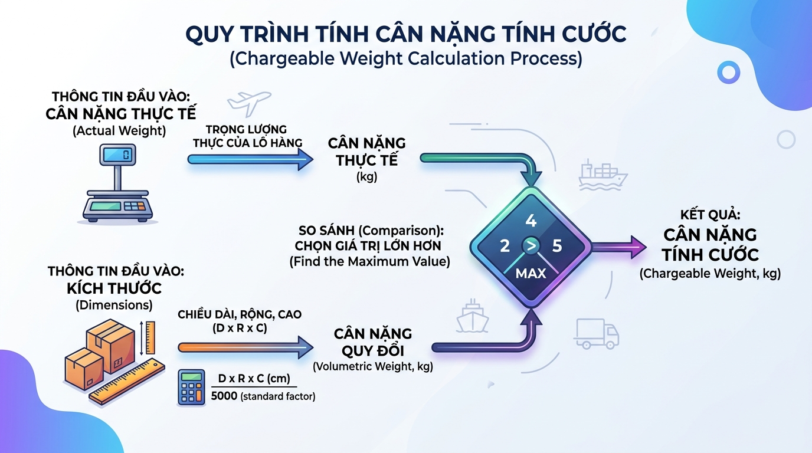

## <center>[Vận dụng cơ bản 2] Khắc phục lỗi tính trọng lượng quy đổi thể tích hàng hóa</center>

### **1. Mục tiêu**
*   Vận dụng kiến thức về biến, kiểu dữ liệu cơ bản (int, float, str, bool), nhập xuất dữ liệu và ép kiểu trong Python.
*   Ứng dụng kỹ thuật định dạng chuỗi bằng f-string để hiển thị thông tin trực quan.
*   Phát hiện và cải tiến lỗi logic nghiệp vụ trong việc tính toán chỉ số vận hành logistics.
*   Xây dựng tư duy kiểm thử (Testing) cơ bản thông qua thiết lập Test Case nhằm phát hiện lỗ hổng phần mềm trước khi vận hành.

### **2. Bối cảnh & Vấn đề**
Trong ngành vận tải quốc tế và logistics, chi phí vận chuyển hàng hóa không chỉ dựa vào trọng lượng thực tế (Actual Weight) mà còn phụ thuộc vào thể tích chiếm chỗ của kiện hàng trên phương tiện vận chuyển. Quy chuẩn này được gọi là **Trọng lượng quy đổi thể tích (Volumetric Weight)**.

Công thức chuẩn để tính trọng lượng quy đổi đường bộ (Standard Air/Road Freight) là:
$$\text{Volumetric Weight (kg)} = \frac{\text{Chiều dài (cm)} \times \text{Chiều rộng (cm)} \times \text{Chiều cao (cm)}}{5000}$$

Trọng lượng tính cước cuối cùng (**Chargeable Weight**) sẽ là giá trị lớn nhất giữa **Trọng lượng thực tế** và **Trọng lượng quy đổi thể tích**.


<p align="center">
  
</p>


Một kỹ sư tập sự đã viết một đoạn mã Python ban đầu để tự động hóa công việc này cho nhân viên kho. Tuy nhiên, mã nguồn này đang hoạt động không ổn định, tính toán sai lệch kết quả tài chính gây thất thu cho doanh nghiệp và dễ dàng bị sập hệ thống (crash) khi nhân viên nhập sai dữ liệu.

### **3. Mã nguồn hiện tại**
Dưới đây là mã nguồn Python hiện tại đang chạy trong hệ thống quản lý kho:

```python
# --- HỆ THỐNG ĐÁNH GIÁ VẬN CHUYỂN LOGISTICS ---
print("--- HỆ THỐNG ĐÁNH GIÁ VẬN CHUYỂN LOGISTICS ---")

length = float(input("Nhập chiều dài kiện hàng (cm): "))
width = float(input("Nhập chiều rộng kiện hàng (cm): "))
height = float(input("Nhập chiều cao kiện hàng (cm): "))
actual_weight = float(input("Nhập trọng lượng thực tế hàng hóa (kg): "))

# Tính toán trọng lượng quy đổi thể tích
volumetric_weight = (length * width * height) // 5000 

# So sánh để xác định trọng lượng tính cước (Trọng lượng nào lớn hơn sẽ được chọn)
chargeable_weight = max(actual_weight, volumetric_weight)

# Hiển thị kết quả bằng f-string
print(f"\nKết quả phân tích đơn hàng:")
print(f"Trọng lượng thực tế: {actual_weight} kg")
print(f"Trọng lượng quy đổi thể tích: {volumetric_weight} kg")
print(f"Trọng lượng tính cước cuối cùng: {chargeable_weight} kg")
```

Bảng mô tả ràng buộc dữ liệu đầu vào:
<table style="width: 100%; min-width: 100%; display: table; border-collapse: collapse;" width="100%" border="1">
  <thead>
    <tr style="background-color: #f2f2f2;">
      <th>Tham số</th>
      <th>Mô tả</th>
      <th>Kiểu dữ liệu mong muốn</th>
      <th>Ràng buộc nghiệp vụ</th>
    </tr>
  </thead>
  <tbody>
    <tr>
      <td><code>length</code></td>
      <td>Chiều dài kiện hàng</td>
      <td>Số thực (float)</td>
      <td>Phải lớn hơn 0</td>
    </tr>
    <tr>
      <td><code>width</code></td>
      <td>Chiều rộng kiện hàng</td>
      <td>Số thực (float)</td>
      <td>Phải lớn hơn 0</td>
    </tr>
    <tr>
      <td><code>height</code></td>
      <td>Chiều cao kiện hàng</td>
      <td>Số thực (float)</td>
      <td>Phải lớn hơn 0</td>
    </tr>
    <tr>
      <td><code>actual_weight</code></td>
      <td>Trọng lượng thực tế</td>
      <td>Số thực (float)</td>
      <td>Phải lớn hơn 0</td>
    </tr>
  </tbody>
</table>

### **4. Yêu cầu đầu ra**

#### **Phần 1: Báo cáo kịch bản kiểm thử (Test Case Report)**
Học viên phân tích mã nguồn hiện tại, chỉ ra ít nhất **3 lỗi logic** hoặc **lỗi validate dữ liệu** có thể làm hệ thống hoạt động sai lệch hoặc bị dừng đột ngột. Trình bày kết quả dưới dạng bảng markdown gồm các cột:
1.  **Mã Test Case**
2.  **Mô tả kịch bản** (Thông tin đầu vào nhập vào màn hình)
3.  **Kết quả thực tế bị lỗi của hệ thống hiện tại** (System crash hoặc tính sai số tiền)
4.  **Kết quả mong muốn** (Sau khi sửa lỗi)

#### **Phần 2: Mã nguồn cải tiến**
Viết lại mã nguồn Python bằng cách sử dụng các kiến thức đã học trong Session 01 (cho phép sử dụng các câu lệnh điều kiện `if-else` cơ bản hoặc các phương thức xử lý chuỗi để validate) nhằm giải quyết triệt để các vấn đề sau:
1.  **Bảo vệ hệ thống khỏi crash**: Kiểm tra các dữ liệu nhập vào có phải là chữ hoặc ký tự đặc biệt hay không trước khi thực hiện ép kiểu sang số thực `float()`. Nếu không hợp lệ, hiển thị thông báo lỗi tường minh và dừng chương trình một cách an toàn.
2.  **Ràng buộc giá trị dương**: Đảm bảo các kích thước và trọng lượng thực tế không được phép nhỏ hơn hoặc bằng 0.
3.  **Độ chính xác của phép tính**: Sửa lỗi phép toán chia nguyên (`//`) để trả về đúng giá trị số thực chính xác của trọng lượng quy đổi thể tích.
4.  **Định dạng đầu ra chuyên nghiệp**: Định dạng tất cả các số thực trong kết quả hiển thị (f-string) có đúng **2 chữ số thập phân** sau dấu phẩy (Ví dụ: `12.34 kg`).

*(Chú ý: Học viên viết code cải tiến đầu vào trực tiếp từ CLI bằng hàm `input()` và in ra kết quả bằng hàm `print()` kết hợp cấu trúc điều khiển cơ bản)*

### **5. Yêu cầu nộp bài**
Học viên cần nộp:
*   Phần phân tích lỗi và code sau khi sửa.
*   Đẩy mã nguồn lên GitHub theo định dạng thư mục: `[Tên Lớp]_[Môn Học]_Session01_Ex02`.
    Ví dụ: `HNKS25CNTT1_PythonCore_Session01_Ex02`