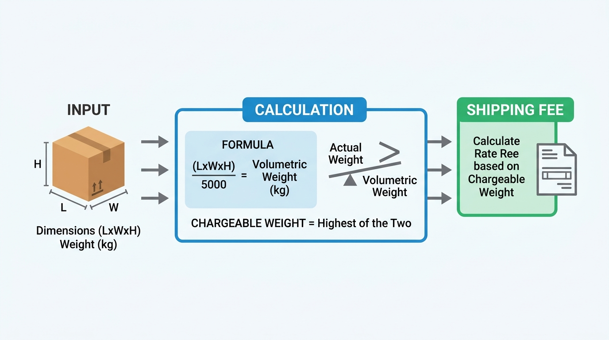

## <center>[Vận dụng chuyên sâu] Hệ thống tính phí và phân loại đơn hàng vận chuyển</center>

### **1. Mục tiêu**
*   Vận dụng thành thục các kiến thức về khai báo biến, các kiểu dữ liệu cơ bản (`int`, `float`, `str`, `bool`) để lưu trữ thông tin thực thể logistics.
*   Thực hiện nhập dữ liệu từ bàn phím thông qua hàm `input()` và áp dụng kỹ thuật ép kiểu dữ liệu (`int()`, `float()`) để xử lý các phép toán số học.
*   Sử dụng toán tử số học, toán tử so sánh để tính toán trọng lượng quy đổi và kiểm tra trạng thái vận hành của đơn hàng (như cảnh báo quá tải).
*   Ứng dụng cơ chế định dạng chuỗi hiển thị `f-string` để xuất hóa đơn vận chuyển (Waybill Receipt) trực quan, căn lề chuyên nghiệp trên giao diện dòng lệnh (CLI).
*   Rèn luyện tư duy tự thiết kế giải pháp cấu trúc dữ liệu và xây dựng luồng xử lý đầu-cuối (end-to-end) cho một nghiệp vụ thực tế trong ngành Logistics.

### **2. Bối cảnh & Vấn đề**
Trong phân hệ vận hành Logistics (Logistics Execution), việc tính toán chi phí vận chuyển dựa trên kích thước hình học và trọng lượng thực tế của kiện hàng là tác vụ diễn ra liên tục tại các bưu cục. Để tối ưu hóa không gian xếp dỡ trên phương tiện vận chuyển, các doanh nghiệp logistics áp dụng quy tắc "trọng lượng quy đổi theo thể tích" (Dimensional Weight) bên cạnh trọng lượng cân đo thực tế. 

Hiện tại, điều phối viên tại kho bãi đang phải thực hiện các phép tính này một cách thủ công, dẫn đến sai sót trong việc áp phí và phân loại xe giao hàng phù hợp. Bạn được yêu cầu thiết kế và phát triển một công cụ dòng lệnh (CLI) bằng ngôn ngữ Python để tự động hóa quy trình này. Chương trình sẽ nhận thông tin kích thước, trọng lượng thực tế, khoảng cách giao hàng, và tự động xuất ra phiếu chi tiết vận chuyển.


<p align="center">
  
</p>

W*H/5000), comparing with actual weight to get chargeable weight, and finally printing out a formatted shipping receipt. Minimal design, clean lines, professional layout. All annotations and labels must be in Vietnamese, while keeping key technical terms in English.*

### **3. Quy tắc nghiệp vụ**
Hệ thống cần tuân thủ nghiêm ngặt các quy tắc tính toán nghiệp vụ logistics dưới đây:

1.  **Thông tin định danh:**
    *   Mã vận đơn (Waybill Code) nhập vào phải bắt đầu bằng chuỗi ký tự `"LGT-"` (Ví dụ: `LGT-882910`). 
    *   Tên khách hàng gửi và khách hàng nhận là chuỗi chữ không chứa các ký tự đặc biệt xử lý thô.
2.  **Tính toán trọng lượng tính cước (Chargeable Weight):**
    *   Trọng lượng thể tích quy đổi (Dimensional Weight) được tính theo công thức chuẩn quốc tế:
        $$\text{Trọng lượng quy đổi (kg)} = \frac{\text{Chiều dài (cm)} \times \text{Chiều rộng (cm)} \times \text{Chiều cao (cm)}}{5000}$$
    *   Trọng lượng tính cước (Chargeable Weight) được xác định là giá trị lớn nhất giữa **Trọng lượng thực tế (Actual Weight)** và **Trọng lượng thể tích quy đổi (Dimensional Weight)**. Bạn cần sử dụng hàm có sẵn của Python để so sánh lấy giá trị lớn nhất.
3.  **Tính chi phí vận chuyển:**
    *   Người dùng sẽ nhập vào đơn giá vận tải cơ bản trên mỗi kg cho mỗi km đường đi (Ví dụ: 1,500 VND/kg/km).
    *   Công thức tính tổng chi phí vận chuyển (Shipping Fee) trước thuế:
        $$\text{Phí vận chuyển} = \text{Trọng lượng tính cước} \times \text{Khoảng cách (km)} \times \text{Đơn giá}$$
    *   Thuế suất VAT áp dụng cho dịch vụ logistics này là cố định $8\%$. Tổng chi phí sau thuế bao gồm cả thuế VAT.
4.  **Kiểm tra ràng buộc vận tải (Overload Warning):**
    *   Xe máy chuyên chở của bưu cục có giới hạn tải trọng thực tế tối đa là $150\text{ kg}$.
    *   Hệ thống cần xác định trạng thái quá tải bằng một biến kiểu Boolean (`True`/`False`) bằng cách so sánh trọng lượng thực tế của kiện hàng với giới hạn $150\text{ kg}$.

### **4. Yêu cầu bài toán**

#### **Phần 1: Báo cáo phân tích và thiết kế giải pháp**
Học viên tạo một tài liệu Markdown đặt tên là `solution_design.md` trình bày các nội dung:
1.  **Xác định cấu trúc Input/Output:** Liệt kê rõ các biến đầu vào cần nhận từ hàm `input()`, kiểu dữ liệu tương ứng sau khi ép kiểu và cấu trúc thông tin xuất ra màn hình.
2.  **Lưu đồ thuật toán hoặc Mã giả:** Mô tả chi tiết các bước tính toán logic từ lúc nhận dữ liệu đầu vào cho đến lúc ra kết quả cuối cùng, đặc biệt thể hiện rõ bước so sánh tìm trọng lượng tính cước lớn nhất và kiểm tra quá tải.

#### **Phần 2: Hiện thực hóa chương trình Python**
Viết file mã nguồn Python đặt tên là `shipping_calculator.py` thực hiện các công việc sau:
1.  Nhận các thông tin nhập liệu từ bàn phím (Console Inputs):
    *   Mã vận đơn (Chuỗi).
    *   Trọng lượng thực tế (Số thực - kg).
    *   Kích thước 3 chiều của kiện hàng: Chiều dài, Chiều rộng, Chiều cao (Số thực - cm).
    *   Khoảng cách vận chuyển (Số thực - km).
    *   Đơn giá vận chuyển cơ bản (Số thực - VND/kg/km).
2.  Thực hiện đầy đủ các bước tính toán theo mục **3. Quy tắc nghiệp vụ**.
3.  Kiểm tra tính hợp lệ của mã vận đơn (phải bắt đầu bằng `"LGT-"`). Kết quả kiểm tra lưu vào một biến Boolean.
4.  Sử dụng `f-string` để xuất ra terminal một hóa đơn vận chuyển được căn lề thẳng hàng, định dạng số thập phân đẹp mắt (lấy 2 chữ số sau dấu phẩy đối với trọng lượng, khoảng cách và định dạng tiền tệ nguyên giá cho VND).

*Ví dụ giao diện output mong muốn khi chạy chương trình console:*
```text
==================================================
              PHIẾU VẬN ĐƠN LOGISTICS             
==================================================
Mã vận đơn         : LGT-99281
Mã hợp lệ          : True
Trọng lượng thực   : 45.50 kg
Kích thước (DxRxC) : 50.00 x 60.00 x 40.00 cm
Trọng lượng quy đổi: 24.00 kg
--------------------------------------------------
Trọng lượng tính cước: 45.50 kg
Khoảng cách giao   : 25.50 km
Đơn giá cơ bản     : 1,500.00 VND/kg/km
--------------------------------------------------
Phí vận chuyển gốc : 1,739,625.00 VND
Thuế VAT (8%)      : 139,170.00 VND
Tổng chi phí thanh toán: 1,878,795.00 VND
--------------------------------------------------
Cảnh báo quá tải (>150kg): False
==================================================
```

*(Lưu ý: Không được sử dụng các thư viện ngoài cấu trúc mặc định của Python thế hệ Core đã học để giải quyết bài toán).*

### **5. Yêu cầu nộp bài**
Học viên cần nộp:
*   Bản phân tích thiết kế (File MD hoặc tài liệu thiết kế).
*   Mã nguồn hoàn chỉnh từ đầu.
*   Đẩy mã nguồn lên GitHub theo định dạng thư mục: `[Tên Lớp]_[Môn Học]_Session01_Ex03`.
    Ví dụ: `HNKS25CNTT1_FastAPI_Session01_Ex03`