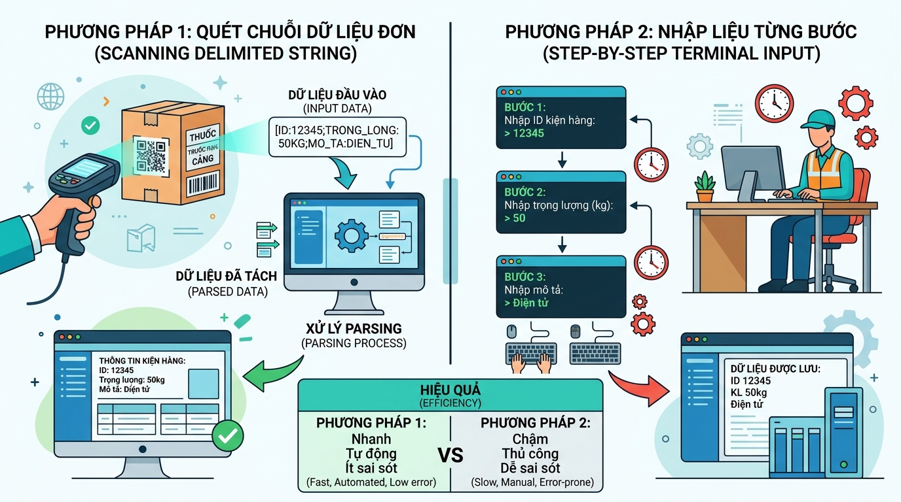

## <center>[Phân tích] Thiết kế giải pháp nhập liệu tối ưu cho thiết bị cầm tay kho bãi</center>

### **1. Mục tiêu**
Học viên có khả năng phân tích, so sánh các giải pháp xử lý luồng dữ liệu đầu vào (Input Stream) trong Python. Qua đó, học viên biết cách tối ưu hóa hiệu năng lưu trữ trên RAM, giảm thiểu số lượng chỉ thị xử lý cho thiết bị phần cứng hạn chế, đồng thời sử dụng thành thạo kỹ thuật xử lý chuỗi, ép kiểu dữ liệu và định dạng hiển thị thông tin động bằng f-string trong bối cảnh nghiệp vụ Logistics.

### **2. Vấn đề**
Tại một trung tâm phân phối logistics, các nhân viên kho cần sử dụng thiết bị cầm tay chạy hệ điều hành thu gọn (Handheld Terminal) có cấu hình phần cứng cực kỳ hạn chế (CPU xung nhịp thấp và dung lượng RAM trống khả dụng rất nhỏ). Thiết bị này thực hiện quét mã vạch và ghi nhận thông tin của từng kiện hàng lên hệ thống trước khi chất lên xe vận chuyển.

Mỗi kiện hàng yêu cầu thu thập 4 thông tin cơ sở bao gồm:
*   Mã vận đơn (ví dụ: `BK-9928-HN`)
*   Trọng lượng kiện hàng (đơn vị: Kilogram)
*   Quãng đường vận chuyển dự kiến (đơn vị: Kilomet)
*   Hệ số phụ phí khu vực (ví dụ: vùng sâu vùng xa, nội thành hoặc ngoại tỉnh)

Do giới hạn phần cứng, nếu chương trình gọi quá nhiều tiến trình nhập dữ liệu tuần tự (`input()`) và tạo quá nhiều biến trung gian lưu trữ trên RAM, thiết bị sẽ gặp hiện tượng phản hồi trễ (latency tăng cao). Nhóm kỹ thuật đang phân vân giữa hai giải pháp thiết kế luồng dữ liệu đầu vào.


<p align="center">
  
</p>


### **3. Quy tắc nghiệp vụ**
1.  **Công thức tính Chi phí Vận chuyển Cơ bản (VNĐ):**
    $$\text{Chi phí cơ bản} = \text{Trọng lượng (kg)} \times \text{Quãng đường (km)} \times 1.200$$
    *(Trong đó: $1.200$ VNĐ là đơn giá định mức cơ sở cho mỗi kg trên mỗi km).*
2.  **Công thức tính Tổng phí Vận chuyển Thực tế (VNĐ):**
    $$\text{Tổng phí vận chuyển} = \text{Chi phí cơ bản} \times \text{Hệ số phụ phí}$$
3.  **Quy cách định dạng dữ liệu đầu ra:**
    *   Toàn bộ kết quả tính toán chi phí phải được làm tròn về dạng số nguyên và hiển thị trực quan.
    *   Sử dụng cơ chế f-string để căn lề hiển thị thông tin thành một biên lai vận chuyển (Delivery Receipt) có cấu trúc cột thẳng hàng, chuyên nghiệp.
4.  **Định dạng chuỗi dữ liệu nén (Dành cho Giải pháp 2):**
    *   Chuỗi ký tự quét từ mã QR của kiện hàng có cấu trúc phân tách bởi ký tự gạch đứng (`|`):
        `[Mã vận đơn]|[Trọng lượng]|[Quãng đường]|[Hệ số phụ phí]`
        Ví dụ dữ liệu quét thực tế: `BK-1085-SG|42.5|350|1.15`

### **4. Yêu cầu bài toán**

#### **Phần 1: Báo cáo phân tích so sánh Trade-off**
Hãy nghiên cứu và lập bảng so sánh chi tiết giữa 2 giải pháp sau:
*   **Giải pháp 1:** Nhập liệu tuần tự (Multi-step Input) - Yêu cầu người dùng nhập từng dòng cho 4 thông tin khác nhau bằng các câu lệnh `input()` riêng biệt.
*   **Giải pháp 2:** Nhập liệu chuỗi tích hợp (Single-line Delimited Input) - Nhập một chuỗi duy nhất định dạng `BK-1085-SG|42.5|350|1.15`, sau đó dùng các phương thức xử lý chuỗi cơ bản của Python để phân tách, ép kiểu.

Bảng so sánh cần tuân thủ cấu trúc sau:
<table style="width: 100%; min-width: 100%; display: table; border-collapse: collapse;" width="100%" border="1">
  <thead>
    <tr style="background-color: #f2f2f2;">
      <th>Tiêu chí đánh giá</th>
      <th>Giải pháp 1: Nhập liệu tuần tự</th>
      <th>Giải pháp 2: Nhập liệu chuỗi tích hợp</th>
    </tr>
  </thead>
  <tbody>
    <tr>
      <td><strong>Độ phức tạp thời gian & Tốc độ vận hành</strong></td>
      <td>...</td>
      <td>...</td>
    </tr>
    <tr>
      <td><strong>Mức độ chiếm dụng bộ nhớ RAM tạm thời</strong></td>
      <td>...</td>
      <td>...</td>
    </tr>
    <tr>
      <td><strong>Khả năng phát sinh lỗi nhập liệu (UX/Human Error)</strong></td>
      <td>...</td>
      <td>...</td>
    </tr>
    <tr>
      <td><strong>Độ phức tạp bảo trì & Khả năng mở rộng</strong></td>
      <td>...</td>
      <td>...</td>
    </tr>
    <tr>
      <td><strong>Bối cảnh áp dụng tối ưu trong thực tế</strong></td>
      <td>...</td>
      <td>...</td>
    </tr>
  </tbody>
</table>

#### **Phần 2: Lập luận lựa chọn và Thiết kế mã giả**
*   Trình bày lập luận khoa học để chọn ra 1 trong 2 giải pháp trên làm phương án tối ưu cho thiết bị Handheld của nhân viên kho.
*   Viết mã giả (Pseudocode) hoặc vẽ lưu đồ (Flowchart) mô tả chi tiết các bước xử lý dữ liệu của phương án tối ưu đã chọn (từ bước nhận chuỗi đầu vào, phân tách chuỗi, ép kiểu dữ liệu cho từng biến, thực hiện phép toán số học cho đến bước định dạng hiển thị kết quả).

#### **Phần 3: Hiện thực hóa mã nguồn Python**
*   Chuyển đổi thiết kế mã giả ở Phần 2 thành một chương trình Python hoàn chỉnh (ví dụ đặt tên file: `logistics_parser.py`).
*   **Điều kiện giới hạn kỹ thuật:** Chỉ được sử dụng các kiến thức đã học trong Session 01 (bao gồm: `input()`, `print()`, ép kiểu `int()`, `float()`, `str()`, các phương thức xử lý chuỗi cơ bản như `.split()`, và định dạng hiển thị `f-string`). Tuyệt đối không sử dụng cấu trúc điều kiện (`if-else`), vòng lặp (`for`, `while`) hay khai báo hàm (`def`).
*   Dữ liệu mẫu để kiểm thử chương trình:
    ```text
    Hãy nhập chuỗi dữ liệu quét kiện hàng: LGT-8849-DN|12.8|450|1.08
    ```
*   Giá trị đầu ra mong đợi hiển thị trên màn hình:
    ```text
    ========================================
             BIÊN LAI ĐƠN VẬN CHUYỂN        
    ========================================
    Mã vận đơn       : LGT-8849-DN
    Trọng lượng      : 12.8 kg
    Quãng đường      : 450 km
    Hệ số vùng miền  : 1.08
    ----------------------------------------
    Chi phí cơ bản   : 6,912,000 VNĐ
    Hệ số phụ phí    : 108%
    TỔNG CHI PHÍ     : 7,464,960 VNĐ
    ========================================
    ```

### **5. Yêu cầu nộp bài**
Học viên cần nộp:
*   Tài liệu báo cáo chi tiết so sánh các giải pháp và code tối ưu đã chọn.
*   Đẩy mã nguồn lên GitHub theo định dạng thư mục: `[Tên Lớp]_[Môn Học]_Session01_Ex04`.
    Ví dụ: `HNKS25CNTT1_FastAPI_Session01_Ex04`