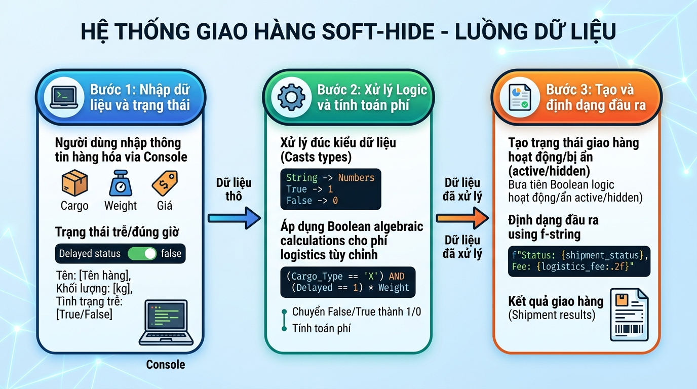

## 
[Sáng tạo] Thiết kế hệ thống ẩn tạm thời vận đơn Logistics bằng toán tử logic Boolean

### **1. Mục tiêu**
*   Vận dụng các kiến thức cốt lõi về biến, kiểu dữ liệu cơ bản (`str`, `int`, `float`, `bool`) trong Python.
*   Ứng dụng thành thạo kỹ thuật ép kiểu dữ liệu (`int()`, `float()`, `bool()`, `str()`) và xử lý dữ liệu nhập vào từ bàn phím (`input()`).
*   Phát triển tư duy logic và kỹ năng giải quyết vấn đề sáng tạo thông qua việc thiết kế giải thuật tính toán chi phí và quản lý trạng thái ẩn vận đơn (Soft-Hide) hoàn toàn bằng biểu thức Boolean và toán tử số học, tuyệt đối không sử dụng cấu trúc rẽ nhánh (`if-else`) hoặc vòng lặp (`loops`).
*   Sử dụng công cụ `f-string` nâng cao để thiết kế giao diện báo cáo chuyên nghiệp trong môi trường Console.

### **2. Bối cảnh & Vấn đề**
Trong phân hệ Logistics của các doanh nghiệp vận chuyển đa quốc gia, thông tin về các vận đơn bị trì hoãn (Delayed Shipment) hoặc gặp sự cố không nên xuất hiện trực tiếp trên bảng theo dõi thời gian thực (Active Dashboard) của điều phối viên để tránh gây nhiễu thông tin quyết định. Tuy nhiên, việc xóa vĩnh viễn (Hard Delete) các bản ghi này khỏi hệ thống là một sai lầm nghiêm trọng, làm mất đi vết lịch sử dòng tiền phục vụ cho hoạt động kiểm toán tài chính cuối tháng.

Giải pháp tối ưu được đề ra là xây dựng cơ chế **"Ẩn tạm thời vận đơn" (Soft-Hide)**. Bản ghi vận đơn vẫn tồn tại nguyên vẹn trong hệ thống để đối soát chi phí, nhưng trạng thái hiển thị bên ngoài của nó sẽ bị chuyển đổi thành vô hiệu hóa. 

Để tối ưu hóa hiệu năng xử lý của các thiết bị nhúng cầm tay (Handheld Terminals) tại kho bãi vốn có năng lực phần cứng hạn chế, hệ thống yêu cầu lập trình viên không được sử dụng các cấu trúc rẽ nhánh điều kiện (`if-else`) hay vòng lặp. Thay vào đó, toàn bộ logic ẩn/hiện và tính toán chi phí phạt/khấu trừ bảo hiểm của đơn hàng sẽ phải xử lý thuần túy bằng các phép toán logic Boolean (`True`/`False` tương ứng với `1`/`0`) kết hợp với nhân tử số học.

  

### **3. Quy tắc nghiệp vụ**
Hệ thống xử lý thông tin đầu vào và tính toán chi phí theo các quy tắc nghiêm ngặt sau:

#### **A. Nhập dữ liệu đầu vào (Input)**
Chương trình yêu cầu người dùng nhập 5 thông tin sau từ bàn phím:
1.  **Mã vận đơn (Shipment ID):** Chuỗi ký tự định danh (Ví dụ: `LOG-2023-VN`).
2.  **Khối lượng hàng hóa (Weight):** Số thực dương, đơn vị tính: Kg.
3.  **Khách vận vận chuyển (Distance):** Số thực dương, đơn vị tính: Km.
4.  **Trạng thái trì hoãn (Delayed Status):** Người dùng nhập `1` nếu đơn hàng bị trễ do thời tiết/thủ tục hải quan, nhập `0` nếu đơn hàng đi đúng lịch trình.
5.  **Yêu cầu ẩn vận đơn của kiểm soát viên (Admin Soft-Hide Request):** Người dùng nhập chuỗi `"True"` nếu muốn ẩn vận đơn này khỏi luồng hiển thị chính, nhập `"False"` nếu muốn giữ hiển thị bình thường.

#### **B. Quy tắc tính toán logic & chi phí (Không dùng `if-else`)**
*   **Chi phí vận chuyển gốc (Base Shipping Cost):** 
    $$\text{Base Cost} = \text{Weight} \times \text{Distance} \times 15,000 \text{ VND}$$
*   **Phụ phí trì hoãn giao nhận (Delay Surcharge):**
    Phụ phí cố định là `500,000` VND. Phí này chỉ được cộng vào tổng chi phí nếu trạng thái trì hoãn của đơn hàng là `True`. 
    *(Gợi ý kỹ thuật: Chuyển đổi trạng thái trì hoãn nhập vào thành kiểu `bool`, sau đó nhân trực tiếp giá trị logic này với phụ phí).*
*   **Trạng thái ẩn thực tế của vận đơn (Is Hidden):**
    Vận đơn sẽ chuyển sang trạng thái ẩn (Giá trị Boolean = `True`) khi thỏa mãn một trong hai điều kiện sau:
    *   Yêu cầu ẩn từ kiểm soát viên là `True`.
    *   **HOẶC** Đơn hàng vừa bị trì hoãn (Delayed Status là `True`) đồng thời khoảng cách vận chuyển vượt quá `500` km.
*   **Tỷ lệ thanh toán thực tế (Payment Rate):**
    *   Nếu vận đơn bị ẩn (`Is Hidden` là `True`), khách hàng được bồi hoàn bảo hiểm tương đương $80\%$ chi phí vận chuyển gốc (tức là chỉ cần thanh toán $20\%$ chi phí vận tải gốc).
    *   Nếu vận đơn không bị ẩn (`Is Hidden` là `False`), khách hàng thanh toán $100\%$ chi phí vận tải gốc.
    *   *(Gợi ý kỹ thuật: Tính toán tỷ lệ thanh toán dạng `float` nằm trong khoảng từ `0.2` đến `1.0` hoàn toàn bằng biểu thức chứa biến luận lý `Is Hidden` để triệt tiêu câu lệnh rẽ nhánh).*
*   **Tổng chi phí cuối cùng (Final Invoice Cost):**
    $$\text{Final Cost} = (\text{Base Cost} \times \text{Payment Rate}) + \text{Delay Surcharge}$$

#### **C. Định dạng hiển thị kết quả đầu ra (Output)**
*   Hiển thị thông tin hóa đơn Logistics một cách trực quan, khoa học bằng cách sử dụng công cụ định dạng chuỗi `f-string` chuyên sâu (căn chỉnh lề trái/phải, làm tròn số thực đến 2 chữ số thập phân).
*   Trạng thái hoạt động hiển thị trên màn hình phải được hiển thị cụ thể dưới dạng chuỗi: `"AN TOÀN HÀNH TRÌNH (ACTIVE)"` hoặc `"ẨN TẠM THỜI (SOFT-HIDDEN)"`. Không được in ra màn hình các từ nguyên bản `True`/`False`. 
    *(Gợi ý kỹ thuật: Sử dụng cơ chế nhân bản chuỗi với giá trị đại số Boolean: `chuỗi_A * biến_boolean + chuỗi_B * (not biến_boolean)`).*

---

### **4. Yêu cầu đầu ra**
Học viên cần triển khai sản phẩm đáp ứng đầy đủ 2 nội dung chính sau:

#### **Phần 1: Thiết kế kiến trúc và Sơ đồ luồng dữ liệu**
*   Vẽ sơ đồ luồng dữ liệu (Data Flow Diagram - DFD) sử dụng định dạng Mermaid hoặc mô tả chi tiết từng bước xử lý. Sơ đồ phải làm rõ:
    *   Các điểm tiếp nhận dữ liệu đầu vào cùng kiểu dữ liệu tương ứng.
    *   Các bước ép kiểu và kiểm chuẩn dữ liệu tự động (Ví dụ: Chuyển đổi chuỗi `"True"`/`"False"` từ bàn phím thành giá trị luận lý thực sự trong Python).
    *   Cơ chế luân chuyển trạng thái và tính toán chi phí bằng sơ đồ hộp đen các biểu thức logic.
    *   Đầu ra hiển thị trên màn hình Console.

#### **Phần 2: Triển khai mã nguồn sạch (Clean Code)**
*   Viết chương trình Python hoàn chỉnh phục vụ bài toán trên (lưu trong file `main.py`).
*   Toàn bộ mã nguồn không được chứa bất kỳ từ khóa rẽ nhánh nào như: `if`, `elif`, `else`, `match`, `case`, hoặc từ khóa vòng lặp như `for`, `while`.
*   Đặt tên biến rõ ràng, tuân thủ quy tắc đặt tên Snake Case trong Python, có chú thích giải thích các công thức Boolean nâng cao được sử dụng.

---

### **5. Yêu cầu nộp bài**
Học viên cần nộp:
*   Sơ đồ luồng dữ liệu nghiệp vụ và thiết kế vòng đời tính năng hiển thị dưới dạng Markdown.
*   Mã nguồn triển khai đầy đủ kịch bản tính toán logistics trên file Python.
*   Đẩy mã nguồn lên GitHub theo định dạng thư mục: `[Tên Lớp]_[Môn Học]_Session01_Ex05`.
    *   Ví dụ: `HNKS25CNTT1_PythonCore_Session01_Ex05`
    *   Dán đường dẫn của repository chứa mã nguồn lên hệ thống LMS học trực tuyến.
 