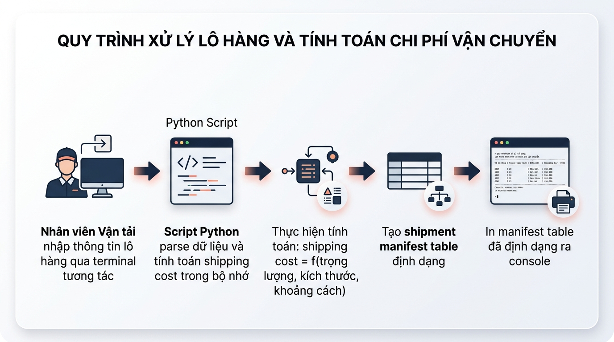

## <center>[Bài tập tổng hợp] Xây dựng hệ thống quản lý đơn vận chuyển Logistics</center>

### **1. Mục tiêu**
Trang bị cho học viên năng lực áp dụng tổng hợp các kiến thức nền tảng trong Session 01 bao gồm: khởi tạo môi trường ảo `.venv`, quản lý biến và kiểu dữ liệu cơ bản (`str`, `int`, `float`, `bool`), nhận đầu vào từ console bằng hàm `input()`, ép kiểu dữ liệu an toàn, xử lý logic nghiệp vụ tính toán và định dạng thông tin đầu ra trực quan bằng `f-string`. Đồng thời, học viên làm quen với việc tổ chức mã nguồn có cấu trúc nhằm chuẩn bị cho việc xây dựng ứng dụng web API ở các bài học tiếp theo.

### **2. Bối cảnh & Vấn đề**
Trong phân hệ Logistics của doanh nghiệp chuyển phát, việc ghi nhận thông tin vận đơn nhanh chóng và tính toán cước phí chính xác ngay tại các bưu cục là ưu tiên hàng đầu. Để giải quyết bài toán này, bạn cần xây dựng một ứng dụng Python chạy trên giao diện dòng lệnh (CLI - Command Line Interface) cho phép quản lý danh sách các đơn vận chuyển (Shipment) lưu trữ trực tiếp trên bộ nhớ RAM (In-memory storage).


<p align="center">
  
</p>


### **3. Quy tắc nghiệp vụ**
Hệ thống cần quản lý các thông tin vận đơn với các kiểu dữ liệu và quy tắc ràng buộc sau:

<table style="width: 100%; min-width: 100%; display: table; border-collapse: collapse;" width="100%" border="1">
  <thead>
    <tr style="background-color: #f2f2f2;">
      <th>Thuộc tính (Trường dữ liệu)</th>
      <th>Kiểu dữ liệu Python</th>
      <th>Mô tả & Quy tắc nghiệp vụ</th>
    </tr>
  </thead>
  <tbody>
    <tr>
      <td><strong>Shipment ID</strong></td>
      <td><code>str</code></td>
      <td>Mã vận đơn duy nhất (ví dụ: SP001). Không được phép trùng lặp và không chứa khoảng trắng.</td>
    </tr>
    <tr>
      <td><strong>Origin</strong></td>
      <td><code>str</code></td>
      <td>Địa danh xuất phát (Điểm gửi).</td>
    </tr>
    <tr>
      <td><strong>Destination</strong></td>
      <td><code>str</code></td>
      <td>Địa danh đích (Điểm nhận).</td>
    </tr>
    <tr>
      <td><strong>Weight</strong></td>
      <td><code>float</code></td>
      <td>Khối lượng hàng hóa (Đơn vị: kg). Phải là số lớn hơn 0.</td>
    </tr>
    <tr>
      <td><strong>Base Rate</strong></td>
      <td><code>float</code></td>
      <td>Đơn giá vận chuyển cơ bản trên mỗi kg (Đơn vị: VND/kg). Phải lớn hơn 0.</td>
    </tr>
    <tr>
      <td><strong>Is Express</strong></td>
      <td><code>bool</code></td>
      <td>Xác định dịch vụ vận chuyển hỏa tốc. Nhận giá trị True nếu chọn chuyển phát hỏa tốc, False nếu chuyển phát thường.</td>
    </tr>
  </tbody>
</table>

**Công thức tính toán Tổng phí vận chuyển (Total Cost):**
*   Cước phí cơ bản = `Weight` * `Base Rate`.
*   Nếu `Is Express` là `True`, tổng cước phí sẽ được tính thêm Phụ phí hỏa tốc bằng **20%** cước phí cơ bản (tương đương nhân hệ số `1.2`).
*   Nếu `Is Express` là `False`, tổng cước phí bằng cước phí cơ bản.

### **4. Yêu cầu đầu ra**
Bạn cần khởi tạo môi trường và phát triển ứng dụng Console trong tệp tin `main.py` để thực hiện các yêu cầu sau:

#### **Khởi tạo và Thiết lập Môi trường**
1.  Tạo thư mục làm việc và thiết lập môi trường ảo `.venv` cho dự án.
2.  Tạo cấu trúc lưu trữ dữ liệu dạng danh sách các từ điển (`list` of `dict`) trong file `main.py` để chứa thông tin các vận đơn đã thêm.

#### **Chức năng Ghi (Mô phỏng POST - Tạo mới đơn vận chuyển)**
1.  Người dùng nhập lần lượt các thông tin: Mã vận đơn, Điểm gửi, Điểm nhận, Khối lượng, Đơn giá cơ bản, và lựa chọn dịch vụ Hỏa tốc (Y/N).
2.  Thực hiện ép kiểu dữ liệu phù hợp từ hàm `input()` sang số thực hoặc kiểu boolean.
3.  **Chặn bẫy dữ liệu:**
    *   Kiểm tra nếu mã vận đơn trùng với một mã đã có trong danh sách, hệ thống phải in ra thông báo lỗi bằng tiếng Việt có dấu và dừng thao tác thêm đơn.
    *   Bắt lỗi ngoại lệ (Sử dụng `try-except` hoặc kiểm tra điều kiện) đối với giá trị Khối lượng và Đơn giá để tránh chương trình bị crash khi người dùng nhập chữ thay vì nhập số.

#### **Chức năng Đọc (Mô phỏng GET - Xem danh sách vận đơn)**
*   Hiển thị toàn bộ danh sách vận đơn hiện có ra màn hình dưới dạng bảng danh mục hàng hóa sạch đẹp.
*   Yêu cầu sử dụng tính năng định dạng chuỗi `f-string` của Python để căn lề các cột thẳng hàng (ví dụ: căn lề trái cho chuỗi văn bản, căn lề phải cho cột số liệu), làm nổi bật tổng số tiền vận đơn đã tính toán.

*Ví dụ về tương tác màn hình console mong muốn:*
```text
=== HỆ THỐNG QUẢN LÝ VẬN ĐƠN LOGISTICS ===
1. Thêm mới đơn vận chuyển
2. Hiển thị danh sách đơn vận chuyển
3. Thoát chương trình
Lựa chọn của bạn (1-3): 1

--- NHẬP THÔNG TIN VẬN ĐƠN MỚI ---
Nhập mã vận đơn: SP001
Nhập điểm gửi: Hà Nội
Nhập điểm nhận: Đà Nẵng
Nhập khối lượng (kg): 12.5
Nhập đơn giá (VND/kg): 15000
Vận chuyển hỏa tốc? (Y/N): Y
=> Đã thêm thành công vận đơn SP001. Tổng cước: 225,000.0 VND (Đã bao gồm 20% phụ phí hỏa tốc).
```

### **5. Yêu cầu nộp bài**
Để hoàn thành bài tập tổng hợp, học viên cần:
*   Hiện thực hóa toàn bộ các API yêu cầu và chạy thử nghiệm thành công.
*   Đẩy mã nguồn lên GitHub theo định dạng thư mục: `[Tên Lớp]_[Môn Học]_Session01_Tong_hop`.
    Ví dụ: `HNKS25CNTT1_PythonCore_Session01_Tong_hop`
*   Dán link của repository lên phần nộp bài trên hệ thống.