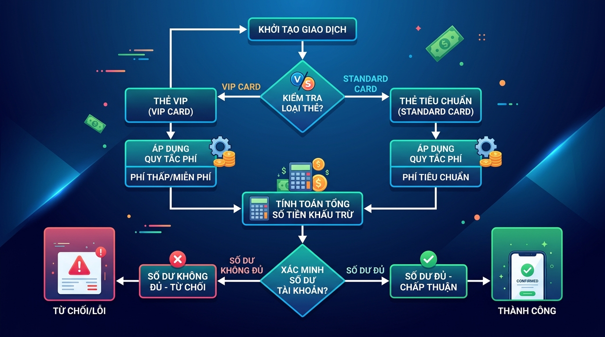

## <center>[Vận dụng cơ bản 1] Khắc phục lỗi logic giao dịch ví điện tử</center>

### **1. Mục tiêu**
*   Áp dụng các toán tử số học, toán tử so sánh và toán tử logic để kiểm tra tính hợp lệ của giao dịch tài chính.
*   Sử dụng cấu trúc điều kiện `if-elif-else` và cấu trúc `match-case` để phân loại và xử lý phí giao dịch theo từng nhóm đối tượng khách hàng.
*   Thực hành kỹ thuật tìm lỗi (debug) logic nghiệp vụ và xử lý phản hồi lỗi chuẩn HTTP bằng cách sử dụng `HTTPException` trong FastAPI.

### **2. Vấn đề**
Bộ phận Vận hành của một công ty Fintech chuyên dịch vụ cổng thanh toán phát hiện hệ thống ví điện tử đang gặp lỗi nghiêm trọng trong luồng xử lý chuyển tiền giữa các tài khoản:
1. Nhiều tài khoản Standard có số dư bị âm sau khi chuyển tiền do hệ thống chỉ so sánh số dư với số tiền chuyển mà quên cộng thêm phí giao dịch vào tổng số tiền cần trừ.
2. Hệ thống vẫn duyệt các giao dịch có số tiền âm hoặc bằng không.
3. Việc tính phí cho tài khoản Standard đang bị sai quy tắc nghiệp vụ giới hạn mức phí tối đa và tối thiểu.


<p align="center">
  
</p>


### **3. Mã nguồn hiện tại**
Dưới đây là đoạn mã nguồn FastAPI giả lập quy trình xử lý giao dịch đang chạy trong RAM. Mã nguồn này đang chứa các lỗi logic nghiệp vụ được đề cập ở trên:

```python
from fastapi import FastAPI, HTTPException, status
from pydantic import BaseModel

app = FastAPI()

# Giả lập cơ sở dữ liệu tài khoản trong RAM
accounts_db = {
    "ACC001": {"name": "Nguyen Van A", "balance": 100000.0, "type": "STANDARD"},
    "ACC002": {"name": "Tran Thi B", "balance": 50000.0, "type": "VIP"},
    "ACC003": {"name": "Le Van C", "balance": 150000.0, "type": "STANDARD"},
}

class TransferRequest(BaseModel):
    sender_id: str
    receiver_id: str
    amount: float

@app.post("/transfer")
def transfer_money(request: TransferRequest):
    sender = accounts_db.get(request.sender_id)
    receiver = accounts_db.get(request.receiver_id)

    if not sender or not receiver:
        raise HTTPException(
            status_code=status.HTTP_404_NOT_FOUND, 
            detail="Tài khoản người gửi hoặc người nhận không tồn tại"
        )

    # Tính phí giao dịch dựa trên loại tài khoản
    fee = 0.0
    match sender["type"]:
        case "STANDARD":
            # Quy tắc: Phí = 1.5% số tiền chuyển, tối thiểu 2,000 VND và tối đa 50,000 VND
            # LỖI LOGIC: Đoạn code dưới đây tính toán sai giới hạn phí
            fee = min(2000.0, max(50000.0, request.amount * 0.015))
        case "VIP":
            fee = 0.0

    # LỖI LOGIC: Kiểm tra số dư không tính đến phí giao dịch
    if sender["balance"] < request.amount:
        raise HTTPException(
            status_code=status.HTTP_400_BAD_REQUEST, 
            detail="Số dư tài khoản không đủ để thực hiện giao dịch"
        )

    # Thực hiện trừ tiền và cộng tiền
    sender["balance"] -= request.amount + fee
    receiver["balance"] += request.amount

    return {
        "message": "Giao dịch thành công",
        "sender_id": request.sender_id,
        "sender_new_balance": sender["balance"],
        "fee_charged": fee,
        "receiver_id": request.receiver_id
    }
```

### **4. Yêu cầu bài toán**
Học viên cần thực hiện hai phần công việc sau:

#### **Phần 1: Báo cáo kịch bản kiểm thử (Test Case Report)**
Xây dựng bảng kịch bản kiểm thử dạng Markdown để chỉ ra các lỗi logic của mã nguồn hiện tại. Bảng cần tối thiểu 3 kịch bản kiểm thử bao gồm các cột sau:
*   **Mã kiểm thử (ID)**
*   **Dữ liệu đầu vào (Input)**
*   **Kết quả thực tế bị lỗi (Actual Output)**
*   **Kết quả mong đợi sau khi sửa (Expected Output)**

#### **Phần 2: Tái cấu trúc và sửa lỗi mã nguồn**
1.  **Kiểm chuẩn dữ liệu đầu vào**: Đảm bảo số tiền chuyển (`amount`) phải lớn hơn $0$.
2.  **Sửa lỗi tính phí giao dịch của tài khoản Standard**: Áp dụng đúng công thức phí dịch vụ bằng $1.5\%$ số tiền chuyển, giới hạn trong khoảng từ $[2,000\,\text{VND} \rightarrow 50,000\,\text{VND}]$.
3.  **Sửa lỗi kiểm tra số dư**: Đảm bảo tài khoản người gửi có đủ số dư cho tổng số tiền chuyển và phí giao dịch (`amount + fee`). Trả về mã lỗi HTTP `400 Bad Request` nếu không đủ điều kiện.
4.  **Cấm người dùng tự chuyển tiền cho chính mình**: Nếu `sender_id` trùng với `receiver_id`, hệ thống cần từ chối xử lý và trả về mã lỗi HTTP `400 Bad Request`.

### **5. Yêu cầu nộp bài**
Học viên cần nộp:
*   Phần phân tích lỗi và code sau khi sửa.
*   Đẩy mã nguồn lên GitHub theo định dạng thư mục: `[Tên Lớp]_[Môn Học]_Session02_Ex01`.
    Ví dụ: `HNKS25CNTT1_FastAPI_Session02_Ex01`