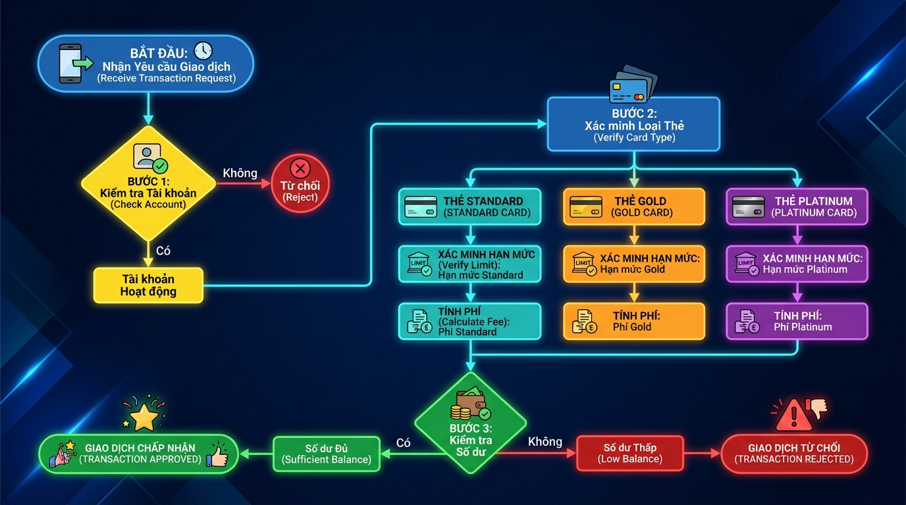

## <center>[Vận dụng cơ bản 2] Khắc phục lỗi logic phân loại và tính phí giao dịch thanh toán quốc tế</center>

### **1. Mục tiêu**
*   Vận dụng đúng các toán tử logic (`and`, `or`, `not`), toán tử so sánh và thứ tự ưu tiên của toán tử để giải quyết bài toán kiểm soát điều kiện.
*   Sử dụng hiệu quả cấu trúc điều kiện rẽ nhánh `if-elif-else` lồng nhau để xử lý các luồng nghiệp vụ phức tạp.
*   Phát triển kỹ năng kiểm thử hộp đen (Black-box testing), thiết lập bảng kịch bản kiểm thử (Test Case) và gỡ lỗi (Debugging) các lỗi logic ẩn trong mã nguồn FastAPI.
*   Rèn luyện việc xử lý ngoại lệ nghiệp vụ và trả về mã lỗi HTTP chuẩn hóa (`400 Bad Request`, `422 Unprocessable Entity`).

### **2. Bối cảnh & Vấn đề**
Một cổng thanh toán quốc tế của công ty Fintech đang vận hành hệ thống phê duyệt giao dịch tự động. Quy trình nghiệp vụ yêu cầu kiểm tra tính hợp lệ của tài khoản thẻ trước khi trích xuất tiền mặt. Tuy nhiên, trong quá trình vận hành, hệ thống liên tục ghi nhận các lỗi nghiêm trọng:
1.  Nhiều tài khoản đã bị khóa (`is_active = False`) vẫn thực hiện thành công các giao dịch có giá trị nhỏ.
2.  Khách hàng lách luật bằng cách thay đổi định dạng chữ hoa/chữ thường của loại thẻ (ví dụ: chuyển từ `Standard` thành `standard` hoặc `STANDARD`) để thực hiện các giao dịch vượt quá hạn mức quy định của hạng thẻ mà không bị hệ thống từ chối.
3.  Một số yêu cầu gửi lên với loại thẻ lạ không nằm trong danh mục hỗ trợ vẫn được xử lý thay vì bị chặn từ đầu.

Dưới đây là sơ đồ luồng kiểm tra logic nghiệp vụ chuẩn khi nhận được yêu cầu thanh toán:


<p align="center">
  
</p>


### **3. Mã nguồn hiện tại**
Dưới đây là mã nguồn của endpoint xử lý giao dịch. Mã nguồn này đang chứa các lỗi logic nghiệp vụ nghiêm trọng liên quan đến thứ tự ưu tiên của toán tử và xử lý chuỗi:

```python
from fastapi import FastAPI, HTTPException, status
from pydantic import BaseModel

app = FastAPI()

class TransactionRequest(BaseModel):
    card_type: str  # Các hạng thẻ hợp lệ: "Standard", "Gold", "Platinum"
    amount: float
    balance: float
    is_active: bool

@app.post("/transactions/process")
def process_transaction(tx: TransactionRequest):
    # 1. Tính toán phí giao dịch dựa trên hạng thẻ
    fee = 0.0
    if tx.card_type.upper() == "STANDARD":
        fee = tx.amount * 0.025 + 0.5  # Phí 2.5% + 0.5 USD cố định
    elif tx.card_type.upper() == "GOLD":
        fee = tx.amount * 0.015        # Phí 1.5%
    elif tx.card_type.upper() == "PLATINUM":
        fee = tx.amount * 0.005        # Phí 0.5%
    else:
        # Áp dụng phí mặc định cho loại thẻ không xác định
        fee = tx.amount * 0.03
        
    # LỖI LOGIC 1: Kiểm tra khả năng thanh toán và trạng thái kích hoạt của tài khoản.
    # Quy tắc: Tài khoản bị khóa (is_active = False) thì KHÔNG được phép giao dịch trong mọi trường hợp.
    # Số dư tài khoản phải đủ để chi trả cho tổng số tiền giao dịch và phí giao dịch.
    if tx.balance < tx.amount + fee or not tx.is_active and tx.amount > 100:
        raise HTTPException(
            status_code=status.HTTP_400_BAD_REQUEST,
            detail="Giao dịch không hợp lệ do số dư không đủ hoặc tài khoản bị khóa."
        )
        
    # LỖI LOGIC 2: Kiểm tra hạn mức giao dịch tối đa của từng loại thẻ
    # Hạn mức quy định: Standard (tối đa 1,000 USD), Gold (tối đa 5,000 USD), Platinum (tối đa 10,000 USD)
    limit_exceeded = False
    if tx.card_type == "Standard" and tx.amount > 1000:
        limit_exceeded = True
    elif tx.card_type == "Gold" and tx.amount > 5000:
        limit_exceeded = True
    elif tx.card_type == "Platinum" and tx.amount > 10000:
        limit_exceeded = True
        
    if limit_exceeded:
        raise HTTPException(
            status_code=status.HTTP_400_BAD_REQUEST,
            detail="Giao dịch vượt quá hạn mức cho phép của loại thẻ."
        )

    new_balance = tx.balance - (tx.amount + fee)
    return {
        "status": "APPROVED",
        "card_type": tx.card_type,
        "amount": tx.amount,
        "fee": fee,
        "remaining_balance": new_balance
    }
```

### **4. Yêu cầu bài toán**

#### **Phần 1: Báo cáo Kịch bản Kiểm thử (Test Cases)**
Học viên cần phân tích mã nguồn hiện tại, chỉ ra nguyên nhân gây lỗi logic và lập bảng kịch bản kiểm thử gồm ít nhất **3 Test Cases** dưới định dạng bảng HTML để chứng minh các hành vi sai lệch của hệ thống.

*Bảng mẫu báo cáo kịch bản kiểm thử:*
<table style="width: 100%; min-width: 100%; display: table; border-collapse: collapse;" width="100%" border="1">
  <thead>
    <tr style="background-color: #f2f2f2;">
      <th>Mã TC</th>
      <th>Mô tả kịch bản kiểm thử</th>
      <th>Dữ liệu đầu vào (JSON Input)</th>
      <th>Kết quả thực tế từ hệ thống lỗi (Output/Status Code)</th>
      <th>Kết quả mong đợi sau khi sửa (Output/Status Code)</th>
    </tr>
  </thead>
  <tbody>
    <tr>
      <td>TC-01</td>
      <td>Kiểm tra giao dịch của tài khoản bị khóa (is_active = False) với số tiền nhỏ (ví dụ: 50 USD)...</td>
      <td>...</td>
      <td>...</td>
      <td>...</td>
    </tr>
    <tr>
      <td>TC-02</td>
      <td>Kiểm tra hạn mức thẻ Standard dưới định dạng chữ thường ("standard")...</td>
      <td>...</td>
      <td>...</td>
      <td>...</td>
    </tr>
    <tr>
      <td>TC-03</td>
      <td>Kiểm tra giao dịch với loại thẻ không hợp lệ (ví dụ: "Silver")...</td>
      <td>...</td>
      <td>...</td>
      <td>...</td>
    </tr>
  </tbody>
</table>

#### **Phần 2: Khắc phục lỗi và Nâng cấp mã nguồn**
Hãy sửa lại mã nguồn trên để đảm bảo các yêu cầu nghiệp vụ sau:
1.  **Quản lý loại thẻ nghiêm ngặt**: Chỉ chấp nhận 3 loại thẻ: `Standard`, `Gold`, `Platinum` (không phân biệt chữ hoa, chữ thường khi người dùng gửi lên). Mọi loại thẻ khác ngoài danh sách này phải bị từ chối ngay lập tức với mã lỗi `400 Bad Request` và thông báo `"Loại thẻ không hợp lệ"`.
2.  **Khắc phục lỗi thứ tự ưu tiên toán tử**: Đảm bảo tài khoản có `is_active = False` không thể thực hiện bất kỳ giao dịch nào, bất kể số tiền lớn hay nhỏ.
3.  **Khắc phục lỗi kiểm tra hạn mức**: Đảm bảo hạn mức tối đa của từng loại thẻ hoạt động chính xác kể cả khi người dùng truyền vào chuỗi viết hoa hoặc viết thường (ví dụ: "STANDARD", "gold").
4.  Tính toán chính xác số dư còn lại sau khi khấu trừ cả tiền giao dịch và phí tương ứng.

### **5. Yêu cầu nộp bài**
Học viên cần nộp:
*   Phần phân tích lỗi và code sau khi sửa.
*   Đẩy mã nguồn lên GitHub theo định dạng thư mục: `[Tên Lớp]_[Môn Học]_Session02_Ex02`.
    Ví dụ: `HNKS25CNTT1_PythonCore_Session02_Ex02`