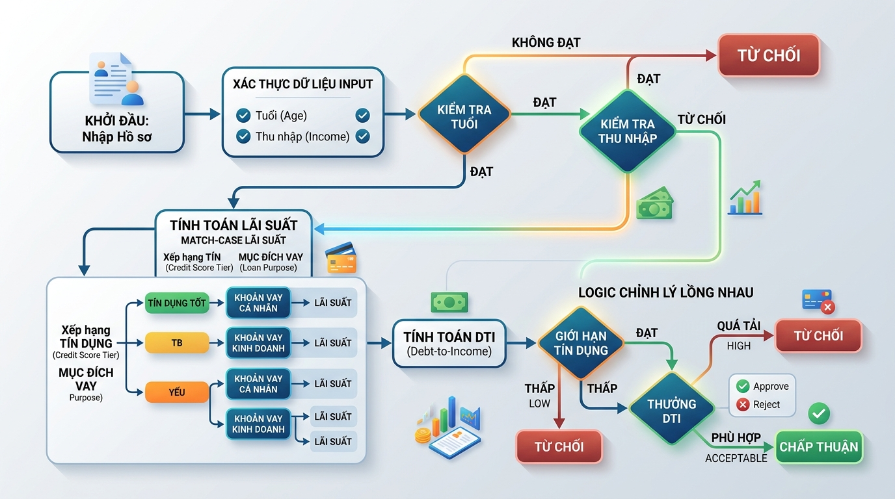

## <center>[Vận dụng chuyên sâu] Thiết kế hệ thống tự động thẩm định hồ sơ vay tín chấp</center>

### **1. Mục tiêu**
Vận dụng linh hoạt các kiến thức về toán tử số học, toán tử so sánh, toán tử logic, cấu trúc điều kiện rẽ nhánh `if-elif-else`, điều kiện lồng nhau và cấu trúc khớp mẫu `match-case` (Python 3.10+) để xây dựng một bộ máy đánh giá rủi ro và phê duyệt hồ sơ vay tín dụng tự động (Loan Assessment Engine) trong phân hệ Fintech.

### **2. Vấn đề**
Trong các hệ thống tài chính công nghệ (Fintech), việc xử lý hồ sơ đăng ký vay tiền cần phải được tự động hóa tối đa nhằm tối ưu trải nghiệm khách hàng và giảm thiểu rủi ro vận hành. Yêu cầu đặt ra là phải xây dựng một mô-đun nghiệp vụ giải quyết bài toán: tiếp nhận thông tin hồ sơ vay, tự động tính toán các chỉ số tài chính, áp dụng các quy tắc xếp hạng tín dụng, kiểm tra điều kiện ràng buộc lồng nhau và đưa ra quyết định phê duyệt cuối cùng (Đồng ý/Từ chối) kèm theo lãi suất phù hợp.


<p align="center">
  
</p>


### **3. Quy tắc nghiệp vụ**
Hệ thống cần tiếp nhận một cấu trúc dữ liệu khách hàng đăng ký vay như ví dụ minh họa dưới đây:

**Ví dụ dữ liệu đầu vào (JSON Request Body):**
```json
{
  "customer_id": "KH-9082",
  "age": 27,
  "monthly_income": 25000000,
  "current_monthly_debt": 3000000,
  "requested_loan_amount": 120000000,
  "loan_term_months": 24,
  "credit_score": 680,
  "loan_purpose": "PERSONAL"
}
```

Các thuộc tính đầu vào bao gồm:
<table style="width: 100%; min-width: 100%; display: table; border-collapse: collapse;" width="100%" border="1">
  <thead>
    <tr style="background-color: #f2f2f2;">
      <th>Thuộc tính</th>
      <th>Kiểu dữ liệu</th>
      <th>Mô tả</th>
    </tr>
  </thead>
  <tbody>
    <tr>
      <td><code>customer_id</code></td>
      <td>String</td>
      <td>Mã định danh khách hàng</td>
    </tr>
    <tr>
      <td><code>age</code></td>
      <td>Integer</td>
      <td>Tuổi của khách hàng</td>
    </tr>
    <tr>
      <td><code>monthly_income</code></td>
      <td>Float/Integer</td>
      <td>Thu nhập ròng hàng tháng (VND)</td>
    </tr>
    <tr>
      <td><code>current_monthly_debt</code></td>
      <td>Float/Integer</td>
      <td>Khoản nợ hiện tại phải trả hàng tháng (VND)</td>
    </tr>
    <tr>
      <td><code>requested_loan_amount</code></td>
      <td>Float/Integer</td>
      <td>Số tiền đề xuất vay (VND)</td>
    </tr>
    <tr>
      <td><code>loan_term_months</code></td>
      <td>Integer</td>
      <td>Kỳ hạn muốn vay (tháng)</td>
    </tr>
    <tr>
      <td><code>credit_score</code></td>
      <td>Integer</td>
      <td>Điểm tín dụng cá nhân (Từ 300 đến 850)</td>
    </tr>
    <tr>
      <td><code>loan_purpose</code></td>
      <td>String</td>
      <td>Mục đích vay: <code>MORTGAGE</code> (Mua nhà), <code>AUTO</code> (Mua xe), <code>PERSONAL</code> (Tiêu dùng cá nhân).</td>
    </tr>
  </tbody>
</table>

#### **Luồng thẩm định nghiệp vụ:**

**Bước 1: Kiểm thử biên điều kiện cứng (Hard Triggers)**
Khách hàng sẽ bị **Từ chối ngay lập tức (REJECTED)** nếu vi phạm bất kỳ một trong các điều kiện logic cơ bản sau:
*   Độ tuổi không nằm trong khoảng hợp lệ: `age < 18` hoặc `age > 65`.
*   Thu nhập hàng tháng không đạt mức tối thiểu: `monthly_income < 10,000,000` VND.
*   Điểm tín dụng nằm ngoài quy chuẩn hệ thống: `credit_score < 300` hoặc `credit_score > 850`.

**Bước 2: Phân loại rủi ro tín dụng và Lãi suất cơ bản**
Sử dụng cấu trúc `match-case` (dựa trên mục đích vay `loan_purpose`) để xác định lãi suất cơ bản hàng năm (Annual Interest Rate - AIR) tương ứng:
*   `MORTGAGE`: Lãi suất cơ bản = 8% / năm (0.08)
*   `AUTO`: Lãi suất cơ bản = 10% / năm (0.10)
*   `PERSONAL`: Lãi suất cơ bản = 12% / năm (0.12)
*   Bất kỳ mục đích nào khác: Coi là không hợp lệ và trả về lỗi nghiệp vụ.

Sau đó, điều chỉnh lãi suất dựa trên điểm tín dụng (`credit_score`):
*   Nếu `credit_score` thuộc nhóm `[300 - 550)`: Tăng thêm 2% (0.02) nợ xấu rủi ro cao.
*   Nếu `credit_score` thuộc nhóm `[550 - 680)`: Giữ nguyên lãi suất cơ bản.
*   Nếu `credit_score` thuộc nhóm `[680 - 850]`: Giảm 1.5% (0.015) để khuyến khích khách hàng uy tín.

**Bước 3: Tính toán tỷ lệ nợ (Debt-to-Income - DTI)**
*   Tính số tiền gốc và lãi ước tính khách hàng phải trả hàng tháng cho khoản vay mới này theo công thức lãi đơn giản chia đều:
    $$\text{monthly\_payment} = \frac{\text{requested\_loan\_amount}}{\text{loan\_term\_months}} + \left(\frac{\text{requested\_loan\_amount} \times \text{ann_interest_rate}}{12}\right)$$
*   Tính chỉ số tài chính DTI (Tỷ lệ Tổng Nợ trên Thu nhập):
    $$\text{DTI} = \frac{\text{current\_monthly\_debt} + \text{monthly\_payment}}{\text{monthly\_income}}$$

**Bước 4: Điều kiện xét duyệt lồng nhau nâng cao**
Đưa ra kết quả thẩm định cuối cùng dựa trên các điều kiện lồng nhau sau:
1.  Nếu `credit_score >= 750`:
    *   Hồ sơ được duyệt (`APPROVED`) nếu `DTI <= 0.60`. (Mức DTI ưu đãi đặc biệt cho điểm tín dụng cao).
2.  Nếu `600 <= credit_score < 750`:
    *   Hồ sơ được duyệt (`APPROVED`) nếu `DTI <= 0.45` và `monthly_income >= 15,000,000 VND`. Các trường hợp DTI > 0.45 hoặc thu nhập dưới 15,000,000 VND sẽ bị từ chối.
3.  Nếu `500 <= credit_score < 600`:
    *   Hồ sơ chỉ được duyệt (`APPROVED`) khi `DTI <= 0.35` và không có khoản nợ hiện tại (`current_monthly_debt == 0`).
4.  Các trường hợp còn lại (`credit_score < 500`):
    *   Hồ sơ bị từ chối (`REJECTED`) do mức độ tín dụng không an toàn.

**Ví dụ thông tin trả về thành công khi hồ sơ được duyệt (JSON Response):**
```json
{
  "status": "APPROVED",
  "data": {
    "customer_id": "KH-9082",
    "annual_interest_rate": 0.085,
    "estimated_monthly_payment": 5850000.0,
    "dti_ratio": 0.354,
    "assessment_note": "Hồ sơ được duyệt dựa trên nhóm điểm tín dụng tốt."
  }
}
```

**Ví dụ thông tin trả về khi hồ sơ bị từ chối (JSON Response):**
```json
{
  "status": "REJECTED",
  "data": {
    "customer_id": "KH-8812",
    "rejection_reason": "Tỷ lệ nợ trên thu nhập (DTI) vượt mức an toàn 0.45 ở mức tín dụng trung bình."
  }
}
```

### **4. Yêu cầu bài toán**

#### **Phần 1: Báo cáo phân tích và thiết kế giải pháp**
*   Học viên cần mô tả quy trình tiếp nhận và xác thực dữ liệu kỹ lưỡng.
*   Thiết lập sơ đồ luồng (Flowchart) hoặc viết mã giả (Pseudocode) thể hiện rõ ràng cấu trúc cấu trúc điều kiện rẽ nhánh (`if-elif-else`), match-case và các toán tử logic được kết hợp ra sao.

#### **Phần 2: Hiện thực hóa mã nguồn từ đầu**
*   Xây dựng đầy đủ logic kiểm tra, tính toán và thẩm định theo đúng các quy tắc tài chính được mô tả ở mục 3 bằng Python.
*   Cần kiểm tra chặt chẽ tính đúng đắn của dữ liệu đầu vào (ví dụ: tuổi, số tiền gửi lên không được âm, kỳ hạn vay không âm,...).
*   Không được sử dụng bất kỳ code mẫu hoặc hàm khung có sẵn nào; tự định nghĩa toàn bộ cấu trúc hàm xử lý dữ liệu và tính toán.

### **5. Yêu cầu nộp bài**
Học viên cần nộp:
*   Bản phân tích thiết kế (File MD hoặc tài liệu thiết kế chứa flowchart/pseudocode).
*   Mã nguồn hoàn chỉnh từ đầu.
*   Đẩy mã nguồn lên GitHub theo định dạng thư mục: `[Tên Lớp]_[Môn Học]_Session02_Ex03`.
    Ví dụ: `HNKS25CNTT1_FastAPI_Session02_Ex03`