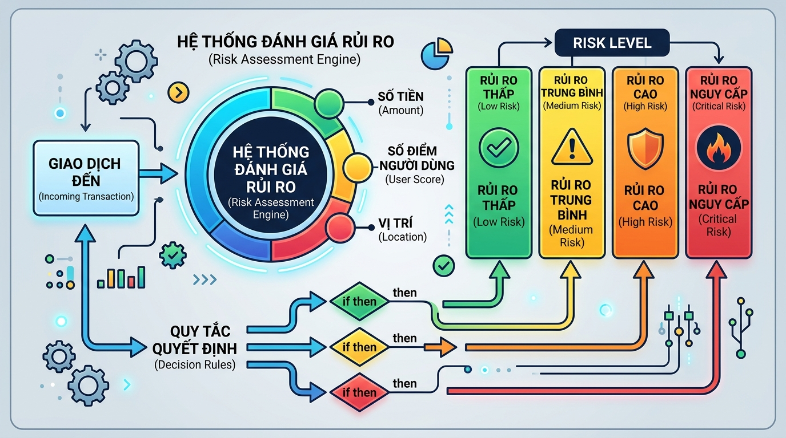

## <center>[Phân tích] Thiết kế hệ thống đánh giá rủi ro giao dịch tài chính động</center>

### **1. Mục tiêu**
*   Phân tích, so sánh và đánh giá trade-off giữa các cấu trúc rẽ nhánh điều kiện lồng nhau phức tạp (`nested if-else`) và cấu trúc so khớp mẫu nâng cao (`match-case` kết hợp guards) trong Python.
*   Áp dụng các toán tử so sánh (`>`, `<`, `>=`, `<=`, `==`, `!=`) và toán tử logic (`and`, `or`, `not`) để giải quyết một bài toán xử lý rủi ro giao dịch tài chính (Fintech) thực tế.
*   Rèn luyện kỹ năng viết mã giả (pseudocode), phân tích thiết kế hệ thống và đánh giá hiệu năng mã nguồn trước khi bắt tay vào lập trình chi tiết.

### **2. Bối cảnh & Vấn đề**
Trong phân hệ quản lý rủi ro (Risk Engine) của một cổng thanh toán Fintech quốc tế, việc phân loại mức độ rủi ro giao dịch theo thời gian thực đóng vai trò cực kỳ quan trọng. Hệ thống nhận vào hàng nghìn giao dịch mỗi giây từ khắp các quốc gia trên thế giới. Dựa trên dữ liệu thu được của từng giao dịch như: số tiền, vị trí địa lý, lịch sử thất bại gần đây của thẻ và điểm tín dụng người dùng, hệ thống phải ngay lập tức xác định mức độ rủi ro để đưa ra quyết định: cho phép giao dịch, tăng cường xác thực, áp dụng mức phí bảo hiểm rủi ro động, hoặc chủ động từ chối giao dịch.


<p align="center">
  
</p>


Thách thức đặt ra là các quy định về dấu hiệu gian lận liên tục được cập nhật từ đội ngũ nghiệp vụ an ninh tài chính. Nếu mã nguồn được tổ chức không tốt, sự kết hợp giữa hàng loạt toán tử so sánh và toán tử logic sẽ tạo ra những khối code cực kỳ phức tạp ("spaghetti code"), dẫn đến việc bảo trì bảo mật hoặc mở rộng quy tắc trở thành ác mộng đối với đội ngũ kỹ sư phần mềm.

### **3. Quy tắc nghiệp vụ**
Hệ thống nhận vào thông tin một giao dịch chứa dữ liệu mô phỏng như cấu trúc dưới đây:
```json
{
  "transaction_id": "TXN_100293",
  "transaction_amount": 12000.50,
  "is_foreign_country": true,
  "account_credit_score": 650,
  "recent_failed_attempts": 2
}
```

Dựa trên các thông số này, hệ thống áp dụng các quy tắc để phân loại và tính phí bảo hiểm rủi ro (Risk Fee) cộng thêm vào số tiền giao dịch:

1.  **Rất cao (CRITICAL) - Từ chối giao dịch**:
    *   **Điều kiện**: Có số lần giao dịch thất bại gần đây `recent_failed_attempts >= 5` HOẶC (số tiền giao dịch `transaction_amount > 50000.0` đồng thời điểm tín dụng người dùng `account_credit_score < 500`).
    *   **Hành động**: Đánh dấu mức rủi ro là `CRITICAL`, phí bảo hiểm không áp dụng (giao dịch bị từ chối thẳng).
2.  **Cao (HIGH)**:
    *   **Điều kiện**: Không thuộc diện *CRITICAL* VÀ thỏa mãn một trong hai trường hợp:
        *   Số tiền giao dịch `transaction_amount > 10000.0` đồng thời giao dịch diễn ra ở nước ngoài (`is_foreign_country` là `True`).
        *   Điểm tín dụng `account_credit_score < 600` đồng thời số lần giao dịch thất bại gần đây `recent_failed_attempts >= 3`.
    *   **Hành động**: Đánh dấu mức rủi ro là `HIGH`, tính phí bảo hiểm giao dịch bằng **3.5%** tổng số tiền giao dịch.
3.  **Trung bình (MEDIUM)**:
    *   **Điều kiện**: Không thuộc diện *CRITICAL*, *HIGH* VÀ thỏa mãn:
        *   Có số tiền giao dịch `transaction_amount > 2000.0` HOẶC thực hiện ở nước ngoài (`is_foreign_country` là `True`).
        *   Điểm tín dụng người dùng `account_credit_score` nằm trong khoảng từ `600` đến dưới `700` (`600 <= score < 700`).
    *   **Hành động**: Đánh dấu mức rủi ro là `MEDIUM`, tính phí bảo hiểm giao dịch bằng **1.5%** tổng số tiền giao dịch.
4.  **Thấp (LOW)**:
    *   **Điều kiện**: Các trường hợp giao dịch hợp lệ còn lại.
    *   **Hành động**: Đánh dấu mức rủi ro là `LOW`, phí bảo hiểm bằng **0%**.

**Quy tắc kiểm chuẩn đầu vào (Validation)**:
*   Mã giao dịch `transaction_id` không được để trống.
*   Số tiền giao dịch `transaction_amount` phải là số thực dương (`> 0`).
*   Điểm tín dụng `account_credit_score` phải nằm trong giới hạn chuẩn từ `300` đến `850` (bao gồm cả hai đầu mút).
*   Số giao dịch thất bại gần đây `recent_failed_attempts` phải là số nguyên không âm (`>= 0`).
*   Nếu bất kỳ dữ liệu nào vi phạm quy tắc trên, giao dịch ngay lập tức bị xếp loại rủi ro là `INVALID_DATA`, phí bảo hiểm là `0.0`.

Dưới đây là một số ca kiểm thử (test cases) tiêu chuẩn để đối chiếu kết quả:

<table style="width: 100%; min-width: 100%; display: table; border-collapse: collapse;" width="100%" border="1" cellpadding="5">
  <thead>
    <tr style="background-color: #f2f2f2;">
      <th>ID</th>
      <th>Amount ($)</th>
      <th>Foreign?</th>
      <th>Credit Score</th>
      <th>Failed Attempts</th>
      <th>Trạng thái rủi ro mong đợi</th>
      <th>Phí Bảo Hiểm ($)</th>
    </tr>
  </thead>
  <tbody>
    <tr>
      <td>TXN_01</td>
      <td>60000.00</td>
      <td>false</td>
      <td>450</td>
      <td>1</td>
      <td><strong>CRITICAL</strong></td>
      <td>0.00 (Từ chối)</td>
    </tr>
    <tr>
      <td>TXN_02</td>
      <td>12000.00</td>
      <td>true</td>
      <td>650</td>
      <td>2</td>
      <td><strong>HIGH</strong></td>
      <td>420.00 (3.5%)</td>
    </tr>
    <tr>
      <td>TXN_03</td>
      <td>3000.00</td>
      <td>false</td>
      <td>680</td>
      <td>0</td>
      <td><strong>MEDIUM</strong></td>
      <td>45.00 (1.5%)</td>
    </tr>
    <tr>
      <td>TXN_04</td>
      <td>1500.00</td>
      <td>false</td>
      <td>750</td>
      <td>0</td>
      <td><strong>LOW</strong></td>
      <td>0.00 (0%)</td>
    </tr>
    <tr>
      <td>TXN_05</td>
      <td>-100.00</td>
      <td>false</td>
      <td>700</td>
      <td>1</td>
      <td><strong>INVALID_DATA</strong></td>
      <td>0.00</td>
    </tr>
  </tbody>
</table>

### **4. Yêu cầu bài toán**

#### **Phần 1: Báo cáo phân tích so sánh Trade-off**
Hãy nghiên cứu và chuẩn bị báo cáo phân tích thiết kế hệ thống so sánh hai phương án triển khai sau:
*   **Giải pháp 1**: Sử dụng chuỗi các cấu trúc điều kiện lồng nhau (`nested if-elif-else`) và các toán tử logic thuần túy (`and`, `or`, `not`).
*   **Giải pháp 2**: Nhóm các tham số cần kiểm tra của một giao dịch vào một tuple `(amount, foreign, score, failed)` và áp dụng cấu trúc so khớp mẫu nâng cao `match-case` (từ Python 3.10+) kết hợp các biểu thức gác (`guard conditions - if`).
*   **Yêu cầu đầu ra:** Lập bảng so sánh chi tiết hai giải pháp theo các tiêu chí: _Bộ nhớ (RAM)_, _Tốc độ xử lý (Execution Speed)_, _Độ dễ đọc (Readability)_, _Độ dễ bảo trì và cập nhật nghiệp vụ (Maintainability)_, và _Bối cảnh áp dụng thực tế_.

#### **Phần 2: Lập luận lựa chọn và Thiết kế mã giả**
*   Lựa chọn giải pháp tối ưu cho lõi xử lý thanh toán Fintech dựa trên báo cáo phân tích ở Phần 1. Viết lập luận khoa học bảo vệ cho sự lựa chọn này (ví dụ: tối ưu hiệu năng tính toán hay khả năng mở rộng nhanh của dự án).
*   Thiết kế lưu đồ logic hoặc viết mã giả (Pseudocode) mô tả trọn vẹn luồng xử lý của giải pháp tối ưu được chọn, bao gồm cả bước kiểm chuẩn dữ liệu đầu vào (validation).

#### **Phần 3: Hiện thực hóa mã nguồn**
*   Viết chương trình Python thực thi giải pháp tối ưu đã lựa chọn ở Phần 2.
*   Chương trình nhận đầu vào là một danh sách chứa nhiều transaction (mỗi transaction là một dictionary). Duyệt qua danh sách, tính toán và xuất kết quả xếp loại rủi ro kèm theo phí rủi ro chính xác đến 2 chữ số thập phân cho từng giao dịch.
*   Tuân thủ nghiêm ngặt quy tắc không sử dụng bất kỳ thư viện bên ngoài nào, chỉ sử dụng tối đa kiến thức trong Session 02 (toán tử số học/so sánh/logic và các cấu trúc điều kiện).

### **5. Yêu cầu nộp bài**
Học viên cần nộp:
*   Tài liệu báo cáo chi tiết so sánh các giải pháp và code tối ưu đã chọn.
*   Đẩy mã nguồn lên GitHub theo định dạng thư mục: `[Tên Lớp]_[Môn Học]_Session02_Ex04`.
    Ví dụ: `HNKS25CNTT1_FastAPI_Session02_Ex04`