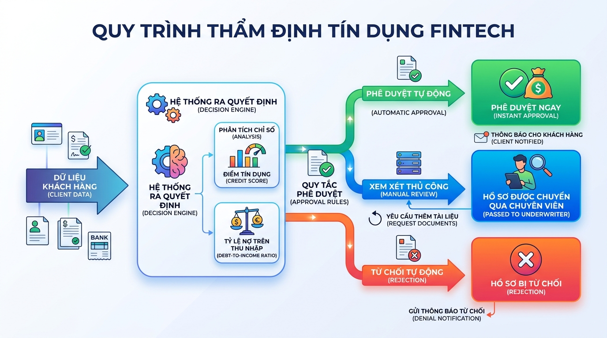

## <center>[Sáng tạo] Thiết lập hệ thống thẩm định và phân luồng hồ sơ vay tiêu dùng tự động</center>

### **1. Mục tiêu**
*   Vận dụng linh hoạt các toán tử số học, toán tử so sánh và toán tử logic để tính toán các chỉ số tài chính cốt lõi.
*   Ứng dụng cấu trúc điều kiện rẽ nhánh `if-elif-else` lồng nhau kết hợp với cấu trúc `match-case` (từ Python 3.10+) để phân luồng phê duyệt và quản trị rủi ro hồ sơ tín dụng.
*   Rèn luyện kỹ năng phân tích nghiệp vụ, tự thiết kế cấu trúc luồng dữ liệu (Data Flow) và vòng đời của một hồ sơ tài chính trong phân hệ Fintech.

### **2. Bối cảnh & Vấn đề**
Công ty Fintech **SmartFinance** đang phát triển một dịch vụ cho vay tiêu dùng trực tuyến (Micro-lending). Hiện tại, quy trình tiếp nhận và thẩm định hồ sơ đăng ký vay đang được thực hiện thủ công, dẫn đến thời gian phản hồi khách hàng bị chậm trễ và tỷ lệ sai sót do yếu tố con người cao. 

Nhằm tối ưu hóa vận hành, phòng Quản trị rủi ro yêu cầu xây dựng một module lõi bằng Python để tự động tiếp nhận thông tin từ Client (thông qua dữ liệu cấu trúc Python Dictionary), thực hiện thẩm định tự động, phân luồng hồ sơ và đưa ra quyết định phê duyệt (Phê duyệt tự động, Từ chối tự động, hoặc Chuyển cấp thẩm định thủ công).


<p align="center">
  
</p>


### **3. Quy tắc nghiệp vụ**
Hệ thống cần xử lý bộ dữ liệu của khách hàng bao gồm các thông số cơ bản sau:
*   `age` (Tuổi - số nguyên)
*   `monthly_income` (Thu nhập hàng tháng - số thực hoặc số nguyên)
*   `current_debt` (Tổng số nợ hiện tại đang trả hàng tháng - số thực hoặc số nguyên)
*   `credit_score` (Điểm tín dụng CIC, từ 300 đến 850 - số nguyên)
*   `late_payments_12m` (Số lần thanh toán trễ hạn trong 12 tháng qua - số nguyên)
*   `loan_purpose` (Mục đích vay: `PERSONAL` - Tiêu dùng cá nhân, `BUSINESS` - Kinh doanh nhỏ, `EDUCATION` - Học tập)
*   `requested_amount` (Số tiền đề xuất vay - số thực hoặc số nguyên)

Dưới đây là các quy tắc thẩm định bắt buộc học viên phải hiện thực hóa bằng mã nguồn:

#### **A. Kiểm tra tính hợp lệ của dữ liệu đầu vào (Validation Input)**
*   Độ tuổi hợp pháp để thực hiện giao dịch tài chính phải từ 18 tuổi đến dưới 60 tuổi.
*   Các chỉ số tài chính (`monthly_income`, `requested_amount`) phải là số dương lớn hơn 0. Dư nợ (`current_debt`) và điểm tín dụng (`credit_score`) không được âm.
*   Điểm tín dụng nằm trong phạm vi hợp lệ `[300, 850]`.

#### **B. Tính toán chỉ số tài chính & Phân loại rủi ro nghiệp vụ**
*   **Tỷ lệ Nợ trên Thu nhập (DTI - Debt-to-Income Ratio):**
    $$\text{DTI} = \frac{\text{current\_debt} + (\text{requested\_amount} \times 0.05)}{\text{monthly\_income}}$$
    *(Giả định mỗi tháng khách hàng phải trả cho khoản vay mới này bằng 5% tổng số tiền đề xuất vay).*
*   **Quy tắc Cấm vay (Hard Reject):** Hệ thống sẽ ngay lập tức từ chối hồ sơ nếu vi phạm bất kỳ điều kiện nào sau đây:
    *   Điểm tín dụng `credit_score` dưới 500.
    *   Tỷ lệ DTI lớn hơn 60% ($0.6$).
    *   Số lần trễ hạn trong 12 tháng qua `late_payments_12m` lớn hơn 3 lần.

#### **C. Phân luồng xử lý và phê duyệt (Sử dụng `match-case` và `if-elif-else` lồng nhau)**
Hệ thống sẽ thực hiện phân luồng hồ sơ dựa trên mục đích vay `loan_purpose` thông qua cấu trúc `match-case`, sau đó tiếp tục đánh giá chi tiết:

1.  **Luồng `PERSONAL` (Vay tiêu dùng cá nhân):**
    *   *Phê duyệt tự động (Auto-Approved):* Nếu `credit_score` >= 680 và DTI <= 40% và `late_payments_12m` == 0.
    *   *Từ chối tự động (Auto-Rejected):* Nếu rơi vào quy tắc Cấm vay ở mục B.
    *   *Thẩm định thủ công (Manual Review):* Các trường hợp còn lại.
2.  **Luồng `BUSINESS` (Vay kinh doanh nhỏ):**
    *   Yêu cầu khắt khe hơn: Chỉ phê duyệt tự động nếu `credit_score` >= 720, DTI <= 35% và không có trịch thượng nợ xấu.
    *   Không phê duyệt tự động cho khách hàng có thu nhập hàng tháng `monthly_income` dưới 15,000,000 VND (chuyển sang thẩm định thủ công).
3.  **Luồng `EDUCATION` (Vay học tập):**
    *   Chính sách ưu đãi: Chấp nhận `credit_score` từ 600 trở lên và DTI tối đa lên tới 50% để được phê duyệt tự động. Lãi suất ưu đãi sẽ được giảm sâu.
4.  **Luồng không xác định (Trường hợp mặc định):**
    *   Từ chối ngay lập tức với lý do: *"Mục đích vay không hợp lệ"*.

#### **D. Công thức xác định Hạn mức chi trả tối đa và Lãi suất (Chỉ áp dụng với hồ sơ Auto-Approved)**
*   Lãi suất cơ bản hàng năm là $12\%$.
*   Nếu điểm tín dụng từ 750 trở lên: Giảm $2\%$ lãi suất.
*   Nếu mục đích vay là `EDUCATION`: Giảm thêm $1.5\%$ lãi suất.
*   Hạn mức phê duyệt tối đa được tính bằng $\text{monthly\_income} \times 4$. Tuy nhiên, nếu số tiền vay đề xuất `requested_amount` nhỏ hơn hạn mức này, hệ thống sẽ cấp đúng bằng `requested_amount`.

---

### **4. Yêu cầu đầu ra**

#### **Phần 1: Thiết kế kiến trúc module và Sơ đồ luồng dữ liệu**
Học viên cần mô tả kiến trúc của Module thẩm định tự động bằng sơ đồ Mermaid (hoặc sơ đồ khối chi tiết), minh họa rõ ràng các bước:
1.  Tiếp nhận yêu cầu (Client Request Payload).
2.  Lớp kiểm chuẩn chất lượng dữ liệu đầu vào (Input Parsing & Validation).
3.  Bộ tính toán chỉ số tài chính (DTI & Phân loại rủi ro sơ bộ).
4.  Bộ động cơ phân luồng bằng `match-case` và `if-elif-else` lồng nhau.
5.  Quyết định đầu ra (Response) chứa thông tin: Trạng thái duyệt (`APPROVED`, `REJECTED`, `MANUAL_REVIEW`), mức lãi suất áp dụng, hạn mức được duyệt, và mã lý do từ chối hệ thống (nếu có).

#### **Phần 2: Triển khai mã nguồn sạch hoàn chỉnh**
*   Triển khai mã nguồn Python core hoàn toàn không sử dụng thư viện bên ngoài (ngoại trừ thư viện có sẵn của Python như `enum`, `math`, `typing`).
*   Viết hàm xử lý nghiệp vụ với tham số đầu vào là một `dict` biểu diễn hồ sơ khách hàng.
*   Để giúp kiểm thử hệ thống, học viên tham khảo cấu trúc dữ liệu mô phỏng dưới đây:

**Ví dụ dữ liệu đầu vào (Hồ sơ đăng ký vay):**
```python
customer_application_1 = {
    "age": 28,
    "monthly_income": 25000000,
    "current_debt": 3000000,
    "credit_score": 760,
    "late_payments_12m": 0,
    "loan_purpose": "PERSONAL",
    "requested_amount": 50000000
}

customer_application_2 = {
    "age": 20,
    "monthly_income": 12000000,
    "current_debt": 8000000,
    "credit_score": 520,
    "late_payments_12m": 2,
    "loan_purpose": "EDUCATION",
    "requested_amount": 30000000
}
```

**Ví dụ dữ liệu phản hồi mong đợi (Hồ sơ 1 - Phê duyệt thành công):**
```json
{
  "status": "APPROVED",
  "approved_limit": 50000000,
  "interest_rate_yearly": 0.10,
  "debt_to_income_ratio": 0.22,
  "reason": "Đáp ứng đầy đủ các tiêu chí phê duyệt tự động."
}
```

**Ví dụ dữ liệu phản hồi mong đợi (Hồ sơ 2 - Thẩm định thủ công / Từ chối):**
```json
{
  "status": "MANUAL_REVIEW",
  "approved_limit": 0,
  "interest_rate_yearly": 0.0,
  "debt_to_income_ratio": 0.79,
  "reason": "Tỷ lệ nợ trên thu nhập vượt quá ngưỡng xét duyệt nhanh."
}
```

---

### **5. Yêu cầu nộp bài**
Học viên cần nộp:
*   Sơ đồ luồng dữ liệu nghiệp vụ và thiết kế vòng đời tính năng (Định dạng ảnh hoặc mã vẽ Mermaid trong file Markdown).
*   Mã nguồn triển khai đầy đủ các邏輯 xử lý tín dụng và các tập chạy thực nghiệm phân luồng.
*   Đẩy mã nguồn lên GitHub theo định dạng thư mục: `[Tên Lớp]_[Môn Học]_Session02_Ex05`.
    Ví dụ: `HNKS25CNTT1_PythonCore_Session02_Ex05`